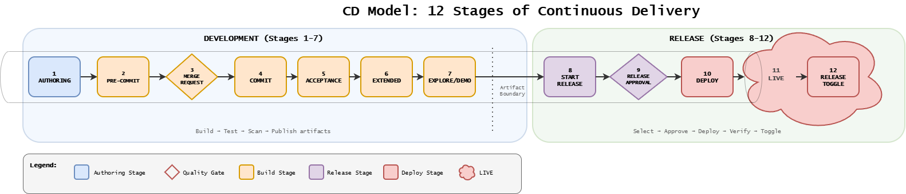

# CD Model: The 12-Stage Framework

The Continuous Delivery Model is a comprehensive framework for delivering software from development through production with quality,
traceability, and compliance built in.

The diagram above shows all 12 stages divided into Development (Stages 1-7) and Release (Stages 8-12) phases, with color-coded stage types indicating their purpose in the delivery pipeline.

## In This Section

| Topic                             | Description                              |
| --------------------------------- | ---------------------------------------- |
| [Overview](./overview.md)         | Introduction to the 12-stage model       |
| [Visual Notation](./notation.md)  | How to read CD Model diagrams            |
| [Key Principles](./principles.md) | Shift-left, fail fast, automation        |
| [The 12 Stages](./stages.md)      | Development and release stages           |
| [Variants](./variants.md)         | RA vs CDe patterns and configuration     |
| [Compliance](./compliance.md)     | Evidence, verification, and audit trails |
