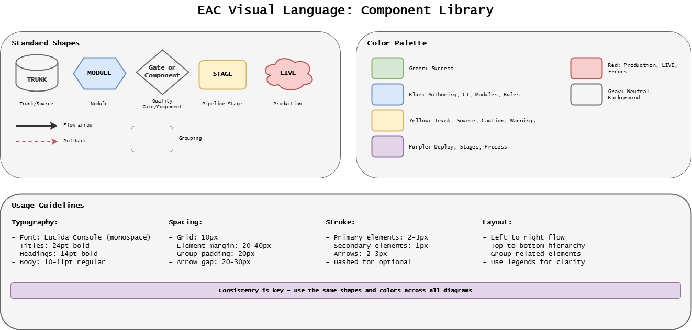
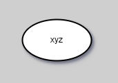
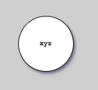
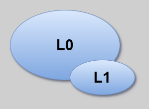
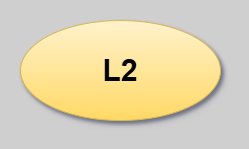
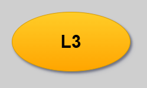
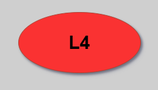
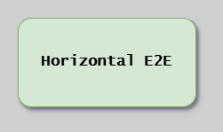

# Visual Notation

The CD Model uses specific visual elements to represent different concepts.

Understanding these symbols is essential for reading the model diagrams.

The following diagram provides a comprehensive reference for all visual elements used in EAC documentation, including stages, gates, environments, and test level indicators.

{width=1000}

---

## Start Elements

{width=150}

Start elements indicate entry points into the CD Model workflow.

These represent where work begins, typically when an engineer starts authoring changes on a local topic branch.

## Automated Quality Gates

{width=150}

Automated quality gates are checkpoints that validate specific criteria before allowing progression to the next stage.

**Examples:**

- Tests passing
- Code quality standards (formatting, repository layout)
- Test coverage thresholds
- Security scan results
- Performance benchmarks
- Automated approvals based on quality metrics

If quality gates fail, the pipeline stops, preventing defects from progressing further.

## Signoff Points

{width=150}

Signoff points represent formal approvals required at critical stages.

**Types:**

- Manual approvals from stakeholders or release managers
- Compliance artifact sign-offs
- Security review approvals
- Peer approval in the merge request

See [Compliance](compliance.md#signoff-gates) for detailed signoff gate descriptions.

## Exploration Activities

{width=150}

Exploration activities represent human-driven validation that complements automated testing.

**Examples:**

- Exploratory testing
- User acceptance testing (UAT)
- Stakeholder demos and feedback
- Manual verification of edge cases

## Execution Hosts

{width=150}

Execution hosts are where automation is executed:

| Host              | Description                                        |
| ----------------- | -------------------------------------------------- |
| **DevBox**        | Local development environment                      |
| **Build Agents**  | CI/CD pipeline runners                             |
| **Deploy Agents** | Specialized runners with production network access |

## Production-Like Test Environments (PLTE)

{width=150}

PLTEs are isolated environments that emulate production characteristics, optimally ephemeral.

When the underlying infrastructure (such as PaaS/VM) doesn't support truly ephemeral environments,
approximate ephemeral behavior by resetting dedicated slots between uses.

**Connectivity note:** A PLTE _can_ be horizontally connected with other live systems,
but such an environment cannot support automated testing in L3.

Horizontally connected PLTEs should _only_ facilitate [Exploration Activities](#exploration-activities)
\- or specialized and human observed [Extended Testing](stages.md#stage-6-extended-testing),
as these systems are extremely fragile and can't support real deterministic testing.

**PLTEs enable:**

- Realistic testing without production risk
- Parallel testing for multiple topic branches
- Production IaC validation
- Performance and security testing in production-like conditions

---

## Test Level Icons

Test levels are represented using color-coded ovals that indicate the execution environment and scope:

### L0-L1: Unit/Component Tests

{width=150}

Blue ovals representing fast, in-process unit and component tests.

### L2: Emulated System Tests

{width=150}

Yellow oval representing integration-level emulated system testing.

### L3: In-Situ Vertical Tests

{width=150}

Orange oval representing in-situ vertical testing in PLTE environments.

### L4: Production Tests

{width=150}

Red oval representing production testing and live verification.

### HE2E: Horizontal E2E (Anti-Pattern)

{width=150}

Green rounded rectangle identifying shared pre-production anti-pattern.

---

## References

- [Overview](overview.md) - CD Model introduction
- [The 12 Stages](stages.md) - Where each environment is used
- [Environments](../environments/environments.md) - Environment types and zones
