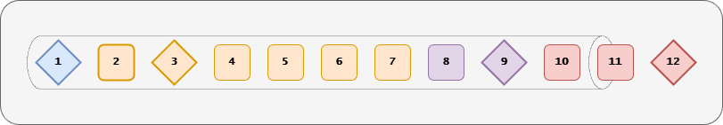
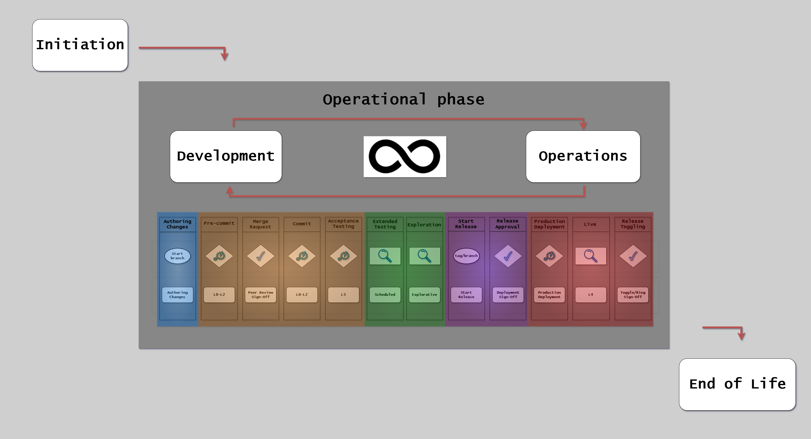
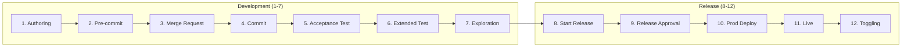

# CD Model Overview

## Introduction

The Continuous Delivery (CD) Model provides a comprehensive framework for delivering software,
from initial development through production deployment and ongoing maintenance.

The model ensures quality, traceability, and compliance throughout the entire software delivery lifecycle.

Unlike traditional linear Software Development Lifecycle (SDLC) approaches that rely on manual handoffs and stage-gate approvals,
the CD Model integrates automation, quality gates, and continuous validation at every step.

This approach reduces lead time, increases deployment frequency, and improves software quality through rapid feedback loops.

## The 12-Stage Model

The CD Model consists of 12 distinct stages that guide software from code authoring to production operation.

The following diagram provides a compact view of all stages,
using chevrons for regular stages and diamonds for approval gates (stages 1, 3, 9, 12):

{width=900}

For detailed interactions between stages, environments, and quality gates, see the full canvas view:

This visualization shows the complete flow through all stages,
including quality gates, environment transitions, and approval points.

**Development Stages (1-7):**

1. **Authoring** - Create code, config, requirements on local topic branches
2. **Pre-commit** - Verify changes before committing (5-10 min time-box)
3. **Merge Request** - Peer review and automated verification
4. **Commit** - Integrate verified changes into main branch
5. **Acceptance Testing** - Validate functional requirements in PLTE
6. **Extended Testing** - Performance, security, and compliance validation
7. **Exploration** - Stakeholder validation and exploratory testing

**Release Stages (8-12):**

<!-- markdownlint-disable MD029 -->

8. **Start Release** - Create release candidate and documentation
9. **Release Approval** - Obtain formal approval for production deployment
10. **Production Deployment** - Deploy to production environment
11. **Live** - Monitor and validate production behavior
12. **Release Toggling** - Control feature exposure with feature flags

<!-- markdownlint-enable MD029 -->

For detailed stage explanations, see [The 12 Stages](stages.md).

## Traditional vs CD Model

**Traditional SDLC (Waterfall/Stage-Gate):**

- **Development** → **Testing** → **Validation** → **Production**
- Manual handoffs between teams/silos
- Testing happens late in the cycle
- Long feedback loops (weeks to months)
- Environment-specific configurations that drift
- Bottlenecks when multiple teams share environments

**CD Model Approach:**

- Purpose-built stages for specific validation activities
- Automated progression based on quality gates
- Testing integrated throughout the pipeline
- Rapid feedback loops (seconds to minutes to hours)
- Infrastructure as Code ensures consistency
- Parallel execution without environment conflicts

## Benefits

**Faster Time to Market:**

- Automated pipeline reduces manual delays
- Parallel testing accelerates validation
- Continuous integration prevents integration debt

**Higher Quality:**

- Early defect detection through shift-left practices
- Automated testing at every stage
- Quality gates prevent defects from progressing

**Reduced Risk:**

- Small, frequent changes are easier to validate and rollback
- Automated compliance checks ensure consistency
- Production-like testing catches issues before deployment

**Better Compliance:**

- Automated evidence generation
- Traceability from requirements to deployment
- Audit trail built into the pipeline

**Improved Developer Experience:**

- Fast feedback loops (minutes, not days)
- Clear quality expectations
- Automated repetitive tasks

## How to Use This Documentation

**If you're new to the CD Model:**

1. Read this overview to understand the concept
2. Review [The 12 Stages](stages.md) to understand the complete flow
3. Explore [Variants](variants.md) to choose your configuration

**If you're implementing the CD Model:**

1. Choose your variant (RA or CDe) using [Variants](variants.md)
2. Review [Environments](../environments/environments.md) for infrastructure needs
3. Review [Testing Strategy](../testing/index.md) for test coverage
4. Review [Compliance](compliance.md) for evidence requirements

**If you're reading CD Model diagrams:**

- See [Visual Notation](notation.md) for symbol explanations

---

## References

- [The 12 Stages](stages.md) - Detailed stage explanations
- [Visual Notation](notation.md) - How to read diagrams
- [Key Principles](principles.md) - Shift-left, fail fast, automation
- [Variants](variants.md) - RA vs CDe patterns
- [Compliance](compliance.md) - Evidence and signoffs
- [Environments](../environments/environments.md) - Environment types
- [Testing Strategy](../testing/index.md) - Test levels
- [Trunk-Based Development](../workflow/trunk-based-development.md) - Branching strategy
