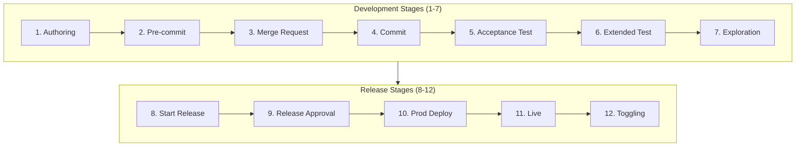
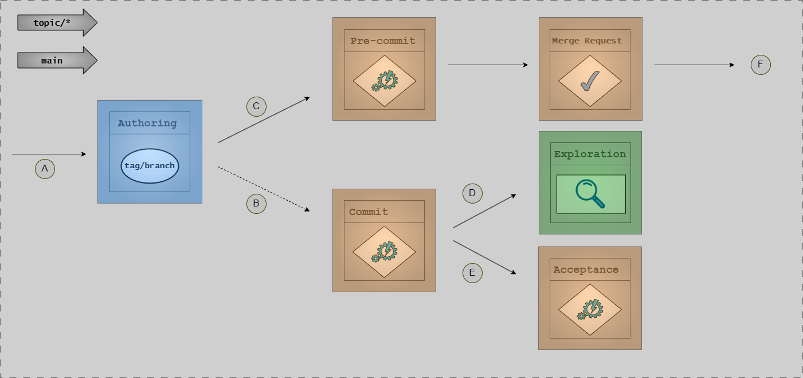
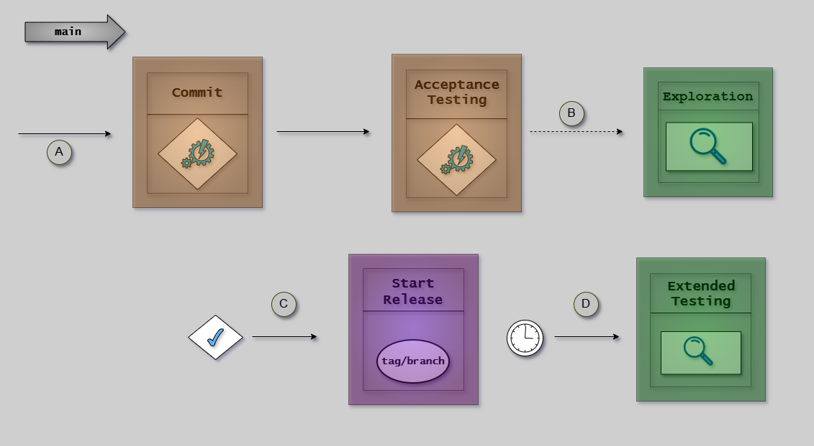
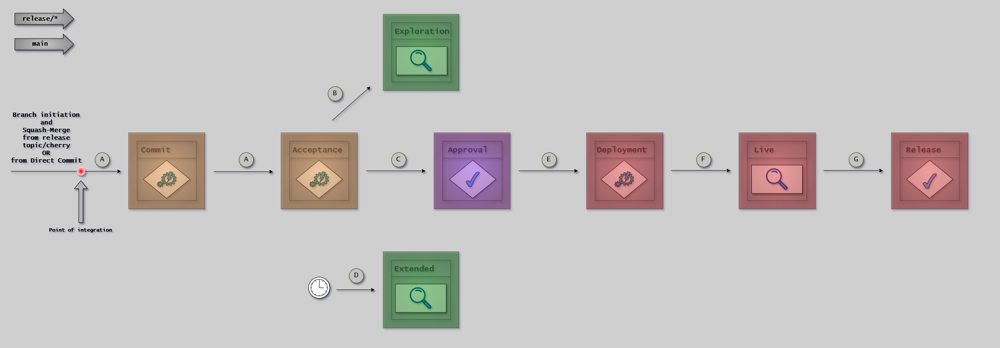

# The 12 Stages

The CD Model consists of 12 stages that guide software from code authoring to production operation. This article provides a compact reference for each stage.

---

## Development Stages

Stages 1-7 cover code authoring through comprehensive verification, emphasizing shift-left practices and rapid feedback.

### Stage 1: Authoring

**Purpose:** Create code, configuration, and requirements on local topic branches.

**Key Activities:**

- Create topic branch from trunk HEAD
- Develop features, fixes, or documentation
- Collaborate on requirements (Three Amigos approach)
- Express requirements as executable specifications (Gherkin)
- Run local tests before sharing

**Best Practices:**

- Keep changes small and focused
- Commit frequently with descriptive messages
- Test locally before pushing
- Follow coding standards

**Environment:** DevBox (local development)

---

### Stage 2: Pre-commit

**Purpose:** Validate changes before committing to ensure quality and standards compliance.

**Key Activities:**

- Code formatting verification
- SAST code quality issues
- Unit test execution
- Security scanning (secrets, vulnerabilities)
- Build verification

**Time-box:** 5-10 minutes. Longer checks create friction and get skipped.

**Quality Gates:**

| Check        | Pass Criteria                      |
| ------------ | ---------------------------------- |
| Formatting   | All files formatted per standards  |
| SAST         | No high-severity issues            |
| Unit tests   | 100% passing, minimum coverage met |
| Secrets scan | No hardcoded secrets detected      |
| Build        | Successful compilation             |

**Environment:** DevBox (local) and Build Agents (CI validation)

---

### Stage 3: Merge Request

**Purpose:** Submit changes for peer review and automated validation before integration.

**Key Activities:**

- Create pull request for peer review
- Automated CI checks run in parallel
- Peers review code for correctness, security, and design
- Address feedback and iterate
- Obtain required approvals

**Quality Gates:**

| Gate            | Requirement                   |
| --------------- | ----------------------------- |
| Peer approval   | At least one approver         |
| Automated tests | All tests passing             |
| Code coverage   | Meets threshold (e.g., 80%)   |
| No conflicts    | Branch up-to-date with target |
| Security scans  | No critical vulnerabilities   |

**Variants:** PRs (default), direct-to-trunk, merge queue. See [Variants](variants.md#merge-request-variants).

**Environment:** Build Agents

---

### Stage 4: Commit

**Purpose:** Integrate validated changes into the main branch and trigger full validation.

**Key Activities:**

- Merge approved changes to trunk (squash merge)
- Trigger full build and test pipeline
- Generate versioned build artifacts
- Store artifacts with commit SHA for traceability

**Automated Testing Triggered:**

- L0: Unit tests
- L1: Component integration tests
- L2: Integration tests
- L3: System tests (if fast enough)

**Traceability:** Every commit links to requirements via semantic commit messages and PR references.

**Environment:** Build Agents

---

### Stage 5: Acceptance Testing

**Purpose:** Validate that changes meet functional requirements in a production-like environment.

**Key Activities:**

- Deploy to PLTE (Production-Like Test Environment)
- Execute Installation Verification (IV)
- Execute Operational Verification (OV)
- Execute Performance Verification (PV)
- Generate compliance evidence

**PLTE Characteristics:**

- Same infrastructure as production
- Production-like configuration
- Realistic test data
- Isolated per branch (ephemeral)

**Verification Types:** See [Compliance](compliance.md#verification-types) for IV/OV/PV details.

**Scaling:**

- Single module: One change in Stage 5 at a time
- Multiple modules: Parallel execution with isolated PLTEs

**Environment:** PLTE (ephemeral)

---

### Stage 6: Extended Testing

**Purpose:** Perform comprehensive performance, security, and compliance validation.

**Key Activities:**

- **Performance testing:** Load, stress, endurance, spike tests
- **Security testing:** DAST (OWASP ZAP), penetration testing, API security
- **Compliance validation:** Regulatory controls, audit logging, data protection
- **Cross-system integration:** External service validation, error handling

**Trigger:** Periodic (not every commit) - picks up current HEAD for deeper analysis.

**Quality Gates:**

| Check                    | Threshold        |
| ------------------------ | ---------------- |
| Performance regression   | < 5%             |
| Security vulnerabilities | No critical/high |
| Compliance controls      | All passing      |

**Environment:** PLTE (longer-lived instances)

---

### Stage 7: Exploration

**Purpose:** Enable stakeholder validation and exploratory testing before release.

**Key Activities:**

- Deploy to demo environment
- Stakeholder demos and feature validation
- Exploratory testing (session-based, test tours)
- User acceptance testing (UAT)
- Documentation and training validation

**What Exploration Catches:**

- Confusing user workflows
- Missing features or edge cases
- Visual/aesthetic concerns
- Business rule misinterpretations

**Environment:** Demo Environment (trunk-HEAD or release-HEAD)

---

## Release Stages

Stages 8-12 cover release preparation through production operation, emphasizing controlled deployment and operational excellence.

### Stage 8: Start Release

**Purpose:** Initiate the formal release process and prepare for production deployment.

**Key Activities:**

- Create release branch from main (e.g., `release/v1.2.0`)
- Tag version using semantic versioning (MAJOR.MINOR.PATCH)
- Generate release notes (features, fixes, breaking changes)
- Freeze features (only critical fixes allowed)

**Release Notes Include:**

- New features and enhancements
- Bug fixes
- Breaking changes requiring user action
- Security fixes
- Known issues

**Environment:** Build Agents

---

### Stage 9: Release Approval

**Purpose:** Obtain formal approval for production deployment.

**Approval Criteria:**

| Category   | Requirements                                                  |
| ---------- | ------------------------------------------------------------- |
| Quality    | All tests passing, coverage met, no critical bugs             |
| Security   | Scans pass, no critical/high vulnerabilities                  |
| Compliance | Documentation complete, sign-offs obtained                    |
| Business   | Release notes finalized, support trained, rollback plan ready |

**Variants:**

| Pattern                     | Approver        | Mechanism                      |
| --------------------------- | --------------- | ------------------------------ |
| RA (Release Approval)       | Release manager | Manual review and sign-off     |
| CDe (Continuous Deployment) | Quality gates   | Auto-approve if all gates pass |

See [Variants](variants.md#release-approval-variants) for detailed comparison.

**Environment:** PLTE (evidence) + Demo (exploratory validation)

---

### Stage 10: Production Deployment

**Purpose:** Deploy the approved release to production with appropriate controls.

**Deployment Strategies:**

| Strategy   | Characteristic                           |
| ---------- | ---------------------------------------- |
| Hot Deploy | Fastest, brief downtime                  |
| Rolling    | Zero downtime, gradual                   |
| Blue-Green | Instant rollback, 2x infrastructure cost |
| Canary     | Metrics-driven, 1-5% initial             |
| Rings      | User-segment phased rollout              |

See [Deployment Strategies](../deployment/deployment-strategies.md) for detailed guidance.

**Rollback Planning:**

- Define automated rollback triggers (error rate, latency)
- Document rollback procedures
- Target rollback time < 5 minutes
- Practice regularly

**Environment:** Production (via Deploy Agents with segregated access)

---

### Stage 11: Live

**Purpose:** Monitor and validate the release in production.

**Monitoring Categories:**

| Category       | Examples                                          |
| -------------- | ------------------------------------------------- |
| Infrastructure | CPU, memory, disk, network, container health      |
| Application    | Request rates, response times, error rates        |
| Business       | Conversion rates, transaction volumes, engagement |

**Alert Thresholds:**

| Metric          | Threshold       | Action            |
| --------------- | --------------- | ----------------- |
| Error rate      | < 0.1%          | Alert if exceeded |
| P95 latency     | < 200ms         | Alert if exceeded |
| CPU utilization | < 70% sustained | Alert             |

**Incident Response:**

1. Detect (monitoring/user reports)
2. Triage (assess severity)
3. Respond (rollback, hotfix, mitigate)
4. Communicate (status page, notifications)
5. Resolve (fix root cause)
6. Post-mortem (learn and prevent)

**Environment:** Production

---

### Stage 12: Release Toggling

**Purpose:** Control feature availability using feature flags (optional).

**When to Use Feature Flags:**

- Large features (deploy incrementally)
- Experimental features (test with subset of users)
- Risky changes (quick rollback without redeployment)
- Phased rollouts (1% → 10% → 50% → 100%)
- Business events (activate at specific times)

**Flag Types:**

| Type          | Example                                 |
| ------------- | --------------------------------------- |
| Boolean       | `new-search: true`                      |
| Percentage    | `rollout_percentage: 25`                |
| User-targeted | `enabled_for_groups: ["beta-testers"]`  |
| Time-based    | `enabled_after: "2024-11-29T00:00:00Z"` |

**Flag Lifecycle:**

1. **Create:** Deploy feature with flag OFF
2. **Enable:** Gradually roll out to users
3. **Stabilize:** Monitor and iterate
4. **Remove:** Delete flag after 30-90 days (treat as tech debt)

**Environment:** Production (runtime control)

---

## Summary

| Stage            | Purpose                | Environment   | Duration        |
| ---------------- | ---------------------- | ------------- | --------------- |
| 1. Authoring     | Create changes         | DevBox        | hours-days      |
| 2. Pre-commit    | Local validation       | DevBox/Agents | 5-10 min        |
| 3. Merge Request | Peer review + CI       | Build Agents  | hours           |
| 4. Commit        | Integration            | Build Agents  | 5-10 min        |
| 5. Acceptance    | Functional validation  | PLTE          | minutes-1 hour  |
| 6. Extended      | Deep validation        | PLTE          | hours           |
| 7. Exploration   | Stakeholder validation | Demo          | continuous      |
| 8. Start Release | Prepare release        | Build Agents  | minutes         |
| 9. Approval      | Formal approval        | PLTE/Demo     | hours-days (RA) |
| 10. Deployment   | Deploy to prod         | Production    | minutes         |
| 11. Live         | Monitor prod           | Production    | ongoing         |
| 12. Toggling     | Feature control        | Production    | as needed       |

---

## References

- [Overview](overview.md) - CD Model introduction
- [Visual Notation](notation.md) - How to read diagrams
- [Principles](principles.md) - Core philosophy
- [Variants](variants.md) - RA vs CDe patterns
- [Compliance](compliance.md) - Evidence and signoffs
- [Environments](../environments/environments.md) - Environment types
- [Testing Strategy](../testing/index.md) - Test levels
