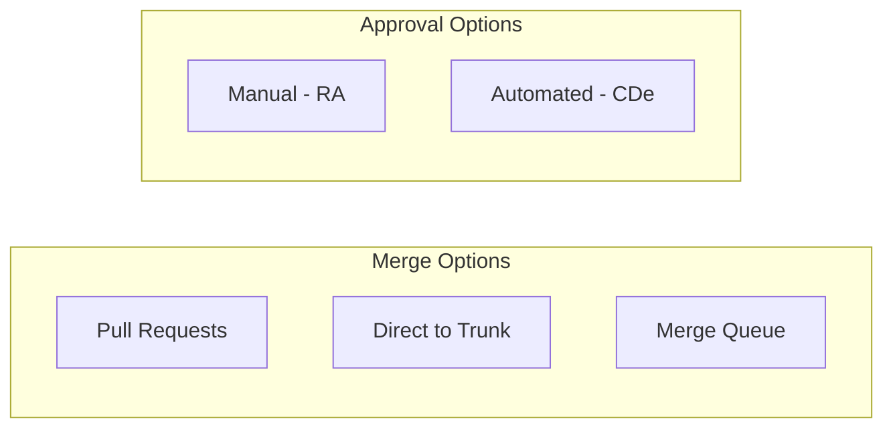
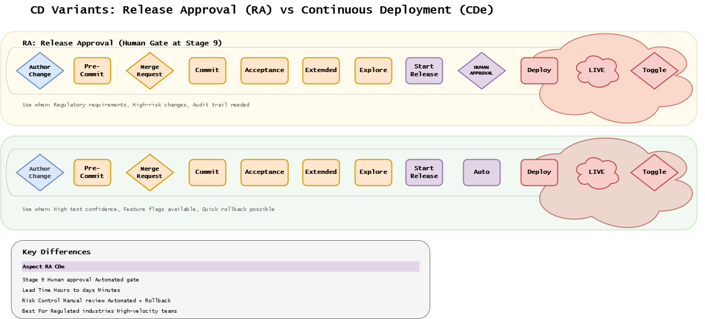
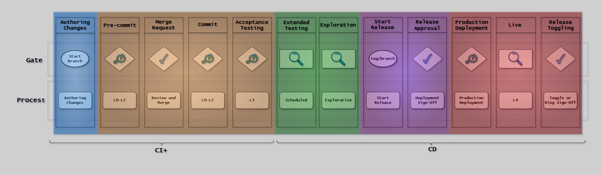
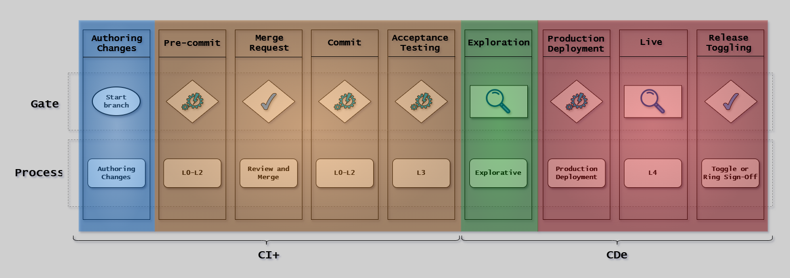
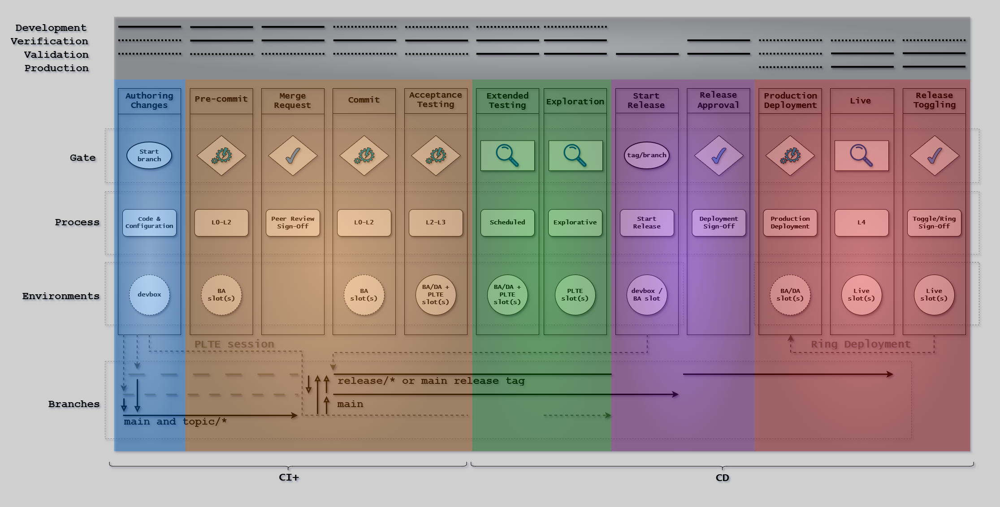
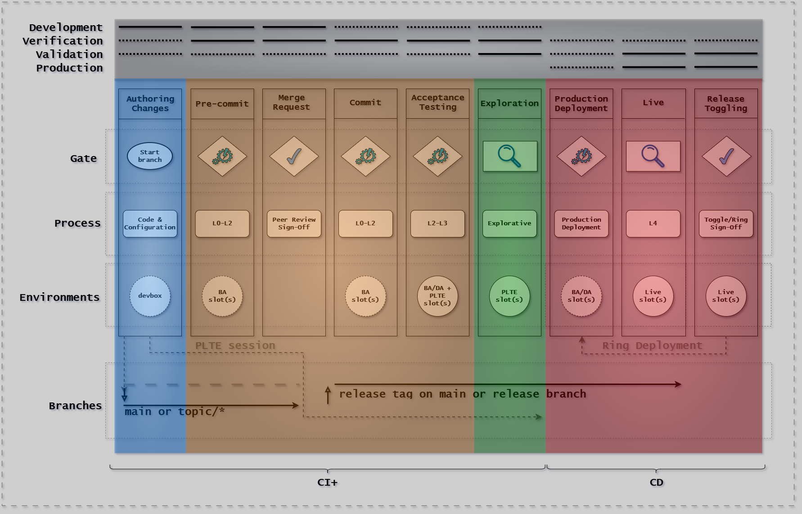
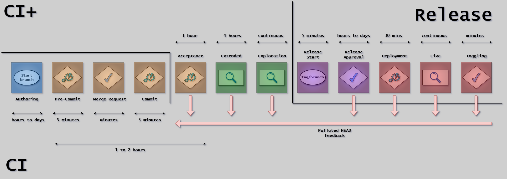
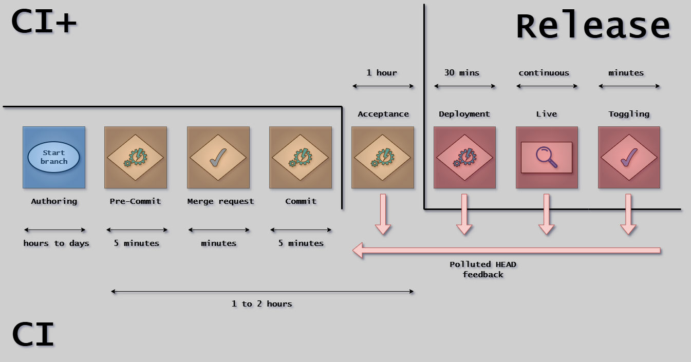
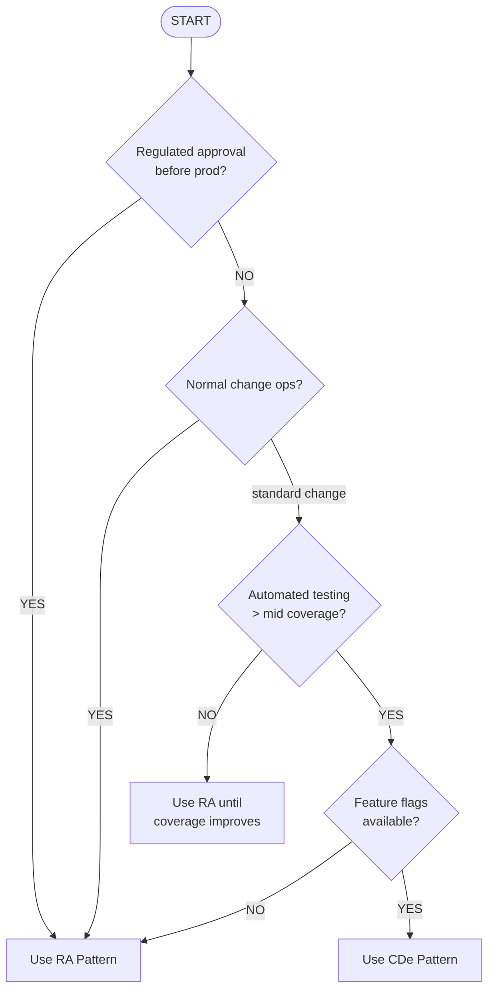

# CD Model Variants

## Introduction

The CD Model can be adapted to different contexts through two primary variation points.

Understanding these variants helps you configure your CD implementation for your regulatory requirements,
risk profile, team size, and organizational maturity.

### The Two Variation Points

1. **Merge Request (Stage 3)**: How changes are integrated into the main branch
2. **Release Approval (Stage 9)**: How changes are approved for production deployment

These two dimensions combine independently, creating multiple valid configurations.

### Why Variants Exist

- **Regulated systems** require extensive validation, audit trails, and formal approvals
- **Small teams** (1-2 developers) cannot effectively utilize pull request workflows
- **Internal tools** benefit from rapid iteration and minimal overhead
- **High-velocity teams** use merge queues to prevent dirty HEADs

---

## Merge Request Variants

The Merge Request stage (Stage 3) controls how changes are integrated into the main branch.

### 1. Topic Branches with Pull Requests (Default)

**Workflow:** Create topic branch → commit changes → create PR → peer review + CI → merge to trunk

**Advantages:**

- Formal peer review with documented approval
- Automated checks gate integration
- Clear audit trail
- Supports regulatory compliance

**Disadvantages:**

- Slower feedback (minutes to hours)
- Potential for stale branches
- Overhead for very small teams

**Best for:** Teams of 3+, regulated environments.

### 2. Direct-to-Trunk Commits

**Workflow:** Make changes locally → pre-commit checks → push to trunk → CI validates → peer review deferred to Stage 9

**Advantages:**

- Fastest feedback (minutes)
- Minimal ceremony
- Works for solo/pair programming

**Disadvantages:**

- No pre-integration peer review
- Peer review batched at release time
- Higher risk of dirty trunk HEADs

**Best for:** Very small teams (1-2), internal tools, pair programming.

### 3. Integration/Merge Queue (Advanced)

**Workflow:** Create PR → pass review → add to queue → queue rebases onto trunk → CI runs → auto-merge if pass

**Advantages:**

- Prevents dirty HEAD (trunk always green)
- Parallelizes validation, serializes merges
- Scales to high-velocity teams

**Disadvantages:**

- Requires advanced tooling (GitHub Merge Queue, Bors)
- Adds merge latency
- Can bottleneck under heavy load

**Best for:** Large teams, monorepos, critical trunk stability.

### Choosing Your Merge Strategy

| Variant         | Feedback | Stability | Approval   | Team Size |
| --------------- | -------- | --------- | ---------- | --------- |
| Pull Requests   | Slow     | Medium    | Per-change | 3+        |
| Direct-to-Trunk | Fast     | Lower     | Deferred   | 1-2       |
| Merge Queue     | Slow     | Highest   | Per-change | Large     |

---

## Release Approval Variants

The Release Approval stage (Stage 9) controls how changes are approved for production.

The following diagram compares the two primary release approval patterns. Release Approval (RA) includes a manual approval gate, while Continuous Deployment (CDe) uses automated quality gates to approve changes.

### Release Approval (RA) Pattern

**Best for:** Regulated environments, high-risk applications, audit requirements.

**Key characteristics:**

- Manual approval at Stage 9 by release manager
- Comprehensive audit trail emphasized
- Formal sign-off documented
- Two approval gates: Stage 3 (peer) + Stage 9 (release manager)

**When to use:**

- Regulatory oversight (FDA, financial regulations)
- Critical systems (safety, health, business-critical)
- Compliance requirements for documented approvals
- High consequence of failure

**Cycle time:** 1-2 weeks (constrained by authoring and approval queue)

### Continuous Deployment (CDe) Pattern

**Best for:** Non-regulated systems, internal tools, mature DevOps practices.

**Key characteristics:**

- Automated approval at Stage 9 (quality gates)
- Feature flags provide runtime control
- Stage 3 serves as both first and second-level approval
- Changes flow to production automatically if gates pass

**When to use:**

- Fully automated verification in place
- Non-regulated deployment
- Internal tools with tolerant users
- Mature test coverage
- Feature flags available
- Business value from rapid deployment

**Cycle time:** Under 1 hour for small changes

**Note:** CDe can work in regulated environments,
if features deploy disabled (flag OFF) and Stage 12 (Release Toggling) controls when features go live.

### Key Differences

| Aspect        | RA Pattern               | CDe Pattern                 |
| ------------- | ------------------------ | --------------------------- |
| Stage 9       | Manual (Release Manager) | Automated (Quality Gates)   |
| Stage 3 scope | Code review only         | Code review + prod approval |
| Feature flags | Optional                 | Required                    |
| Audit trail   | Emphasized               | Available                   |
| Cycle time    | 1-2 weeks                | < 1 hour                    |

### Detailed Canvas Views

For a complete view of each pattern with all 12 stages across CI+ Development and Release phases:

**RA Pattern Full Canvas:**

{width=1000}

**CDe Pattern Full Canvas:**

{width=1000}

### Timeline Comparison

The following diagrams show the timing intervals for each pattern, illustrating feedback loops and phase transitions:

**RA Pattern Timeline:**

{width=900}

**CDe Pattern Timeline:**

{width=900}

---

## Choosing Your Configuration

### Decision Tree

### Configuration Matrix

| Merge  | Release | Best For                       | Cycle Time |
| ------ | ------- | ------------------------------ | ---------- |
| PR     | RA      | Regulated teams, 3+ devs       | 1-2 weeks  |
| PR     | CDe     | Fast teams, mature testing     | 1-2 hours  |
| Direct | RA      | Small teams needing compliance | 1-2 weeks  |
| Direct | CDe     | Solo devs, internal tools      | < 1 hour   |
| Queue  | RA      | Large regulated teams          | 1-2 weeks  |
| Queue  | CDe     | Large teams, monorepos         | hours      |

### Factors to Consider

**Risk:** Impact of production defects, detection speed, rollback cost

**Team:** Size (1-2 vs 3+ vs large), distribution, skill level

**Maturity:** Test automation, monitoring, incident response

**Regulatory:** Evidence requirements, approval needs, audit frequency

**Business:** Time-to-market pressure, user tolerance, support capabilities

### Hybrid Approaches

**By system type:**

- Live products (PR + RA): Customer-facing, critical
- Internal tools (Direct + CDe): Developer tools, dashboards

**By maturity:**

1. Start with PR + RA (full oversight)
2. Build automation (improve coverage, monitoring)
3. Transition to PR + CDe (remove Stage 9 manual gate)
4. Advanced: Queue + CDe (high-velocity, high-confidence)

---

## Summary

### Merge Variants

| Variant         | Speed | Stability | Best For    |
| --------------- | ----- | --------- | ----------- |
| Pull Requests   | Slow  | Medium    | Most teams  |
| Direct-to-Trunk | Fast  | Lower     | Small teams |
| Merge Queue     | Slow  | Highest   | Large teams |

### Release Variants

| Pattern | Approval       | Cycle Time | Best For                |
| ------- | -------------- | ---------- | ----------------------- |
| RA      | Manual Stage 9 | 1-2 weeks  | Regulated, high-risk    |
| CDe     | Automated      | 1-2 hours  | Non-regulated, low-risk |

---

## References

- [Overview](overview.md) - CD Model introduction
- [The 12 Stages](stages.md) - Stage details
- [Compliance](compliance.md) - Signoffs and evidence
- [Trunk-Based Development](../workflow/trunk-based-development.md) - Branching strategy
