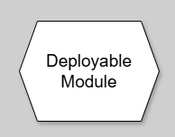
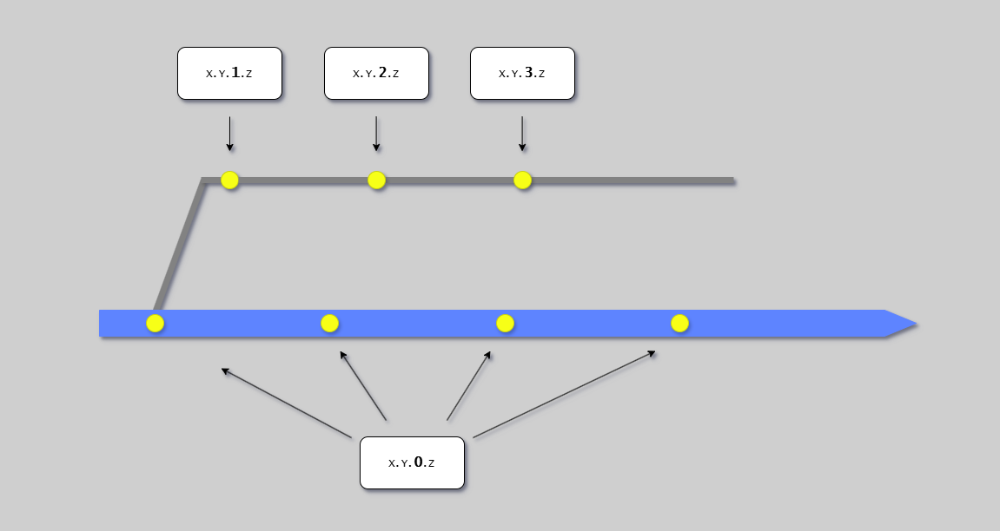

# Deployable Modules

{{ page_breadcrumb() }}

## Introduction

A Deployable Module is the fundamental building block of Continuous Delivery. It represents the discrete body of work that is built, tested, and delivered as a cohesive whole through the CD Model's 12 stages.

Understanding deployable modules is critical for:

- Defining the scope of what gets built and deployed together
- Determining versioning and release granularity
- Establishing clear ownership boundaries
- Enabling independent testing and deployment

{width=100}

This diagram shows the deployable module notation used throughout CD Model visualizations.

## Definition

**Deployable Module:** The discrete body of work that is built, tested, and delivered.

**Key Characteristics:**

- Composed of one or more immutable artifacts
- Has its own version number
- Progresses through all CD Model stages independently
- Can be deployed without horizontally testing with other units
- Lowest level of granularity for repository decomposition

**What a Deployable Module Is NOT:**

- Not arbitrary code that happens to be in a repository
- Not a feature or user story
- Not a module or package within a larger system (unless independently deployable)

---

## Types of Deployable Modules

Deployable modules fall into two primary categories, each with different characteristics and versioning strategies.

### Runtime Systems

Runtime systems are services, applications, or systems that run continuously to serve users or process data.

**Examples:**

- **Microservices**: Independent services in a distributed architecture
- **Modular Monoliths**: Single deployable application with internal modularity
- **Web Applications**: User-facing web apps
- **Data Pipelines**: ETL/ELT processing systems
- **Background Workers**: Async job processors
- **APIs**: REST/GraphQL/gRPC services
- **Micro Applications**: Small, focused applications
- **Store Apps**: Mobile or desktop applications
- **Shared Infrastructure**: Common platform services

**Characteristics:**

- Continuously running in production
- Serve real-time user requests or process data
- Typically versioned with CalVer or Release Number
- Usually "Software as a Service" (SaaS) model
- Only one version active in production at a time

**Deployment Pattern:**

- Deploy to production environment
- Replace previous version
- Monitor runtime behavior
- Support single active version

### Versioned Components

Versioned components are libraries, tools, or containers consumed by other systems.

**Examples:**

- **Container Images**: Docker images for applications
- **npm Packages**: JavaScript/TypeScript libraries
- **NuGet Packages**: .NET libraries
- **pip Packages**: Python libraries
- **Maven/Gradle Artifacts**: Java libraries
- **Go Modules**: Go libraries
- **CLI Tools**: Command-line utilities
- **PowerShell/Bash Modules**: Shell automation
- **Contract Packages**: API contracts/schemas
- **Automation Modules**: Reusable automation code

**Characteristics:**

- Consumed by other systems via dependency management
- Multiple versions exist simultaneously "in the wild"
- Typically versioned with Semantic Versioning (SemVer)
- "Multiple Releases in the Wild" model
- Consumers control which version they use

**Deployment Pattern:**

- Publish to artifact registry (npm, NuGet, Docker Hub)
- Multiple versions available simultaneously
- Consumers upgrade at their own pace
- Must maintain backward compatibility or communicate breaking changes

---

## Versioning Strategies

Deployable modules must be versioned to enable traceability, rollback, and dependency management.

### Version Number Format

!!! note
    Even though we define quite complex numbers here, for almost all usages we only use the 3 first parts Major.Minor.Revision

We use a extensible four-part version number:

**Major.Minor.Revision.Patch[-informational]**

**Example:** `1.2.3.4-rc1`

- **Major**: 1
- **Minor**: 2
- **Revision**: 3
- **Patch**: 4 (commit count from branch point - for release branching - 0 for main)
- **Informational**: rc1 (release candidate 1)

Non-used positions default to zero (e.g., `1.2` = `1.2.0.0`).

### Versioning Schemes by Type

The versioning scheme depends on the deployable module type and distribution model.

**Implicit Versioning:**

- **Use for**: Internal supporting modules in monorepo
- **Format**: No explicit version number (uses commit SHA)
- **Example**: Shared utilities library in monorepo
- **Cost**: Lowest maintenance

**CalVer (Calendar Versioning):**

- **Use for**: SaaS runtime systems
- **Format**: `YYYY.MMDD.HHMM.Patch`
- **Example**: `2024.1115.2030.0` (Nov 15, 2024, 20:30, main branch commit)
- **Cost**: Low maintenance (automated)
- **Benefit**: Easy to identify when deployed

**Manual Semantic Versioning:**

- **Use for**: SaaS systems with human calculated major and minor.
- **Benefit**: Communicates breaking changes vs enhancements
- **Format**: `Fixed.Fixed.Revision.Patch`
- **Example**: `1.5.1234.0` (Major=1, Minor=5, Revision=1234, main branch commit)
- **Cost**: Low to medium maintenance (still need to control major and minor, but they are fixed in configration)
- **Benefit**: Easy to implement
- **Drawback**: Hard to calculate manually -> High chance of semver not be used correctly

**Automated Semantic Versioning (SemVer):**

- **Use for**: Versioned components, libraries, multi-release systems
- **Benefit**: Communicates breaking changes vs enhancements
- **Format**: `Major.Minor.Revision.Patch`
- **Example**: `2.3.12.0`
- **Cost**: Higher complexity (requires semantic change logs etc.)
- **MAJOR**: Breaking changes (incompatible API changes)
- **MINOR**: New features (backward-compatible)
- **Revision**: Patches on release branches
- **Benefit**: Higher chance of reliable change logs and correct semver bumping.
- **Drawback**: Complex to implement, requires conventional commits and module maps

**API Versioning:**

- **Use for**: Runtime APIs (REST, GraphQL, gRPC)
- **Deployable Module Version**: Uses CalVer or Release Number (tracks with the service)
- **API Interface Version**: Separate version (v1, v2, v3)
- **Example**: API service version `2024.1115.2035.0` is contracted to be compatible with API interfaces v1, v2, v3
- **Purpose**: Maintain multiple API versions in single service for backward compatibility

### Patch Number



The Patch number tracks commits on release branches:

- **Main branch commits**: patch = 0
- **Release branch commits**: patch = count of commits since branch point
- **First release branch commit**: patch = 1

**Git command:**

```bash
# Get patch number on release branch
git rev-list main.. --count
```

### Choosing a Versioning Strategy

| Deployable Module Type   | Distribution Model          | Versioning Strategy |
| ------------------------ | --------------------------- | ------------------- |
| Microservice             | SaaS (single version)       | CalVer or SemVer    |
| Web Application          | SaaS (single version)       | CalVer or SemVer    |
| CLI Tool                 | Multi-release (distributed) | SemVer              |
| npm Package              | Multi-release (distributed) | SemVer              |
| Container Image          | Multi-release (consumed)    | SemVer              |
| Docker Base Image        | Multi-release (consumed)    | SemVer              |
| Internal Monorepo Module | Not distributed             | Implicit            |
| REST API (service)       | SaaS                        | CalVer              |
| REST API (interface)     | Multi-version support       | API (v1, v2, v3)    |

---

## Immutable Artifacts

Deployable modules are built into immutable artifacts that progress through the pipeline.

### What is an Immutable Artifact?

**Definition:** A versioned, unchangeable output from the build process.

**Key Properties:**

- **Built once** in Stage 4 (Commit)
- **Never modified** after creation
- **Same artifact** deployed to all environments
- **Uniquely identified** by version number and checksum
- **Stored** in artifact registry

### Why Immutability Matters

**Consistency:**

- What you test is what you deploy
- No "works on my machine" issues
- Eliminates configuration drift

**Traceability:**

- Exact artifact version in each environment
- Can correlate issues to specific build
- Enables accurate rollback

**Security:**

- Signed artifacts prove integrity
- Tampering is detectable
- Audit trail from build to deployment

**Compliance:**

- Required for regulated industries
- Satisfies evidence requirements
- Supports change control processes

### Artifact Types

**Container Images:**

```text
registry.example.com/api-service:1.2.3.4
```

- Built in Stage 4
- Scanned for vulnerabilities (Trivy)
- Deployed to all environments unchanged

**Application Packages:**

```text
api-service-1.2.3.4.zip
api-service-1.2.3.4.tar.gz
```

- Compressed application bundle
- Includes application code and dependencies
- Excludes environment-specific configuration

**Library Packages:**

```text
@company/shared-utils@1.2.3
company.shared-utils.1.2.3.nupkg
```

- Published to package registry
- Consumed via dependency management
- Multiple versions available simultaneously

### Configuration vs Artifacts

**What's IN the artifact:**

- Application code
- Application dependencies
- Default configuration structure
- Static assets

**What's NOT in the artifact (injected at deployment):**

- Database connection strings
- API keys and secrets
- Environment-specific URLs
- Feature flag states

This separation enables the same artifact to be deployed to multiple environments with environment-specific configuration.

---

## Dependency Management

Deployable modules often depend on other modules (libraries), but can only depend on other deployable modules (services, APIs) via pinning and stitching.

### Internal Dependencies (Monorepo)

**Implicit Versioning:**

```text
monorepo/
├── services/
│   └── api/              # Deployable Module 1
│       └── depends on shared/models
└── shared/
    └── models/           # Not a deployable module (implicit version)
```

**Characteristics:**

- Supporting code doesn't have its own version
- Version is implied by the deployable module it's built with
- Changes trigger rebuild of dependent deployable modules
- Simpler but requires monorepo

### External Dependencies (Polyrepo or Published Libraries)

**Explicit Versioning:**

```yaml
# package.json
dependencies:
  "@company/shared-models": "^2.3.0"  # SemVer range
```

**Characteristics:**

- Dependencies have explicit versions
- Consumers control which version they use
- Breaking changes require major version bump
- Enables gradual migration

### Dependency Patterns

**Pin to Specific Versions (Recommended for Production):**

```json
{
  "dependencies": {
    "express": "4.18.2",
    "@company/auth": "1.2.3"
  }
}
```

**Benefits:** Reproducible builds, no unexpected updates
**Tradeoff:** Manual updates required

**Use Version Ranges (Caution):**

```json
{
  "dependencies": {
    "express": "^4.18.0",
    "@company/auth": "~1.2.0"
  }
}
```

**Benefits:** Automatic patch updates
**Tradeoff:** Potential for unexpected changes

### Dependency Updates

**Automated Monitoring:**

- Use Dependabot to detect vulnerable dependencies
- Automated PRs for security updates
- Regular dependency audits

**Update Strategy:**

1. Dependabot creates PR with updated dependency
2. Automated tests run in Stage 3 (Merge Request)
3. If tests pass, merge and deploy
4. If tests fail, investigate and fix

See [Security](../security/security.md) for dependency scanning with Trivy and Dependabot.

---

## Granularity: Choosing Deployable Module Boundaries

Defining the right boundaries for deployable modules is a critical architectural decision.

### Too Coarse (Too Few Deployable Modules)

**Problem:** Large monolithic deployable modules

**Issues:**

- Long build and test times
- All changes bundled together
- Difficult to rollback specific changes
- Team coordination bottlenecks
- Slow deployment cycles

**Example:**

```text
entire-platform/   # Single deployable module
├── api/
├── web/
├── worker/
└── admin/
```

All changes deploy together, even unrelated ones.

### Too Fine (Too Many Deployable Modules)

**Problem:** Over-segmentation into many tiny deployable modules

**Issues:**

- Complex dependency management
- Version compatibility challenges
- Coordination overhead across units
- Increased operational complexity
- Difficult to make cross-cutting changes

**Example:**

```text
user-service/          # Deployable module
user-service-models/   # Deployable module
user-service-client/   # Deployable module
user-service-worker/   # Deployable module
```

Simple user service split into 4 units requiring coordination.

### Right Balance

**Goal:** Deployable modules that can be independently developed, tested, and deployed

**Good Boundaries:**

- Clear service/module responsibilities
- Minimal coupling with other units
- Can be tested in isolation (Stage 5)
- Can deploy without other units
- Owned by a single team

**Example:**

```text
api-service/      # Deployable module (user-facing API)
worker-service/   # Deployable module (async processing)
admin-app/        # Deployable module (admin UI)
shared-lib/       # Deployable module (published library)
```

Each unit is independently deployable with clear boundaries.

### Decision Factors

**Split into separate deployable modules when:**

- Services have different release cadences
- Teams want independent deployment
- Clear service boundaries exist
- Services scale independently
- Different technology stacks

**Keep as one deployable module when:**

- Code changes together frequently
- Shared codebase makes sense
- Small team size
- Atomic deployments desired
- Tight coupling exists

---

## Deployable Modules in CD Model Stages

### Stage 4 (Commit): Build Artifacts

When a trunk commit affects a deployable module:

1. Pipeline detects which deployable modules changed
2. Build immutable artifacts for affected units
3. Run unit and integration tests
4. Publish artifacts to registry
5. Tag with version number

### Stage 5 (Acceptance Testing): Validate in PLTE

Each deployable module is tested independently:

- Deploy to PLTE environment
- Run acceptance tests for this unit
- Validate IV (installation), OV (operation), PV (performance)
- Collect test evidence

### Stage 8 (Start Release): Create Release Candidate

For each deployable module being released:

- Identify version to release
- Create release branch or tag (RA pattern)
- Or deploy directly from trunk (CDE pattern)
- Generate release notes

### Stage 10 (Production Deployment): Deploy to Live

Deploy the immutable artifact:

- Pull artifact from registry (no rebuild)
- Deploy to production environment
- Inject environment-specific configuration
- Monitor deployment success

---

## Summary

Deployable modules are the fundamental building blocks of Continuous Delivery:

**Definition:**

- Discrete body of work built, tested, and delivered together
- Composed of immutable artifacts
- Has its own version number
- Progresses through CD Model stages independently

**Types:**

- **Runtime Systems**: Services, apps (SaaS model, CalVer/Release Number)
- **Versioned Components**: Libraries, tools (Multi-release model, SemVer)

**Versioning:**

- Implicit: Internal monorepo modules
- CalVer: SaaS runtime systems
- Release Number: SaaS with explicit releases
- SemVer: Libraries and multi-release systems
- API Versioning: Runtime APIs

**Key Principles:**

- Build once, deploy many times (immutability)
- Same artifact across all environments
- Configuration injected at deployment time
- Dependencies explicitly versioned (polyrepo) or implicit (monorepo)
- Boundaries enable independent development and deployment

## Next Steps

- [Unit of Flow](unit-of-flow.md) - See how deployable modules fit into the bigger picture
- [Trunk-Based Development](../workflow/trunk-based-development.md) - How code flows into deployable modules
- [Branching Strategies](../workflow/branching-strategies.md) - Branching flows for RA and CDE patterns
- [Stages 1-7](../cd-model/cd-model-stages-1-7.md) - Development stages for deployable modules
- [Stages 8-12](../cd-model/cd-model-stages-8-12.md) - Release stages for deployable modules

## References

### Internal Documentation

- [CD Model Overview](../cd-model/cd-model-overview.md)
- [Repository Patterns](../architecture/repository-patterns.md)

### External Standards

- [Semantic Versioning (SemVer)](https://semver.org/) - Versioning standard for libraries and tools
- [Calendar Versioning (CalVer)](https://calver.org/) - Versioning standard for runtime systems
- [Conventional Commits](https://www.conventionalcommits.org/) - Commit message convention
- [Trunk-Based Development](https://trunkbaseddevelopment.com/) - Branching strategy and workflow

{{ diataxis_footer() }}
