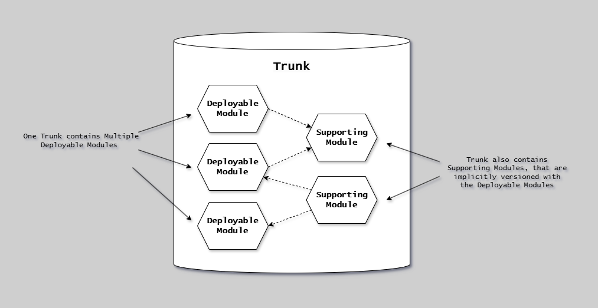
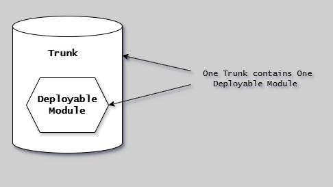
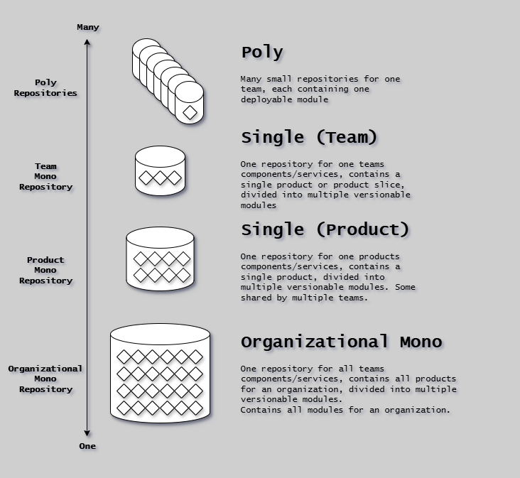
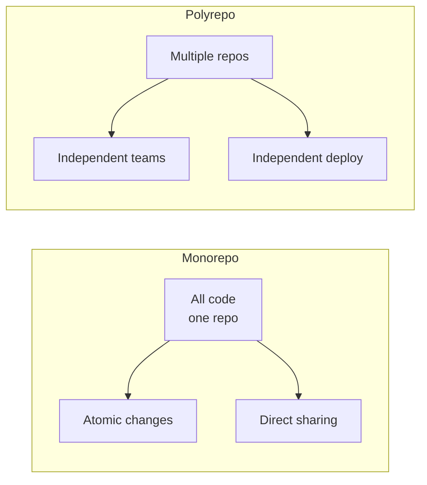
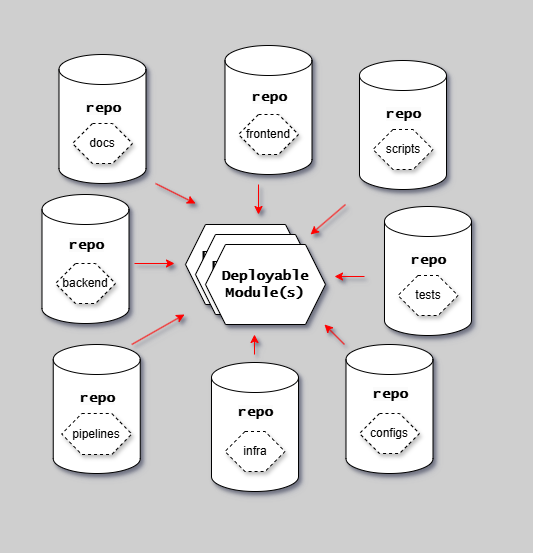

# Trunk

## Introduction

Repository organization is a foundational decision that affects how teams collaborate, how code is versioned, and how deployable modules are structured.

This article explains the two primary patterns - monorepo and polyrepo - and provides guidance on choosing the right approach.

---

## Monorepo Pattern

{width=800}

A single repository containing more than one [deployable module](deployable-modules.md).

Path filters (glob patterns) define module boundaries, allowing independent versioning and deployment despite sharing the same repository.

### Characteristics

**Single Repository:**

- All application code in one repository
- Shared infrastructure and tooling
- Unified version history
- Single source of truth

**Code Organization:**

- Organized by technology first, then module directories
- Shared tooling and configuration
- Unified dependency management

**Example Structure:**

```text
monorepo/
├── services/       # module group (e.g., dotnet)
│   ├── api/        # deployable module
│   ├── web/        # deployable module
│   └── worker/     # deployable module
├── shared/         # module group
│   ├── models/     # supporting module (implicit consume)
│   └── utils/      # supporting module (implicit consume)
├── infrastructure/ # IaC (e.g., Bicep)
└── docs/           # documentation (e.g., mkdocs)
```

### Benefits

- **Atomic Changes**: Refactor multiple services in single commit
- **Simplified Dependencies**: Shared dependencies at root level, no version conflicts
- **Code Sharing**: Direct access to shared utilities and libraries
- **Unified Tooling**: Single CI/CD configuration, consistent build process
- **Easier Refactoring**: Cross-module changes in one PR

### Tradeoffs

- **Build Times**: Need selective builds and caching strategies
- **Access Control**: Coarser-grained permissions, all developers see all code
- **Repository Size**: Can grow large, may need [specialized tooling](https://devblogs.microsoft.com/devops/optimizing-git-beyond-gvfs/)
- **Cognitive Overhead**: Developers may be overwhelmed by scope

### When to Use

- Team-coupled services maintained together
- Heavy code reuse across projects
- Small to medium teams (< 50-100 developers)
- Rapid iteration requiring frequent cross-cutting changes
- Unified ownership of all code

---

## Polyrepo Pattern

{width=400}

One repository per deployable module.

The repository boundary aligns perfectly with the module boundary, making versioning straightforward.

### Characteristics

**Multiple Repositories:**

- One repository per service or component
- Independent version history
- Separate access controls
- Isolated tooling and configuration

**Code Organization:**

- Each repository is self-contained
- Dependencies managed per repository
- Service-specific configuration

**Example Structure:**

```text
api-service-repo/
├── .github/          # pipeline
├── api-service/      # deployable module
├── infrastructure/   # IaC
└── docs/             # documentation
```

```text
shared-models-repo/
├── .github/          # pipeline
├── shared-models/    # deployable module (explicit consume via package)
└── docs/             # documentation
```

### Benefits

- **Team Autonomy**: Teams own and control their repositories
- **Clear Boundaries**: Enforces service boundaries, prevents unintended coupling
- **Independent Deployment**: Services deploy on separate schedules
- **Granular Access Control**: Fine-grained permissions per repository
- **Smaller Repositories**: Faster clone times, simpler navigation

### Tradeoffs

- **Cross-Repository Changes**: Multiple PRs needed, coordination required
- **Dependency Management**: Version conflicts between repositories, contract testing required
- **Tooling Duplication**: CI/CD configuration duplicated across repos
- **Discoverability**: Harder to find related code, no unified search

### When to Use

- Loosely coupled services with independent lifecycles
- Large organizations with separate team ownership
- Distributed teams with confidentiality needs
- Independent deployment cadences
- Well-defined APIs between services

---

## Repository Types

{width=800}

**Poly-repository**: One deployable module. Repository boundary = module boundary.

**Mono-repository subtypes:**

- **Team mono**: Single team owns multiple modules
- **Product mono**: Multiple teams collaborate on one product
- **Organizational mono**: Large-scale (Google/Facebook style, not recommended for most)

### Adjacent Repositories

Not all repositories are trunks. **Adjacent repositories** serve specialized purposes beyond containing deployable modules.

**Example: GitOps Repository**

A Kubernetes GitOps repository is a special form of IaC constrained to declarations only. It cannot easily be integrated into a trunk, nor should it be: the GitOps repository's history should be the history of the cluster it controls, one-to-one.

| Repository Type   | Purpose                             | Contains Modules? |
| ----------------- | ----------------------------------- | ----------------- |
| Trunk (mono/poly) | Source of truth for deployable code | Yes               |
| GitOps repo       | Cluster state declarations          | No                |
| Config repo       | Environment-specific configuration  | No                |
| Template repo     | Repository scaffolding              | No                |

Adjacent repositories are consumed by or triggered from trunk pipelines, but maintain their own lifecycle and history.

### Comparison



| Factor                       | Monorepo                     | Polyrepo            |
| ---------------------------- | ---------------------------- | ------------------- |
| Atomic cross-cutting changes | Excellent                    | Difficult           |
| Traceability                 | Single timeline              | Multiple timelines  |
| Team autonomy                | Limited                      | High                |
| Pipeline complexity          | Requires specialized tooling | Simple              |
| Coordinated releases         | Simple                       | Hard                |
| Code reuse                   | Easy (direct)                | Requires versioning |
| Access control               | Coarse-grained               | Fine-grained        |
| Discoverability              | All in one place             | Spread across repos |

---

## Anti-Pattern: Technical Boundary Split

{width=400}

Splitting repositories by technical boundary (frontend/, backend/, scripts/, infrastructure/) rather than deployable module boundary creates dependency chaos.

**Problems:**

- No coherent version for what a release consists of
- Changes to one feature require coordinating multiple repositories
- No clear deployment boundary

**Avoid:**

- Separate repos for frontend, backend, scripts, docs, infrastructure unless each is a distinct deployable module with proper contracts
- Loose gatherings of repositories with cross-repository dependencies
- Head-to-head dependencies between repos (use pinning and stitching instead)

---

## Best Practices

**Module Boundaries**: Define explicit boundaries, document dependencies, enforce with tooling.

**Versioning**:

- Monorepo: Independent SemVer/CalVer per module
- Polyrepo: SemVer/CalVer per repository

**Dependency Management**:

- Root-level lock files (go.sum, package-lock.json) for consistency
- In-repository bindings are implicit
- Cross-repository bindings are pinned and stitched

**Automation**:

- Monorepo: Change detection, selective builds (Nx, Bazel, Turborepo)
- Both: Repository templates, shared pipeline definitions, Dependabot

---

## Next Steps

- [Unit of Flow](unit-of-flow.md) - How trunk fits in the 4-component model
- [Deployable Modules](deployable-modules.md) - What modules trunk contains
- [Pipeline](pipeline.md) - How pipelines work with mono/poly repos
- [Environments](../environments/environments.md) - Environment types and PLTE

## References

- [CD Model Overview](../cd-model/overview.md)
- [Trunk-Based Development](../workflow/trunk-based-development.md)
