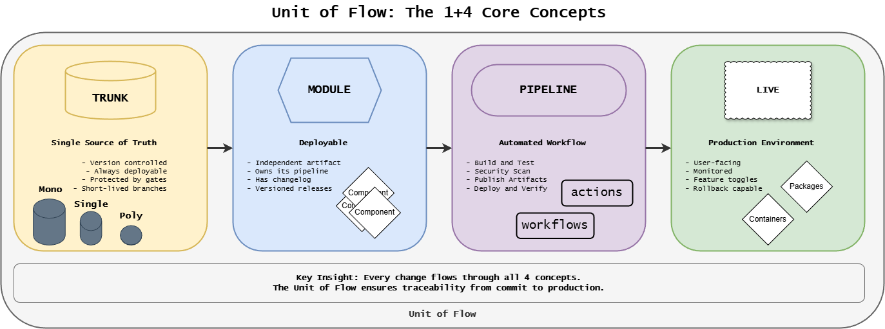
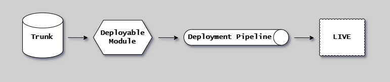
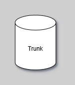
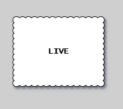
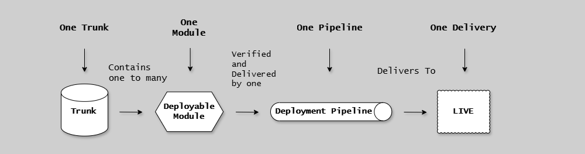
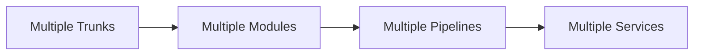

# Unit of Flow

## Introduction

The Unit of Flow is a conceptual framework that divides Continuous Delivery into four discrete, interconnected components.

Understanding these components and their relationships is essential for implementing an effective CD Model.

The following diagram introduces the Unit of Flow concept, showing the four components and how changes flow from trunk through the pipeline to live systems.

{width=900}

For a more detailed technical view of the component relationships:

{width=800}

---

## The Four Components

### Trunk

{width=150}

The version-controlled repository where code lives.

Implemented as a Git repository following trunk-based development, it contains "everything as code" and represents the single source of truth.

Can be a polyrepo (one deployable module) or monorepo (multiple deployable modules).

See [Trunk](trunk.md) for monorepo vs polyrepo patterns.

### Deployable Module

{width=150}

The discrete body of work that is built, tested, and delivered as a single unit.

Composed of immutable artifacts with its own version number.

Types include runtime systems (services, apps) and versioned components (libraries, containers).

See [Deployable Modules](deployable-modules.md) for types, versioning, and artifact management.

### Deployment Pipeline

{width=250}

The automated process that validates and delivers changes through the CD Model's 12 stages.

Triggered by trunk commits, it builds artifacts, runs tests, and deploys to production.

Each deployable module has its own pipeline instance.

See [Pipeline](pipeline.md) for triggers, stages, and evidence collection.

### Live

{width=150}

The destination where released software serves consumers.

- For services, this is production.
- For versioned components, this is a package registry.

Provides feedback loops that influence future development.

See [Live](live.md) for destinations by module type and rollback strategies.

---

## Relationships

{width=800}

The four components connect in a continuous flow:

> **Trunk Contains Deployable Modules**

- Polyrepo: One trunk = one deployable module
- Monorepo: One trunk = multiple deployable modules

> **Each Deployable Module Has a Pipeline**

- Polyrepo: One pipeline per repository
- Monorepo: Multiple pipelines, one per module

> **Pipeline Delivers to Live**

The pipeline validates changes and delivers immutable artifacts to production or registries.

> **Live Feedback Influences Trunk**

Monitoring, incidents, and user behavior create feedback that drives changes to trunk.

---

## Common Patterns

### Single Service (Polyrepo)

**Use when:** Service is independent, team owns entire service, clear boundaries.

### Multi-Service Platform (Monorepo)

**Use when:** Services share code, need atomic cross-service changes, small-medium team.

### Microservices (Multiple Polyrepos)

**Use when:** Services loosely coupled, multiple teams with separate ownership, independent deployment.

---

## Next Steps

- [Trunk](trunk.md) - Monorepo vs polyrepo patterns
- [Deployable Modules](deployable-modules.md) - Types, versioning, artifacts
- [Pipeline](pipeline.md) - Automation and stages
- [Live](live.md) - Production and registries
- [CD Model Overview](../cd-model/overview.md) - Complete 12-stage framework

## References

- [CD Model Stages](../cd-model/stages.md)
- [CD Variants](../cd-model/variants.md)
- [Trunk-Based Development](../workflow/trunk-based-development.md)
