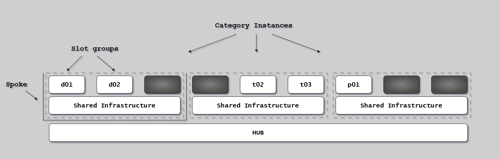
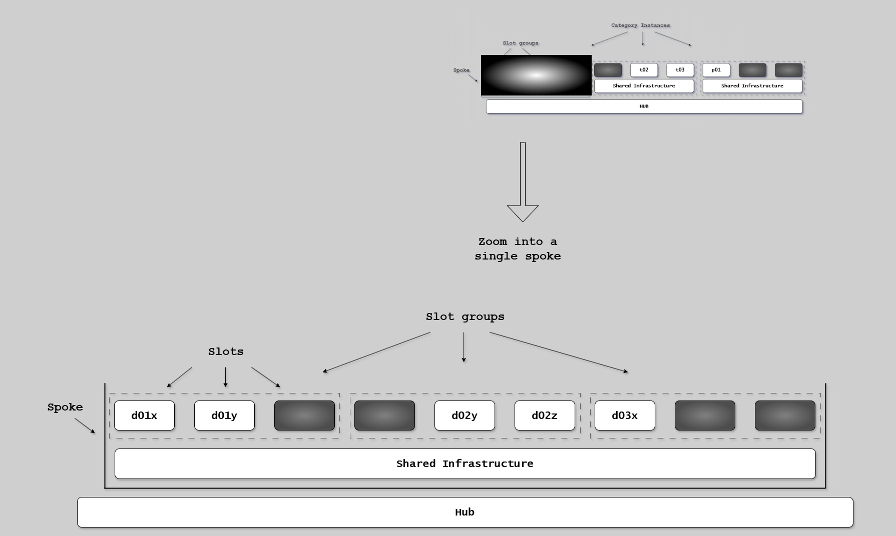
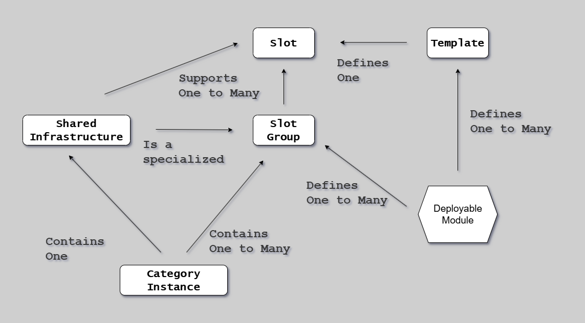

# Environment Types

## Introduction

Environments are the platform of the Continuous Delivery Model implementation.

Each serves a specific purpose in the software delivery pipeline implementation.

The CD Model reimagines environments as purpose-built, often ephemeral resources that enable parallel execution, rapid feedback, and consistent infrastructure.

---

## Overview

| Environment   | Purpose                     | CD Model Stages       | Lifespan         |
| ------------- | --------------------------- | --------------------- | ---------------- |
| Platform      | Ex. GitHub/GitLab/ADO       | all                   | Fixture          |
| DevBox        | Local development           | 1, 2                  | Fixture          |
| Build Agents  | CI/CD pipeline execution    | 2, 3, 4, 8            | Per-build        |
| Deploy Agents | Production deployment       | 10, 11                | Per-deployment   |
| PLTE          | Acceptance/extended testing | 5, 6                  | minutes to hours |
| Demo          | Explorative Testing         | 7 (RA trunk)          | Fixture          |
| Validation    | Stakeholder validation      | 7 (RA release branch) | Fixture          |
| Production    | Live user traffic           | 10, 11, 12            | Fixture          |

---

## DevBox

The developer's local environment where all changes begin.

**Characteristics:**

- Full control and isolation
- Fast iteration without network dependencies
- Immediate feedback loops

**Tools:** IDE, local build tools, unit testing frameworks, Docker, Git.

**Best Practice:** Mirror production configuration where possible.

---

## Build Agents

CI/CD pipeline runners that provide consistent, reproducible build environments.

**Characteristics:**

- Isolated execution for each build
- Consistent configuration across runs
- Access to artifact repositories
- No production credentials

**Infrastructure:** Containerized runners (Docker, Kubernetes, or vendor PaaS).

---

## Deploy Agents

Specialized CI/CD runners with segregated access to production.

{width=150}

**Characteristics:**

- Network access to production environments
- Production credentials (stored in vaults)
- Strict access controls and audit logging
- Separate from Build Agents

**Why Separate:** Principle of least privilege, reduced attack surface, clear audit trail.

See [Network Zones](network-zones.md) for security boundaries.

---

## Production-Like Test Environments (PLTE)

Ephemeral, isolated environments that emulate production for realistic testing.

{width=150}

**Characteristics:**

- Production-like infrastructure and configuration
- Realistic test data (anonymized)
- Isolated per topic branch or release candidate
- Created on-demand, destroyed after testing

**Benefits:**

- Realistic testing without production risk
- No resource contention between features
- Parallel testing for multiple branches

**Cost Management:** Short-lived (hours), automated cleanup, resource limits.

---

## Demo Environment

Stable, production-like environment for stakeholder validation.

**Characteristics:**

- Reflects current state of main branch
- Longer-lived than PLTEs (days to weeks)
- Accessible to non-technical stakeholders
- Represents "next release" features

**Use Cases:** Feature demos, UAT, documentation prep, exploratory testing.

**Update Cadence:** After successful Stage 6, daily or weekly.

---

## Production

Where software serves end users and delivers business value.

**Characteristics:**

- Live user traffic and real business data
- High availability requirements
- Performance monitoring
- Incident response procedures

**Deployment Strategies:** Hot Deploy, Rolling, Blue-Green, Canary, Feature Flags.

See [Deployment Strategies](../deployment/deployment-strategies.md) for details.

**Rollback:** Automated on threshold breaches, manual procedures, feature flag kill switches.

---

## Environment Organization

Environments are organized into **slot groups** and **slots** for infrastructure management.

### Architectural Layers

{width=800}

Environments are structured using categories (Production vs Dev/Test), templates (IaC), and instances. Shared infrastructure supports multiple slot groups.

### Slot Groups and Slots

{width=800}

**Slot groups** are named horizontal groupings (d/DEVELOPMENT, t/DEMO, p/PRODUCTION). **Slots** are logical constructs within groups that map to infrastructure templates.

### Naming Conventions

{width=800}

Infrastructure components are named to indicate slot group and slot membership, enabling automated provisioning and lifecycle management.

---

## Next Steps

- [Network Zones](network-zones.md) - Security boundaries between environments
- [CD Model Stages](../cd-model/stages.md) - How environments support each stage
- [Deployment Strategies](../deployment/deployment-strategies.md) - Production deployment patterns

## References

- [CD Model Overview](../cd-model/overview.md)
- [Live](../core-concepts/live.md)
