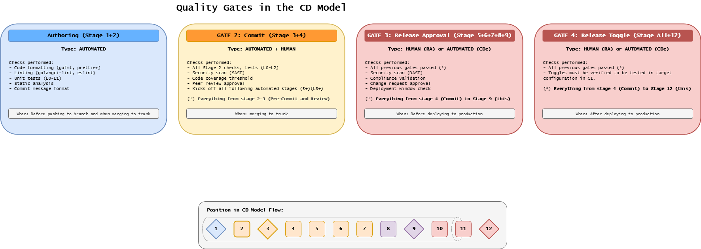
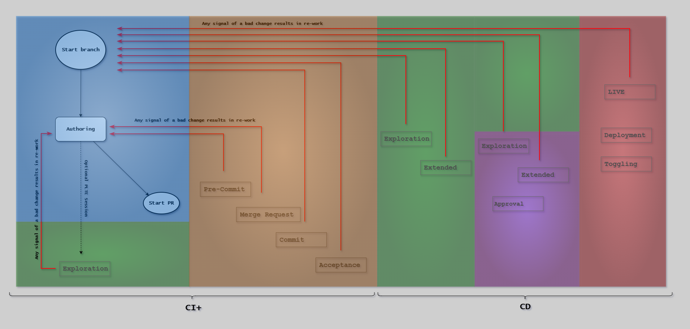
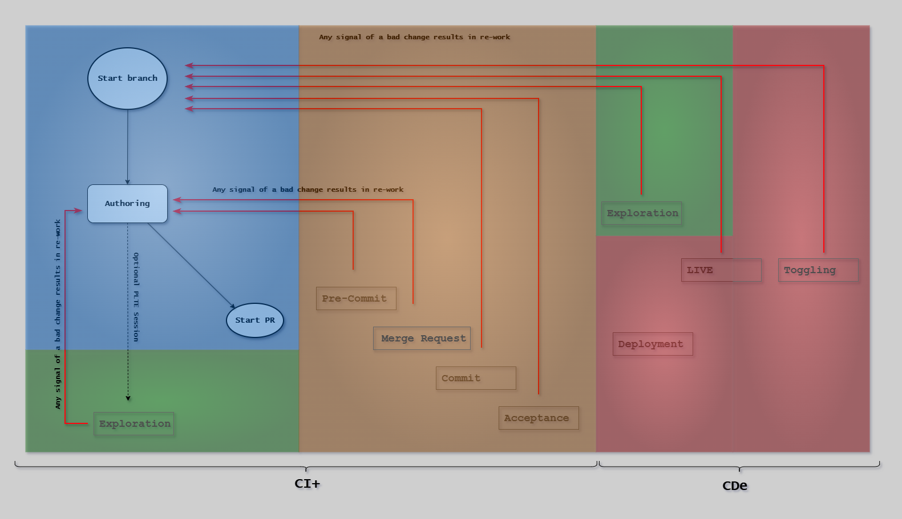

# Quality Gates

## Introduction

Quality gates are automated and manual checkpoints throughout the software delivery pipeline,
that ensure code meets defined standards before progressing to the next stage.
They embody a fundamental principle: **catch issues early, when they're cheapest and easiest to fix**.

Every quality gate represents a deliberate decision about what quality means at that point in the pipeline,
who verifies it, and what happens when standards aren't met.

Well-designed gates provide fast feedback while maintaining high confidence in what reaches production.

### Why Quality Gates Matter

**Fast Feedback Loops:**

Without quality gates, issues discovered late in the pipeline (or worse, in production) require expensive context switching.

A developer who wrote code yesterday can fix an issue in minutes.
The same developer fixing the same issue three weeks later after it reaches production may spend hours reconstructing context.

Quality gates create increasingly comprehensive validation stages:

- **Stage 2 (Pre-commit)**: Fast local validation in 5-10 minutes
- **Stage 3 (Merge Request)**: Peer review and CI validation
- **Stage 9 (Release Approval)**: Production readiness validation

**Shift-Left Philosophy:**

The CD Model embraces "shift-left testing" - moving quality validation earlier in the pipeline. Earlier detection means:

- Smaller blast radius (fewer people affected)
- Faster fixes (developer context still fresh)
- Lower cost (infrastructure, time, reputation)
- Higher confidence in later stages

**Automation vs Manual Gates:**

Different stages require different balances:

- **Automated gates** provide consistent, fast feedback (Stages 2, 4, 5, 6)
- **Manual gates** provide human judgment for complex decisions (Stage 3 peer review, Stage 9 in RA pattern)

The key is knowing which decisions benefit from automation and which require human expertise.

---

## Quality Gates in the CD Model

The following diagram shows where the four primary quality gates are positioned within the CD Model stages. Each gate serves as a checkpoint that validates specific criteria before allowing progression.

Quality gates appear at specific CD Model stages, each with distinct purposes:

### Stage 2: Pre-commit Quality Gates

**Purpose**: Fast validation before committing code

**Environment**: DevBox (local) and Build Agents (CI)

**Time Budget**: 5-10 minutes maximum

**Gate Type**: Fully automated

**What's Validated**:

- Code formatting and style
- Linting and static analysis
- Unit tests (fast, isolated)
- Secret detection
- Dependency vulnerability scanning
- Successful compilation

**Philosophy**: If it fails pre-commit, it shouldn't be committed.
Keep the feedback loop tight so developers can fix issues immediately while the context is fresh.

[Learn more: Pre-commit Quality Gates](./precommit-gates.md)

### Stage 3: Merge Request Quality Gates

**Purpose**: Validate code quality and design before merging to main branch

**Environment**: Build Agents (CI/CD)

**Time Budget**: Minutes to hours (includes human review time)

**Gate Type**: Automated + Manual (peer review)

**What's Validated**:

- All pre-commit checks (repeated in CI)
- Integration tests
- Code coverage thresholds
- Peer review approval
- No merge conflicts
- Security scans (SAST, dependency scanning)
- Documentation updates

**Philosophy**: Stage 3 is the first-level approval gate.

- In RA pattern, it approves code quality.
- In CDe pattern, it approves both code quality AND production deployment (combined first and second-level approval).

[Learn more: Merge Request Quality Gates](./merge-request-gates.md)

### Stage 9: Release Approval Quality Gates

**Purpose**: Validate production readiness before deployment

**Environment**: Evidence from PLTE (Stages 5-6) and Demo (Stage 7)

**Time Budget**: RA pattern (hours to days), CDe pattern (seconds - automated)

**Gate Type**: RA pattern (manual approval), CDe pattern (automated)

**What's Validated**:

- 100% test pass rate
- Code coverage thresholds met
- Zero critical/high severity bugs
- Performance regression < 5%
- Zero critical/high security vulnerabilities
- Complete documentation
- Stakeholder sign-offs
- Risk assessment completed

**Philosophy**: Stage 9 is the second-level approval gate in RA pattern (release manager validates production readiness).

In CDe pattern, this gate is automated - if Stages 5-6 pass, the release is automatically approved.

[Learn more: Release Quality Gates](./release-gates.md)

---

## Quality Gate Patterns: RA vs CDe

The CD Model supports two implementation patterns with different quality gate philosophies.

The following diagrams show the quality signals workflow for each pattern, illustrating stage progression with color-coded zones and re-work feedback loops:

**RA Pattern Quality Signals:**

{width=1000}

**CDe Pattern Quality Signals:**

{width=1000}

### Release Approval (RA) Pattern

**Approval Gates**:

- **Stage 3**: First-level (Peer review - code quality)
- **Stage 9**: Second-level (Release manager - production readiness)
- **Stage 12**: Third-level (Feature owner - feature exposure)

**Philosophy**: Human judgment at critical decision points. Manual review at Stage 9 provides:

- Risk assessment by experienced release managers
- Stakeholder sign-off for high-stakes releases
- Compliance documentation review
- Business-driven release timing

**Typical Cycle Time**: 1-2 weeks from commit to production

**Best for**: Regulated industries, high-risk deployments, coordinated releases

### Continuous Deployment (CDe) Pattern

**Approval Gates**:

- **Stage 3**: Combined first and second-level (Peer review - code quality AND production approval)
- **Stage 9**: Automated (no human approval)
- **Stage 12**: Third-level (Feature owner - feature exposure via feature flags)

**Philosophy**: Automate everything except feature exposure. By merging at Stage 3, the peer reviewer approves:

1. Code quality (first-level)
2. Production deployment (second-level)

Stage 9 becomes a fully automated check - if comprehensive automated tests pass in Stages 5-6, the code is production-ready.

**Typical Cycle Time**: 2-4 hours from commit to production

**Best for**: Fast-moving products, teams with strong automated testing, feature flag infrastructure

**Key Requirement**: Feature flags decouple deployment from release. Code reaches production with features disabled, enabled via Stage 12.

---

## Quality Gate Design Principles

### 1. Fail Fast

Gates should fail as quickly as possible when quality standards aren't met.

Don't wait 20 minutes to report a formatting error that could be caught in 10 seconds.

**Implementation**:

- Run fastest checks first (formatting, linting)
- Fail immediately on critical issues
- Parallel execution when possible
- Stop on first failure for sequential dependencies

### 2. Clear Feedback

Failures should provide actionable information:

- What failed and why
- Exact location of the problem
- How to fix it (when possible)
- Links to relevant documentation

### 3. Appropriate Scope

Each gate validates what's appropriate for that stage:

- **Stage 2**: Fast, isolated checks only (unit tests, not integration)
- **Stage 3**: Broader checks including integration tests
- **Stage 9**: Comprehensive validation including performance, security, compliance

### 4. Time Budget Awareness

Every gate has an implicit or explicit time budget:

- **Pre-commit (Stage 2)**: 5-10 minutes - developers wait for this
- **Merge Request (Stage 3)**: Minutes to hours - includes human review
- **Release Approval (Stage 9)**: RA pattern (hours to days), CDe pattern (seconds)

Exceeding time budgets creates bottlenecks and reduces effectiveness.

### 5. Automation Where Possible

Automate checks that:

- Have clear pass/fail criteria
- Run consistently every time
- Provide fast feedback
- Don't require contextual judgment

Keep manual review for:

- Design decisions
- Architecture tradeoffs
- Business risk assessment
- Contextual security review

### 6. Progressive Validation

Each stage builds on previous validation:

- Stage 2: Foundation (formatting, unit tests)
- Stage 3: Integration (integration tests, peer review)
- Stage 5: Acceptance (IV, OV, PV in production-like environment)
- Stage 6: Extended (performance, security, compliance)
- Stage 9: Production readiness (all evidence collected)

Later stages assume earlier stages passed - don't repeat validations unnecessarily.

---

## Common Anti-Patterns

### Anti-Pattern 1: Slow Pre-commit Gates

**Problem**: Pre-commit gates taking 30+ minutes

**Impact**: Developers skip pre-commit checks or work on multiple branches simultaneously, losing context

**Solution**:

- Move slow tests to Stage 3 or 5
- Use incremental testing (only changed code)
- Implement caching for dependencies
- Fail fast on critical issues

### Anti-Pattern 2: Manual Gates Too Early

**Problem**: Manual approval required at Stage 2 or 4

**Impact**: Creates bottlenecks, slows down feedback loops

**Solution**: Automate early gates, reserve manual approval for Stage 3 (peer review) and Stage 9 (RA pattern only)

### Anti-Pattern 3: No Automated Release Gates

**Problem**: Stage 9 approval based on "gut feel" without metrics

**Impact**: Inconsistent quality, human bias, slow releases

**Solution**: Define objective quality thresholds, automate collection and validation, present metrics to approvers

### Anti-Pattern 4: Repeating All Tests at Every Stage

**Problem**: Running same unit tests at Stages 2, 3, 4, 5, 6, and 9

**Impact**: Wasted time and resources, longer pipelines

**Solution**: Progressive validation - each stage adds new validations, trusts earlier stage results

### Anti-Pattern 5: Approval Without Criteria

**Problem**: "LGTM" approvals without defined standards

**Impact**: Inconsistent quality, bias, unclear expectations

**Solution**: Document clear approval criteria for each gate, use checklists, automated checks enforce minimum standards

---

## In This Section

| Topic                                           | Description                                                   |
| ----------------------------------------------- | ------------------------------------------------------------- |
| [Pre-commit Gates](./precommit-gates.md)        | Stage 2 quality gates - fast local validation in 5-10 minutes |
| [Pre-commit Setup](./precommit-setup.md)        | Configuration guide for pre-commit hooks and validation       |
| [Merge Request Gates](./merge-request-gates.md) | Stage 3 quality gates - peer review and CI validation         |
| [Release Gates](./release-gates.md)             | Stage 9 quality gates - production readiness validation       |

## Reference Documentation

For CLI commands, tool configurations, and evidence formats, see:

**[Quality Gates Reference](../../../reference/eac/quality-gates/index.md)** - Implementation details including:

- Pre-commit setup scripts and configurations
- Check category tool references
- Evidence collection formats (JUnit, SARIF, Cobertura)

---

## Next Steps

- [Pre-commit Quality Gates](./precommit-gates.md) - Fast local validation
- [CD Model Stages 1-7](../cd-model/stages.md#development-stages) - See gates in development context
- [CD Variants](../cd-model/variants.md) - RA vs CDe gate differences
- [Testing Strategy](../testing/index.md) - How testing integrates with gates
