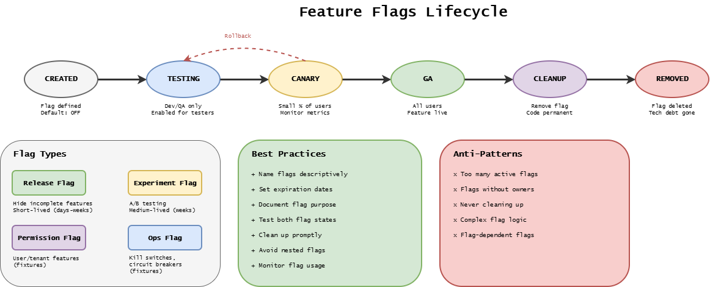

# Feature Flags

Feature flags control when features become available to users.

Code is deployed with features disabled, then enabled gradually via runtime configuration.

This is a **Stage 12 (Release Toggling)** concern - distinct from deployment (Stage 10).

---

## Flag Lifecycle

The following diagram illustrates the six-phase feature flag lifecycle, from creation through removal, along with flag types and best practices for each phase.

{width=900}

| Phase     | Duration   | Actions                                |
| --------- | ---------- | -------------------------------------- |
| Create    | Day 0      | Add flag, deploy code with feature OFF |
| Enable    | Days 1-14  | Gradual rollout (10% → 50% → 100%)     |
| Stabilize | Days 15-30 | Monitor, collect feedback              |
| Remove    | Days 30-90 | Delete flag and old code paths         |

---

## Rollout Strategies

**Percentage rollout:**

| Day | Percentage | Validation             |
| --- | ---------- | ---------------------- |
| 1   | 10%        | Monitor errors         |
| 3   | 25%        | Check business metrics |
| 7   | 50%        | Validate performance   |
| 14  | 100%       | Full rollout           |

**User-targeted:** Enable for specific users, groups, or beta testers.

**Time-based:** Enable during specific time windows (e.g., Black Friday sale).

---

## Disabling Features

When issues occur, disable instantly via API or dashboard. **This is not a rollback** - the code remains deployed,
only the feature is turned off.

| Action              | What happens                   | Time    |
| ------------------- | ------------------------------ | ------- |
| Disable flag        | Feature hidden from users      | Seconds |
| Deployment rollback | Previous code version restored | Minutes |

---

## Removing Flags

**When:** Feature stable 30+ days, 100% rollout complete, no issues.

**Steps:**

1. Verify stability (30 days, no issues)
2. Remove old code path
3. Remove flag checks
4. Remove flag definition
5. Deploy cleanup

---

## Flag Hygiene

| Anti-Pattern    | Problem             | Solution                    |
| --------------- | ------------------- | --------------------------- |
| Nested flags    | Complex logic       | Flatten or combine          |
| Permanent flags | Technical debt      | Enforce cleanup deadlines   |
| Missing owners  | Nobody responsible  | Require owner in definition |
| No monitoring   | Can't detect issues | Add metrics per flag        |

---

## External Resources

- [LaunchDarkly Docs](https://docs.launchdarkly.com/)
- [Unleash (Open Source)](https://www.getunleash.io/)
- [OpenFeature Standard](https://openfeature.dev/)

---

## Next Steps

- [Progressive Exposure](./progressive-exposure.md) - Rollout to user segments
- [CD Model Stage 12](../cd-model/stages.md#stage-12-release-toggling) - Release toggling in context
- [Deployment Strategies](../deployment/deployment-strategies.md) - Stage 10 infrastructure patterns
