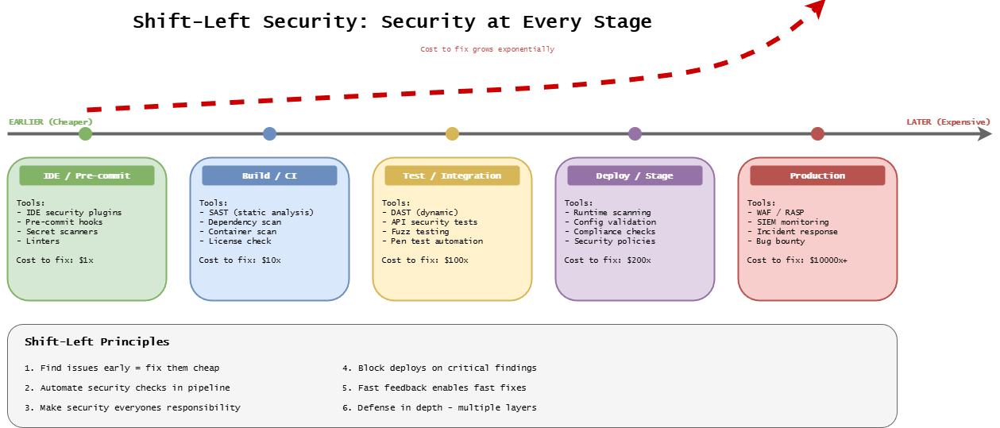

# Shift-Left Security

Security integrated throughout all stages of the CD Model, not bolted on at the end.

## What is Shift-Left Security

The following diagram illustrates the cost of fixing security vulnerabilities at different stages,
from IDE ($1x) through Production ($1000x+).

The earlier issues are caught, the cheaper they are to fix.

Traditional security tests late in the cycle:

- Security testing after development complete
- Vulnerabilities discovered near release
- Expensive to fix, delays release

Shift-left moves testing earlier:

- Security integrated from Stage 2 (Pre-commit)
- Vulnerabilities caught during development
- Fast feedback, cheap fixes

**Cost of fixing vulnerabilities:**

| Stage Found | Relative Cost |
| ----------- | ------------- |
| Development | 1x            |
| Testing     | 10x           |
| Production  | 100x          |

## Defense in Depth

Multiple security layers protect against different threat vectors:

| Layer                                  | Description                             | Tool              |
| -------------------------------------- | --------------------------------------- | ----------------- |
| [SAST](sast.md)                        | Static analysis before code runs        | Trivy             |
| [DAST](dast.md)                        | Dynamic testing of running applications | OWASP ZAP         |
| [Dependency Scanning](supply-chain.md) | Identifying vulnerable libraries        | Trivy, Dependabot |
| [Container Security](supply-chain.md)  | Multi-layer image scanning              | Trivy             |

No single layer is perfect - overlapping layers provide comprehensive coverage.

## Security by Stage

| Stage                 | Security Activities                   | Tools             | Duration   |
| --------------------- | ------------------------------------- | ----------------- | ---------- |
| **Pre-commit (2)**    | Secret scan, dependency check         | Trivy             | < 2 min    |
| **Merge Request (3)** | SAST, dependency scan, container scan | Trivy, Dependabot | < 5 min    |
| **Commit (4)**        | Full SAST, container scan             | Trivy             | < 10 min   |
| **Acceptance (5)**    | DAST baseline scan                    | OWASP ZAP         | < 15 min   |
| **Extended (6)**      | DAST full scan                        | OWASP ZAP         | 1-4 hours  |
| **Deployment (10)**   | Final container scan                  | Trivy             | < 5 min    |
| **Production (11)**   | Continuous DAST monitoring            | OWASP ZAP         | Continuous |

## Why Open-Source Tools

This documentation focuses on free, open-source tools:

| Tool           | Purpose               | Why                                 |
| -------------- | --------------------- | ----------------------------------- |
| **Trivy**      | Multi-purpose scanner | Fast, comprehensive, no licensing   |
| **OWASP ZAP**  | DAST                  | Industry standard, active community |
| **Dependabot** | Dependency updates    | GitHub-native, zero setup           |

These tools provide enterprise-grade security without licensing costs.

## Benefits

- **10-100x cheaper** to fix vulnerabilities early
- **Faster releases** - no last-minute security blocks
- **Developer education** - learn secure coding practices
- **Better posture** - proactive, continuous validation
