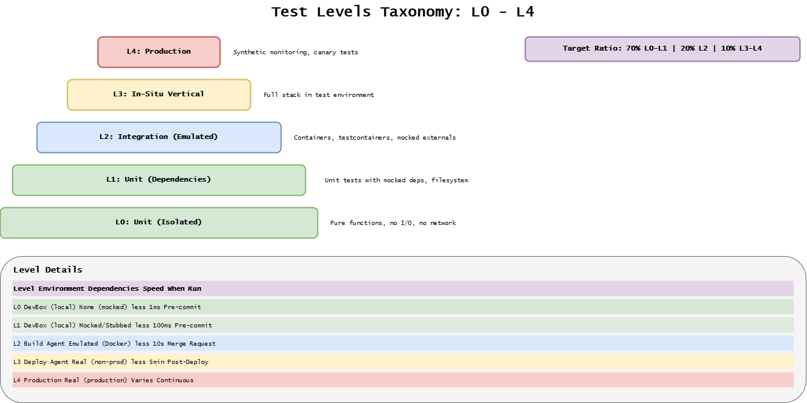
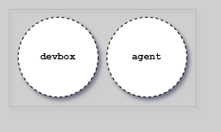
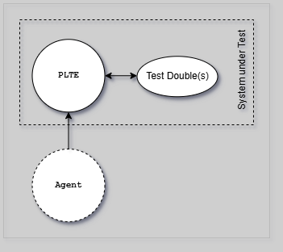
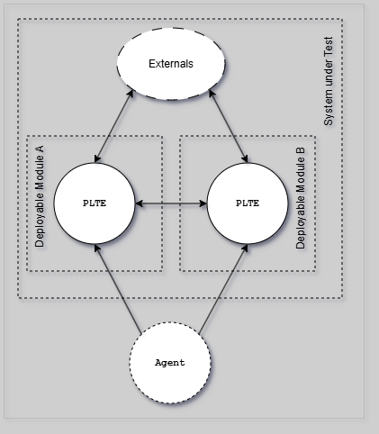
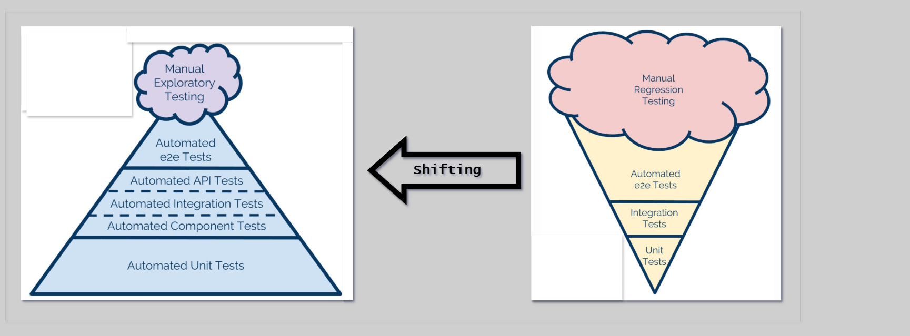
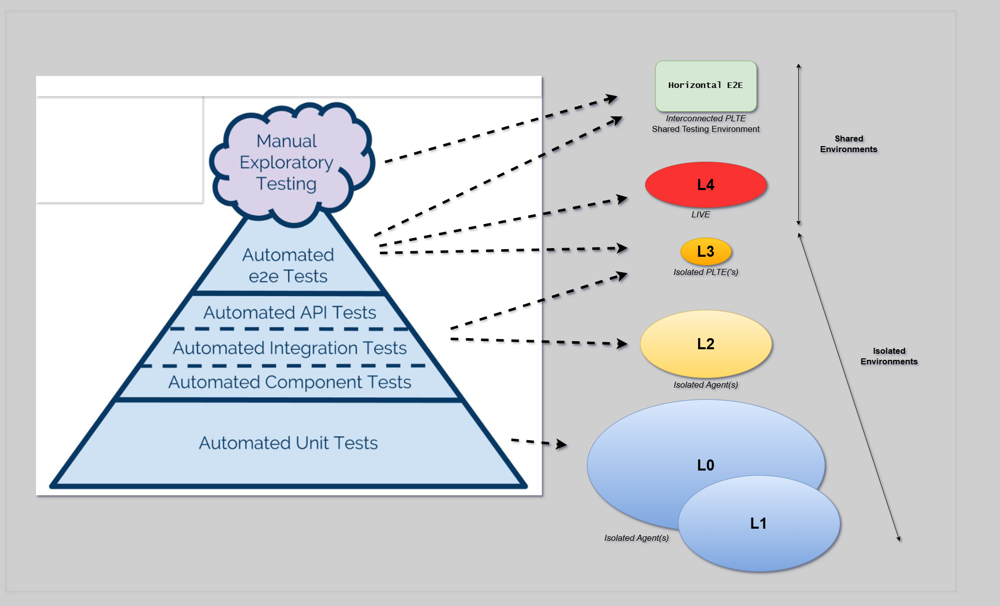
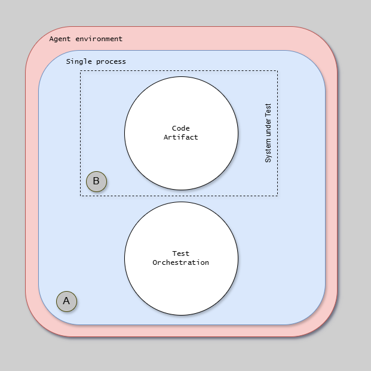
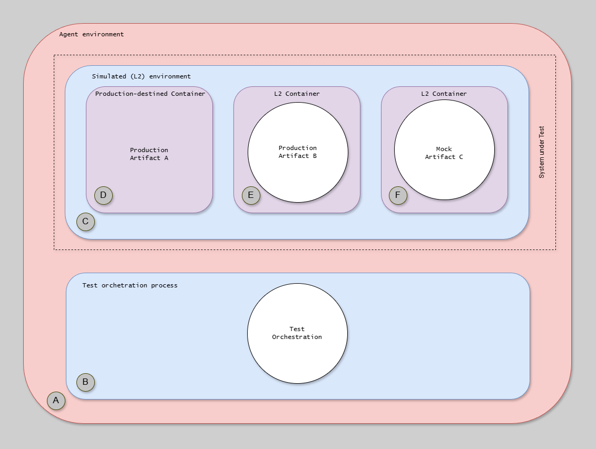
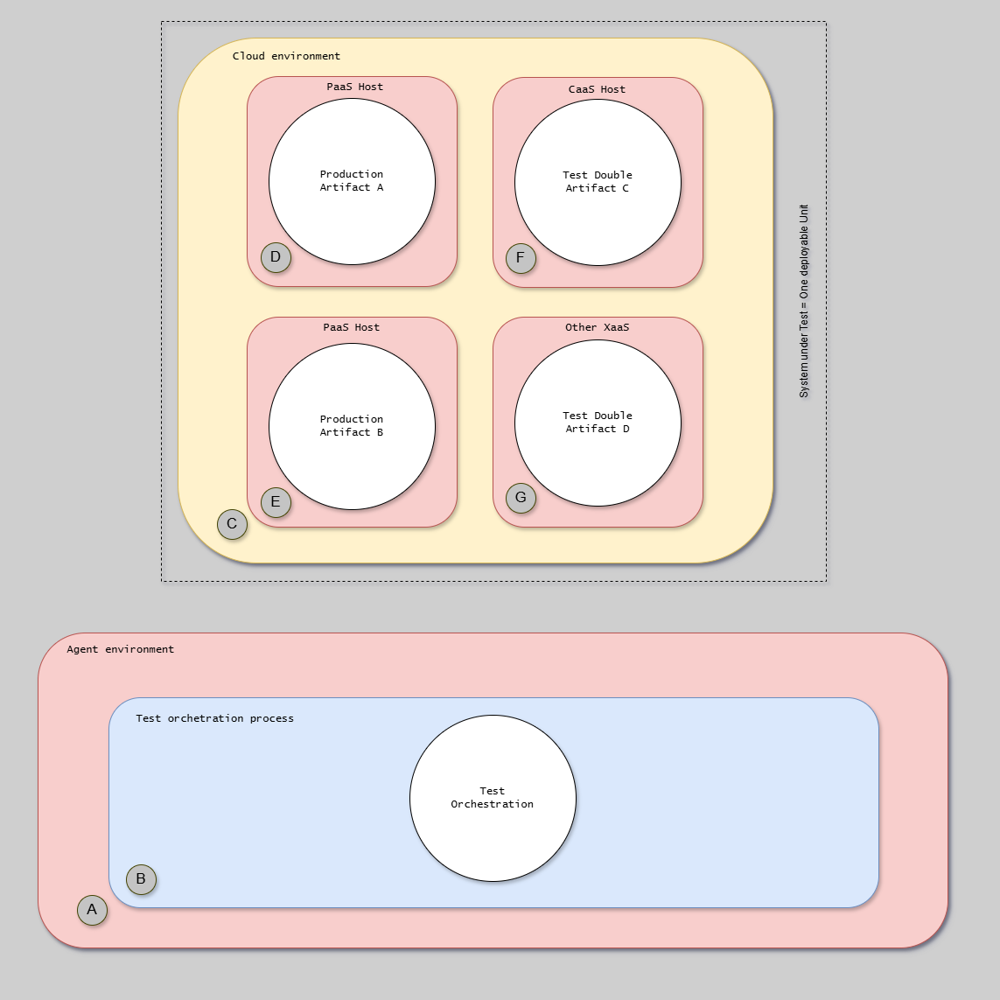
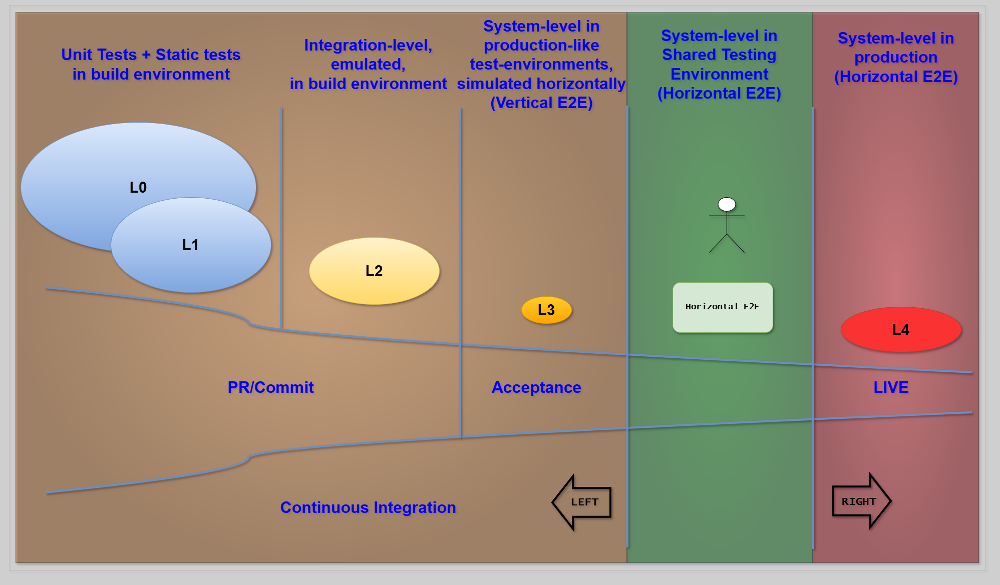

# Test Levels

The CD Model uses a taxonomy of test levels (L0-L4) based on execution environment and scope.

---

## Taxonomy Overview

The following diagram provides a visual overview of the test level taxonomy, showing the L0-L4 levels with their execution environments, scope, and the recommended distribution ratio (70% L0-L1, 20% L2, 10% L3-L4).

| Level | Name               | Environment  | Scope                | Dependencies     | Determinism |
| ----- | ------------------ | ------------ | -------------------- | ---------------- | ----------- |
| L0-L1 | Unit Tests         | DevBox/Agent | Source/Binary        | All test doubles | Highest     |
| L2    | Emulated System    | DevBox/Agent | Deployable artifacts | All test doubles | High        |
| L3    | In-Situ Vertical   | PLTE         | Deployed system      | All test doubles | Moderate    |
| L4    | Production Testing | Production   | Deployed system      | Real services    | High        |

**Anti-Pattern (Out-of-Category):**

| Level | Name           | Environment     | Dependencies             | Determinism |
| ----- | -------------- | --------------- | ------------------------ | ----------- |
| HE2E  | Horizontal E2E | Shared test env | Other teams' deployments | Lowest      |

---

## L0-L1: Unit Tests

**Purpose:** Validate individual functions, methods, and component interactions in isolation.

| Characteristic | Description                                                |
| -------------- | ---------------------------------------------------------- |
| Speed          | Milliseconds per test                                      |
| Isolation      | No external dependencies, all mocked                       |
| Scope          | Single function/method (L0) or component interactions (L1) |
| Execution      | In-process, no network calls                               |

**CD Stages:** 2 (Pre-commit), 3 (MR), 4 (Commit)

---

## L2: Emulated System Tests

**Purpose:** Validate deployable artifacts in an emulated environment with test doubles.

| Characteristic | Description                                                |
| -------------- | ---------------------------------------------------------- |
| Speed          | Seconds per test                                           |
| Isolation      | Cross-process, but all external deps are test doubles      |
| Scope          | Deployable artifacts, component-to-component communication |
| Execution      | Multiple processes, network calls to test doubles only     |

**Test doubles:** In-memory databases, mock message queues, stubbed external APIs.

**CD Stages:** 3 (MR), 4 (Commit)

---

## L3: In-Situ Vertical Tests

**Purpose:** Validate a deployed module in PLTE with vertical testing boundaries.

| Characteristic | Description                                               |
| -------------- | --------------------------------------------------------- |
| Speed          | Minutes per test                                          |
| Isolation      | Single deployable module only (vertical)                  |
| Scope          | Deployed system in production-like infrastructure         |
| Execution      | Cloud environment, test doubles for ALL external services |

**Validates:**

- Deployment procedures work
- Infrastructure configuration correct (networking, DNS, load balancing)
- Service responds correctly in cloud environment

**Does NOT validate:** Cross-service interactions (that's L4).

**CD Stages:** 5 (Acceptance), 6 (Extended)

---

## L4: Production Testing

**Purpose:** Validate real cross-service interactions in production.

| Characteristic | Description                                              |
| -------------- | -------------------------------------------------------- |
| Speed          | Seconds to minutes                                       |
| Isolation      | None - real production environment                       |
| Scope          | Cross-service workflows (horizontal)                     |
| Execution      | Production, may use live test doubles for specific cases |

**Validates:**

- Real cross-service interactions
- End-to-end user journeys
- Production infrastructure under real load

**Includes:** Synthetic monitoring, canary validation, exploratory testing.

**CD Stages:** 11 (Live), 12 (Release Toggling)

---

## Horizontal E2E Anti-Pattern

Shared pre-production environments where multiple teams deploy pre-prod services linked together.

| Problem                                      | Impact                    |
| -------------------------------------------- | ------------------------- |
| Any team's broken deployment breaks everyone | Blocking                  |
| Version mismatches common                    | Non-deterministic results |
| Hard to isolate failures                     | Difficult debugging       |
| Can't test until all deps deployed           | Slow feedback             |

**Solution:** Shift LEFT (L0-L3 with test doubles) and RIGHT (L4 in production).

---

## Shift-Left and Shift-Right Strategy

The shift-left/shift-right strategy moves testing emphasis away from the fragile middle (shared pre-production environments) toward fast, deterministic tests on the left and real production validation on the right.

The following diagram shows how this strategy maps across test levels and CD stages:

**Why this works:**

| Strategy     | Benefit                                                          |
| ------------ | ---------------------------------------------------------------- |
| Shift LEFT   | Fast feedback, high determinism, no cross-team dependencies      |
| Shift RIGHT  | Real production validation without pre-prod fragility            |
| Avoid middle | Skip the worst of both worlds (slow, fragile, non-deterministic) |

---

## Test Distribution

| Level | Volume                   | Purpose                        |
| ----- | ------------------------ | ------------------------------ |
| L0-L2 | 95% (hundreds-thousands) | Fast, deterministic validation |
| L3    | 5% (5-20 scenarios)      | Infrastructure validation      |
| L4    | Continuous               | Production monitoring          |

---

## External Resources

- [Google Testing Blog](https://testing.googleblog.com/)
- [Testing in Production (Charity Majors)](https://charity.wtf/tag/testing-in-production/)
- [Shift-Left Testing (Microsoft)](https://learn.microsoft.com/en-us/devops/develop/shift-left-make-testing-fast-reliable)

---

## Process Isolation by Level

Each test level operates within different process boundaries. Understanding these boundaries helps design appropriate test strategies.

### L0-L1: Single Process

Tests run in-process with the code artifact. No cross-process communication occurs.

{width=800}

### L2: Multi-Process/Container

Tests involve multiple processes or containers, including the production container and L2 test containers, with test orchestration coordinating them.

{width=800}

### L3: Cloud Environment

Tests run against distributed deployments across cloud infrastructure, with test orchestration reaching into PLTE environments.

{width=800}

---

## Comprehensive Taxonomy Reference

The following diagram provides a complete view of the test taxonomy matrix, showing test levels across all CD stages with shift-left and shift-right indicators.

{width=1000}

---

## Next Steps

- [Verification Types](./verification-types.md) - IV/OV/PV for acceptance testing
- [Testing Taxonomy](../../specifications/taxonomy/index.md) - Tag contracts and test suites
- [Environments](../environments/environments.md) - PLTE for L3 tests
