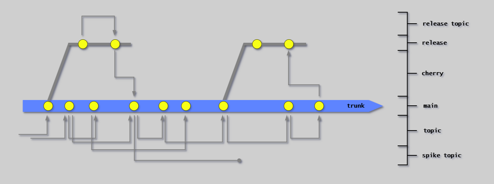

# Branch Types

## Overview



Trunk-based development uses exactly three branch types:

1. **Trunk** (main) - Single source of truth
2. **Topic branches** - Short-lived development work
3. **Release branches** - Isolate releases (RA pattern only)

---

## Trunk (Main)

**Definition:** The single branch representing the trunk.

**Characteristics:**

- Always deployable
- Protected - no direct commits
- All changes via merge request
- Updated multiple times per day
- Only meaningful version of the code

**Access:**

- Read: All developers
- Write: Via approved merge requests only

**Purpose:** Single source of truth, continuous integration point, release candidate source.

---

## Topic Branches

**Definition:** Short-lived branches for individual changes.

**Characteristics:**

- Branched from trunk (or occasionally release branch)
- Live for hours to maximum 2 days
- Squash-merged to preserve clean history
- Deleted immediately after merge

> **One topic branch = One trunk commit after squash merge**

**Naming Convention:**

Prefer `topic/[user]/[topic-moniker]` (e.g., `topic/ausr/fix-build`), but really any topic branch name goes (anything not main or release\* is considered a topic).

Only trunk (`main`) and release (`release/[x]`) branch names are strictly enforced.

**Purpose:** Isolate work in progress, enable code review, provide temporary workspace.

**Topic branches are NOT feature branches:**

| Topic Branches                 | Feature Branches             |
| ------------------------------ | ---------------------------- |
| Live hours                     | Live weeks/months            |
| Result in single squash commit | Accumulate many commits      |
| Focused on one change          | Accumulate unrelated changes |
| Integrate continuously         | Defer integration            |

---

## Release Branches

**Definition:** Short branches isolating releases.

**Characteristics:**

- Created from trunk at Stage 8 (Start Release)
- Short-lived (days to weeks)
- Only critical fixes allowed
- Fixes cherry-picked back to trunk
- Used in Release Approval (RA) pattern only

**Naming Convention:**

```text
release/1         # First release
release/2         # Second release
release/10        # Tenth release
release/product-name/5   # Fifth release of product-name (monorepo)
```

**Note**: The `[x]` is an incremental integer release number, NOT a semantic version. Release 10 might be tagged as v1.2.0, but the branch name uses the release count.

**Purpose:** Isolate release for validation, allow trunk to continue evolving, apply critical fixes without trunk changes.

**Not used in Continuous Deployment (CDe) pattern** - trunk deploys directly to production.

---

## Spike Branches

**Definition:** Experimental branches that are never merged.

**Characteristics:**

- Used for exploration and prototyping
- Never progress past Merge Request stage
- May be archived for reference
- No expectation of merge

**Purpose:** Allow experimentation without committing to integration.

---

## Branch Flow Summary

```text
Topic Branch → (Squash Merge) → Trunk → (Branch) → Release Branch
                                  ↓
                            (CDe: Direct)
                                  ↓
                             Production
```

**RA Pattern:** Topic → Trunk → Release → Production

**CDe Pattern:** Topic → Trunk → Production (no release branch)

---

## Next Steps

- [Trunk-Based Development](trunk-based-development.md) - Core principles
- [Branching Strategies](branching-strategies.md) - RA vs CDe flows
- [Cherry-Picking](cherry-picking.md) - Moving fixes between branches
