# Branching Strategies

## Introduction

Branching strategies define how code flows through the CD Model's 12 stages. This article provides detailed branching flows for the two primary implementation patterns:

- **Release Approval (RA)**: Uses release branches for validation and approval before production
- **Continuous Deployment (CDe)**: Deploys directly from trunk without release branches

See [CD Variants](../cd-model/variants.md) for guidance on choosing between RA and CDe.

---

## Release Approval (RA) Pattern

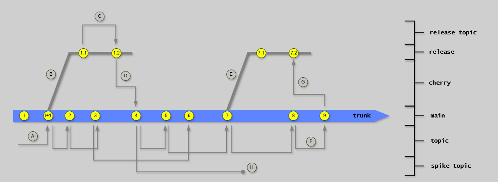

### Pattern Overview

The RA pattern uses release branches to isolate releases for validation and approval:

- Enables trunk to continue evolving during release validation
- Allows critical fixes on release branch without trunk changes
- Provides stable release candidate for approval
- Maintains audit trail for regulated environments

**Best for**: Regulated systems, high-risk applications, systems requiring formal approvals

### Stage Flow for RA Pattern

**Stages 1-3: Topic Branch Development**:

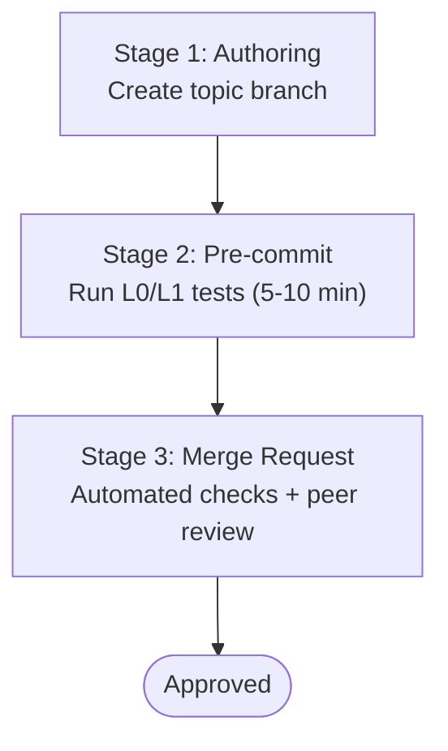

**Stages 4-7: Trunk Integration and Testing**:

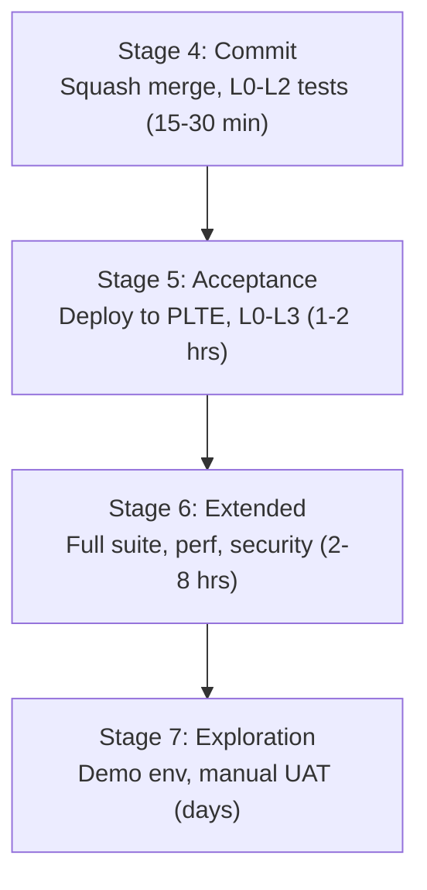

**Stages 8-12: Release Branch Flow**:

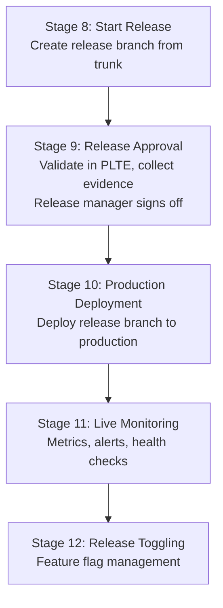

### Release Branch Lifecycle

**Creation** (Stage 8):

```bash
git checkout main
git pull origin main
git checkout -b release/10
git push origin release/10
```

**Validation** (Stage 9):

- Deploy release branch to PLTE
- Run regression test suite
- Review quality metrics
- Collect evidence (IV, OV, PV)
- Obtain formal approval

**Maintenance**:

- Release branch stays active until superseded
- Critical fixes applied via cherry-picking (see [Cherry-Picking](cherry-picking.md))
- Eventually archived when release is deprecated

### RA Pattern Summary


**Time Expectations**:

- Topic branch: Hours to 2 days
- Trunk testing (Stages 4-7): 1-2 days
- Release branch validation (Stages 8-9): 1-3 days
- **Total**: 1-2 weeks from commit to production

---

## Continuous Deployment (CDe) Pattern

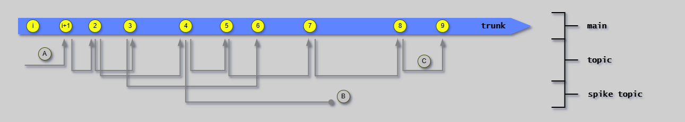

### Pattern Overview

The CDe pattern deploys directly from trunk without release branches:

- Maximizes deployment speed (hours instead of weeks)
- Relies on comprehensive automated testing
- Uses feature flags for runtime control
- Requires mature DevOps practices

**Best for**: Non-regulated systems, internal tools, teams with mature automation

### Stage Flow for CDe Pattern

**Stages 1-3**: Identical to RA pattern.

**Stages 4-7: Trunk Integration and Testing**:

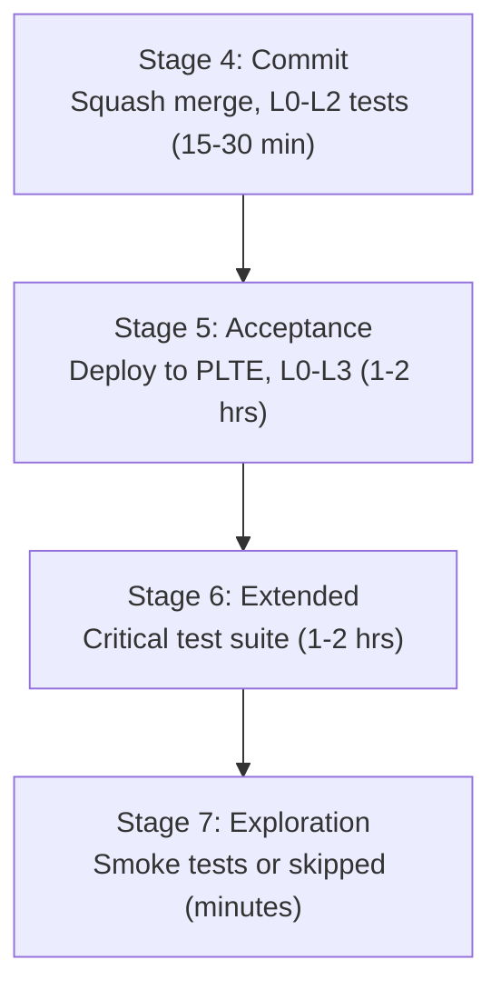

**Key Differences from RA**:

- Stage 6: Faster execution (1-2 hrs vs 2-8 hrs)
- Stage 7: Often automated or skipped
- Higher reliance on automated quality gates

**Stages 8-12: Direct Deployment from Trunk**:

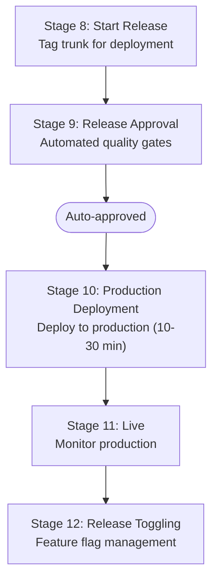

### No Release Branches

The CDe pattern eliminates release branches entirely:

- Trunk is always production-ready
- Deploy directly from trunk
- Feature flags control feature exposure
- Fix-forward or rollback if issues arise

**Benefits**: Faster deployment, simpler branching model, less overhead

**Tradeoffs**: Requires higher confidence in trunk, comprehensive testing, and feature flags

### Fixing Bugs in Production

#### Approach 1: Fix-Forward (Preferred)

Create topic branch, implement fix, fast-track through stages, deploy.

#### Approach 2: Rollback

Roll back to previous version while implementing proper fix.

#### Approach 3: Feature Flag Kill Switch

Disable problematic feature via flag, fix at normal pace, re-enable.

### CDe Pattern Summary

```text
Topic Branch → (Squash Merge) → Trunk → (Tag) → Production
```

**Time Expectations**:

- Topic branch: Hours to 1 day
- Trunk testing (Stages 4-7): 2-4 hours
- Deployment (Stages 8-10): Minutes
- **Total**: 2-4 hours from commit to production

---

## Pipeline Architecture

Both patterns benefit from separating pipeline concerns. The first diagram shows the problem: complexity arising from separate Orchestration (YAML), Scripts (PowerShell), and Configuration management that don't integrate well.

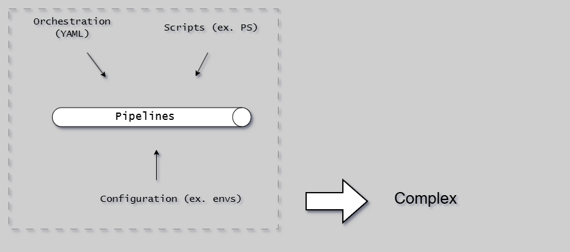

The solution is unified orchestration that bridges YAML orchestration, configuration, and modular scripting:

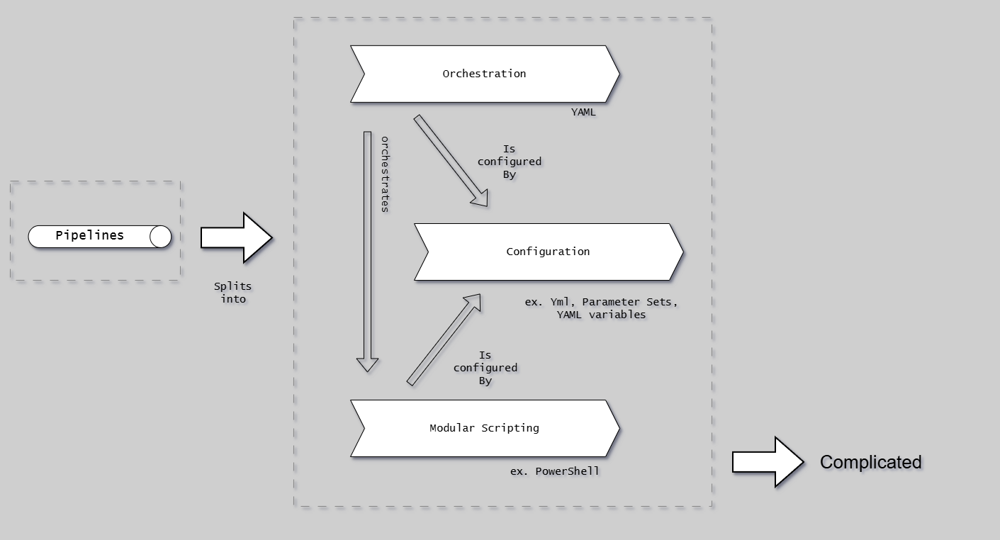

**Three layers**:

1. **Orchestration** (YAML): Agent provisioning, parallelization, artifact management
2. **Scripting** (CLI): Build/test/deploy logic, executable locally
3. **Configuration** (yml files): Environment-specific settings

This separation enables local development, easier testing, and clearer maintenance.

### Pipeline by Branch Type

**RA Pattern**:

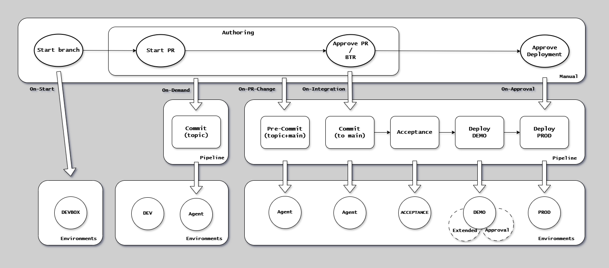

- Topic branch triggers Stages 2-3
- Trunk commit triggers Stages 4-7
- Release branch triggers Stages 8-10
- Manual approval required at Stage 9

**CDe Pattern**:

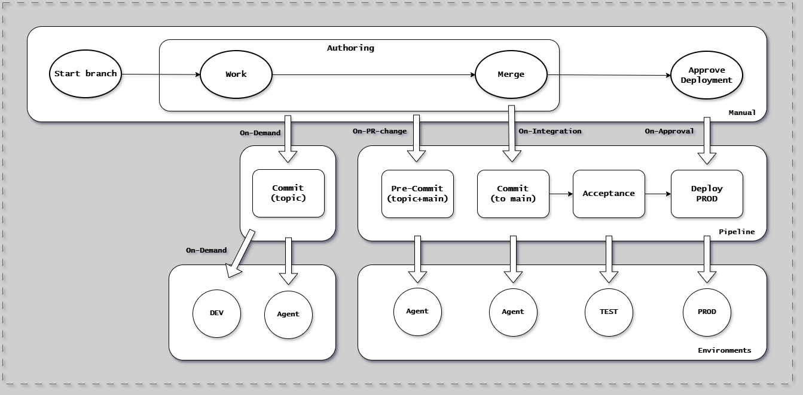

- Topic branch triggers Stages 2-3
- Trunk commit triggers Stages 4-10 (automated)
- No release branch pipeline
- Automated approval at Stage 9

---

## Comparison Summary

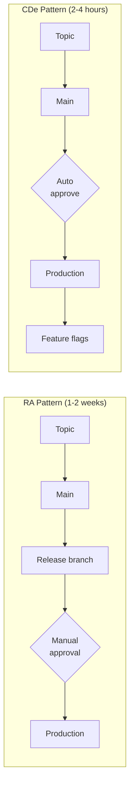

### Branch Type Usage

| Branch Type      | RA Pattern      | CDe Pattern    |
| ---------------- | --------------- | -------------- |
| Trunk (main)     | Always          | Always         |
| Topic branches   | Hours to 2 days | Hours to 1 day |
| Release branches | Required        | Not used       |

### When to Use Each Pattern

**Use RA Pattern when**:

- Subject to regulatory oversight
- High-risk system (safety, health, critical operations)
- Requires formal audit trail
- Needs documented approvals

**Use CDe Pattern when**:

- Non-regulated environment
- Internal tools or low-risk systems
- Mature DevOps practices
- Comprehensive automated testing
- Feature flags implemented

---

## Best Practices

### RA Pattern Specific

- Create release branches from trunk only
- Only critical fixes allowed on release branch
- Always fix on trunk first, cherry-pick to release (see [Cherry-Picking](cherry-picking.md))
- Archive release branch when superseded

### CDe Pattern Specific

- Use feature flags for all incomplete features (see [Feature Hiding](feature-hiding.md))
- Implement kill switches for high-risk features
- Gradual rollout (1% → 10% → 50% → 100%)
- Maintain previous version artifacts for rollback

---

## Next Steps

- [CD Variants](../cd-model/variants.md) - Choosing between RA and CDe
- [Trunk-Based Development](trunk-based-development.md) - Core principles
- [Branch Types](branch-types.md) - Branch definitions
- [Cherry-Picking](cherry-picking.md) - Moving fixes between branches
- [Dependency Management](dependency-management.md) - Implicit vs pinned dependencies
