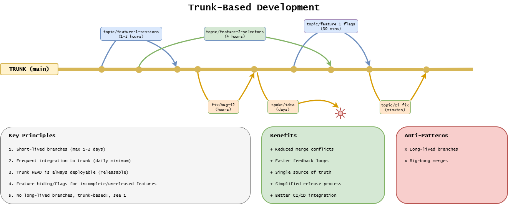
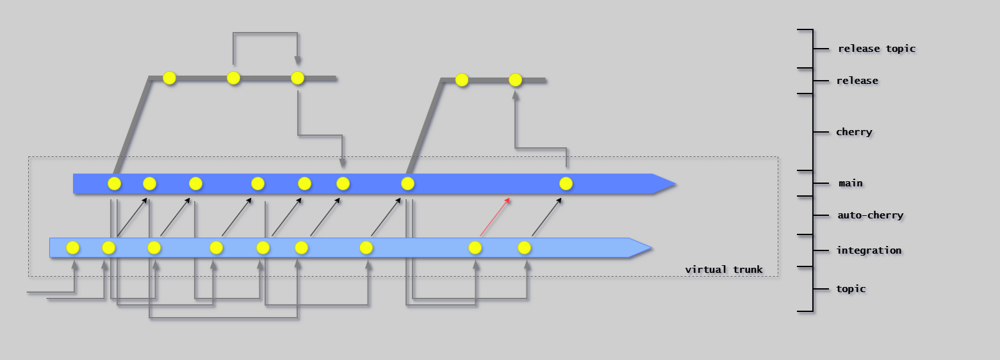

# Trunk-Based Development

## Introduction

**Trunk-Based Development is the branching strategy and workflow that enables Continuous Integration and Continuous Delivery.**

Instead of long-lived topic branches that defer integration,
Trunk-Based Development emphasizes frequent integration to a single main branch (trunk), enabling rapid feedback and reducing merge conflicts.

This approach is fundamental to achieving:

- **Continuous Integration**: All developers integrate to trunk at least daily
- **Continuous Delivery**: Head of trunk is always in a releasable state
- **Fast feedback**: Issues detected within minutes, not weeks
- **Reduced risk**: Small, incremental changes are easier to validate and rollback

---

## Core Principles

The following diagram illustrates trunk-based development in practice. It shows how short-lived topic branches integrate frequently into trunk, the key principles that enable this workflow, the benefits it provides, and the anti-patterns to avoid.



Each principle below maps to specific behaviors in this workflow:

### 1. Single Source of Truth

**Principle:** _There is only ever one meaningful version of the code: the current one._

- The `main` branch (trunk) is the only source of truth
- The `HEAD` of `main` is the current version
- All changes integrate to `main` frequently (at least daily)

**Why this matters:**

Eliminates confusion about which version is the release candidate, enables continuous delivery, and provides clear traceability.

**Anti-pattern:**

Long-lived feature branches that become "alternative versions" of truth.

### 2. Branch Very Briefly

**Principle:** _At any given time, there are only 3 active branch types: trunk, topic branches, and release branches._

- Topic branches live for hours or at most 1-2 days
- Changes are kept small and focused
- Branches are deleted immediately after squash merging

**Why this matters:** Prevents integration drift, enables continuous integration, reduces merge conflicts.

**Anti-pattern:** "Feature branches" that live for weeks, accumulating hundreds of changes.

### 3. Small, Incremental Changes

**Principle:** _Work in small batches that are continuously integrated._

- Each change is a small, logical increment
- Large features broken into deployable pieces
- Feature hiding used for incomplete features

**Why this matters:** Easier to review, faster to validate, lower risk.

**Anti-pattern:** Massive "big bang" merges making review impossible and rollback risky.

### 4. Continuous Integration to Trunk

**Principle:** _Integrate at least daily, preferably multiple times per day._

- Developers pull from `main` frequently
- Push changes as soon as they pass local validation
- Pipeline validates every trunk commit

**Why this matters:** Early detection of integration issues, maintains releasable trunk.

**Anti-pattern:** Developers working in isolation for days/weeks before attempting integration.

### 5. Branch by Abstraction

**Principle:** _Instead of branching for a feature, create an abstraction in code that can be toggled off._

This technique is a key enabler for continuous integration.

Many developers are trained to hide new features in branches, but this conflicts with frequent integration.

See [Feature Hiding](feature-hiding.md) for implementation strategies.

---

## Daily Development Flow

**Typical workflow:**

1. **Sync with trunk**: `git pull origin main`
2. **Create topic branch**: `git checkout -b feature/short-description`
3. **Make small changes**: Keep small, optimally one logical change
4. **Integrate regularly**: Pull from trunk every few hours
5. **Push and create merge request**: Triggers Stage 2-3 validation
6. **Address review feedback**: Push additional commits
7. **Squash merge to trunk**: One topic branch = one trunk commit

**Key command:**

```bash
gh pr merge --squash --delete-branch
```

---

## Conflict Resolution

**Prevention is key:** Pull from trunk frequently (every few hours), keep changes small, and integrate hourly to daily.

When conflicts occur: pull latest, resolve locally, rebase main onto your local branch if complex.

---

## Next Steps

- [Branch Types](branch-types.md) - Detailed branch definitions and naming
- [Branching Strategies](branching-strategies.md) - RA vs CDe stage flows
- [Feature Hiding](feature-hiding.md) - Hiding incomplete features in trunk
- [Cherry-Picking](cherry-picking.md) - Moving fixes between branches
- [Commit Messages](commit-messages.md) - Message format conventions

## Advanced Patterns

### Virtual Trunk Integration

For teams that need an additional layer of validation before integrating to trunk, the virtual trunk pattern uses an integration branch as a staging area. Changes are merged to the integration branch first, validated, then automatically cherry-picked to main.



This pattern is useful for:

- Large teams with high commit velocity
- Systems requiring additional validation gates
- Environments where trunk stability is critical

However, it adds complexity and should only be adopted when simpler patterns prove insufficient.

---

## References

### External

- [Trunk-Based Development (trunkbaseddevelopment.com)](https://trunkbaseddevelopment.com/)
- [Feature Branches Considered Evil (YouTube)](https://www.youtube.com/watch?v=h7LeD7VevyI)
