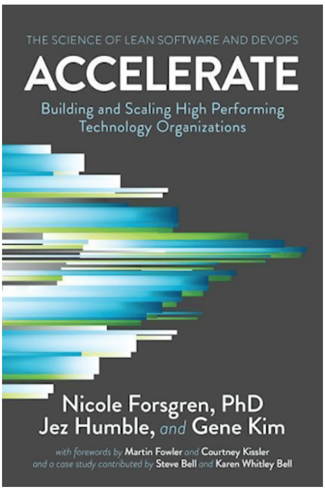
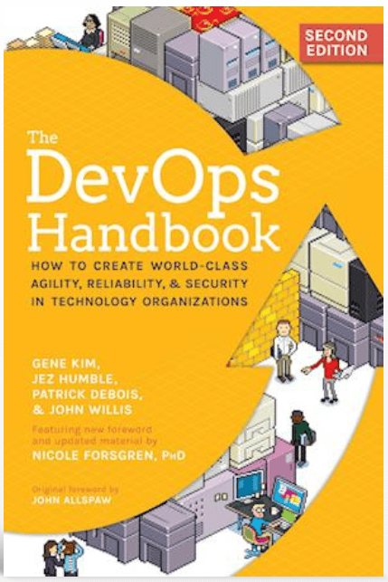
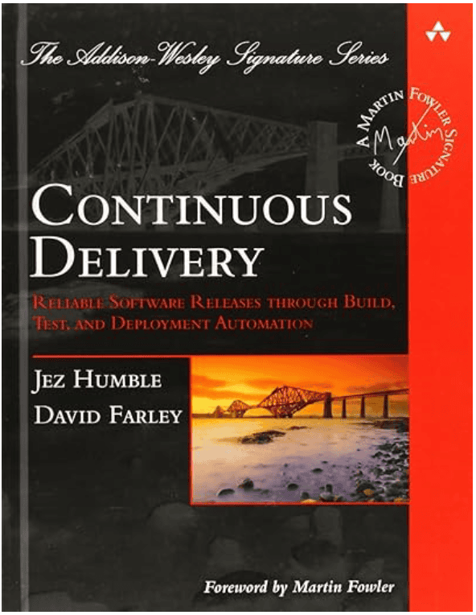
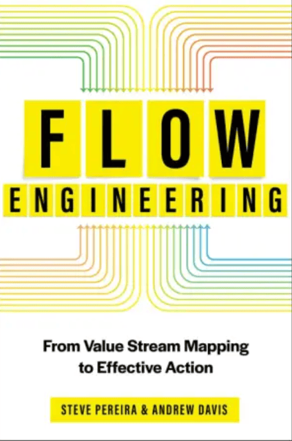
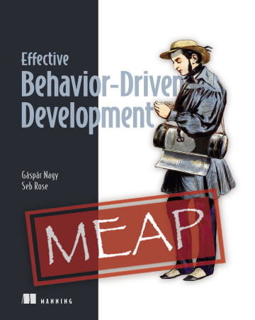
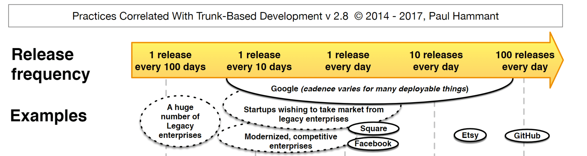

# References

## Books

### Accelerate

{ width="150" }

> Forsgren, Nicole and Humble, Jez and Kim, Gene (2018).

### The DevOps Handbook

{ width="150" }

> Gene Kim, Jez Humble, Patrick Debois, John Willis, Nicole Forsgren (2021).

### Continuous Delivery

{ width="150" }

> Jez Humble, Dave Farley.

### Flow Engineering - From Value Stream Mapping to Effective Actions

{ width="150" }

> Steve Pereira and Andrew Davis (2024)

### [Effective Behavior-Driven Development](https://www.manning.com/books/effective-behavior-driven-development)

{ width="150" }

> Gáspár Nagy and Seb Rose (2026)

## PDFs

### State of devops

{ width="150" }

- [State of AI-assisted Software Development 2025](../assets/lfs/pdf/2025_state_of_ai_assisted_software_development.pdf)

### Trunk based correlated practices

{ width="400" }

- [Trunk Correlated Practices](../assets/lfs/pdf/Trunk_Correlated_Practices_v2.8.pdf)

## Articles

### [Introduction to Head-to-Head Development, Part 1](https://www.twosigma.com/articles/introduction-to-head-to-head-development-part-1/)

> Nico Kicillof, Two Sigma (2017).
