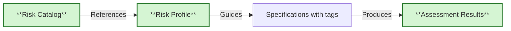

# Risk Control Traceability

{{ page_breadcrumb() }}

> **Control-based risk management with automated evidence collection**

## What Are Risk Controls?

Risk controls are **standardized security and compliance requirements** from established catalogs (NIST 800-53, ISO 27001, CIS, etc.) that mitigate identified risks.

**How Controls Address Risks**:

- Each control is explicitly designed to mitigate specific risks
- Control catalogs document which risks each control addresses
- Risk assessments map risks to applicable controls
- Test scenarios verify control implementation

They answer:

- **What could go wrong?** (Risk - documented in risk assessments)
- **What must we do to prevent it?** (Control - risk catalog)
- **How do we implement it?** (Control implementation)
- **How do we prove it works?** (Evidence - test scenarios with `@control:` tags)

**Traditional Approach**:

- Risk assessment → Spreadsheet → Manual verification → Periodic audits
- Artifacts in separate systems, evidence gathered retroactively
- Difficult to maintain traceability

**Control-based Approach**:

- Risk assessment → risk control selection → BDD specifications with `@control:` tags → Automated testing
- All in version control, traceability in real-time
- Automated evidence collection linking controls to test results

**Benefits**:

- Machine-readable control definitions (JSON)
- Explicit traceability via `@control:` tags
- Automated evidence linking test results to controls
- Version controlled and audit-ready

---

## Risk Control Tagging

### `@control:<control-id>` - Risk Compliance Controls

**Purpose**: Link test scenarios to standardized compliance controls from catalogs

**Format**: `@control:<family>-<number>` or `@control:<family>-<number>(<enhancement>)`

**Examples**: `@control:ac-2`, `@control:ia-5(1)`, `@control:cis-5.1`

**When to use**:

- Compliance requirements (FedRAMP, HIPAA, ISO 27001, etc.)
- Security control frameworks (NIST, CIS, CSA)
- Regulatory mandates requiring specific controls
- Audit and assessment requirements

**Control-Risk Relationship**:

Controls inherently address risks. When you tag a scenario with `@control:ac-2` (Account Management), you're implicitly addressing risks like:

- Unauthorized access
- Privilege escalation
- Account misuse

Risk assessments should document which risks exist and map them to applicable controls. Test scenarios then verify control implementation.

**Risk Assessment File Structure:**

Risk assessment documents should be stored alongside specifications:

```text
Project Root/
├── specs/
│   ├── .risk-controls/          # OSCAL profiles and catalogs
│   │   ├── catalog.json
│   │   └── risk-profile.json    # Single profile for entire repository
│   └── <module>/
│       └── <feature>/
│           └── specification.feature
└── docs/
    └── risk-assessments/         # Risk analysis documents
        ├── ra-2025-access-control.md
        └── ra-2025-data-protection.md
```

**Note**: The `docs/risk-assessments/` directory is optional and used for human-readable risk analysis. OSCAL files in `specs/.risk-controls/` are the authoritative machine-readable format. The repository uses a **single risk profile** (`risk-profile.json`) that applies to all modules.

**Example**:

```gherkin
@ov @control:ac-2
Scenario: Account creation requires approval
  # Mitigates: Unauthorized access risk
  # See: docs/risk-assessments/ra-2025-access-control.md (optional reference)
  Given a user registration request
  When an administrator reviews the request
  Then the account should require approval
  And the approval should be logged
```

**Multiple Controls Example**:

```gherkin
@ov @control:ac-2 @control:ia-5
Scenario: Authentication prevents unauthorized access
  # Mitigates: Unauthorized access, weak authentication risks
  # Controls: AC-2 (Account Management), IA-5 (Authenticator Management)
  Given I am not authenticated
  When I attempt to access protected resources
  Then access should be denied
  And I should be redirected to login
```

**Traceability**:

- Risk Assessment (external) → identifies risks
- Control Selection (Risk Profile) → maps risks to controls
- Test Scenarios (`@control:` tags) → verifies control implementation
- Evidence Collection (automated) → proves control satisfaction

---

## Architecture

### What is OSCAL?

[OSCAL (Open Security Controls Assessment Language)](https://pages.nist.gov/OSCAL/) is a standardized, machine-readable framework developed by NIST for representing security controls, profiles, implementations, and assessment results.

**Why OSCAL?**

Traditional security control management relies on documents (PDFs, spreadsheets, Word files) that are:

- Difficult to automate and integrate with development workflows
- Prone to inconsistency across systems and organizations
- Hard to maintain traceability between controls, implementations, and evidence
- Time-consuming for compliance audits

**OSCAL solves this by providing**:

- **Standardized formats**: JSON, XML, and YAML schemas for all security artifacts
- **Machine-readable**: Enables automated validation, evidence collection, and reporting
- **Interoperable**: Common language across tools, organizations, and frameworks
- **Version controlled**: Security artifacts can live alongside code in git
- **Traceable**: Explicit links between controls, implementations, and test evidence

**OSCAL Versions**: The framework is actively maintained by NIST. This project uses **OSCAL 1.1.2** for profiles and **OSCAL 1.1.3** for catalogs and assessment results. Always check schema compatibility when working with OSCAL documents.

### How OSCAL Helps Cross-Domain Regulated Industries

One of OSCAL's most powerful features is its ability to unify compliance efforts across multiple regulatory frameworks. Organizations operating in multiple regulated industries can use OSCAL to:

| Benefit | How It Helps |
|---------|--------------|
| **Unified risk catalog** | Map GxP, banking rules, GDPR, NIS2, AI Act → into one standardized structure |
| **Compliance-as-Code** | Treat controls as code, versioned in Git, reusable across systems |
| **Crosswalk of controls** | Link equivalent responsibilities (e.g., ISO 27001 = GDPR Art. 32 = NIS2 security) |
| **System-to-control traceability** | Each system component linked to control objectives + evidence |
| **Automated reporting** | Generate audits and regulatory submissions programmatically |
| **Evidence integration** | Link logs, tests, validation results directly into compliance artifacts |

**Example**: A healthcare technology company operating in the EU might need to comply with GDPR (data protection), MDR (medical devices), NIS2 (cybersecurity), and ISO 13485 (quality management). With OSCAL, they can:

1. Create a single catalog mapping controls across all frameworks
2. Identify control overlaps (e.g., encryption requirements appear in all four)
3. Write test scenarios once that satisfy multiple controls
4. Generate framework-specific compliance reports from the same evidence base

This approach dramatically reduces compliance burden while improving traceability and auditability.

### Three Core Documents



### Risk Catalog (Templates)

**What**: Library of standard control definitions that you define for your company (e.g., NIST 800-53, ISO 27001)

**Location**: `templates/specs/risk-catalog/controls.catalog.json`

**Purpose**: Provides standardized control definitions that can be referenced

**Example Controls**:

- `ac-2`: Account Management
- `au-3`: Audit Record Content
- `ia-5(1)`: Password-Based Authentication

**You don't modify the catalog** - it's the reference standard.

### Profile (Your Selection)

**What**: Defines which controls apply to YOUR entire repository/system

**Location**: `specs/.risk-controls/risk-profile.json` (single profile for all modules)

**Purpose**: Selects relevant controls from the catalog for your entire solution

**Create with**:

```bash
r2r create risk-profile assessment.md
```

**Example** (`specs/.risk-controls/risk-profile.json`):

```json
{
  "profile": {
    "uuid": "...",
    "metadata": { "title": "Repository-Wide Risk Controls" },
    "imports": [{
      "href": "../../../templates/specs/risk-catalog/controls.catalog.json",
      "include-controls": [{
        "with-ids": ["ac-2", "ac-3", "au-2", "ia-5", "ia-5(1)", "sc-7", "sc-8"]
      }]
    }]
  }
}
```

**Note**: The repository uses a **single risk profile** that applies to all modules. Individual modules reference the same controls via `@control:` tags in their specifications.

### BDD Specifications (Your Implementation)

**What**: Executable scenarios tagged with control IDs

**Location**: `specs/<module>/**/*.feature`

**Purpose**: Test scenarios that verify control satisfaction

**Tag Format**:

- `@control:ac-2` - Single control
- `@control:ia-5(1)` - Control with enhancement
- `@controls:ac-2,au-3` - Multiple controls

**Example** (`specs/auth-service/login.feature`):

```gherkin
@control:ac-2 @control:ia-5(1)
Scenario: User authenticates with password
  Given a registered user account
  When the user provides valid credentials
  Then access should be granted
  And the login event should be logged

@controls:au-2,au-3
Scenario: Login attempts are audited
  Given audit logging is enabled
  When a login attempt occurs
  Then an audit record must be created
  And the record must include timestamp, user ID, and result
```

### Assessment Results (Automated Evidence)

**What**: OSCAL document linking controls to test evidence

**Location**: `out/risk/assessment-results.json`

**Generated by**:

```bash
r2r eac create risk-assess --profile specs/.risk-controls/risk-profile.json
```

**Contains**:

- **Observations**: Test results, security scans, timestamps
- **Findings**: Per-control satisfied/not-satisfied status
- **Evidence Links**: Traces controls → scenarios → test results

---

## Control Tag Format Reference

### Format Rules

**Control Tags**:

- **Pattern**: `@control:<family>-<number>` or `@control:<family>-<number>(<enhancement>)`
- **Family**: 2-4 lowercase letters (e.g., `ac`, `au`, `ia`, `sc`, `cis`)
- **Number**: 1+ digits (e.g., `2`, `12`)
- **Enhancement**: Optional number in parentheses (e.g., `(1)`, `(10)`)
- **Multiple**: Use `@controls:` with comma-separated IDs (no spaces)

### Validation

Ensure tags reference valid controls:

```bash
r2r eac validate control-tags
# Checks all @control: tags against OSCAL catalog
# Reports: Invalid control IDs with file locations
```

---

## Schema Validation

All OSCAL documents must conform to official NIST schemas. Validation ensures your control definitions, profiles, and assessment results are properly structured and interoperable.

```bash
r2r eac validate risk-catalog
# Validates: templates/specs/risk-catalog/*.catalog.json
# Against: OSCAL 1.1.3 catalog schema
```

**Validate Control Profile**:

```bash
r2r eac validate risk-profile
# Validates: specs/.risk-controls/*.profile.json
# Against: OSCAL 1.1.2 profile schema
```

**Validate Assessment Results** (automatic during generation):

```bash
r2r eac create risk-assess --profile specs/.risk-controls/risk-profile.json
# Generates and validates: out/risk/assessment-results.json
# Against: OSCAL 1.1.3 assessment-results schema
```

### Schema References

**Official OSCAL Documentation**:

- [OSCAL Schema Reference](https://pages.nist.gov/OSCAL/resources/concepts/layer/) - Overview of all OSCAL layers
- [Catalog Layer](https://pages.nist.gov/OSCAL/concepts/layer/control/catalog/) - Control catalog structure
- [Profile Layer](https://pages.nist.gov/OSCAL/concepts/layer/control/profile/) - Profile selection mechanism
- [Assessment Layer](https://pages.nist.gov/OSCAL/concepts/layer/assessment/) - Assessment results format

**All OSCAL Schemas**:

- [OSCAL Complete Schema Repository](https://github.com/usnistgov/OSCAL/tree/main/json/schema) - All JSON schemas by version

**Validation Tools**:

- [OSCAL-CLI](https://github.com/usnistgov/oscal-cli) - Official NIST validation tool
- [JSON Schema Validator](https://www.jsonschemavalidator.net/) - Online validation (paste schema + document)

---

## When You Need Risk Controls

### Regulated Industries

Risk controls are essential for:

- **Healthcare**: HIPAA, FDA 21 CFR Part 11, ISO 13485, IEC 62304
- **Financial Services**: SOX, PCI-DSS, GLBA
- **Government**: FedRAMP, FISMA, StateRAMP
- **Cloud Services**: CSA CCM, ISO 27017/27018
- **AI/ML Systems**: EU AI Act, NIST AI RMF
- **Privacy**: GDPR, CCPA, LGPD

### Risk-Based Development

Even outside regulated domains, use controls for:

- High consequence of failure (safety-critical, financial, reputation)
- Security requirements (authentication, encryption, access control)
- Compliance obligations (SOC 2, ISO 27001, contractual SLAs)
- Audit requirements (internal, external, certification)

### When You Don't Need Them

Skip for:

- Low-risk internal tools
- Prototypes and experiments
- Simple utilities
- Personal/side projects without regulatory obligations

---

## See Also

- [BDD Fundamentals](../concepts/bdd-fundamentals.md) - Writing executable specs
- [Three-Layer Approach](../concepts/three-layer-approach.md) - Integrating controls into workflow
- [Review and Iterate](../quality/review-and-iterate.md) - Specification maintenance
- [Testing Taxonomy](../taxonomy/) - Complete tag documentation
- [OSCAL Documentation](https://pages.nist.gov/OSCAL/) - Official OSCAL standard
- [NIST 800-53](https://csrc.nist.gov/pubs/sp/800/53/r5/upd1/final) - Security control catalog

{{ diataxis_footer() }}
