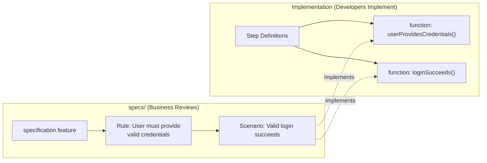

# BDD Fundamentals
>
> **Understanding Behavior-Driven Development and specifications**

Learn the foundations of BDD and how it enables shared understanding through executable specifications.

---

## What is BDD?

**Behavior-Driven Development (BDD)** is a specification technique that describes user-facing behavior through concrete examples.

BDD focuses on **observable behavior** - what users can see and interact with, not internal implementation details.

### Core Purpose

BDD answers the question: **"How does the system behave from the user's perspective?"**

By writing scenarios in natural language (Given/When/Then), teams create:

- Shared understanding of expected behavior
- Executable specifications that become automated tests
- Living documentation that stays synchronized with code

---

## Why Use BDD?

### Common Language

**Problem:** Developers, testers, and product owners speak different languages

**Solution:** BDD uses Gherkin (Given/When/Then), which is readable by all stakeholders

### Focus on Behavior

**Problem:** Tests focus on implementation details that change frequently

**Solution:** BDD tests describe **what the system does**, not **how it does it**

### Living Documentation

**Problem:** Documentation becomes outdated

**Solution:** BDD scenarios are executable — if they pass, the documentation is accurate

---

## The Unified Approach

This project maintains the conceptual distinction between Rules (often referred to as acceptance criteria) and Scenarios,
while using a single unified format: Gherkin.

### Rule Blocks

- **Purpose**: Define acceptance criteria
- **Format**: `Rule:` blocks in Gherkin
- **Location**: `specs/<module>/<feature>/specification.feature`
- **Origin**: Blue cards from Example Mapping, or policies from Event Storming
- **Audience**: Product owners, stakeholders, QA
- **Focus**: WHAT the system must do

### Scenario Blocks

- **Purpose**: Executable behavior examples
- **Format**: `Scenario:` blocks under Rules
- **Location**: `specs/<module>/<feature>/specification.feature` (same file as Rules)
- **Implementation**: Step definition files (separate from specification)
- **Origin**: Green cards from Example Mapping, and any further scenarios needed to make the rule complete
- **Audience**: Product Owners, Developers, QA, automation engineers
- **Focus**: HOW the system behaves (described in specs/, implemented separately)

> **Implementation**: Step definitions implement executable behavior for Gherkin steps.
> Location and naming conventions vary by language. See your implementation guide for details.

---

## Architectural Principle: Specs vs Implementation

**IMPORTANT**: This documentation emphasizes the separation between:

- **Specifications** (in `specs/`): Business-readable Gherkin describing WHAT
- **Implementations** (in implementation directories): Technical code describing HOW



---

## Executable Specifications

Executable Specifications are specifications written in such a way that automated tests can be executed from them.

Here we have decided to use a formal language called Gherkin.

This allows us to express the specification in a natural language whilst creating a structure with keywords that will trigger tests.

The tests are implemented in step definitions. These provide the connection between the specification and the code.

---

## Gherkin and the Ubiquitous Language

BDD scenarios are most effective when written using the **Ubiquitous Language** from Domain-Driven Design.

The shared vocabulary that both business and technical teams understand.

### Why This Matters

**Using technical language** (harder for business to validate):

```gherkin
Given the database record exists
When the API endpoint is called
Then the response code should be 200
```

**Using Ubiquitous Language** (clear to all stakeholders):

```gherkin
Given an order awaiting approval
When the manager approves the order
Then the order status should be "Approved"
```

The second version uses domain terms that:

- Business stakeholders recognize and can validate
- Developers implement using the domain model
- QA tests reflect actual business rules

**Best practice**: Before writing specifications, participate in Event Storming and Example Mapping workshops to establish the shared language.

See: [Ubiquitous Language](./ubiquitous-language.md) for DDD foundation and [Event Storming](../discovery/event-storming-overview.md) for domain discovery workshops

---

## Requirements Discovery with Example Mapping

Requirements for features are discovered through **Example Mapping**,
a collaborative workshop technique that uses colored index cards to surface acceptance criteria (Blue cards → Rules) and concrete examples (Green cards → Scenarios).

### Card to Gherkin Mapping

| Card Color | Represents          | Maps To             | Location |
| ---------- | ------------------- | ------------------- | -------- |
| **Yellow** | User Story          | Feature description | `specs/` |
| **Blue**   | Acceptance Criteria | `Rule:` blocks      | `specs/` |
| **Green**  | Concrete Examples   | `Scenario:` blocks  | `specs/` |
| **Pink**   | Questions/Unknowns  | issues.md           | `specs/` |
| N/A        | Step Implementation | Go functions        | `src/`   |

### Workshop Format

- < 25 minutes, time-boxed
- Collaborative: Product Owner + Developer + Tester
- Produces cards that map directly to Gherkin elements
- Surfaces questions and risks early

### Result

A feature is ready to implement when you have:

- 1 Yellow Card (user story)
- < 4 Blue Cards (acceptance criteria)
- < 4 Green Cards per Blue Card (examples)
- No questions that can not be quickly resolved

**See**: [Example Mapping Guide](../discovery/example-mapping.md) for complete workshop process, best practices, and detailed examples.

---

## BDD Best Practices

### DO

- ✅ Write specifications in ubiquitous language
- ✅ Run Example Mapping workshops before coding
- ✅ Keep specifications separate from implementation
- ✅ Focus on observable behavior
- ✅ Make specifications readable by stakeholders
- ✅ Use concrete examples

### DON'T

- ❌ Write specifications in technical language
- ❌ Let developers write specifications alone
- ❌ Mix business logic and implementation details
- ❌ Test internal implementation
- ❌ Skip stakeholder collaboration
- ❌ Write vague, subjective scenarios

---

## Related Documentation

- [Executable Specifications](./executable-specifications.md) - From discovery to implementation
- [Specifications Evolution](./specifications-evolution.md) - How specifications evolve
- [Three-Layer Approach](./three-layer-approach.md) - Rules/Scenarios/Unit Tests
- [Ubiquitous Language](./ubiquitous-language.md) - DDD and shared vocabulary
- [Example Mapping](../discovery/example-mapping.md) - Requirements discovery
