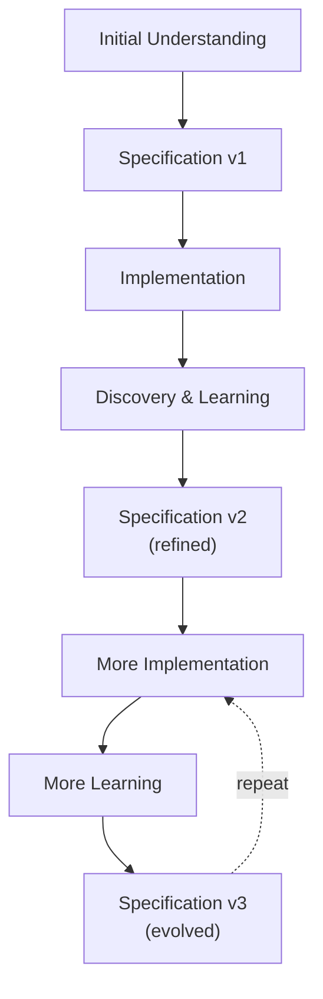

# Specifications Evolution

{{ page_breadcrumb() }}

> **How specifications evolve with understanding**

Specifications are living documents that evolve as your understanding deepens through implementation, usage, and feedback.

---

## Specifications Are Not Static

Specifications are not static artifacts written once and frozen. They are **living documents** that evolve as your understanding deepens through implementation, usage, and feedback.

---

## Evolution Example

### Initial Specification

After Example Mapping, you might write:

```gherkin
Feature: cli_user-registration

  Rule: Users must provide contact information

    @ov
    Scenario: User provides email
      Given I am registering a new account
      When I provide my email "user@example.com"
      Then my account should be created
      And I should see "Registration successful"
```

**What we knew**: Users need to provide an email to register.

### After Implementation Learning

During implementation, you discover:

- Email validation requirements (unit testing reveals format rules)
- Verification workflow (not just storage)
- Error cases (what if email already exists?)

Updated specification:

```gherkin
Feature: cli_user-registration

  Rule: Users must provide verified contact information

    @ov
    Scenario: User provides valid email format
      Given I am registering a new account
      When I provide my email "user@example.com"
      Then I should receive a verification email
      And my account should be in "pending verification" status
      And I should see "Check your email to verify your account"

    @ov
    Scenario: User provides invalid email format
      Given I am registering a new account
      When I provide my email "not-an-email"
      Then I should see an error "Invalid email format"
      And my account should not be created

    @ov
    Scenario: User provides already registered email
      Given an account exists with email "existing@example.com"
      When I provide my email "existing@example.com"
      Then I should see an error "Email already registered"
      And I should be directed to password reset
```

**What changed**:

- **Rule refined**: "contact information" → "verified contact information"
- **Scenario expanded**: Added verification workflow steps
- **Edge cases added**: Invalid format, duplicate email
- **Acceptance criteria clarified**: Actual behavior now explicit

### After Production Use

After users interact with the feature, you learn:

- Typos are common (help users correct them)
- Verification emails go to spam (provide resend option)
- Users forget which email they used (need lookup)

Further updated specification:

```gherkin
Feature: cli_user-registration

  Rule: Users must provide verified contact information with error recovery

    @ov
    Scenario: User provides valid email format
      Given I am registering a new account
      When I provide my email "user@example.com"
      Then I should receive a verification email
      And my account should be in "pending verification" status
      And I should see "Check your email to verify your account"
      And I should see "Didn't receive it? Resend verification email"

    @ov
    Scenario: User corrects email typo before verification
      Given I registered with email "user@exampl.com"
      And I have not yet verified my email
      When I run "r2r account update-email --new user@example.com"
      Then my verification email should be resent to "user@example.com"
      And I should see "Verification email sent to updated address"

    @ov
    Scenario: User provides invalid email format
      Given I am registering a new account
      When I provide my email "not-an-email"
      Then I should see an error "Invalid email format"
      And I should see a suggestion "Did you mean: not-an-email@gmail.com?"
      And my account should not be created

    @ov
    Scenario: User provides already registered email
      Given an account exists with email "existing@example.com"
      When I provide my email "existing@example.com"
      Then I should see "This email is already registered"
      And I should see "Forgot your password? Reset it here"
      And I should not create a duplicate account
```

**What changed**:

- **Rule expanded**: Added "with error recovery" (learned from user behavior)
- **Scenarios added**: Email correction, typo suggestions
- **User guidance**: Added helpful error messages and next steps
- **Real-world refinement**: Specs now match actual user needs

---

## Evolution Triggers

Update specifications when:

| Trigger                    | Example                             | Action                     |
| -------------------------- | ----------------------------------- | -------------------------- |
| **Implementation reveals** | Unit testing finds edge case        | Add error scenario         |
| **Stakeholder feedback**   | "This isn't what I meant"           | Refine acceptance criteria |
| **Production bugs**        | Users encounter unexpected behavior | Add regression scenario    |
| **Domain evolution**       | Business process changes            | Update Rules and scenarios |
| **Language refinement**    | Team adopts clearer terminology     | Refactor scenario language |
| **Requirements change**    | New regulatory requirement          | Add compliance scenarios   |

---

## Maintaining Specification Quality

As specifications evolve:

### DO

- ✅ Update specifications **immediately** when you learn something new
- ✅ Refactor for clarity as understanding deepens
- ✅ Keep specifications synchronized with implementation
- ✅ Document why changes were made (commit messages)
- ✅ **Don't forget the code** - as we evolve the domain language we do not only change specifications, we also change the corresponding language in the code!

### DON'T

- ❌ Leave specifications unchanged while code evolves
- ❌ Accumulate "specification debt" to fix later
- ❌ Let scenarios become outdated documentation
- ❌ Treat specifications as write-once artifacts
- ❌ Skip renaming corresponding code elements

---

## The Evolution Cycle



**Remember**: Each iteration brings you closer to a specification that accurately captures both the **intended behavior** and the **actual behavior** of your system.

---

## Practical Evolution Guidelines

### When to Update Specifications

**During Development**:

- Discovered a new edge case? Add scenario immediately
- Found better wording? Refactor specification
- Acceptance criteria unclear? Refine with stakeholders

**After Development**:

- Bug found in production? Add regression scenario
- User feedback reveals misunderstanding? Update specification
- Domain language evolved? Refactor terminology

**During Refactoring**:

- Code structure changes? Ensure specifications still accurate
- Domain model refactored? Update specification language
- Step definitions change? Verify specifications still pass

### How to Update Specifications

1. **Identify the change**: What did you learn?
2. **Update the specification**: Add/modify scenarios
3. **Update the implementation**: Code + step definitions
4. **Run all tests**: Ensure everything passes
5. **Commit with context**: Explain why the change was made

**Example commit message**:

```text
feat(auth): add email typo correction

After production deployment, users frequently registered with
typos in their email addresses. This adds a correction workflow
that allows users to update their email before verification.

Updated specification: cli_user-registration.feature
Added scenario: User corrects email typo before verification
```

---

## Evolution Anti-Patterns

### Specification Debt

**Problem**: Specifications not updated as code evolves

**Symptoms**:

- Specifications don't match actual behavior
- Failing scenarios ignored
- New features have no specifications

**Solution**:

- Update specifications immediately when code changes
- Make specification updates part of "done" definition
- Review specifications during code review

### Over-Engineering Early

**Problem**: Trying to anticipate every future scenario

**Symptoms**:

- Specifications for features not yet needed
- Overly complex acceptance criteria
- Scenarios for hypothetical edge cases

**Solution**:

- Write specifications for current understanding
- Add scenarios when you actually encounter the need
- Let specifications evolve naturally with the system

### Ignoring Domain Evolution

**Problem**: Domain terminology changes but specifications don't

**Symptoms**:

- Specifications use outdated terms
- New team members confused by language
- Disconnect between business and technical vocabulary

**Solution**:

- Refactor specifications when domain language evolves
- Update both specifications AND code together
- Keep glossary current

---

## Evolution Checklist

When updating specifications, check:

- [ ] Does the Rule still accurately describe the acceptance criterion?
- [ ] Do all scenarios still reflect current behavior?
- [ ] Is the language still aligned with domain vocabulary?
- [ ] Are error cases and edge cases covered?
- [ ] Does the implementation match the specification?
- [ ] Do all scenarios pass?
- [ ] Have I updated related documentation?

---

## Related Documentation

- [BDD Fundamentals](./bdd-fundamentals.md) - Understanding BDD
- [Executable Specifications](./executable-specifications.md) - From discovery to implementation
- [Review and Iterate](../quality/review-and-iterate.md) - Detailed evolution practices
- [Ubiquitous Language](./ubiquitous-language.md) - Domain language evolution

{{ diataxis_footer() }}
