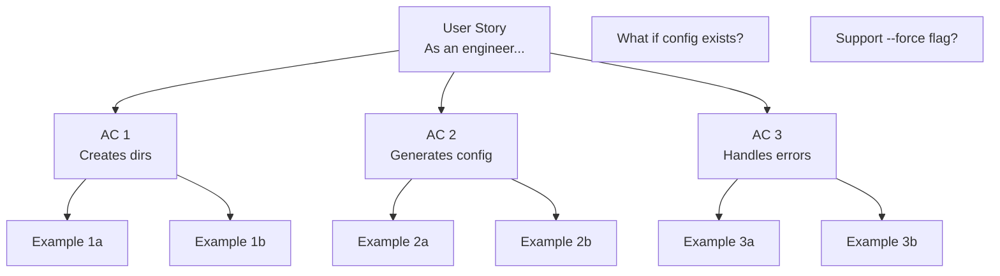
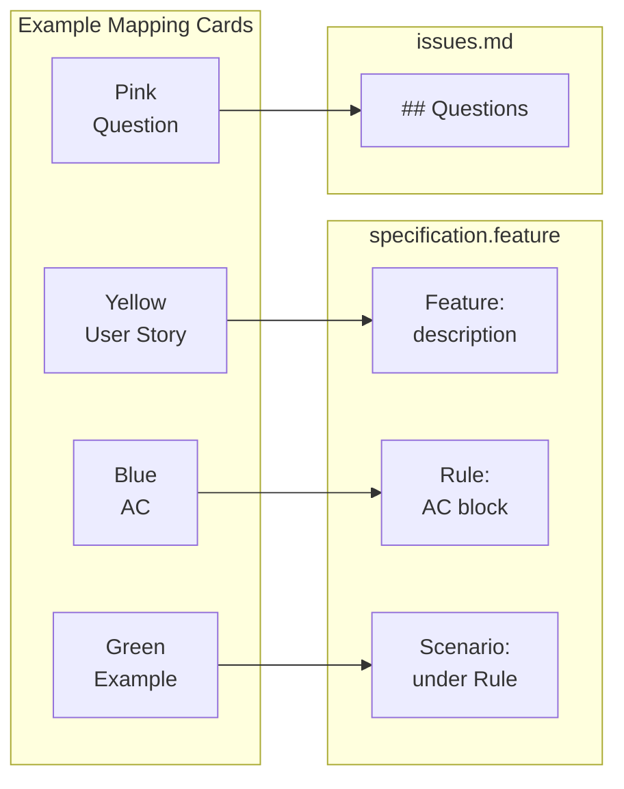

# Example Mapping

Workshop technique for discovering requirements through collaborative conversation in 15-25 minutes.

---

## What is Example Mapping?

**[Example Mapping](https://cucumber.io/blog/bdd/example-mapping-introduction/)** is a time-boxed collaborative workshop that uses colored index cards to discover acceptance criteria and concrete examples before development begins.

**Core purpose**: Answers three questions:

1. What does this feature need to do? (Acceptance criteria)
2. What are concrete examples? (Test scenarios)
3. What don't we know yet? (Questions and risks)

**Prerequisites**: Establish **Ubiquitous Language** through **Event Storming** first. See: [Event Storming](./event-storming.md) and [Ubiquitous Language](./ubiquitous-language.md)

**Why use it?** Discovers requirements early (less than 25 min conversation vs days/weeks of coding), produces concrete measurable criteria (not subjective), creates fast feedback loop, builds collaborative understanding.

---

## The Four Card Colors

| Card Color    | Represents | Maps To | Location          |
|---------------|------------|---------|-------------------|
| <svg width="24" height="24" xmlns="http://www.w3.org/2000/svg"><rect width="24" height="24" rx="2" fill="#F7E55A" stroke="#D6C645"/></svg> **Yellow** | User Story: WHO, WHAT, WHY | Feature description | 1 per feature     |
| <svg width="24" height="24" xmlns="http://www.w3.org/2000/svg"><rect width="24" height="24" rx="2" fill="#5BA3F7" stroke="#4A89D6"/></svg> **Blue**   | Acceptance Criteria: Success conditions | `Rule:` blocks | < 4 per story     |
| <svg width="24" height="24" xmlns="http://www.w3.org/2000/svg"><rect width="24" height="24" rx="2" fill="#7EDC7A" stroke="#68B666"/></svg> **Green**  | Concrete Examples: Specific scenarios | `Scenario:` blocks | < 4 per criterion |
| <svg width="24" height="24" xmlns="http://www.w3.org/2000/svg"><rect width="24" height="24" rx="2" fill="#FF7EBF" stroke="#D66A9F"/></svg> **Pink**   | Questions/Unknowns: Blockers | issues.md | See below         |

### Card Guidelines

**Yellow** (User Story):

```text
As a [role]
I want [capability]
So that [business value]
```

**Blue** (Rules): Measurable business rules

- ✅ "Creates 3 directories (src/, tests/, docs/)"
- ❌ "Interface is user-friendly" (not measurable)

**Green** (Examples): [Context] → [Action] → [Result]

- ✅ "Empty folder → init → creates src/, tests/, docs/"
- ❌ "It creates directories" (too abstract)

**Pink** (Questions): Capture without solving during workshop

- "What if r2r.yaml already exists?"
- "Should we support a --force flag?"

---

## Workshop Process

**Participants**: Product Owner + Engineer + Tester
**Duration**: 15-25 minutes (strictly time-boxed)

### Steps

1. **Place Yellow Card** (2 min) - Write user story
2. **Generate Blue Cards** (8-12 min) - Brainstorm 2-6 acceptance criteria
3. **Create Green Cards** (5-10 min) - Write 2-4 concrete examples per Blue Card
4. **Capture Pink Cards** (ongoing) - Write down questions, don't solve them
5. **Assess Readiness** (2 min) - Ready to implement, too large, or too uncertain?

### Readiness Assessment

**✅ Ready**: <4 Blue Cards, <4 Green Cards each, no Pink cards you can't answer within a day
**⚠️ Too Large**: >4 Blue Cards or >25 minutes → Split into multiple features
**❌ Too Uncertain**: Blocking Pink Cards → Research spike, then re-run

---

## Visual Layout



**Workshop tips**: Use physical cards on table (or Miro/Mural for virtual), everyone can add cards, take photos for documentation.

---

## From Cards to Gherkin



### Example Conversion

**Workshop Cards**:

```text
🟡 As an engineer, I want to initialize a CLI project with one command
🔵 [BLUE-1] Creates project directory structure
🟢 [GREEN-1a] Empty folder → init → creates src/, tests/, docs/
🟢 [GREEN-1b] Existing project → init → error "already initialized"
```

**Resulting Gherkin** (`specs/cli/init-project/specification.feature`):

```gherkin
Feature: cli_init-project

  As an engineer
  I want to initialize a CLI project with one command
  So that I can quickly start development

  Rule: Creates project directory structure

    @ov
    Scenario: Initialize in empty directory creates structure
      Given I am in an empty folder
      When I run "r2r init my-project"
      Then a directory named "my-project/src/" should exist
      And a directory named "my-project/tests/" should exist
      And a directory named "my-project/docs/" should exist

    @ov
    Scenario: Initialize in existing project shows error
      Given I am in a directory with "r2r.yaml"
      When I run "r2r init"
      Then the command should fail
      And stderr should contain "already initialized"
```

---

## After the Workshop

### Immediate (Same Day)

1. **Write specification.feature** - Convert cards to Gherkin while context is fresh
2. **Share for review** - Product Owner, Engineers, QA validate
3. **Document Pink Cards** - Create `issues.md` with ownership and deadlines

### Short-term (1-2 Days)

1. **Incorporate feedback** - Refine ambiguous steps, add missing criteria
2. **Resolve Pink Cards** - Research, mini-sessions, spike implementations
3. **Confirm scope** - All three amigos agree before implementation starts

### During Implementation (1 Week)

1. **Discover edge cases** - Unit tests reveals boundary conditions → Add scenarios
2. **Refine language** - Vague steps become precise → Update specification
3. **Keep synchronized** - Commit spec changes with code changes

### After Implementation

1. **Retrospective review** - Did spec match what was built?
2. **Refactor for clarity** - Consolidate duplicates, simplify verbose scenarios
3. **Document lessons learned** - Improve next workshop

**Remember**: Specifications are **living documents**. They evolve through discovery, feedback, refinement, and iteration. See: [Review and Iterate](review-and-iterate.md)

---

## Best Practices

### Do's ✅

- Time-box strictly (25 min max)
- Use domain language from Event Storming
- Be specific: "Creates 3 directories" not "Creates directories"
- Include error cases (at least one per Blue Card)
- Set Pink Cards aside (don't solve during workshop)
- Invite all three amigos (Product + Dev + Test)

### Don'ts ❌

- Don't make Blue Cards subjective → Use measurable criteria
- Don't use abstract Green Cards → Use specific input/output
- Don't debate Pink Cards → Write down, resolve later
- Don't exceed 6 Blue Cards → Split the feature
- Don't skip edge cases → Error scenarios matter

---

## Common Anti-Patterns

❌ **Solution in User Story**: "I want a YAML config file" → ✅ "I want to configure my CLI tool"
❌ **Unmeasurable criteria**: "Performance is good" → ✅ "Completes in <2 seconds"
❌ **Too many Green Cards**: 10+ examples for one Blue Card → ✅ Split into multiple Blue Cards
❌ **Implementation details**: "Parser loads YAML → deserializes" → ✅ "Valid YAML → init succeeds"

---

## When to Split Features

Split when:

- **>6 Blue Cards** - Group related criteria into separate features
- **Workshop >25 minutes** - Prioritize and split
- **Every Blue Card has 6+ Green Cards** - Keep MVP, defer edge cases

---

## See Also

- [Working with specifications](working-with-specifications.md) - Concepts behind specifications
- [Three-Layer Approach](./three-layer-approach.md) - How Example Mapping fits the workflow
- [Review and Iterate](review-and-iterate.md) - Maintaining living specifications

## Quick Reference

- [Example Mapping Cards](../../reference/specifications/example-mapping-cards.md) - Card colors and quantities
- [Running Example Mapping](../../how-to-guides/specifications/running-example-mapping.md) - How to facilitate sessions
- [Translating to Gherkin](../../how-to-guides/specifications/translating-to-gherkin.md) - Converting cards to specs
