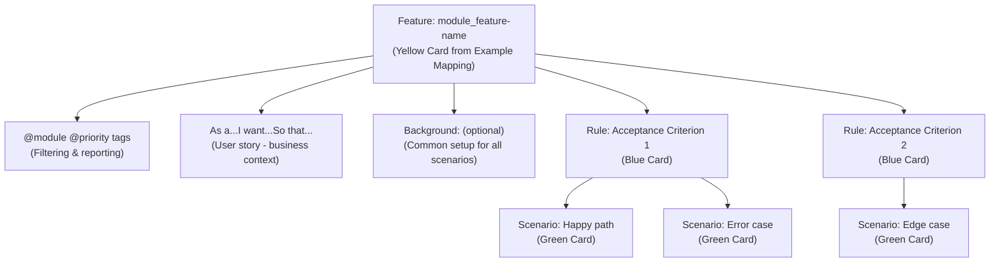

# File Structure
>
> **Specifications vs implementation separation**

Understanding the philosophy and structure of separating WHAT from HOW.

---

## Quick Start

> **Creating Your First Feature File:**
>
> 1. **Create directory**: `mkdir -p specs/<module>/<feature>/`
> 2. **Copy template**: `cp templates/specs/specification.feature specs/<module>/<feature>/`
> 3. **Add Rules and Scenarios**: Convert Example Mapping cards to Gherkin
> 4. **Add required tags**: `@ov` (verification) and `@ac1` (acceptance criteria link)
> 5. **Validate**: `r2r eac validate specs`
> 6. **Run tests**: `r2r eac test <module> --suite pre-commit`
>
> See [Template Usage](#template-usage) for detailed steps.

---

## Specifications vs Implementation

The project maintains strict separation:

```text
specs/<module>/<feature>/
└── specification.feature    ← WHAT the system should do (business-readable)

<implementation>/
└── Step Definitions         ← HOW to verify (technical implementation)
```

> **Implementation**: Step definitions are organized in a module-specific test directory.
>
> Common patterns:
>
> - **Go**: `src/<module>/tests/steps_test.go`
> - **Python**: `src/<module>/tests/steps.py`
> - **Java**: `src/test/java/<package>/StepDefinitions.java`
> - **TypeScript**: `src/<module>/tests/steps.ts`
>
> Your implementation guide specifies the exact structure for your project.

---

## Why Separate?

### Business Reviews Specs Without Seeing Technical Code

Stakeholders can review feature files without understanding:

- Programming languages
- Technical implementation details
- Test frameworks

### Developers Refactor Implementations Without Changing Specs

If behavior is unchanged, developers can:

- Optimize implementation
- Switch frameworks
- Refactor code structure
- Improve performance

All without modifying the specifications.

### Specifications Evolve with Business

- Requirements change → Update specs
- New features → Add new specs
- Business pivots → Modify specs

### Implementations Evolve with Technology

- New framework → Rewrite step definitions
- Better tools → Optimize implementation
- Tech debt → Refactor step definitions

### Clear Ownership

- **Product Owners** review `specs/` directory
- **Developers** review `src/` directory
- **Domain Experts** validate `specs/` behavior
- **QA Engineers** maintain both

---

## Feature Hierarchy

Every feature file follows this hierarchy:



**Design principle**: Each level serves a distinct purpose and audience.

---

## Directory Structure

### Specification Directory Structure

```
specs/
├── <module>/
│   ├── <feature>/
│   │   └── specification.feature    ← Feature specifications
│   └── <feature2>/
│       └── specification.feature
└── <module2>/
    └── <feature>/
        └── specification.feature
```

### Implementation Directory Structure (Go Example)

```
src/
└── <module>/
    ├── *.go                          ← Production code
    ├── *_test.go                     ← Unit tests
    └── tests/
        └── steps_test.go             ← Step definitions
```

---

## Complete Example

### Specification File

**Location**: `specs/cli/init-project/specification.feature`

```gherkin
@cli @critical
Feature: cli_init-project

  As a developer
  I want to initialize a CLI project
  So that I can quickly start development

  Rule: Creates project directory structure

    @ov
    Scenario: Initialize in empty directory
      Given I am in an empty folder
      When I run "r2r init"
      Then a file named "r2r.yaml" should be created

    @ov
    Scenario: Initialize in existing project
      Given I am in a directory with "r2r.yaml"
      When I run "r2r init"
      Then the command should fail
```

### Step Definition File (Go Example)

**Location**: `src/cli/tests/steps_test.go`

```go
package tests

import (
    "github.com/cucumber/godog"
)

// Feature: cli_init-project
func InitializeScenario(ctx *godog.ScenarioContext) {
    ctx.Step(`^I am in an empty folder$`, iAmInAnEmptyFolder)
    ctx.Step(`^I run "([^"]*)"$`, iRun)
    ctx.Step(`^a file named "([^"]*)" should be created$`, aFileNamedShouldBeCreated)
}

func iAmInAnEmptyFolder() error {
    // Implementation
}

func iRun(command string) error {
    // Implementation
}

func aFileNamedShouldBeCreated(filename string) error {
    // Implementation
}
```

---

## Template Usage

### Canonical Template

The project provides a complete template at `templates/specs/specification.feature`:

**Template includes**:

- Architectural notes (specs/ vs src/ separation)
- Instructions for each component
- Examples of all tag types
- Comments explaining choices

**Documentation examples** (like in this guide) omit the notes for brevity, but users should **copy the actual template file** to get full context.

### Starting a New Feature

**Step 1**: Copy template to feature directory

```bash
mkdir -p specs/cli/new-feature
cp templates/specs/specification.feature specs/cli/new-feature/specification.feature
```

**Step 2**: Replace placeholders

- `[module-name_feature-name]` → Feature name in kebab-case
- `[role]` → User role (developer, admin, user, etc.)
- `[capability]` → What user wants to do
- `[business value]` → Why this matters

**Step 3**: Add Rules from Example Mapping

Convert Blue Cards to Rule blocks:

```gherkin
Rule: Creates project directory structure

Rule: Configuration file contains required fields

Rule: Existing projects are not overwritten
```

**Step 4**: Add Scenarios for Each Rule

Convert Green Cards to Scenario blocks under their Rules:

```gherkin
Rule: Creates project directory structure

  @ov @ac1
  Scenario: Initialize in empty directory
    Given I am in an empty folder
    When I run "r2r init"
    Then a file named "r2r.yaml" should be created
    And a directory named "specs/" should be created

  @ov @ac1
  Scenario: Initialize in existing project
    Given I am in a directory with "r2r.yaml"
    When I run "r2r init"
    Then the command should fail
    And I should see "Project already initialized"
```

**Step 5**: Add Required Tags

Every scenario MUST have:

1. **Verification tag**: `@ov`, `@iv`, `@pv`, `@piv`, or `@ppv`
2. **Acceptance criteria tag**: `@ac1`, `@ac2`, etc. (links scenario to Rule)

**Step 6**: Validate and Test

```bash
# Validate specification syntax
r2r eac validate specs

# Run the specification
r2r eac test <module> --suite pre-commit
```

---

## Best Practices

### DO

- ✅ Keep specifications in `specs/` directory
- ✅ Keep step definitions in module test directories
- ✅ Use clear, business-readable language in specifications
- ✅ Document technical implementation in step definitions
- ✅ Review specifications with stakeholders
- ✅ Review implementations with developers

### DON'T

- ❌ Mix specifications and implementation in same file
- ❌ Include technical details in specification files
- ❌ Include business logic in step definitions (use production code)
- ❌ Skip stakeholder review of specifications
- ❌ Let specifications drift from implementation

---

## Related Documentation

- [Organizing Rules](./organizing-rules.md) - Creating acceptance criteria
- [Organizing Scenarios](./organizing-scenarios.md) - Scenario structure
- [Go Implementation](../implementation/go/file-organization.md) - Go-specific file structure
