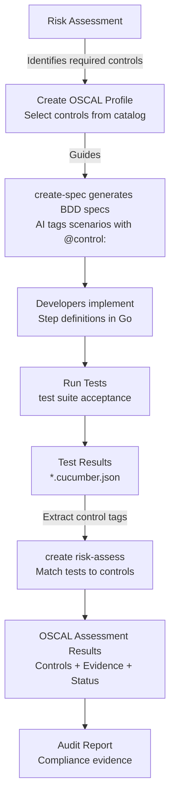

# Risk Controls and Compliance Traceability

> **Risk-based control management with automated evidence collection**

## What Are Risk Controls?

Risk controls are **security and compliance requirements** that mitigate identified risks. They answer:

- **What could go wrong?** (Risk)
- **What must we do to prevent it?** (Control)
- **How do we prove it works?** (Evidence)

**Traditional Approach**:

- Risk assessment → Spreadsheet → Manual verification → Periodic audits
- Artifacts in separate systems, evidence gathered retroactively
- Difficult to maintain traceability

**EAC OSCAL Approach**:

- Risk assessment → OSCAL profile → BDD specifications → Automated testing
- All in version control, traceability in real-time
- Automated evidence collection for compliance audits

**Benefits**:

- Machine-readable control definitions (OSCAL JSON)
- Explicit traceability via `@control:` tags
- Automated evidence linking test results to controls
- Version controlled and audit-ready

---

## Architecture

### What is OSCAL?

[OSCAL (Open Security Controls Assessment Language)](https://pages.nist.gov/OSCAL/) is a standardized, machine-readable framework developed by NIST for representing security controls, profiles, implementations, and assessment results.

**Why OSCAL?**

Traditional security control management relies on documents (PDFs, spreadsheets, Word files) that are:

- Difficult to automate and integrate with development workflows
- Prone to inconsistency across systems and organizations
- Hard to maintain traceability between controls, implementations, and evidence
- Time-consuming for compliance audits

**OSCAL solves this by providing**:

- **Standardized formats**: JSON, XML, and YAML schemas for all security artifacts
- **Machine-readable**: Enables automated validation, evidence collection, and reporting
- **Interoperable**: Common language across tools, organizations, and frameworks
- **Version controlled**: Security artifacts can live alongside code in git
- **Traceable**: Explicit links between controls, implementations, and test evidence

**OSCAL Versions**: The framework is actively maintained by NIST. This project uses **OSCAL 1.1.2** for profiles and **OSCAL 1.1.3** for catalogs and assessment results. Always check schema compatibility when working with OSCAL documents.

### Three Core Documents

```text
┌──────────────────┐
│  OSCAL Catalog   │  Templates: Control definitions (NIST 800-53, etc.)
│  controls.json   │  Location: templates/specs/risk-catalog/
└────────┬─────────┘
         │ References
         ↓
┌──────────────────┐
│  OSCAL Profile   │  Solution: Control selection for YOUR system
│  *.profile.json  │  Location: specs/.risk-controls/<module>.profile.json
└────────┬─────────┘
         │ Guides
         ↓
┌──────────────────┐
│  BDD Scenarios   │  Implementation: Executable tests with @control: tags
│  *.feature       │  Location: specs/<module>/**/*.feature
└────────┬─────────┘
         │ Produces
         ↓
┌──────────────────┐
│ Assessment       │  Evidence: Test results + security scans
│ Results JSON     │  Location: out/risk/<module>/assessment-results.json
└──────────────────┘
```

### Risk Catalog (Templates)

**What**: Library of standard control definitions that you define for the company (e.g., NIST 800-53, ISO 27001)

**Location**: `templates/specs/risk-catalog/controls.catalog.json`

**Purpose**: Provides standardized control definitions that can be referenced

**Example Controls**:

- `ac-2`: Account Management
- `au-3`: Audit Record Content
- `ia-5(1)`: Password-Based Authentication

**You don't modify the catalog** - it's the reference standard.

### Profile (Your Selection)

**What**: Defines which controls apply to YOUR specific system/module

**Location**: `specs/.risk-controls/<module>.profile.json`

**Purpose**: Selects relevant controls from the catalog for your solution

**Create with**:

```bash
create risk-profile assessment.md
```

**Example** (`specs/.risk-controls/auth-service.profile.json`):

```json
{
  "profile": {
    "uuid": "...",
    "metadata": { "title": "Authentication Service Controls" },
    "imports": [{
      "href": "../../../templates/specs/risk-catalog/controls.catalog.json",
      "include-controls": [{
        "with-ids": ["ac-2", "ac-3", "au-2", "ia-5", "ia-5(1)"]
      }]
    }]
  }
}
```

### BDD Specifications (Your Implementation)

**What**: Executable scenarios tagged with control IDs

**Location**: `specs/<module>/**/*.feature`

**Purpose**: Test scenarios that verify control satisfaction

**Tag Format**:

- `@control:ac-2` - Single control
- `@control:ia-5(1)` - Control with enhancement
- `@controls:ac-2,au-3` - Multiple controls

**Example** (`specs/auth-service/login.feature`):

```gherkin
@control:ac-2 @control:ia-5(1)
Scenario: User authenticates with password
  Given a registered user account
  When the user provides valid credentials
  Then access should be granted
  And the login event should be logged

@controls:au-2,au-3
Scenario: Login attempts are audited
  Given audit logging is enabled
  When a login attempt occurs
  Then an audit record must be created
  And the record must include timestamp, user ID, and result
```

### Assessment Results (Automated Evidence)

**What**: OSCAL document linking controls to test evidence

**Location**: `out/risk/<module>/assessment-results.json`

**Generated by**:

```bash
create risk-assess --profile specs/.risk-controls/risk-profile.json
```

**Contains**:

- **Observations**: Test results, security scans, timestamps
- **Findings**: Per-control satisfied/not-satisfied status
- **Evidence Links**: Traces controls → scenarios → test results

---

## The Traceability Flow

### How It Works



### Step-by-Step Example

> **1. Conduct Risk Assessment**

```bash
# Document risks in assessment.md
echo "## Risk: Unauthorized Access
- Likelihood: High
- Impact: Critical
- Controls Needed: AC-2, AC-3, IA-5
" > assessment.md
```

> **2. Create OSCAL Profile**

```bash
create risk-profile assessment.md
# Generates: specs/.risk-controls/risk-profile.json
# Contains: Selected control IDs (ac-2, ac-3, ia-5)
```

> **3. Generate Specifications**

```bash
create-spec "User authentication with password" --module auth-service
# AI receives available controls from profile
# Generates spec with @control: tags
```

Output (`specs/auth-service/authentication.feature`):

```gherkin
@control:ac-2 @control:ia-5
Feature: User Authentication

  Scenario: Password authentication
    Given a user with valid credentials
    When they provide username and password
    Then access should be granted
```

> **4. Run Tests**

```bash
test auth-service --suite acceptance
# Produces: out/test/<timestamp>/auth-service/*.cucumber.json
```

> **5. Collect Evidence**

```bash
create risk-assess auth-service --profile specs/.risk-controls/risk-profile.json
# Extracts @control: tags from specs
# Matches to test results
# Generates: out/risk/auth-service/assessment-results.json
```

> **6. Assessment Results** (`assessment-results.json`):

```json
{
  "results": [{
    "findings": [
      {
        "title": "Control AC-2 Assessment",
        "target": {
          "target-id": "ac-2",
          "status": { "state": "satisfied" }
        },
        "related-observations": ["obs-uuid-1"],
        "remarks": "Tested by: specs/auth-service/authentication.feature:Password authentication"
      }
    ],
    "observations": [
      {
        "uuid": "obs-uuid-1",
        "title": "Test Results",
        "collected": "2025-12-04T...",
        "relevant-evidence": [
          { "href": "out/test/.../auth-service/acceptance.cucumber.json" }
        ]
      }
    ]
  }]
}
```

---

## IMPORTANT: Assessment-First Process

**You MUST conduct a risk assessment BEFORE selecting controls.**

### Correct Process

1. **Conduct Risk Assessment**

   - Identify YOUR specific threats and vulnerabilities
   - Document in `assessment.md` or risk register
   - Determine likelihood and impact

2. **Create OSCAL Profile**

   - Review OSCAL catalog controls
   - Select controls that address YOUR risks
   - Create profile: `create risk-profile assessment.md`

3. **Generate Specifications**

   - Use `create-spec` with module profile
   - AI automatically tags scenarios with applicable controls
   - Review and adjust tags as needed

4. **Implement and Test**
   - Write step definitions
   - Run tests to verify control satisfaction
   - Collect evidence with `create risk-assess`

### Why OSCAL?

**Standardization**: Industry-standard format (NIST)
**Machine-Readable**: Automated tooling and validation
**Interoperability**: Works with compliance management systems
**Traceability**: Direct links from controls → tests → evidence
**Auditability**: Version-controlled, timestamped evidence

---

## Control Tag Format

### Single Control

```gherkin
@control:ac-2
Scenario: Account management
  # Tests control AC-2 (Account Management)
```

### Control with Enhancement

```gherkin
@control:ia-5(1)
Scenario: Password-based authentication
  # Tests control IA-5(1) (Password-Based Authentication)
```

### Multiple Controls

```gherkin
@controls:ac-2,au-3
Scenario: Audited account creation
  # Tests both AC-2 (Account Management) and AU-3 (Audit Record Content)
```

### Format Rules

- **Pattern**: `@control:<family>-<number>` or `@control:<family>-<number>(<enhancement>)`
- **Family**: 2-4 lowercase letters (e.g., `ac`, `au`, `ia`, `sc`)
- **Number**: 1+ digits (e.g., `2`, `12`)
- **Enhancement**: Optional number in parentheses (e.g., `(1)`, `(10)`)
- **Multiple**: Use `@controls:` with comma-separated IDs (no spaces)

### Validation

Ensure tags reference valid controls:

```bash
validate control-tags
# Checks all @control: tags against OSCAL catalog
# Reports: Invalid control IDs with file locations
```

---

## OSCAL Schema Validation

All OSCAL documents must conform to official NIST schemas. Validation ensures your control definitions, profiles, and assessment results are properly structured and interoperable.

### Schema Versions and Locations

| Family | Description                          | Example Controls                                                  |
| ------ | ------------------------------------ | ----------------------------------------------------------------- |
| **AC** | Access Control                       | `ac-2` (Account Management), `ac-3` (Access Enforcement)          |
| **AU** | Audit and Accountability             | `au-2` (Event Logging), `au-3` (Audit Record Content)             |
| **IA** | Identification and Authentication    | `ia-2` (User Identification), `ia-5(1)` (Password Authentication) |
| **SC** | System and Communications Protection | `sc-7` (Boundary Protection), `sc-8(1)` (Encrypted Transmission)  |
| **SI** | System and Information Integrity     | `si-2` (Flaw Remediation), `si-10` (Information Input Validation) |

### Validation Commands

The CLI provides automated validation against OSCAL schemas:

| Framework     | Maps to NIST 800-53          | Example                           |
| ------------- | ---------------------------- | --------------------------------- |
| **HIPAA**     | Security Rule requirements   | `ac-2`, `au-2`, `ia-2`, `sc-8`    |
| **PCI-DSS**   | Data protection requirements | `ac-2`, `au-2`, `sc-7`, `sc-8(1)` |
| **SOC 2**     | Trust Services Criteria      | `ac-2`, `au-2`, `ia-2`, `sc-12`   |
| **ISO 27001** | Annex A controls             | `ac-2`, `ac-3`, `au-2`, `ia-5`    |
| **FedRAMP**   | Security controls            | Entire NIST 800-53 catalog        |

```bash
validate risk-catalog
# Validates: templates/specs/risk-catalog/*.catalog.json
# Against: OSCAL 1.1.3 catalog schema
```

**Validate Control Profile**:

```bash
validate risk-profile
# Validates: specs/.risk-controls/*.profile.json
# Against: OSCAL 1.1.2 profile schema
```

**Validate Assessment Results** (automatic during generation):

```bash
create risk-assess --profile specs/.risk-controls/mymodule.profile.json
# Generates and validates: out/risk/<module>/assessment-results.json
# Against: OSCAL 1.1.3 assessment-results schema
```

### Schema References

**Official OSCAL Documentation**:

- [OSCAL Schema Reference](https://pages.nist.gov/OSCAL/resources/concepts/layer/) - Overview of all OSCAL layers
- [Catalog Layer](https://pages.nist.gov/OSCAL/concepts/layer/control/catalog/) - Control catalog structure
- [Profile Layer](https://pages.nist.gov/OSCAL/concepts/layer/control/profile/) - Profile selection mechanism
- [Assessment Layer](https://pages.nist.gov/OSCAL/concepts/layer/assessment/) - Assessment results format

**All OSCAL Schemas**:

- [OSCAL Complete Schema Repository](https://github.com/usnistgov/OSCAL/tree/main/json/schema) - All JSON schemas by version

**Validation Tools**:

- [OSCAL-CLI](https://github.com/usnistgov/oscal-cli) - Official NIST validation tool
- [JSON Schema Validator](https://www.jsonschemavalidator.net/) - Online validation (paste schema + document)

### Common Validation Errors

| Error | Cause | Fix |
|-------|-------|-----|
| `Missing required property 'uuid'` | Every OSCAL document needs a unique UUID | Add `"uuid": "..."` to root object |
| `Invalid control ID reference` | Profile references control not in catalog | Check `with-ids` matches catalog control IDs |
| `Schema version mismatch` | Document created for different OSCAL version | Update to correct schema version or regenerate |
| `Invalid href path` | Catalog import path incorrect | Verify relative path from profile to catalog file |

---

## When You Need Risk Controls

### Regulated Industries

Risk controls are essential for:

- **Healthcare**: HIPAA, FDA 21 CFR Part 11, ISO 13485, IEC 62304
- **Financial Services**: SOX, PCI-DSS, GLBA
- **Government**: FedRAMP, FISMA, StateRAMP
- **Cloud Services**: CSA CCM, ISO 27017/27018
- **AI/ML Systems**: EU AI Act, NIST AI RMF
- **Privacy**: GDPR, CCPA, LGPD

### Risk-Based Development

Even outside regulated domains, use controls for:

- High consequence of failure (safety-critical, financial, reputation)
- Security requirements (authentication, encryption, access control)
- Compliance obligations (SOC 2, ISO 27001, contractual SLAs)
- Audit requirements (internal, external, certification)

### When You Don't Need Them

Skip for:

- Low-risk internal tools
- Prototypes and experiments
- Simple utilities
- Personal/side projects without regulatory obligations

---

## Commands Reference

### Create OSCAL Profile

```bash
create risk-profile <assessment.md>

# Generates: specs/.risk-controls/risk-profile.json
# AI selects controls based on risk assessment
```

### Generate Specifications with Control Tags

```bash
create-spec "<description>" --module <module-name>

# AI receives available controls from module's profile
# Automatically tags scenarios with @control: tags
# Generates: specs/<module>/**/*.feature
```

### Validate Control Tags

```bash
validate control-tags

# Checks: All @control: tags reference valid catalog controls
# Reports: Invalid IDs with file locations
```

### Collect Evidence

```bash
create risk-assess <module> --profile <profile-path>

# Extracts: @control: tags from feature files
# Matches: Tags to test results
# Generates: out/risk/<module>/assessment-results.json
```

### Validate OSCAL Documents

```bash
validate risk-profile     # Validate profile against OSCAL schema
validate risk-catalog     # Validate catalog against OSCAL schema
```

---

## Best Practices

### Do ✅

- **Start with risk assessment** - Document YOUR threats and vulnerabilities first
- **Use standard controls** - Leverage NIST 800-53 or industry frameworks
- **Tag all control scenarios** - Maintain complete traceability
- **Validate tags** - Run `validate control-tags` in CI/CD
- **Collect evidence regularly** - Run `create risk-assess` after test runs
- **Version control everything** - Profiles, specs, and evidence in git
- **Review quarterly** - Update controls as risks and regulations evolve

### Don't ❌

- **Don't skip risk assessment** - Controls without risk analysis are meaningless
- **Don't modify the catalog** - Use profiles to select controls
- **Don't forget enhancements** - Use `ia-5(1)` format when applicable
- **Don't mix tag formats** - Use `@control:id` not old `@risk-control:name`
- **Don't manually create assessment-results** - Use `create risk-assess`
- **Don't tag unrelated scenarios** - Only tag scenarios that actually verify the control
- **Don't forget validation** - Engage compliance experts for regulatory mappings

---

## Review and Maintenance

### Review Cadence

**Quarterly (Regular)**:

```bash
# 1. Review profile controls
cat specs/.risk-controls/*.profile.json

# 2. Check for invalid tags
validate control-tags

# 3. Verify evidence is current
create risk-assess --profile specs/.risk-controls/risk-profile.json

# 4. Review assessment results
cat out/risk/*/assessment-results.json
```

**Event-Driven (Triggered)**:

- New regulation → Update profile with new controls
- Audit finding → Add missing control tags to specs
- Security incident → Add defensive control scenarios
- Architecture change → Review applicable controls
- Threat intelligence → Update risk assessment and controls

### Update Process

1. **Update Risk Assessment** - Document new/changed risks
2. **Update OSCAL Profile** - Add/remove controls using `create risk-profile`
3. **Update Specifications** - Add `@control:` tags to new scenarios
4. **Validate** - Run `validate control-tags`
5. **Test** - Execute test suites
6. **Collect Evidence** - Run `create risk-assess`
7. **Document** - Update CHANGELOG and audit trail

---

## Troubleshooting

### "Control not found in catalog"

```bash
validate control-tags
# Error: Control 'ac-99' not found in catalog

# Fix: Check catalog for valid control IDs
cat templates/specs/risk-catalog/controls.catalog.json | jq '.catalog.groups[].controls[].id'

# Use correct control ID (e.g., ac-2 instead of ac-99)
```

### "No controls in profile"

```bash
create risk-assess --profile specs/.risk-controls/empty.profile.json
# Error: Profile has no controls

# Fix: Add controls to profile
create risk-profile assessment.md
```

### "No test evidence for control"

```bash
# Assessment shows control as not-satisfied

# Fix: Add @control: tag to test scenario
# Then run tests and re-collect evidence
test <module>
create risk-assess <module> --profile <profile>
```

---

## Migration from Old Format

### Old Format (Deprecated)

```gherkin
@risk-control:auth-mfa-01
Scenario: MFA required
```

### New OSCAL Format

```gherkin
@control:ia-2(1)
Scenario: Multi-factor authentication required
```

### Migration Steps

1. **Map old controls to OSCAL** - Identify equivalent NIST 800-53 controls
2. **Create OSCAL profile** - Select mapped controls
3. **Update tags** - Replace `@risk-control:` with `@control:`
4. **Validate** - Run `validate control-tags`
5. **Test** - Verify tests still pass
6. **Collect evidence** - Run `create risk-assess`

---

## See Also

- [Working with Specifications](working-with-specifications.md) - Writing executable specs
- [Three-Layer Approach](three-layer-approach.md) - Integrating controls into workflow
- [Review and Iterate](review-and-iterate.md) - Specification maintenance
- [Tag Reference](tag-reference.md) - Complete tag documentation
- [OSCAL Documentation](https://pages.nist.gov/OSCAL/) - Official OSCAL standard
- [NIST 800-53](https://csrc.nist.gov/pubs/sp/800/53/r5/upd1/final) - Security control catalog
