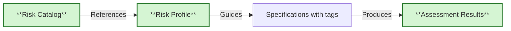

# Risk Controls and Compliance Traceability

> **Risk-based control management with automated evidence collection**

## What Are Risk Controls?

Risk controls are **security and compliance requirements** that mitigate identified risks. This system uses two complementary tagging approaches:

- **`@risk:<risk-id>`** - Project-specific or domain risks identified in risk assessments
- **`@control:<control-id>`** - Standardized compliance controls from catalogs (NIST 800-53, ISO 27001, etc.)

They answer:

- **What could go wrong?** (Risk - tracked with `@risk:<risk-id>`)
- **What must we do to prevent it?** (Control - tracked with `@control:<id>`)
- **How do we prove it works?** (Evidence - test scenarios with tags)

**Traditional Approach**:

- Risk assessment → Spreadsheet → Manual verification → Periodic audits
- Artifacts in separate systems, evidence gathered retroactively
- Difficult to maintain traceability

**Risk-based Approach**:

- Risk assessment → Risk profile → BDD specifications → Automated testing
- All in version control, traceability in real-time
- Automated evidence collection for compliance audits

**Benefits**:

- Machine-readable control definitions (JSON)
- Explicit traceability via `@control:` tags
- Automated evidence linking test results to controls
- Version controlled and audit-ready

---

## Tag System Overview

### `@risk:<risk-id>` - Domain Risk Tracking

**Purpose**: Link scenarios to project-specific or domain risks from your risk assessments

**Format**: `@risk:<risk-id>` where risk-id is kebab-case identifier

**Examples**: `@risk:data-loss`, `@risk:unauthorized-access`, `@risk:regulatory-non-compliance`

**When to use**:
- Tracking risks identified in your project's risk assessment
- Domain-specific risks not covered by standard catalogs
- Project-level hazards or concerns
- Business continuity risks

**Example**:

```gherkin
@ov @risk:data-loss
Scenario: System prevents data loss during network interruption
  Given I am uploading a large file
  When the network connection is interrupted
  Then the upload should be paused
  And I can resume when connection is restored
```

### `@control:<control-id>` - OSCAL Compliance Controls

**Purpose**: Link scenarios to standardized compliance controls from catalogs (NIST 800-53, ISO 27001, custom)

**Format**: `@control:<family>-<number>` or `@control:<family>-<number>(<enhancement>)`

**Examples**: `@control:ac-2`, `@control:ia-5(1)`, `@control:cis-5.1`

**When to use**:
- Compliance requirements (FedRAMP, HIPAA, ISO 27001, etc.)
- Security control frameworks (NIST, CIS, CSA)
- Regulatory mandates requiring specific controls
- Audit and assessment requirements

**Example**:

```gherkin
@ov @control:ac-2
Scenario: Account creation requires approval
  Given a user registration request
  When an administrator reviews the request
  Then the account should require approval
  And the approval should be logged
```

### Using Both Together

Many scenarios will need both tags - a risk AND the control that mitigates it:

```gherkin
@ov @risk:unauthorized-access @control:ac-2 @control:ia-5
Scenario: Authentication prevents unauthorized access
  Given I am not authenticated
  When I attempt to access protected resources
  Then access should be denied
  And I should be redirected to login
```

**Relationship**:
- Risk Assessment identifies `@risk:unauthorized-access`
- Control catalog specifies `@control:ac-2` (Account Management) and `@control:ia-5` (Authentication)
- Test scenario verifies both the risk is mitigated AND controls are satisfied

---

## Architecture

### What is OSCAL?

[OSCAL (Open Security Controls Assessment Language)](https://pages.nist.gov/OSCAL/) is a standardized, machine-readable framework developed by NIST for representing security controls, profiles, implementations, and assessment results.

**Why OSCAL?**

Traditional security control management relies on documents (PDFs, spreadsheets, Word files) that are:

- Difficult to automate and integrate with development workflows
- Prone to inconsistency across systems and organizations
- Hard to maintain traceability between controls, implementations, and evidence
- Time-consuming for compliance audits

**OSCAL solves this by providing**:

- **Standardized formats**: JSON, XML, and YAML schemas for all security artifacts
- **Machine-readable**: Enables automated validation, evidence collection, and reporting
- **Interoperable**: Common language across tools, organizations, and frameworks
- **Version controlled**: Security artifacts can live alongside code in git
- **Traceable**: Explicit links between controls, implementations, and test evidence

**OSCAL Versions**: The framework is actively maintained by NIST. This project uses **OSCAL 1.1.2** for profiles and **OSCAL 1.1.3** for catalogs and assessment results. Always check schema compatibility when working with OSCAL documents.

### Three Core Documents



### Risk Catalog (Templates)

**What**: Library of standard control definitions that you define for your company (e.g., NIST 800-53, ISO 27001)

**Location**: `templates/specs/risk-catalog/controls.catalog.json`

**Purpose**: Provides standardized control definitions that can be referenced

**Example Controls**:

- `ac-2`: Account Management
- `au-3`: Audit Record Content
- `ia-5(1)`: Password-Based Authentication

**You don't modify the catalog** - it's the reference standard.

### Profile (Your Selection)

**What**: Defines which controls apply to YOUR specific system/module

**Location**: `specs/.risk-controls/<module>.profile.json`

**Purpose**: Selects relevant controls from the catalog for your solution

**Create with**:

```bash
create risk-profile assessment.md
```

**Example** (`specs/.risk-controls/auth-service.profile.json`):

```json
{
  "profile": {
    "uuid": "...",
    "metadata": { "title": "Authentication Service Controls" },
    "imports": [{
      "href": "../../../templates/specs/risk-catalog/controls.catalog.json",
      "include-controls": [{
        "with-ids": ["ac-2", "ac-3", "au-2", "ia-5", "ia-5(1)"]
      }]
    }]
  }
}
```

### BDD Specifications (Your Implementation)

**What**: Executable scenarios tagged with control IDs

**Location**: `specs/<module>/**/*.feature`

**Purpose**: Test scenarios that verify control satisfaction

**Tag Format**:

- `@control:ac-2` - Single control
- `@control:ia-5(1)` - Control with enhancement
- `@controls:ac-2,au-3` - Multiple controls

**Example** (`specs/auth-service/login.feature`):

```gherkin
@control:ac-2 @control:ia-5(1)
Scenario: User authenticates with password
  Given a registered user account
  When the user provides valid credentials
  Then access should be granted
  And the login event should be logged

@controls:au-2,au-3
Scenario: Login attempts are audited
  Given audit logging is enabled
  When a login attempt occurs
  Then an audit record must be created
  And the record must include timestamp, user ID, and result
```

### Assessment Results (Automated Evidence)

**What**: OSCAL document linking controls to test evidence

**Location**: `out/risk/<module>/assessment-results.json`

**Generated by**:

```bash
create risk-assess --profile specs/.risk-controls/risk-profile.json
```

**Contains**:

- **Observations**: Test results, security scans, timestamps
- **Findings**: Per-control satisfied/not-satisfied status
- **Evidence Links**: Traces controls → scenarios → test results

---

## Tag Format Reference

### Risk Tag Format

**Single Risk**:

```gherkin
@risk:data-loss
Scenario: Prevent data loss during failure
  # Mitigates identified data loss risk
```

**Multiple Risks** (if needed):

```gherkin
@risk:data-loss @risk:service-disruption
Scenario: Graceful degradation during outage
  # Mitigates both data loss and service disruption risks
```

### Control Tag Format

**Single Control**:

```gherkin
@control:ac-2
Scenario: Account management
  # Tests control AC-2 (Account Management)
```

**Control with Enhancement**:

```gherkin
@control:ia-5(1)
Scenario: Password-based authentication
  # Tests control IA-5(1) (Password-Based Authentication)
```

**Multiple Controls**:

```gherkin
@controls:ac-2,au-3
Scenario: Audited account creation
  # Tests both AC-2 (Account Management) and AU-3 (Audit Record Content)
```

### Combined Risk and Control Tags

```gherkin
@ov @risk:account-hijacking @control:ia-2(1) @control:ia-5
Scenario: Multi-factor authentication prevents account hijacking
  Given I am logging in with valid credentials
  When MFA is required
  Then I must provide a second factor
  And only then should access be granted
```

### Format Rules

**Risk Tags**:
- **Pattern**: `@risk:<risk-id>`
- **Format**: Kebab-case identifier (e.g., `data-loss`, `unauthorized-access`)
- **Multiple**: Apply separate `@risk:` tags for each risk

**Control Tags**:
- **Pattern**: `@control:<family>-<number>` or `@control:<family>-<number>(<enhancement>)`
- **Family**: 2-4 lowercase letters (e.g., `ac`, `au`, `ia`, `sc`, `cis`)
- **Number**: 1+ digits (e.g., `2`, `12`)
- **Enhancement**: Optional number in parentheses (e.g., `(1)`, `(10)`)
- **Multiple**: Use `@controls:` with comma-separated IDs (no spaces)

### Validation

Ensure tags reference valid controls:

```bash
validate control-tags
# Checks all @control: tags against OSCAL catalog
# Reports: Invalid control IDs with file locations
```

---

## OSCAL Schema Validation

All OSCAL documents must conform to official NIST schemas. Validation ensures your control definitions, profiles, and assessment results are properly structured and interoperable.

```bash
validate risk-catalog
# Validates: templates/specs/risk-catalog/*.catalog.json
# Against: OSCAL 1.1.3 catalog schema
```

**Validate Control Profile**:

```bash
validate risk-profile
# Validates: specs/.risk-controls/*.profile.json
# Against: OSCAL 1.1.2 profile schema
```

**Validate Assessment Results** (automatic during generation):

```bash
create risk-assess --profile specs/.risk-controls/mymodule.profile.json
# Generates and validates: out/risk/<module>/assessment-results.json
# Against: OSCAL 1.1.3 assessment-results schema
```

### Schema References

**Official OSCAL Documentation**:

- [OSCAL Schema Reference](https://pages.nist.gov/OSCAL/resources/concepts/layer/) - Overview of all OSCAL layers
- [Catalog Layer](https://pages.nist.gov/OSCAL/concepts/layer/control/catalog/) - Control catalog structure
- [Profile Layer](https://pages.nist.gov/OSCAL/concepts/layer/control/profile/) - Profile selection mechanism
- [Assessment Layer](https://pages.nist.gov/OSCAL/concepts/layer/assessment/) - Assessment results format

**All OSCAL Schemas**:

- [OSCAL Complete Schema Repository](https://github.com/usnistgov/OSCAL/tree/main/json/schema) - All JSON schemas by version

**Validation Tools**:

- [OSCAL-CLI](https://github.com/usnistgov/oscal-cli) - Official NIST validation tool
- [JSON Schema Validator](https://www.jsonschemavalidator.net/) - Online validation (paste schema + document)

---

## When You Need Risk Controls

### Regulated Industries

Risk controls are essential for:

- **Healthcare**: HIPAA, FDA 21 CFR Part 11, ISO 13485, IEC 62304
- **Financial Services**: SOX, PCI-DSS, GLBA
- **Government**: FedRAMP, FISMA, StateRAMP
- **Cloud Services**: CSA CCM, ISO 27017/27018
- **AI/ML Systems**: EU AI Act, NIST AI RMF
- **Privacy**: GDPR, CCPA, LGPD

### Risk-Based Development

Even outside regulated domains, use controls for:

- High consequence of failure (safety-critical, financial, reputation)
- Security requirements (authentication, encryption, access control)
- Compliance obligations (SOC 2, ISO 27001, contractual SLAs)
- Audit requirements (internal, external, certification)

### When You Don't Need Them

Skip for:

- Low-risk internal tools
- Prototypes and experiments
- Simple utilities
- Personal/side projects without regulatory obligations

---

## See Also

- [Working with Specifications](working-with-specifications.md) - Writing executable specs
- [Three-Layer Approach](three-layer-approach.md) - Integrating controls into workflow
- [Review and Iterate](review-and-iterate.md) - Specification maintenance
- [Tag Reference](tag-reference.md) - Complete tag documentation
- [OSCAL Documentation](https://pages.nist.gov/OSCAL/) - Official OSCAL standard
- [NIST 800-53](https://csrc.nist.gov/pubs/sp/800/53/r5/upd1/final) - Security control catalog
