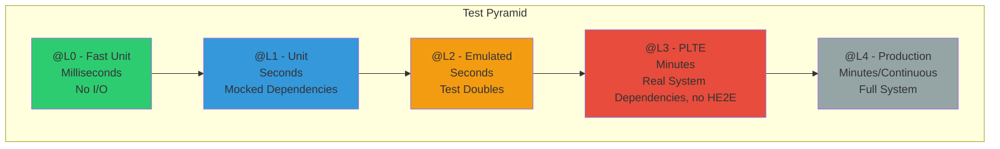
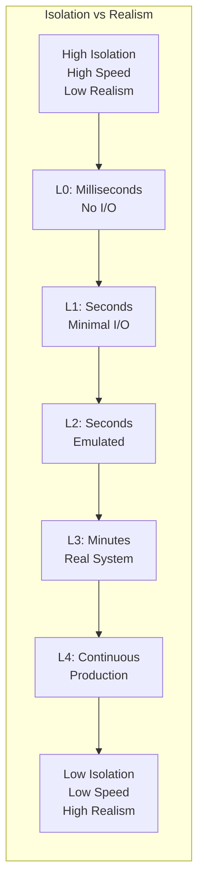

# Test Levels

> **Execution environments and test scope (L0-L4)**

Test level tags define the execution environment and scope based on the [Testing Taxonomy](../../continuous-delivery/testing/index.md).

---

## Test Pyramid

Test levels form a pyramid with fast, isolated tests at the bottom and slower, integrated tests at the top:



**Principle**: More tests at lower levels (fast, isolated) and fewer at higher levels (slow, integrated).

---

## Test Isolation Characteristics

Each level trades off between speed/determinism and realism:



| Level  | Speed      | Determinism | Domain Coherency | Use When                                                  |
| ------ | ---------- | ----------- | ---------------- | --------------------------------------------------------- |
| **L0** | Fastest    | Highest     | Lowest           | Algorithm testing (OV)                                    |
| **L1** | Fast       | High        | Low              | Business logic (OV)                                       |
| **L2** | Moderate   | High        | High             | Integration testing (emulated IV and OV)                  |
| **L3** | Slow       | Medium      | Highest          | Deployment and Post-Deployment validation (IV, OV and PV) |
| **L4** | Continuous | Low         | Highest          | Smoke tests (PV)                                          |

---

## `@L0` - Fast Unit Tests

- **Execution**: Devbox or agent
- **Scope**: Source and binary
- **Dependencies**: None; all collaborators mocked or stubbed in-memory
- **Speed**: Milliseconds
- **Usage**: Go tests with `//go:build L0` build tag, Godog features with `@L0` tag
- **Trade-off**: Highest determinism, lowest domain coherency

**Example**:

```go
//go:build L0
// +build L0

package mypackage_test

func TestValidateEmail(t *testing.T) {
    // Very fast unit test
}
```

---

## `@L1` - Unit Tests

- **Execution**: Devbox or agent
- **Scope**: Source and binary
- **Dependencies**: All collaborators mocked or stubbed in-memory. Temp disk I/O allowed, no network access
- **Speed**: Seconds
- **Usage**: Go tests (default, no build tag needed), Godog features with `@L1` tag
- **Trade-off**: Highest determinism, lowest domain coherency

**Example**:

```go
package mypackage_test

func TestUserService_CreateUser(t *testing.T) {
    // Unit test with mocked dependencies
}
```

---

## `@L2` - Emulated System Tests

- **Execution**: Devbox or agent
- **Scope**: Deployable artifacts
- **Dependencies**: Everything runs locally via emulation or containers; no deployed services required
- **Speed**: Seconds
- **Usage**: Go tests with `//go:build L2` build tag, Godog features (default if no level tag specified)
- **Trade-off**: High determinism; high domain coherency, but emulated

**Tooling categories**:

_Hosting_ — orchestration layer that runs the test environment locally:

| Tool               | Purpose                                       |
| ------------------ | --------------------------------------------- |
| **Docker Compose** | **Multi-container orchestration (preferred)** |
| Kind               | Kubernetes-in-Docker for K8s-native testing   |
| Minikube           | Local K8s cluster with VM or container driver |
| Podman Compose     | Rootless container orchestration              |

_Runners_ — tools that drive test execution:

| Tool           | Purpose                                                              |
| -------------- | -------------------------------------------------------------------- |
| **Playwright** | **Cross-browser automation (Chromium, Firefox, WebKit) (preferred)** |
| Puppeteer      | Chrome/Chromium via DevTools Protocol                                |
| Selenium       | Cross-browser automation via WebDriver                               |
| Cypress        | JavaScript-native E2E testing                                        |

_Emulators_ — services that emulate production infrastructure:

| Category  | Tools                         | Examples                         |
| --------- | ----------------------------- | -------------------------------- |
| Databases | Testcontainers, embedded DBs  | Postgres, Redis, MongoDB, SQLite |
| Cloud     | LocalStack, Azurite, fake-gcs | AWS, Azure Storage, GCP Storage  |
| Messaging | Testcontainers                | Kafka, RabbitMQ, NATS            |
| APIs      | WireMock, MockServer          | Mock external HTTP dependencies  |

**Example**:

```gherkin
@L2 @deps:docker @ov
Feature: Container Integration Tests
  Tests requiring Docker for artifact validation
```

---

## `@L3` - In-Situ Vertical Tests

- **Execution**: PLTE (Production-Like Test Environment)
- **Scope**: Deployed system (single deployable module boundaries)
- **Dependencies**: Real deployed services within module boundary; external services (outside boundary) mocked at network level
- **Speed**: Minutes
- **Usage**: Go tests with `//go:build L3` build tag, Godog features with `@L3` tag (automatically inferred from `@iv` or `@pv`)
- **Trade-off**: Moderate determinism, high domain coherency

**Key difference from L2**: The system under test is deployed to real infrastructure, not running locally. All dependencies must be network-accessible from PLTE.

**Tooling categories**:

_Hosting_ — where the system under test runs (any deployment target):

| Category     | Azure           | AWS               | GCP              |
| ------------ | --------------- | ----------------- | ---------------- |
| Containers   | ACI             | ECS/Fargate       | Cloud Run        |
| Kubernetes   | AKS             | EKS               | GKE              |
| Web Apps     | App Service     | Elastic Beanstalk | App Engine       |
| Static Sites | Static Web Apps | Amplify           | Firebase Hosting |
| Functions    | Azure Functions | Lambda            | Cloud Functions  |

_Runners_ — same tools as L2, but targeting deployed URLs:

| Tool           | Purpose                                            |
| -------------- | -------------------------------------------------- |
| **Playwright** | **Cross-browser against deployed URL (preferred)** |
| Puppeteer      | Chrome against deployed URL                        |
| Selenium       | Cross-browser against deployed URL                 |
| Cypress        | E2E against deployed URL                           |

_Dependencies_ — network-accessible from PLTE; two approaches (can mix):

**Full PaaS** — real managed services (production-like behavior):

| Category  | Azure       | AWS         | GCP         |
| --------- | ----------- | ----------- | ----------- |
| SQL       | Azure SQL   | RDS         | Cloud SQL   |
| NoSQL     | Cosmos DB   | DynamoDB    | Firestore   |
| Cache     | Azure Cache | ElastiCache | Memorystore |
| Messaging | Service Bus | SQS/SNS     | Pub/Sub     |

**Deployed Test Doubles** — emulators running as containers in PLTE:

| Service        | Emulator            | Why emulate                          |
| -------------- | ------------------- | ------------------------------------ |
| RabbitMQ       | RabbitMQ container  | Cost, isolation, reset between tests |
| MSMQ           | MSMQ emulator       | Legacy, not available as PaaS        |
| External APIs  | WireMock/MockServer | Control responses, simulate failures |
| Legacy systems | Custom test doubles | Not accessible from PLTE network     |

> **Choosing PaaS vs Test Double**: Use full PaaS when you need production-like behavior validation. Use deployed test doubles when you need test isolation, cost control, or the real service isn't available as PaaS.

**Example**:

```gherkin
@L3 @iv
Feature: API Service Deployment Verification
  Validates deployment in PLTE with test doubles
```

---

## Horizontal End-to-End Testing (HE2E)

> **Not a test level** — HE2E is a specialized integration environment, not part of the L0-L4 automated testing pyramid.

- **Execution**: Shared integration environment (SIT/UAT)
- **Scope**: Cross-team system integration — your module connected to running versions of other teams' software
- **Dependencies**: Real external systems owned by other teams (not test doubles)
- **Delays**: Hours to days (coordination overhead, team to team queues)
- **Stages**: Only stages 6 (Extended Testing) and 7 (Explorative Testing)
- **Automation**: **Not automated** — human supervision required

**Why HE2E enforces release trains**:

When testing against other teams' real systems, continuous delivery breaks down:

| Challenge                | Impact                                                   |
| ------------------------ | -------------------------------------------------------- |
| Version coordination     | All teams must deploy compatible versions simultaneously |
| Environment availability | Shared environment has limited capacity and scheduling   |
| Data dependencies        | Test data must be coordinated across systems             |
| Failure isolation        | One team's broken deployment blocks all teams            |

This fundamentally requires **release train coordination** rather than independent continuous delivery.

**Automatically assisted manual tests** (Stage 6):

HE2E environments can leverage automation tools under human supervision:

| Tool                 | Usage                                         |
| -------------------- | --------------------------------------------- |
| Playwright/Selenium  | Human triggers test scripts, observes results |
| Postman/Newman       | Manual API exploration with saved collections |
| Test data generators | Human-initiated data setup across systems     |
| Recording tools      | Capture manual test sessions for evidence     |

The automation assists the human tester but doesn't run unattended.

**When to use HE2E**:

| Use case                | Example                             |
| ----------------------- | ----------------------------------- |
| Regulatory compliance   | Bank-to-bank transfer testing       |
| Partner integration     | Third-party API contract validation |
| Legacy system migration | Mainframe-to-cloud cutover testing  |
| Multi-vendor systems    | ERP + CRM + custom app integration  |

**When NOT to use HE2E**:

- Routine regression testing (use L2/L3 with test doubles)
- Continuous delivery pipelines (use L3 PLTE)
- Automated CI/CD gates (HE2E is too slow and fragile)

**Shift-left: From HE2E to Contract Testing**:

Most HE2E scenarios can be shifted left into automated contract testing at L2/L3, restoring continuous delivery:

| HE2E problem              | Contract testing solution                              |
| ------------------------- | ------------------------------------------------------ |
| Need real external system | Verify against contract, not implementation            |
| Coordination overhead     | Each team tests independently against shared contracts |
| Slow feedback             | Contracts verified in seconds at build time            |
| Environment contention    | No shared environment needed                           |

_Contract testing tools_:

| Tool                  | Approach                                  | Language support |
| --------------------- | ----------------------------------------- | ---------------- |
| **Pact**              | **Consumer-driven contracts (preferred)** | Multi-language   |
| Spring Cloud Contract | Provider-driven contracts                 | JVM              |
| Specmatic             | OpenAPI-based contracts                   | Multi-language   |
| Dredd                 | API Blueprint validation                  | Multi-language   |

_How it works_:

```text
┌─────────────┐         ┌──────────────┐         ┌─────────────┐
│  Consumer   │ ──────▶ │   Contract  │ ◀────── │  Provider   │
│  (your app) │ defines │   (Pact/OAS) │ verifies│  (external) │
└─────────────┘         └──────────────┘         └─────────────┘
      │                        │                        │
      ▼                        ▼                        ▼
   L2 test               Broker/repo              L2 test
   (mock provider)       (shared truth)        (replay consumer)
```

**Shift-right: From HE2E to Production Testing (L4)**:

What contracts can't cover should shift RIGHT into L4, not stay in HE2E:

| Concern                     | Why not HE2E                        | L4 solution                           |
| --------------------------- | ----------------------------------- | ------------------------------------- |
| Behavior edge cases         | Synthetic environment ≠ real usage  | Observe real traffic patterns         |
| Performance under real load | HE2E can't simulate production load | Production metrics + synthetic probes |
| Security boundaries         | Test IdP ≠ production IdP           | Canary with real auth flows           |
| Regulatory evidence         | Auditors want production proof      | Production audit logs + observability |

> **Goal**: Eliminate HE2E entirely. Shift LEFT to contract testing (L2/L3) for integration guarantees. Shift RIGHT to L4 for real-world validation. HE2E is a coordination tax—avoid it.

---

## `@L4` - Testing in Production

- **Execution**: Production
- **Scope**: Deployed system (cross-service interactions)
- **Dependencies**: All production, may use live test doubles
- **Speed**: Continuous
- **Usage**: Go tests with `//go:build L4` build tag, Godog features with `@L4` tag (automatically inferred from `@piv` or `@ppv`)
- **Trade-off**: High determinism, highest domain coherency

**Example**:

```gherkin
@L4 @piv
Feature: Production Smoke Tests
  Validates production deployment post-release
```

---

## Inference Rules

### Go Tests

- No build tag → `@L1`
- `//go:build L0` → `@L0`
- `//go:build L2` → `@L2`
- `//go:build L3` → `@L3`
- `//go:build L4` → `@L4`

### Godog Features

- No level tag → `@L2`
- Explicit `@L0`, `@L1`, `@L2`, `@L3`, or `@L4` → corresponding level
- Features with `@iv` or `@pv` → `@L3` (if no explicit level tag)
- Features with `@piv` or `@ppv` → `@L4` (if no explicit level tag)

---

## Test Level Selection Guide

### L0 - Choose When

- Testing pure functions with no side effects
- No I/O operations (filesystem, network, database)
- Microsecond-level execution speed required
- Maximum parallelization needed

### L1 - Choose When

- Unit testing with minimal mocks
- Using temp directories or simple file I/O
- Fast feedback loop needed (pre-commit)
- Testing individual components in isolation

### L2 - Choose When

- Testing with emulated dependencies (test containers, mocked APIs)
- Integration testing without real infrastructure
- Need deterministic, repeatable results
- CI/CD pipeline validation

### L3 - Choose When

- Deployment verification in PLTE
- Installation validation (`@iv`)
- Performance testing in production-like environment (`@pv`)
- End-to-end testing with real infrastructure (test environment)

### L4 - Choose When

- Production smoke tests (`@piv`)
- Continuous production monitoring (`@ppv`)
- Post-deployment validation
- Read-only production verification

---

## Related Documentation

- [Verification Tags](./verification-tags.md) - Types of validation (@ov, @iv, @pv, etc.)
- [Test Suites](./test-suites.md) - How test levels map to test suites
- [Go Implementation](../implementation/go/test-levels.md) - Build tags in Go
