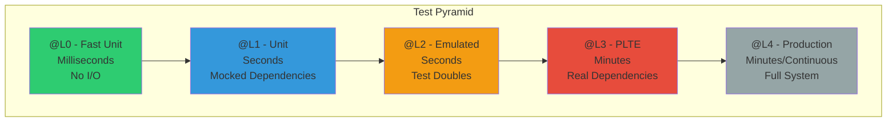
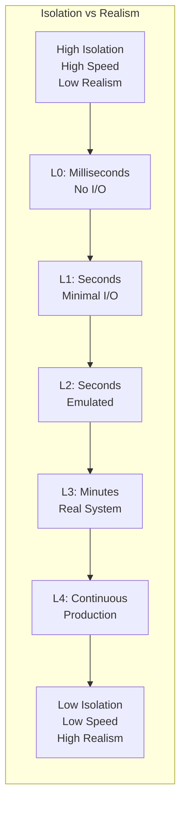

# Test Levels
>
> **Execution environments and test scope (L0-L4)**

Test level tags define the execution environment and scope based on the [Testing Taxonomy](../../continuous-delivery/testing/index.md).

---

## Test Pyramid

Test levels form a pyramid with fast, isolated tests at the bottom and slower, integrated tests at the top:



**Principle**: More tests at lower levels (fast, isolated) and fewer at higher levels (slow, integrated).

---

## Test Isolation Characteristics

Each level trades off between speed/determinism and realism:



| Level | Speed | Determinism | Domain Coherency | Use When |
|-------|-------|-------------|------------------|----------|
| **L0** | Fastest | Highest | Lowest | Algorithm testing |
| **L1** | Fast | High | Low | Business logic |
| **L2** | Moderate | High | High | Integration testing |
| **L3** | Slow | Medium | Highest | Deployment validation |
| **L4** | Continuous | Low | Highest | Smoke tests |

---

## `@L0` - Fast Unit Tests

- **Execution**: Devbox or agent
- **Scope**: Source and binary
- **Dependencies**: All replaced with test doubles
- **Speed**: Milliseconds
- **Usage**: Go tests with `//go:build L0` build tag, Godog features with `@L0` tag
- **Trade-off**: Highest determinism, lowest domain coherency

**Example**:

```go
//go:build L0
// +build L0

package mypackage_test

func TestValidateEmail(t *testing.T) {
    // Very fast unit test
}
```

---

## `@L1` - Unit Tests

- **Execution**: Devbox or agent
- **Scope**: Source and binary
- **Dependencies**: All replaced with test doubles
- **Speed**: Seconds
- **Usage**: Go tests (default, no build tag needed), Godog features with `@L1` tag
- **Trade-off**: Highest determinism, lowest domain coherency

**Example**:

```go
package mypackage_test

func TestUserService_CreateUser(t *testing.T) {
    // Unit test with mocked dependencies
}
```

---

## `@L2` - Emulated System Tests

- **Execution**: Devbox or agent
- **Scope**: Deployable artifacts
- **Dependencies**: All replaced with test doubles
- **Speed**: Seconds
- **Usage**: Go tests with `//go:build L2` build tag, Godog features (default if no level tag specified)
- **Trade-off**: High determinism, high domain coherency

**Example**:

```gherkin
@L2 @deps:docker @ov
Feature: Container Integration Tests
  Tests requiring Docker for artifact validation
```

---

## `@L3` - In-Situ Vertical Tests

- **Execution**: PLTE (Production-Like Test Environment)
- **Scope**: Deployed system (single deployable module boundaries)
- **Dependencies**: All replaced with test doubles
- **Speed**: Minutes
- **Usage**: Go tests with `//go:build L3` build tag, Godog features with `@L3` tag (automatically inferred from `@iv` or `@pv`)
- **Trade-off**: Moderate determinism, high domain coherency

**Example**:

```gherkin
@L3 @iv
Feature: API Service Deployment Verification
  Validates deployment in PLTE with test doubles
```

---

## `@L4` - Testing in Production

- **Execution**: Production
- **Scope**: Deployed system (cross-service interactions)
- **Dependencies**: All production, may use live test doubles
- **Speed**: Continuous
- **Usage**: Go tests with `//go:build L4` build tag, Godog features with `@L4` tag (automatically inferred from `@piv` or `@ppv`)
- **Trade-off**: High determinism, highest domain coherency

**Example**:

```gherkin
@L4 @piv
Feature: Production Smoke Tests
  Validates production deployment post-release
```

---

## Inference Rules

### Go Tests

- No build tag → `@L1`
- `//go:build L0` → `@L0`
- `//go:build L2` → `@L2`
- `//go:build L3` → `@L3`
- `//go:build L4` → `@L4`

### Godog Features

- No level tag → `@L2`
- Explicit `@L0`, `@L1`, `@L2`, `@L3`, or `@L4` → corresponding level
- Features with `@iv` or `@pv` → `@L3` (if no explicit level tag)
- Features with `@piv` or `@ppv` → `@L4` (if no explicit level tag)

---

## Test Level Selection Guide

### L0 - Choose When

- Testing pure functions with no side effects
- No I/O operations (filesystem, network, database)
- Microsecond-level execution speed required
- Maximum parallelization needed

### L1 - Choose When

- Unit testing with minimal mocks
- Using temp directories or simple file I/O
- Fast feedback loop needed (pre-commit)
- Testing individual components in isolation

### L2 - Choose When

- Testing with emulated dependencies (test containers, mocked APIs)
- Integration testing without real infrastructure
- Need deterministic, repeatable results
- CI/CD pipeline validation

### L3 - Choose When

- Deployment verification in PLTE
- Installation validation (`@iv`)
- Performance testing in production-like environment (`@pv`)
- End-to-end testing with real infrastructure (test environment)

### L4 - Choose When

- Production smoke tests (`@piv`)
- Continuous production monitoring (`@ppv`)
- Post-deployment validation
- Read-only production verification

---

## Related Documentation

- [Verification Tags](./verification-tags.md) - Types of validation (@ov, @iv, @pv, etc.)
- [Test Suites](./test-suites.md) - How test levels map to test suites
- [Go Implementation](../implementation/go/test-levels.md) - Build tags in Go
