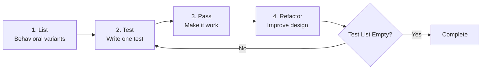
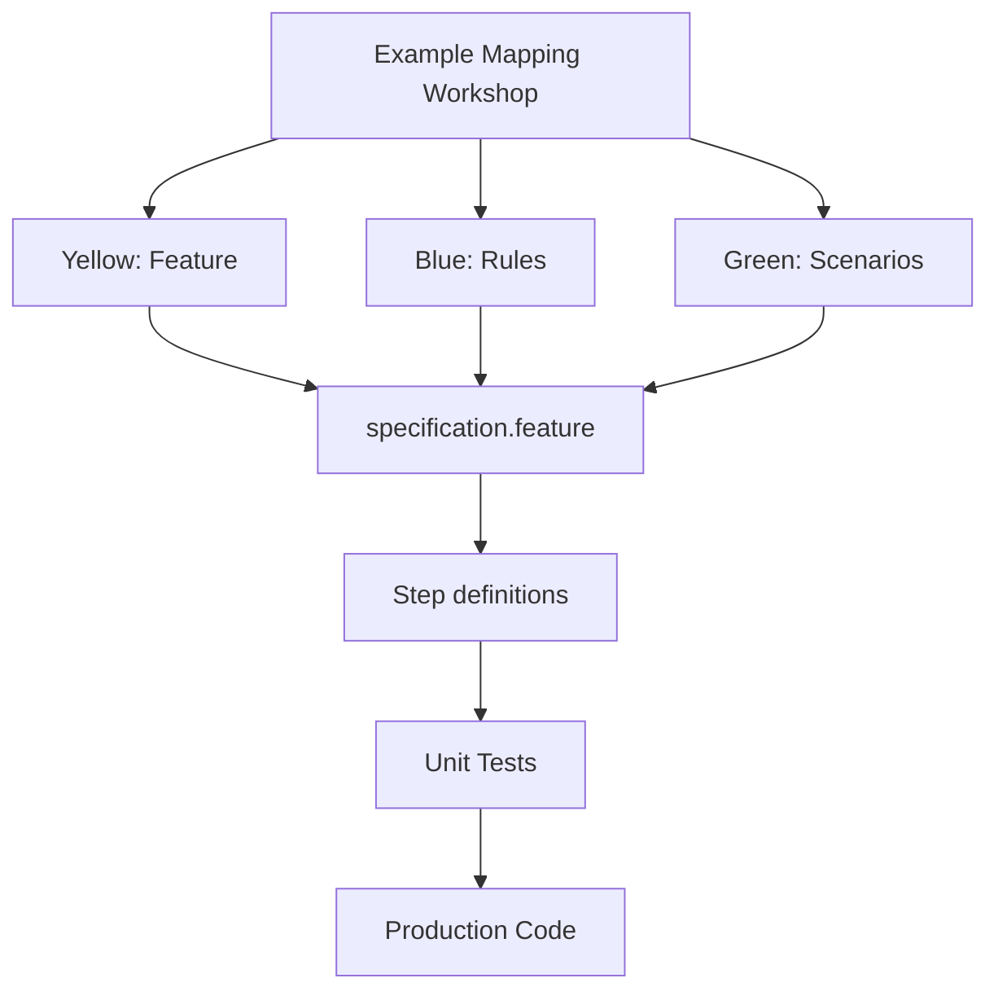
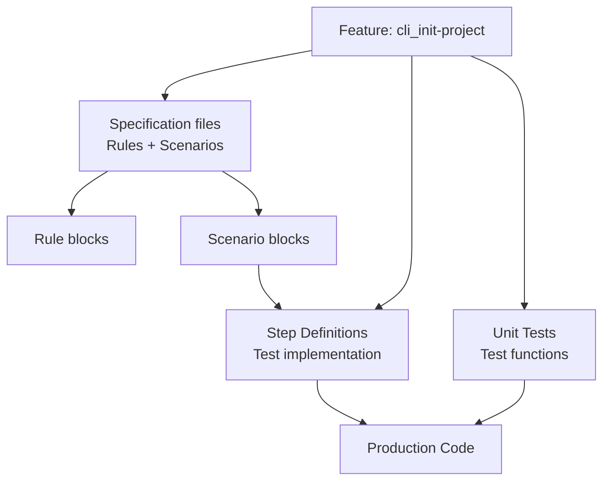
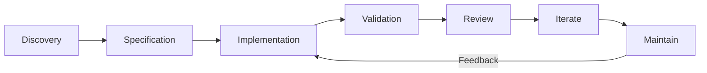
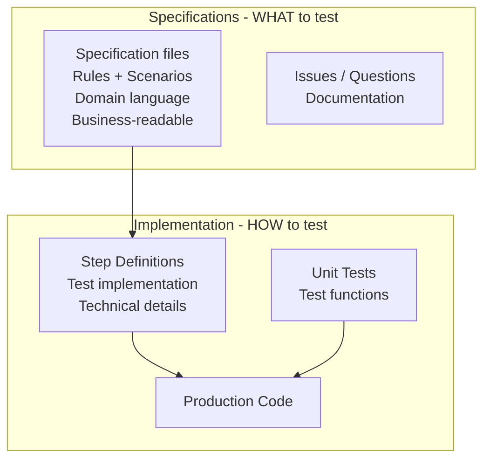

# Three-Layer Testing Approach

How Rules, Scenarios, and unit tests work together to deliver quality software.

---

## Overview

This project uses **three complementary testing methodologies**:

- **Rules** - Business Acceptance Criteria, policies, process rules
- **Scenarios** - Exemplify and shape how rules are applied, creates the acceptance tests
- **Unit tests** Low level component, function, class, behaviour

Each layer serves a distinct purpose, uses different tools, and addresses different stakeholders' needs.

---

## The Three Layers

| Layer           | Question | Stakeholders | Format | Representation | Location |
|-----------------|----------|--------------|--------|----------------|----------|
| **Rules**       | "What business value?" | Product Owner, Business | Gherkin | `Rule:` blocks | Specifications |
| **Scenarios**   | "How does user interact?" | QA, Developers, Product | Gherkin | `Scenario:` under Rules | Specifications + Test implementations |
| **Unit tests** | "Does code work?" | Developers | Test framework | Test functions | Test files |

> **This project**: Uses Godog for Gherkin scenarios and Go test framework for unit tests. See [Go Implementation Guide](../../reference/specifications/go-implementation-guide.md) for language-specific details.

### Layer 1: Rules (Acceptance Criteria)

**Purpose**: Define business requirements before development

**Format**: `Rule:` blocks in Gherkin

```gherkin
@cli @critical
Feature: cli_init-project

  As a developer
  I want to initialize a CLI project
  So that I can quickly start development

  Rule: Creates project directory structure

  Rule: Generates valid configuration file

  Rule: Command completes in under 2 seconds
```

**Origin**: <svg width="24" height="24" xmlns="http://www.w3.org/2000/svg"><rect width="24" height="24" rx="2" fill="#5BA3F7" stroke="#4A89D6"/></svg> Blue cards from Example Mapping
**Location**: `specs/<module>/<feature>/specification.feature`

### Layer 2: Scenarios

**Purpose**: Specify observable behavior through concrete examples

**Format**: `Scenario:` blocks nested under `Rule:` blocks

```gherkin
Rule: Creates project directory structure

  @ov
  Scenario: Initialize in empty directory
    Given I am in an empty folder
    When I run "r2r init"
    Then a file named "r2r.yaml" should be created
    And a directory named "src/" should exist

  @ov
  Scenario: Initialize in existing project
    Given I am in a directory with "r2r.yaml"
    When I run "r2r init"
    Then the command should fail
    And stderr should contain "already initialized"
```

**Origin**: <svg width="24" height="24" xmlns="http://www.w3.org/2000/svg"><rect width="24" height="24" rx="2" fill="#7EDC7A" stroke="#68B666"/></svg> Green cards from Example Mapping
**Specification**: Written in specification files
**Implementation**: Test implementation files (step definitions)

> **This project**: Specifications in `specs/<module>/<feature>/specification.feature`, step definitions in `src/<module>/tests/steps_test.go`. See [Implementation Guide](../../reference/specifications/go-implementation-guide.md).

### Layer 3: Unit Tests

**Purpose**: Ensure code correctness through systematic test-first development

**Format**: Unit test functions in test files

**Tool**: Test framework (language-specific)

> **This project**: Uses Go test framework with `*_test.go` files. See [Implementation Guide](../../reference/specifications/go-implementation-guide.md).

#### Canon TDD Workflow

Kent Beck's **Canon TDD** provides a specific five-step workflow for test-driven development:


*We often discover new tests while we implement a test, add them to the test list.*

*Based on [Canon TDD by Kent Beck](https://tidyfirst.substack.com/p/canon-tdd), flowchart concept by Vic Wu*

**The Five Steps**:

1. **List** - Behavioral analysis: Identify all expected behavioral variants and edge cases through systematic analysis
2. **Test** - Write one automated test with setup, invocation, and assertions (Red)
3. **Pass** - Modify code to make the test pass without shortcuts (Green)
4. **Refactor** - Optionally improve implementation design after test passes
5. **Repeat** - Continue until the test list is empty

**Key Principle**: Red focuses on **interface design** (how behavior is invoked), from the caller. Green focuses on **implementation design** (internal mechanics). Refactoring focuses on finding a design that allows us to continue.

**Red-Green-Refactor Cycle**:

- 🔴 **Red**: Write failing test (from list)
- 🟢 **Green**: Implement minimum code to pass
- 🔵 **Refactor**: Improve design if needed
- 🔁 **Repeat**: Next test from list

**Example** (conceptual):

Feature: cli_init-project

**Step 1: List behavioral variants**
- Create config in empty directory (success)
- Create config with custom path (success)
- Create config when file exists (error)
- Create config in read-only directory (error)

**Steps 2-5: For each variant**
1. **Write test** - Create test that calls the function and asserts expected outcome
   - Arrange: Set up test conditions (empty directory, existing file, etc.)
   - Act: Invoke the function being tested
   - Assert: Verify the expected result or error
2. **Pass** - Implement minimum code to make the test pass
3. **Refactor** - Improve design if needed (optional)
4. **Repeat** - Move to next behavioral variant from the list

**Test structure** (pseudocode):
```
Test_CreateConfig_InEmptyDirectory_ShouldSucceed:
    Arrange: Create empty temporary directory
    Act: Call CreateConfig(path)
    Assert: No error returned, file exists

Test_CreateConfig_WhenFileExists_ShouldFail:
    Arrange: Create directory with existing config file
    Act: Call CreateConfig(path)
    Assert: Error returned
```

**Location**: Test files in source tree (language-specific conventions)

> **This project**: Unit tests in `src/<module>/*_test.go`. See [Go Implementation Guide](../../reference/specifications/go-implementation-guide.md) for complete code examples.

---

## How Layers Interact

### Discovery to Implementation Flow



### Traceability Chain



> **This project**: Specifications in `specs/cli/init-project/`, step definitions in `src/<module>/tests/steps_test.go`, unit tests in `src/<module>/*_test.go`. See [Implementation Guide](../../reference/specifications/go-implementation-guide.md).

---

## Development Workflow

### Discovery Phase

**Activities**:

1. **Event Storming** → Domain understanding and Ubiquitous Language
2. **Example Mapping** → Feature scenarios using domain vocabulary
3. Write `specification.feature` with Rules and Scenarios

**Outputs**:

- Domain vocabulary documented
- `specs/<module>/<feature>/specification.feature` created
- `specs/<module>/<feature>/issues.md` for red cards

### Implementation Phase

**Red-Green-Refactor**:

1. Write step definitions (test implementation)
2. Write failing unit test (Red)
3. Implement minimum code (Green)
4. Refactor for quality
5. Repeat until scenarios pass

> **This project**: Step definitions in `src/<module>/tests/steps_test.go`. See [Implementation Guide](../../reference/specifications/go-implementation-guide.md).

**Definition of Done**:

- ✅ All scenarios passing
- ✅ Code reviewed and refactored
- ✅ Specs synchronized with implementation
- ✅ Stakeholders validated behavior

### Continuous Improvement



**Review Cadence**:

- **Weekly** during active development - sync specs with code
- **Monthly** during maintenance - prevent drift
- **Quarterly** comprehensive - major refactoring, Event Storming validation
- **Event-driven** when requirements change

**Iteration Activities**:

- Add scenarios for discovered edge cases
- Refine ambiguous steps
- Update Rules based on learnings
- Split large files (>20 scenarios)
- Remove deprecated scenarios
- Align language with Ubiquitous Language

---

## Architecture: Specifications vs Implementation

### Critical Separation: WHAT vs HOW



> **This project**: Specifications in `specs/`, step definitions in `src/<module>/tests/steps_test.go`, unit tests in `src/<module>/*_test.go`, production code in `src/<module>/*.go`. See [Implementation Guide](../../reference/specifications/go-implementation-guide.md).

**Why Separate?**:

- **Clarity**: Specs focus on "what should happen", code focuses on "how"
- **Accessibility**: Business reviews specs without seeing code
- **Flexibility**: Refactor implementation without changing specs (if behavior unchanged)
- **Maintenance**: Specs evolve with business, code evolves with technology

**Example**:

| Specification (WHAT) | Implementation (HOW) |
|---------------------|---------------------|
| `Given I have an account` | `testDB.CreateUser(username, hash)` |
| `When I run "r2r login"` | `exec.Command("r2r", "login").Run()` |
| `Then I should be authenticated` | `os.ReadFile("~/.r2r/session")` |

**Key Insight**: Specification describes user-visible behavior; implementation handles technical details (database, filesystem, process execution).

---

## Practical Example: Evolution

### Week 1 (Initial)

```gherkin
Rule: Valid credentials grant access

  @ov
  Scenario: User logs in
    When I login
    Then I am authenticated
```

### Week 2 (After Implementation)

```gherkin
Rule: Valid credentials grant access

  @ov
  Scenario: User logs in with valid credentials
    Given I have an account with username "admin"
    When I run "r2r login --user admin --password secret"
    Then I should be authenticated
    And my session token should be stored in ~/.r2r/session
    And I should see "Login successful"
```

### Month 1 (After Production)

```gherkin
Rule: Valid credentials grant access within rate limits

  @ov
  Scenario: User logs in with valid credentials
    Given I have an account with username "admin"
    When I run "r2r login --user admin --password secret"
    Then I should be authenticated
    And my session token should be stored in ~/.r2r/session

  @ov
  Scenario: User exceeds login attempt rate limit
    Given I have failed to login 5 times in the last minute
    When I run "r2r login --user admin --password secret"
    Then I should see "Rate limit exceeded. Try again in 60 seconds"
    And I should not be authenticated
```

**Evolution drivers**: Implementation discovery, production usage, security requirements

---

## Tag Usage Across Layers

The three layers use different tag types:

**Rules Layer**:

- Uses **organizational tags** for traceability: `@ac1`, `@ac2` (links scenarios to Rules)

**Scenario Layer**:

- Uses **testing taxonomy tags**: `@ov`, `@iv`, `@pv` (verification) + `@L2`, `@L3`, `@L4` (level)
- See **[Tag Reference](tag-reference.md)** for complete taxonomy

**Unit Test Layer**:

- Uses **test level markers** to categorize tests by isolation and speed
- L0: Isolated, no I/O (fastest)
- L1: Unit tests with minimal dependencies (default)
- L2: Integration tests with emulated dependencies

> **This project**: Uses Go build tags (`//go:build L0`, `//go:build L2`) for test levels. See [Go Implementation Guide](../../reference/specifications/go-implementation-guide.md#test-levels) for details.

**Example**:

```gherkin
Rule: Valid credentials grant access

  @ov
  Scenario: User logs in with valid credentials
```

For complete tag documentation, see:

- **Testing taxonomy tags**: [Tag Reference](tag-reference.md)
- **Organizational tags**: [Gherkin File Organization](gherkin-concepts.md#tag-strategy)

---

## Key Principles

1. **Three layers, one file** - Rules and Scenarios in `specification.feature`, implementations in `src/`
2. **Continuous evolution** - Specs and code evolve together through feedback loops
3. **Ubiquitous Language** - Same terms across business discussions, specs, and code
4. **Traceability** - Feature Name links all artifacts across `specs/` and `src/`
5. **Separation of concerns** - Specs define WHAT, implementations define HOW

**Remember**: The goal is **executable, maintainable specifications** that guide development - not bureaucratic overhead.

---

## Related Documentation

- [Working with specifications](working-with-specifications.md) - Unified approach using Rule blocks
- [Ubiquitous Language](ubiquitous-language.md) - Shared vocabulary foundation
- [Review and Iterate](review-and-iterate.md) - Continuous improvement
- [Event Storming](event-storming.md) - Domain discovery workshops
- [Example Mapping](example-mapping.md) - Requirements discovery
- [Risk Controls](risk-controls.md) - Integrating compliance requirements

## Quick Reference

- [Canon TDD Workflow](../../reference/specifications/canon-tdd-workflow.md) - Kent Beck's TDD steps
- [BDD Development Workflow](../../how-to-guides/eac/specifications/bdd-development-workflow.md) - Development workflow guide
