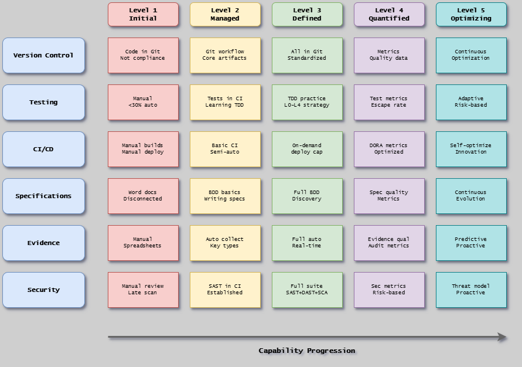

# Capability Metrics Framework

A 5-level framework for measuring Everything-as-Code transformation progress in regulated environments.

## Overview

The Capability Metrics Framework helps organizations understand their current capabilities and chart a clear path forward in their Everything-as-Code transformation. Based on industry-standard maturity models (CMMI, DevOps Maturity Model), it provides concrete capability indicators across six practice areas tailored for treating compliance artifacts as code.

**Key Philosophy**: This framework focuses on **what you can do** (capabilities) rather than **what percentage you've achieved** (arbitrary metrics). Each level represents distinct capabilities that teams can build systematically.

## Why Use This Framework?

**For Teams**:

- Understand current capabilities objectively
- Identify concrete next steps based on capabilities, not percentages
- Track progress over time
- Focus improvement efforts on building real capabilities

**For Leadership**:

- Quantify organizational capability maturity
- Justify transformation investment with clear milestones
- Track ROI and progress
- Enable industry benchmarking

## Framework Structure

{width=800}

*A 5×6 matrix showing five capability levels (Level 1: Initial through Level 5: Optimizing) across six practice areas that form the foundation of Everything-as-Code transformation: Version Control, Testing, CI/CD, Specifications, Evidence, and Security.*

### Five Capability Levels

| Level | Name         | Focus                               |
|-------|--------------|-------------------------------------|
| 1     | Initial      | Ad-hoc, unpredictable processes     |
| 2     | Managed      | Repeatable processes                |
| 3     | Defined      | Standardized, documented processes  |
| 4     | Quantified   | Measured, controlled processes      |
| 5     | Optimizing   | Continuous improvement culture      |

[Learn more about the levels](levels.md)

### Six Practice Areas

1. [Version Control & Artifact Management](practice-areas/version-control.md)
2. [Automated Testing & Validation](practice-areas/testing.md)
3. [Continuous Integration & Delivery](practice-areas/ci-cd.md)
4. [Specifications & Requirements](practice-areas/specifications.md)
5. [Evidence & Traceability](practice-areas/evidence.md)
6. [Security & Risk Management](practice-areas/security.md)

[Learn more about practice areas](practice-areas.md)

---

## Next Steps

1. Review [Capability Levels](levels.md) to understand progression and binary vs gradual philosophy
2. Explore [Practice Areas](practice-areas.md) to see what's measured
3. Start with one practice area to understand the capability approach
4. Conduct baseline measurement across all six areas (focus on capabilities, not percentages)
5. Create learning plan focused on building 2-3 priority capabilities
