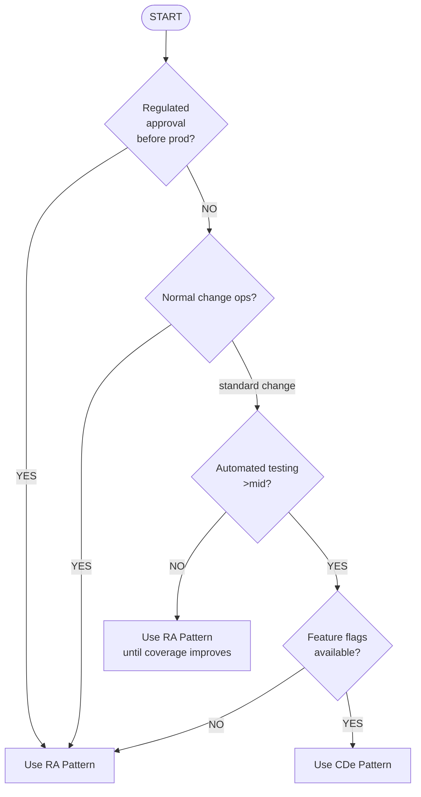

<!-- EDITOR
# Editor: how-to-guides/continuous-delivery/choosing-implementation-pattern.md

## Soul

Decision tree guide for selecting between Release Approval and Continuous Deployment patterns based on regulatory requirements, test coverage, and operational constraints.

## Sections

1. Decision Tree
2. Step-by-Step Selection
3. Step 1: Check Regulatory Requirements
4. Step 2: Assess Change Operations
5. Step 3: Evaluate Test Automation
6. Step 4: Check Feature Flag Availability
7. Pattern Comparison
8. Hybrid Approaches
9. Migration Path
10. Related
-->

# Choosing an Implementation Pattern

How to select between Release Approval (RA) and Continuous Deployment (CDe) patterns.

## Decision Tree

## Step-by-Step Selection

### Step 1: Check Regulatory Requirements

**Ask**: Does your system require regulatory approval before production deployment?

- **YES** → Use **RA Pattern**
- **NO** → Continue to Step 2

Examples requiring RA:

- FDA-regulated medical devices
- Financial systems (SOX, PCI-DSS)
- Critical infrastructure

### Step 2: Assess Change Operations

**Ask**: Do you follow formal change management (CAB approval, change windows)?

- **YES** → Use **RA Pattern**
- **Standard change** → Continue to Step 3

### Step 3: Evaluate Test Automation

**Ask**: Do you have comprehensive automated test coverage (>80%)?

- **NO** → Use **RA Pattern** until coverage improves
- **YES** → Continue to Step 4

### Step 4: Check Feature Flag Availability

**Ask**: Can you control feature exposure at runtime via feature flags?

- **NO** → Use **RA Pattern**
- **YES** → Use **CDe Pattern**

## Pattern Comparison

| Factor         | RA Pattern           | CDe Pattern              |
| -------------- | -------------------- | ------------------------ |
| Approval gates | Manual (Stage 3, 9)  | Automated                |
| Cycle time     | 1-2 weeks            | 2-4 hours                |
| Audit trail    | Comprehensive        | Automated                |
| Best for       | Regulated, high-risk | Internal tools, low-risk |

## Hybrid Approaches

Different patterns for different systems:

- **Production (RA)**: Customer-facing, critical systems
- **Staging (CDe)**: Internal preview environments
- **Internal Tools (CDe)**: Developer tools and dashboards

## Migration Path

1. **Start with RA**: Ensure quality with manual oversight
2. **Build automation**: Increase test coverage, improve monitoring
3. **Transition to CDe**: Gradually remove manual gates as confidence grows

## Related

- [RA Stage Breakdown](../../reference/continuous-delivery/ra-stage-breakdown.md)
- [CDe Stage Breakdown](../../reference/continuous-delivery/cde-stage-breakdown.md)
- [Implementation Patterns](../../explanation/continuous-delivery/cd-model/implementation-patterns.md)
