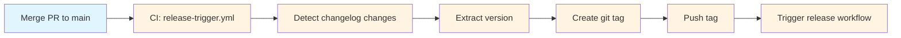

# Understanding Tag Creation

## What You'll Learn

How git tags are created for releases in this repository's **changelog-driven release system**.

**Important**: Tags are created **automatically by CI** when changelog updates merge to `main`. You typically don't create tags manually.

---

## Automated Tag Creation

### How It Works

When you update a module's CHANGELOG.md and merge the PR to `main`:

1. **release-trigger.yml workflow detects** changelog changes in `release/*/CHANGELOG.md`
2. **Extracts version** from the updated changelog
3. **Creates git tag** in format `{moniker}/{version}`
4. **Pushes tag** to remote repository
5. **Triggers release workflow** for that module



**Legend**: Blue = Manual, Yellow = Automated

### Example: my-module Release

**1. You update changelog and create PR**:

```bash
# Update changelog to add version 1.2.4
eac release this my-module

# Commit and create PR
git add release/my-module/CHANGELOG.md
git commit -m "release(my-module): prepare 1.2.4 release"
gh pr create
```

**2. After PR merges, CI automatically**:

```bash
# CI runs release-trigger.yml
# Detects: release/my-module/CHANGELOG.md changed
# Extracts: 1.2.4
# Creates tag: my-module/1.2.4
# Pushes tag

# Then release-my-module.yml runs automatically
# Builds binaries and creates GitHub release
```

**You don't create or push tags manually.**

### Tag Format Examples

| Module Type         | Versioning   | Tag Format                      | Example                      |
| ------------------- | ------------ | ------------------------------- | ---------------------------- |
| **Standard Module** | SemVer       | `{moniker}/{MAJOR.MINOR.PATCH}` | `my-module/1.2.4`            |
| **CalVer Module**   | CalVer       | `{moniker}/{YYYY.MMDD}`         | `my-calver-module/2026.0109` |

### Verification

After PR merges, check that tag was created:

```bash
# View workflow run
gh run list --workflow=release-trigger.yml --limit 1

# Check if tag exists
git fetch --tags
git tag -l "my-module/*" | tail -1
# my-module/1.2.4

# View release
gh release view my-module/1.2.4
```

---

## Tag Format Details

### SemVer Tags

**Format**: `{moniker}/{MAJOR.MINOR.PATCH}`

**Examples**:

- `my-module/1.2.4`
- `my-module/0.1.0`
- `my-module/1.0.0`

**Version bumps**:

- **PATCH** (1.2.3 → 1.2.4): Bug fixes (`fix:` commits)
- **MINOR** (1.2.4 → 1.3.0): New features (`feat:` commits)
- **MAJOR** (1.3.0 → 2.0.0): Breaking changes (`feat!:` or `BREAKING CHANGE:`)

### CalVer Tags

**Format**: `{moniker}/{YYYY.MMDD}`

**Examples**:

- `my-calver-module/2026.0109` (January 9, 2026)
- `my-calver-module/2026.0201` (February 1, 2026)

**Version is date of release**.

---

## Key Takeaways

1. **Tags are automatic** - In normal releases, CI creates tags when you merge CHANGELOG.md updates
2. **You merge, CI tags** - Your responsibility ends at merging the PR; CI handles tagging
3. **Manual is emergency only** - Only create tags manually if automation fails
4. **Tag format matters** - Must be `{moniker}/{version}` for workflows to trigger
5. **One tag per release** - Each module release gets exactly one tag

---

## Next Steps

- **[Prepare Module Release](prepare-module-release.md)** - Follow the full release workflow
- **[Check CI Before Release](check-ci-before-release.md)** - Verify CI before merging
- **[Generate Changelog](generate-changelog.md)** - How to update changelogs
