# Release Management

Learn how to prepare and publish releases using the **changelog-driven release system** where updating CHANGELOG.md files automatically triggers release workflows.

---

## In This Section

### Foundational Guides

| Guide                                                                                                | What You'll Accomplish                                                      |
| ---------------------------------------------------------------------------------------------------- | --------------------------------------------------------------------------- |
| [Understanding Release Types](../../../../reference/eac/continuous-delivery/release-types.md) | Learn the four release types and how they determine changelog locations     |
| [Understanding the Release Folder](./understanding-release-folder.md)                                | Learn release folder structure and how published modules link to changelogs |
| [Release Workflow Variants](./release-workflow-variants.md)                                          | Choose CDe or RA pattern based on regulatory requirements                   |

### Core Workflow Guides

| Guide                                                   | What You'll Accomplish                                             |
| ------------------------------------------------------- | ------------------------------------------------------------------ |
| [Prepare Module Release](./prepare-module-release.md)   | Complete end-to-end CDe workflow with manual and automated phases  |
| [Generate Changelog](./generate-changelog.md)           | Create changelog from Git commits with automatic version detection |
| [Check CI Before Release](./check-ci-before-release.md) | Verify CI passes before merging release PR                         |

### Tag Creation

| Guide                                                 | What You'll Accomplish                                                    |
| ----------------------------------------------------- | ------------------------------------------------------------------------- |
| [Understanding Tag Creation](./create-release-tag.md) | Learn how tags are created automatically by CI (manual is emergency only) |

### Release Artifacts

| Guide                                                                 | What You'll Accomplish                                       |
| --------------------------------------------------------------------- | ------------------------------------------------------------ |
| [View Changelog and Release Notes](./view-changelog-release-notes.md) | Display changelog and release notes for modules              |
| [View PR Approval Comments](./view-approval-comments.md)              | View and analyze PR approval comments for release evidence   |
| [View Release Specifications](./view-specifications.md)               | View and analyze Gherkin specifications included in releases |

### Maintenance

| Guide                                                      | What You'll Accomplish                                  |
| ---------------------------------------------------------- | ------------------------------------------------------- |
| [Clean Up Container Images](./cleanup-container-images.md) | Remove old CI builds while protecting released packages |

---

## Changelog-Driven System Overview

This system uses **changelog-driven releases** where updating module changelogs automatically triggers releases through CI/CD automation.

**Release artifacts** live in the centralized `release/<module>/` folders for **published and bundle modules**. Internal modules have changelogs in their module roots. See:

- [Understanding Release Types](../../../../reference/eac/continuous-delivery/release-types.md) - Learn the release type system
- [Understanding the Release Folder](./understanding-release-folder.md) - Details on folder structure and changelog locations

### How It Works

```mermaid
%%{init: {'theme':'base', 'themeVariables': { 'fontSize':'18px'}}}%%
graph LR
    A[1. Update CHANGELOG] --> B[2. Commit & PR]
    B --> C[3. Code Review]
    C --> D[4. Merge to main]
    D --> E[5. CI Detects Changes]
    E --> F[6. CI Creates Tag]
    F --> G[7. CI Builds Release]
    G --> H[8. CI Publishes]

    style A fill:#e1f5ff,stroke:#0066cc,stroke-width:2px,color:#000
    style B fill:#e1f5ff,stroke:#0066cc,stroke-width:2px,color:#000
    style C fill:#e1f5ff,stroke:#0066cc,stroke-width:2px,color:#000
    style D fill:#e1f5ff,stroke:#0066cc,stroke-width:2px,color:#000
    style E fill:#fff4e1,stroke:#cc8800,stroke-width:2px,color:#000
    style F fill:#fff4e1,stroke:#cc8800,stroke-width:2px,color:#000
    style G fill:#fff4e1,stroke:#cc8800,stroke-width:2px,color:#000
    style H fill:#fff4e1,stroke:#cc8800,stroke-width:2px,color:#000
```



**Legend**:

- **Blue boxes** (1-4) = 🧑 Manual actions you perform
- **Yellow boxes** (5-8) = 🤖 Automated CI/CD actions

**Key principle**: The CHANGELOG.md file is the source of truth. When you merge an updated changelog to `main`, CI automatically creates a git tag and triggers the release workflow. You don't create tags manually.

**Note**: This diagram shows the **CDe (Continuous Deployment)** pattern. For regulated environments requiring formal approval, see [Release Workflow Variants](./release-workflow-variants.md) for the **RA (Release Approval)** pattern that uses release branches.

---

## Choosing Your Release Pattern

The repository supports two release patterns based on the [CD Model variants](../../../../explanation/continuous-delivery/cd-model/variants.md):

| Pattern | Full Name             | Best For                                      | Approval                | Goal                                            |
| ------- | --------------------- | --------------------------------------------- | ----------------------- | ----------------------------------------------- |
| **CDe** | Continuous Deployment | Non-regulated, low-risk                       | Automated quality gates | Minimize cycle time through automation          |
| **RA**  | Release Approval      | Regulated, high-risk (GxP, financial, safety) | Manual release manager  | Minimize approval time while meeting compliance |

Both patterns use the **same changelog preparation process** but diverge at the approval stage:

- **CDe**: Merge to main → Auto-tag → Auto-deploy
- **RA**: Commit to main → Create release branch → Manual approval → Deploy

See [Release Workflow Variants](./release-workflow-variants.md) for complete workflows and selection guidance.

---

## Release Workflow (CDe Pattern)

### Manual Phase (You Perform)

**Steps you take** to prepare a release:

1. **Check pending changes** - Determine if module has unreleased commits

   ```bash
   eac release pending <module>
   ```

2. **Generate changelog** - Create changelog entries from conventional commits

   ```bash
   eac release this <module>
   ```

3. **Review and validate** - Ensure changelog accuracy and format

   ```bash
   cat release/<module>/CHANGELOG.md
   eac validate release <module>
   ```

4. **Verify CI status** - Confirm all tests pass

   ```bash
   eac release check-ci --workflow ci-<module>.yml --commit $(git rev-parse HEAD)
   ```

5. **Commit and create PR** - Submit changelog changes for review

   ```bash
   git add release/<module>/CHANGELOG.md
   git commit -m "release(<module>): prepare <version> release"
   gh pr create
   ```

6. **Get approval and merge** - PR review, then merge to `main`

**After merge**: Automation takes over.

### Automated Phase (CI Performs)

**Steps CI performs automatically** after PR merge:

1. **Detect changelog changes** - Workflow detects updated changelogs

2. **Create git tag** - Tag created in format `{module}/{version}`

3. **Build and publish release** - Module-specific workflow runs
   - Builds artifacts
   - Generates attestations
   - Creates GitHub release
   - Uploads artifacts

**See**: [Prepare Module Release](prepare-module-release.md) for complete step-by-step instructions.

---

## Versioning Schemes

### Semantic Versioning (SemVer)

**Format**: `MAJOR.MINOR.PATCH` (e.g., `1.2.3`)

**Bump rules**:

- **PATCH**: Bug fixes (`fix:` commits)
- **MINOR**: New features (`feat:` commits)
- **MAJOR**: Breaking changes (`feat!:`, `BREAKING CHANGE:`)

### Calendar Versioning (CalVer)

**Format**: `YYYY.MMDD` (e.g., `2026.0109`)

**Bump rules**: Version is the date when release is created

---

## Common Release Scenarios

### Releasing After Bug Fixes (SemVer)

```bash
# 1. Check what needs releasing
eac release pending my-module
# Output: next_version: 1.2.4 (patch)

# 2. Generate changelog
eac release this my-module

# 3. Review, validate, commit, PR
cat release/my-module/CHANGELOG.md
eac validate release my-module
git add release/my-module/CHANGELOG.md
git commit -m "release(my-module): prepare 1.2.4 release"
gh pr create

# 4. Merge after approval
# Then CI automatically creates tag and publishes release
```

### Releasing Documentation (CalVer)

```bash
# 1. Check what needs releasing
eac release pending my-docs
# Output: next_version: 2026.0109 (CalVer)

# 2. Generate changelog
eac release this my-docs

# 3. Review, validate, commit, PR, merge
# Then CI automatically deploys
```

---

## Key Concepts

**Changelog-Driven**: Releases are triggered by merging changelog updates, not by manual tagging

**Manual vs Automated**: You update changelogs and create PRs; CI creates tags and publishes releases

**Tag Format**: `{module}/{version}` (e.g., `my-module/1.2.3`, `my-calver-module/2026.0109`)

**Quality Gates**: CI enforces quality requirements before release (test pass rate, coverage, security, etc.)
