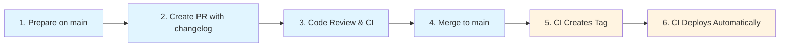
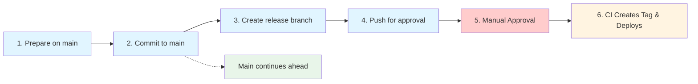

# Release Workflow Variants

## What You'll Learn

How to choose and execute the right release workflow based on your regulatory requirements and risk profile using the CD Model's RA (Release Approval) and CDe (Continuous Deployment) patterns.

---

## Overview

The repository supports two release workflow patterns based on the [CD Model variants](../../../../explanation/continuous-delivery/cd-model/variants.md):

| Pattern | Full Name             | Best For                | Approval  | Branch Strategy |
| ------- | --------------------- | ----------------------- | --------- | --------------- |
| **CDe** | Continuous Deployment | Non-regulated, low-risk | Automated | Main-branch     |
| **RA**  | Release Approval      | Regulated, high-risk    | Manual    | Release-branch  |

Both patterns use the **same changelog preparation process** but diverge at the approval stage.

---

## Choosing Your Pattern

### Decision Factors

**Use CDe (Continuous Deployment) if**:

- ✅ No regulatory approval requirements
- ✅ Mature automated testing (>mid coverage)
- ✅ Feature flags available for runtime control
- ✅ Internal tools or non-critical systems
- ✅ Business benefits from rapid deployment
- ✅ Goal: Minimize cycle time through automation

**Use RA (Release Approval) if**:

- ✅ Regulatory oversight required (FDA, GxP, financial regulations)
- ✅ Critical systems (safety, health, business-critical)
- ✅ Formal sign-off documentation needed
- ✅ High consequence of failure
- ✅ Compliance requires documented approvals
- ✅ Goal: Minimize approval time while meeting compliance

### Configuration Matrix

| Merge Strategy | Release Pattern       | Best For                       | Typical Flow Duration     |
| -------------- | --------------------- | ------------------------------ | ------------------------- |
| PR + CDe       | Continuous Deployment | Fast teams, mature testing     | Hours                     |
| PR + RA        | Release Approval      | Regulated teams, 3+ devs       | Days (approval-dependent) |
| Direct + CDe   | Continuous Deployment | Solo devs, internal tools      | Minutes                   |
| Direct + RA    | Release Approval      | Small teams needing compliance | Days (approval-dependent) |

See [CD Model Variants](../../../../explanation/continuous-delivery/cd-model/variants.md) for complete decision tree.

---

## CDe Pattern: Continuous Deployment

**For**: Non-regulated, low-risk systems

### Workflow Overview



**Legend**: Blue = Manual, Yellow = Automated

### Step-by-Step Process

#### Step 1: Prepare Changelog on Main

```bash
# Check if module has pending changes
eac release pending my-module

# Generate changelog entry
eac release this my-module

# Review generated changelog
cat release/my-module/CHANGELOG.md

# Validate format
eac validate release my-module
```

**What happens**: Changelog updated with new version section in `release/my-module/CHANGELOG.md`

#### Step 2: Create Pull Request

```bash
# Commit changelog
git add release/my-module/CHANGELOG.md
git commit -m "release(my-module): prepare 1.2.4 release"

# Push and create PR
git push origin your-branch
gh pr create \
  --title "release(my-module): 1.2.4" \
  --body "Prepare my-module version 1.2.4 release

## Changes
- Add config validation
- Fix empty file handling

## Pre-release Checklist
- [x] Changelog updated
- [x] CI passing
- [x] Quality gates met"
```

#### Step 3: Code Review & CI

**Automated**:

- CI runs tests, security scans
- Quality gates check coverage, performance

**Manual**:

- Code owner reviews changelog accuracy
- Verifies version number correctness

#### Step 4: Merge to Main

```bash
# After approval, merge PR
gh pr merge --squash
```

**Result**: Changelog with new version is now on `main` branch

#### Step 5: CI Creates Tag (Automated)

**Workflow**: `.github/workflows/release-trigger.yml`

```yaml
# Detects: release/my-module/CHANGELOG.md changed
# Extracts: 1.2.4
# Creates tag: my-module/1.2.4
# Pushes tag to remote
```

**You don't create tags** - CI does this automatically

#### Step 6: CI Deploys (Automated)

**Workflow**: `.github/workflows/release-my-module.yml`

- Builds artifacts (binaries, containers, etc.)
- Generates attestations (Sigstore provenance)
- Creates GitHub release
- Deploys to production automatically

**Stage 9 Approval**: Automated via quality gates (tests, coverage, security)

**Duration**: Minutes to hours (depending on build complexity)

---

## RA Pattern: Release Approval

**For**: Regulated, high-risk systems (GxP, financial, safety-critical)

### Workflow Overview



**Legend**: Blue = Manual, Red = Manual Approval, Yellow = Automated, Green = Parallel Work

### Step-by-Step Process

#### Step 1: Prepare Changelog on Main

```bash
# Same as CDe pattern - always prepare on main first
eac release pending my-module
eac release this my-module
cat release/my-module/CHANGELOG.md
eac validate release my-module
```

**Why main?** Keeps main as single source of truth, enables release branch creation

#### Step 2: Commit Changelog to Main

```bash
# Commit directly to main (or via PR if org policy requires)
git add release/my-module/CHANGELOG.md
git commit -m "release(my-module): prepare 1.2.4 release"
git push origin main
```

**Result**: Main now has changelog with version 1.2.4

#### Step 3: Create Release Branch

```bash
# Create release branch from main
git checkout -b release/my-module/v1.2.4 main

# Push release branch
git push origin release/my-module/v1.2.4
```

**Branch naming**: `release/<module>/v<version>`

**Purpose**: Provides stable branch for approval process

#### Step 4: Trigger Approval Process (Stage 9)

**Manual activities**:

- Release manager reviews changelog
- Stakeholders review RELEASE-NOTES.md
- QA verifies test results
- Security reviews scan results
- Compliance checks documentation

**Approval artifacts**:

```bash
# View test results
eac show test-summary my-module

# View security scan results
eac show scan-summary my-module

# View approval comments (if using GitHub)
eac show approval-comments
```

#### Step 5: Main Continues Ahead (Parallel)

**While release branch awaits approval**, main branch continues normal development:

```bash
# Switch back to main
git checkout main

# Continue with new features
git checkout -b feature/new-stuff
# ... make changes ...
git commit -m "feat: add new feature"
git push origin feature/new-stuff
gh pr create
```

**This is normal and expected**:

- Main is always ahead of production
- Release branches protect production stability
- New work doesn't block release approval
- Multiple releases can be in approval simultaneously

#### Step 6: After Approval - CI Deploys

Once approval is documented (PR comment, approval system, etc.):

**CI detects approval** and:

1. Creates tag from release branch: `my-module/1.2.4`
2. Runs release workflow: `.github/workflows/release-my-module.yml`
3. Builds artifacts
4. Generates attestations
5. Creates GitHub release
6. Deploys to production

**Duration**: Days (approval-dependent), but goal is to minimize approval time

---

## Key Differences

| Aspect          | CDe Pattern                | RA Pattern                |
| --------------- | -------------------------- | ------------------------- |
| **Approval**    | Automated (quality gates)  | Manual (release manager)  |
| **Branch**      | Main only                  | Main + release branches   |
| **Stage 9**     | Automated at merge         | Manual on release branch  |
| **Main status** | Deployed to prod           | Ahead of production       |
| **Cycle time**  | Hours (automation-limited) | Days (approval-dependent) |
| **Use case**    | Non-regulated              | Regulated/high-risk       |

---

## Changelog Preparation (Same for Both Patterns)

Both CDe and RA use the **same changelog preparation process**:

### 1. Check Pending Changes

```bash
eac release pending <module>
```

**Output**:

```yaml
moniker: my-module
has_changes: true
current_version: 1.2.3
next_version: 1.2.4
change_summary:
  feat: 2
  fix: 1
```

### 2. Generate Changelog

```bash
eac release this <module>
```

**What happens**:

- Analyzes commits since last tag (`my-module/1.2.3`)
- Generates entries from conventional commits
- Calculates version bump (SemVer: patch/minor/major, CalVer: date)
- Updates `release/<module>/CHANGELOG.md`

### 3. Validate Format

```bash
eac validate release <module>
```

**Checks**:

- ✓ Changelog exists
- ✓ Valid header format
- ✓ Valid version format
- ✓ Versions in descending order
- ✓ Valid date format

**After this point**, workflows diverge:

- **CDe**: Create PR → Merge → Auto-deploy
- **RA**: Commit to main → Create release branch → Manual approval → Deploy

---

## Next Steps

- **[Prepare Module Release](./prepare-module-release.md)** → See CDe workflow in detail
- **[Understanding Release Folder](./understanding-release-folder.md)** → Learn about release file structure
- **[CD Model Variants](../../../../explanation/continuous-delivery/cd-model/variants.md)** → Complete decision guidance

---

## Related Documentation

- [CD Model Overview](../../../../explanation/continuous-delivery/cd-model/overview.md) - 12-stage model
- [CD Model Stages](../../../../explanation/continuous-delivery/cd-model/stages.md) - Stage 8-9 details
- [Trunk-Based Development](../../../../explanation/continuous-delivery/workflow/trunk-based-development.md) - Branching strategy
