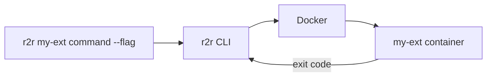

# Creating r2r Extensions

**Problem**: You want to add custom automation commands to r2r that can be shared across teams and run consistently in any environment.

**Solution**: Create a Docker-based extension that r2r invokes as a container.

## How Extensions Work

r2r extensions are Docker containers that:

1. Receive command arguments from the CLI
2. Execute your custom logic
3. Return exit codes to indicate success/failure



## Extension Metadata

**All extensions must implement the `extension-meta` command.**

This provides r2r CLI with extension information for discovery, validation, and management.

### Why It Matters

The extension metadata command allows:

- r2r CLI to discover extension capabilities
- Version compatibility checking
- Resource requirement validation
- Installation and upgrade management

### Metadata Schema

```go
package metadata

import (
    "encoding/json"
    "os"
)

type Metadata struct {
    Name          string       `json:"name"`
    Version       string       `json:"version"`
    Description   string       `json:"description"`
    SchemaVersion string       `json:"schema-version"`
    Capabilities  []string     `json:"capabilities"`
    Requirements  Requirements `json:"requirements"`
}

type Requirements struct {
    R2RVersion       string `json:"r2r-version"`
    ContainerRuntime string `json:"container-runtime"`
    MinimumMemory    string `json:"minimum-memory"`
    MinimumCPU       string `json:"minimum-cpu"`
}

func Print(version string) {
    meta := Metadata{
        Name:          "my-extension",
        Version:       version,
        Description:   "What this extension does",
        SchemaVersion: "1.0",
        Capabilities:  []string{"validate", "transform"},
        Requirements: Requirements{
            R2RVersion:       ">=0.1.0",
            ContainerRuntime: "docker",
            MinimumMemory:    "64MB",
            MinimumCPU:       "0.1",
        },
    }

    encoder := json.NewEncoder(os.Stdout)
    encoder.SetIndent("", "  ")
    encoder.Encode(meta)
}
```

### Integration in main.go

```go
package main

import (
    "fmt"
    "os"

    "github.com/your-org/my-extension/internal/metadata"
)

// Version is set at build time via -ldflags
var Version = "dev"

func main() {
    // Handle special commands BEFORE regular logic
    if len(os.Args) > 1 {
        switch os.Args[1] {
        case "extension-meta":
            metadata.Print(Version)
            os.Exit(0)
        case "version":
            fmt.Printf("my-extension version %s\n", Version)
            os.Exit(0)
        case "help", "--help", "-h":
            printHelp()
            os.Exit(0)
        }
    }

    // Regular command handling...
    runCommand(os.Args[1:])
}
```

### Testing Metadata

```bash
# Test locally
go run ./cmd/my-extension extension-meta

# Test in container
docker run --rm my-extension:dev extension-meta
```

Expected output:

```json
{
  "name": "my-extension",
  "version": "dev",
  "description": "What this extension does",
  "schema-version": "1.0",
  "capabilities": [
    "validate",
    "transform"
  ],
  "requirements": {
    "r2r-version": ">=0.1.0",
    "container-runtime": "docker",
    "minimum-memory": "64MB",
    "minimum-cpu": "0.1"
  }
}
```

## Project Structure

A well-organized extension follows this structure for maintainability and testability:

```text
my-extension/
├── go/
│   └── my-extension/
│       ├── cmd/
│       │   └── my-extension/
│       │       └── main.go           # Entry point with metadata
│       ├── internal/
│       │   ├── core/                 # Business logic
│       │   │   ├── logic.go
│       │   │   └── logic_test.go     # Table-driven tests
│       │   ├── output/               # Output formatting
│       │   │   └── formatter.go
│       │   └── metadata/             # Extension metadata
│       │       └── metadata.go
│       ├── specs/                    # BDD step definitions (optional)
│       │   ├── steps.go
│       │   └── godog_test.go
│       ├── go.mod
│       └── go.sum
├── containers/
│   └── my-extension/
│       └── Dockerfile                # Multi-stage build
├── specs/                            # Gherkin specifications (optional)
│   └── my-extension/
│       └── *.feature
├── release/
│   └── my-extension/
│       └── CHANGELOG.md              # Semver changelog
├── .r2r/
│   └── eac/
│       └── repository.yml            # EAC integration (optional)
└── README.md
```

### Why This Structure?

- **cmd/**: Separates entry point from logic (enables testing without main)
- **internal/**: Prevents external imports (encapsulation, Go best practice)
- **internal/core/**: Business logic separate from I/O
- **internal/output/**: Formatting logic (text, JSON, etc.)
- **internal/metadata/**: Extension metadata implementation
- **specs/**: Co-locates behavior tests with implementation
- **containers/**: Centralizes container definitions
- **.r2r/eac/**: Optional integration with EAC build system

### Package Organization

```go
// cmd/my-extension/main.go - Entry point only
package main

func main() {
    // Parse args, handle special commands, delegate to packages
}

// internal/core/logic.go - Pure business logic
package core

// Testable without I/O
func ProcessData(input string) (string, error) {
    // Logic here
}

// internal/output/formatter.go - Formatting logic
package output

// Format results for display
func FormatResult(result core.Result, format string) string {
    // Formatting here
}

// internal/metadata/metadata.go - Extension metadata
package metadata

// Print extension metadata as JSON
func Print(version string) {
    // Metadata here
}
```

## Quick Start

### 1. Create Your Extension

Build a Docker image that accepts command-line arguments:

```dockerfile
# Dockerfile
FROM alpine:latest

COPY my-extension /usr/local/bin/my-extension
ENTRYPOINT ["/usr/local/bin/my-extension"]
```

Your entrypoint receives all arguments passed after the extension name:

```bash
r2r my-ext do-something --flag value
# Container receives: ["do-something", "--flag", "value"]
```

### 2. Register the Extension

Add your extension to `.r2r/r2r-cli.yml`:

```yaml
extensions:
  - name: 'my-ext'
    image: 'ghcr.io/my-org/my-extension:latest'
    description: 'My custom automation extension'
```

### 3. Use Your Extension

```bash
# Via run command
r2r run my-ext do-something

# Via alias (created automatically)
r2r my-ext do-something
```

## Extension Configuration

### Basic Configuration

```yaml
extensions:
  - name: 'my-ext'
    image: 'ghcr.io/my-org/my-extension:latest'
    description: 'What this extension does'
```

### With Environment Variables

```yaml
extensions:
  - name: 'my-ext'
    image: 'ghcr.io/my-org/my-extension:latest'
    env:
      API_KEY: '${MY_API_KEY}'      # From host environment
      CONFIG_PATH: '/config'         # Static value
```

### With Volume Mounts

```yaml
extensions:
  - name: 'my-ext'
    image: 'ghcr.io/my-org/my-extension:latest'
    volumes:
      - '${HOME}/.my-ext:/config:ro'  # Read-only config
      - './output:/output:rw'          # Read-write output
```

### With Resource Limits

```yaml
extensions:
  - name: 'my-ext'
    image: 'ghcr.io/my-org/my-extension:latest'
    memory_limit: '512m'
    cpu_limit: '1.0'
```

### Local Development

During development, load from local Docker:

```yaml
extensions:
  - name: 'my-ext'
    image: 'my-extension:dev'
    load_local: true  # Don't pull from registry
```

## Full Configuration Schema

```yaml
extensions:
  - name: string              # Required: Command name (r2r <name>)
    image: string             # Required: Docker image reference
    description: string       # Optional: Shown in help
    version: string           # Optional: Extension version
    load_local: boolean       # Optional: Skip registry pull (default: false)
    env:                      # Optional: Environment variables
      KEY: 'value'
    volumes:                  # Optional: Volume mounts
      - 'host:container:mode'
    memory_limit: string      # Optional: Memory limit (e.g., '512m', '2g')
    cpu_limit: string         # Optional: CPU limit (e.g., '0.5', '2.0')
```

## Building Extensions

### Go Extension Example

```go
// main.go
package main

import (
    "fmt"
    "os"
)

func main() {
    if len(os.Args) < 2 {
        fmt.Println("Usage: my-ext <command>")
        os.Exit(1)
    }

    switch os.Args[1] {
    case "hello":
        fmt.Println("Hello from my extension!")
    case "version":
        fmt.Println("my-ext v1.0.0")
    default:
        fmt.Printf("Unknown command: %s\n", os.Args[1])
        os.Exit(1)
    }
}
```

```dockerfile
# Multi-stage build for minimal image size
FROM golang:1.21-alpine AS builder

WORKDIR /build

# Install build dependencies
RUN apk add --no-cache git

# Copy dependency files first (layer caching optimization)
COPY go/my-ext/go.mod go/my-ext/go.sum ./
RUN go mod download

# Copy source code
COPY go/my-ext/ ./

# Build with version injection and optimizations
ARG VERSION=dev
RUN CGO_ENABLED=0 GOOS=linux go build \
    -ldflags "-s -w -X main.Version=${VERSION}" \
    -o my-ext \
    ./cmd/my-ext

# Stage 2: Runtime
FROM alpine:latest

# Add ca-certificates for HTTPS
RUN apk --no-cache add ca-certificates

WORKDIR /workspace

# Copy only the binary
COPY --from=builder /build/my-ext /usr/local/bin/my-ext

# Set entrypoint
ENTRYPOINT ["/usr/local/bin/my-ext"]
CMD ["--help"]
```

**Key optimizations:**

- **Multi-stage build**: Reduces final image from ~800MB to ~20MB
- **Dependency caching**: `go.mod` copied first speeds up rebuilds
- **CGO_ENABLED=0**: Produces static binary (no libc dependencies)
- **-ldflags "-s -w"**: Strips debug info and symbol tables
- **Version injection**: Embeds version at build time via `main.Version`
- **ca-certificates**: Required for HTTPS API calls
- **Alpine base**: Minimal runtime image (~5MB)

### Python Extension Example

```python
#!/usr/bin/env python3
# main.py
import sys

def main():
    if len(sys.argv) < 2:
        print("Usage: my-ext <command>")
        sys.exit(1)

    command = sys.argv[1]

    if command == "hello":
        print("Hello from my extension!")
    elif command == "version":
        print("my-ext v1.0.0")
    else:
        print(f"Unknown command: {command}")
        sys.exit(1)

if __name__ == "__main__":
    main()
```

```dockerfile
FROM python:3.11-slim
COPY main.py /app/main.py
ENTRYPOINT ["python", "/app/main.py"]
```

## Testing Strategies

Extensions should include comprehensive testing at multiple levels.

### Test Organization

Two complementary testing approaches:

1. **Unit Tests**: Fast, isolated, table-driven tests for business logic
2. **Behavior Tests**: Gherkin specifications with step definitions (optional)

### Table-Driven Unit Tests

Place `*_test.go` files alongside the code they test:

```go
// internal/core/validator_test.go
package core

import "testing"

func TestValidator(t *testing.T) {
    tests := []struct {
        name     string
        input    string
        expected bool
        wantErr  bool
    }{
        {
            name:     "valid input",
            input:    "valid-data",
            expected: true,
            wantErr:  false,
        },
        {
            name:     "empty input",
            input:    "",
            expected: false,
            wantErr:  true,
        },
        {
            name:     "invalid format",
            input:    "invalid!@#",
            expected: false,
            wantErr:  true,
        },
    }

    for _, tt := range tests {
        t.Run(tt.name, func(t *testing.T) {
            result, err := Validate(tt.input)

            if tt.wantErr && err == nil {
                t.Errorf("expected error, got nil")
            }
            if !tt.wantErr && err != nil {
                t.Errorf("unexpected error: %v", err)
            }
            if result != tt.expected {
                t.Errorf("expected %v, got %v", tt.expected, result)
            }
        })
    }
}
```

Run unit tests:

```bash
cd go/my-extension
go test ./... -v
```

### Behavior Tests with Gherkin (Optional)

**1. Write specifications** in `specs/my-extension/*.feature`:

```gherkin
Feature: Data validation

As a user
I want to validate my data
So that I can ensure quality

Rule: Validate required fields
  Scenario: Valid data passes validation
    Given I have valid input data
    When I run the validator
    Then the validation should pass

  Scenario: Missing required field fails validation
    Given I have input data missing required field
    When I run the validator
    Then the validation should fail
    And an error message should be shown
```

**2. Implement step definitions** in `go/my-extension/specs/steps.go`:

```go
package specs

import (
    "github.com/cucumber/godog"
    "github.com/your-org/my-extension/internal/core"
)

type testContext struct {
    input  string
    result bool
    err    error
}

func (tc *testContext) iHaveValidInputData() error {
    tc.input = "valid-data"
    return nil
}

func (tc *testContext) iRunTheValidator() error {
    tc.result, tc.err = core.Validate(tc.input)
    return nil
}

func (tc *testContext) theValidationShouldPass() error {
    if !tc.result {
        return fmt.Errorf("expected validation to pass")
    }
    return nil
}

func InitializeScenario(sc *godog.ScenarioContext) {
    tc := &testContext{}

    sc.Step(`^I have valid input data$`, tc.iHaveValidInputData)
    sc.Step(`^I run the validator$`, tc.iRunTheValidator)
    sc.Step(`^the validation should pass$`, tc.theValidationShouldPass)
    // Add more step definitions...
}
```

**3. Run behavior tests**:

```bash
cd go/my-extension/specs
go test -v
```

### Container Testing

Test the built container before publishing:

```bash
# Build
docker build -f containers/my-extension/Dockerfile -t my-extension:test .

# Test metadata
docker run --rm my-extension:test extension-meta

# Test help
docker run --rm my-extension:test --help

# Test functionality
docker run --rm my-extension:test <command>

# Test with environment variables
docker run --rm -e VAR=value my-extension:test <command>

# Test with volume mount
docker run --rm -v $(pwd):/data my-extension:test <command>
```

### Integration Testing via r2r CLI

Test the complete integration:

```bash
# Create local config
cat > .r2r/r2r-cli.local.yml <<EOF
version: "1.0"
extensions:
  - name: my-ext
    image: my-extension:test
    load_local: true
    image_pull_policy: Never
EOF

# Test via r2r CLI
r2r my-ext --help
r2r my-ext <command>
```

### Automated Test Script

Create `scripts/test.sh`:

```bash
#!/bin/bash
set -e

echo "Running unit tests..."
cd go/my-extension && go test ./... -v

echo "Building container..."
docker build -f containers/my-extension/Dockerfile -t my-extension:test .

echo "Testing container metadata..."
docker run --rm my-extension:test extension-meta | jq .

echo "Testing container help..."
docker run --rm my-extension:test --help

echo "Running integration tests..."
docker run --rm my-extension:test <test-command>

echo "✓ All tests passed"
```

### Testing Best Practices

1. **Write tests first** (TDD approach)
2. **Keep tests fast** (< 100ms per unit test)
3. **Avoid external dependencies** in unit tests
4. **Use table-driven tests** for multiple scenarios
5. **Test error cases** as thoroughly as success cases
6. **Test the container** before publishing
7. **Validate extension-meta** output format

## Repository Access

Extensions automatically receive the repository mounted at `/var/task`:

```go
// Access repository files
repoRoot := os.Getenv("R2R_CONTAINER_REPOROOT") // "/var/task"
configPath := filepath.Join(repoRoot, ".r2r", "eac", "repository.yml")
```

Key environment variables available in extensions:

| Variable                 | Description                         |
| ------------------------ | ----------------------------------- |
| `R2R_CONTAINER_REPOROOT` | Repository mount path (`/var/task`) |
| `R2R_HOST_REPOROOT`      | Original host path                  |
| `R2R_ENV`                | Environment identifier              |
| `R2R_OPERATION_ID`       | Unique operation ID for tracing     |

## Publishing Extensions

### To GitHub Container Registry

```bash
# Build and tag
docker build -t ghcr.io/my-org/my-extension:1.0.0 .
docker tag ghcr.io/my-org/my-extension:1.0.0 ghcr.io/my-org/my-extension:latest

# Push
docker push ghcr.io/my-org/my-extension:1.0.0
docker push ghcr.io/my-org/my-extension:latest
```

### Multi-Platform Builds

```bash
docker buildx build \
  --platform linux/amd64,linux/arm64 \
  -t ghcr.io/my-org/my-extension:1.0.0 \
  --push .
```

## EAC Integration (Optional)

Extensions can optionally integrate with EAC's build system for automated builds, testing, and releases.

### Benefits

- Automated multi-platform container builds
- Changelog-based semantic versioning
- Integrated CI/CD workflows
- Module dependency tracking
- Consistent build artifacts
- Automated release management

### Module Contract

Create `.r2r/eac/repository.yml`:

```yaml
repository:
  type: mono

modules:
  - moniker: my-extension
    name: My Extension
    description: What this extension does
    type: container
    versioning:
      scheme: SemVer
    files:
      root: .
      changelog: release/my-extension/CHANGELOG.md
      source:
        - "go/my-extension/**/*.go"
        - "containers/my-extension/**"
      tests:
        - "go/my-extension/**/*_test.go"
      exclude:
        - "**/vendor/**"
      workflows:
        ci: .github/workflows/ci-my-extension.yaml
        release: .github/workflows/release-my-extension.yaml
      repo:
        test_impl: go/my-extension/specs
        specs:
          - "specs/my-extension/**/*.feature"
    docker_build:
      container: "{moniker}"
      context: "."
      dockerfile: "containers/{moniker}/Dockerfile"
      platforms:
        - linux/amd64
        - linux/arm64
      tags:
        - "ghcr.io/your-org/{moniker}:ci"
        - "ghcr.io/your-org/{moniker}:sha-{short_sha}"
      push: true
      registry: ghcr.io
```

### Using EAC Commands

Once configured, use EAC commands to manage your extension:

```bash
# Install r2r CLI with ext-eac
r2r install eac

# Build
r2r eac build my-extension

# Test
r2r eac test my-extension

# Validate
r2r eac validate dependencies
r2r eac validate specs

# Release management
r2r eac release pending my-extension
r2r eac release this my-extension
```

### CI/CD Workflows

EAC provides reusable GitHub Actions for CI/CD:

**`.github/workflows/ci-my-extension.yaml`:**

```yaml
name: "ci-my-extension"

on:
  push:
    branches: [main]
  pull_request:

jobs:
  build:
    uses: ./.github/workflows/_module-ci.yaml
    with:
      module: my-extension
```

**`.github/workflows/release-my-extension.yaml`:**

```yaml
name: "release-my-extension"

on:
  push:
    tags:
      - 'my-extension/*'

jobs:
  release:
    uses: ./.github/workflows/_module-release.yaml
    with:
      module: my-extension
```

### Changelog-Based Releases

EAC uses conventional commits and changelogs for versioning:

**1. Make changes with conventional commits:**

```bash
git commit -m "feat: add validation mode"
git commit -m "fix: handle empty input"
```

**2. Generate changelog:**

```bash
r2r eac release this my-extension
```

**3. Review and commit:**

```bash
git add release/my-extension/CHANGELOG.md
git commit -m "release(my-extension): 1.2.0"
```

**4. Merge to main:**

- PR is created and merged
- Change detection creates tag: `my-extension/1.2.0`
- Release workflow publishes container automatically

### When to Use EAC Integration

| Use Case              | Standalone     | With EAC     |
| --------------------- | -------------- | ------------ |
| Simple extension      | ✓ Easier       | Overkill     |
| Multiple extensions   | Manual effort  | ✓ Consistent |
| Semver releases       | Manual tagging | ✓ Automated  |
| Multi-platform builds | Manual buildx  | ✓ Automated  |
| Dependency tracking   | Manual         | ✓ Automated  |
| Module contracts      | Not available  | ✓ Available  |

**Recommendation**: Use EAC integration if you're managing multiple extensions or want automated release workflows.

## Best Practices

1. **Single responsibility**: Each extension should do one thing well
2. **Exit codes**: Return 0 for success, non-zero for errors
3. **Stdout/stderr**: Use stdout for output, stderr for errors/logs
4. **Help command**: Implement `--help` or `help` subcommand
5. **Version command**: Implement `version` subcommand
6. **Minimal images**: Use Alpine or distroless base images
7. **Pin versions**: Use specific tags, not just `latest`

## Troubleshooting

| Problem           | Solution                                     |
| ----------------- | -------------------------------------------- |
| Image not found   | Check image name and registry access         |
| Permission denied | Ensure entrypoint is executable              |
| No output         | Check container logs with `docker logs`      |
| Wrong arguments   | Extension receives args after extension name |
| Mount issues      | Verify volume paths exist on host            |

---

## See Also

- [Local Development Workflows](../local-setup/local-dev-workflows.md) - Develop and test extensions locally
- [Testing in External Repositories](./testing-in-external-repos.md) - Test extensions in different repositories
- [R2R CLI install command](../../reference/r2r/commands/install.md) - Installing extensions
- [R2R CLI Configuration](../../reference/r2r/commands/configuration.md) - Extension configuration reference
- [CLI vs Extensions Architecture](../../reference/eac/architecture/cli-integration.md) - Understanding the system
