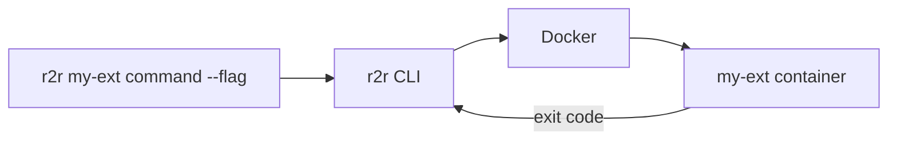

# Creating r2r Extensions

{{ page_breadcrumb() }}

**Problem**: You want to add custom automation commands to r2r that can be shared across teams and run consistently in any environment.

**Solution**: Create a Docker-based extension that r2r invokes as a container.

## How Extensions Work

r2r extensions are Docker containers that:

1. Receive command arguments from the CLI
2. Execute your custom logic
3. Return exit codes to indicate success/failure



## Quick Start

### 1. Create Your Extension

Build a Docker image that accepts command-line arguments:

```dockerfile
# Dockerfile
FROM alpine:latest

COPY my-extension /usr/local/bin/my-extension
ENTRYPOINT ["/usr/local/bin/my-extension"]
```

Your entrypoint receives all arguments passed after the extension name:

```bash
r2r my-ext do-something --flag value
# Container receives: ["do-something", "--flag", "value"]
```

### 2. Register the Extension

Add your extension to `.r2r/r2r-cli.yml`:

```yaml
extensions:
  - name: 'my-ext'
    image: 'ghcr.io/my-org/my-extension:latest'
    description: 'My custom automation extension'
```

### 3. Use Your Extension

```bash
# Via run command
r2r run my-ext do-something

# Via alias (created automatically)
r2r my-ext do-something
```

## Extension Configuration

### Basic Configuration

```yaml
extensions:
  - name: 'my-ext'
    image: 'ghcr.io/my-org/my-extension:latest'
    description: 'What this extension does'
```

### With Environment Variables

```yaml
extensions:
  - name: 'my-ext'
    image: 'ghcr.io/my-org/my-extension:latest'
    env:
      API_KEY: '${MY_API_KEY}'      # From host environment
      CONFIG_PATH: '/config'         # Static value
```

### With Volume Mounts

```yaml
extensions:
  - name: 'my-ext'
    image: 'ghcr.io/my-org/my-extension:latest'
    volumes:
      - '${HOME}/.my-ext:/config:ro'  # Read-only config
      - './output:/output:rw'          # Read-write output
```

### With Resource Limits

```yaml
extensions:
  - name: 'my-ext'
    image: 'ghcr.io/my-org/my-extension:latest'
    memory_limit: '512m'
    cpu_limit: '1.0'
```

### Local Development

During development, load from local Docker:

```yaml
extensions:
  - name: 'my-ext'
    image: 'my-extension:dev'
    load_local: true  # Don't pull from registry
```

## Full Configuration Schema

```yaml
extensions:
  - name: string              # Required: Command name (r2r <name>)
    image: string             # Required: Docker image reference
    description: string       # Optional: Shown in help
    version: string           # Optional: Extension version
    load_local: boolean       # Optional: Skip registry pull (default: false)
    env:                      # Optional: Environment variables
      KEY: 'value'
    volumes:                  # Optional: Volume mounts
      - 'host:container:mode'
    memory_limit: string      # Optional: Memory limit (e.g., '512m', '2g')
    cpu_limit: string         # Optional: CPU limit (e.g., '0.5', '2.0')
```

## Building Extensions

### Go Extension Example

```go
// main.go
package main

import (
    "fmt"
    "os"
)

func main() {
    if len(os.Args) < 2 {
        fmt.Println("Usage: my-ext <command>")
        os.Exit(1)
    }

    switch os.Args[1] {
    case "hello":
        fmt.Println("Hello from my extension!")
    case "version":
        fmt.Println("my-ext v1.0.0")
    default:
        fmt.Printf("Unknown command: %s\n", os.Args[1])
        os.Exit(1)
    }
}
```

```dockerfile
FROM golang:1.21-alpine AS builder
WORKDIR /app
COPY . .
RUN CGO_ENABLED=0 go build -o my-ext .

FROM alpine:latest
COPY --from=builder /app/my-ext /usr/local/bin/
ENTRYPOINT ["/usr/local/bin/my-ext"]
```

### Python Extension Example

```python
#!/usr/bin/env python3
# main.py
import sys

def main():
    if len(sys.argv) < 2:
        print("Usage: my-ext <command>")
        sys.exit(1)

    command = sys.argv[1]

    if command == "hello":
        print("Hello from my extension!")
    elif command == "version":
        print("my-ext v1.0.0")
    else:
        print(f"Unknown command: {command}")
        sys.exit(1)

if __name__ == "__main__":
    main()
```

```dockerfile
FROM python:3.11-slim
COPY main.py /app/main.py
ENTRYPOINT ["python", "/app/main.py"]
```

## Repository Access

Extensions automatically receive the repository mounted at `/var/task`:

```go
// Access repository files
repoRoot := os.Getenv("R2R_CONTAINER_REPOROOT") // "/var/task"
configPath := filepath.Join(repoRoot, ".r2r", "eac", "repository.yml")
```

Key environment variables available in extensions:

| Variable | Description |
|----------|-------------|
| `R2R_CONTAINER_REPOROOT` | Repository mount path (`/var/task`) |
| `R2R_HOST_REPOROOT` | Original host path |
| `R2R_ENV` | Environment identifier |
| `R2R_OPERATION_ID` | Unique operation ID for tracing |

## Publishing Extensions

### To GitHub Container Registry

```bash
# Build and tag
docker build -t ghcr.io/my-org/my-extension:1.0.0 .
docker tag ghcr.io/my-org/my-extension:1.0.0 ghcr.io/my-org/my-extension:latest

# Push
docker push ghcr.io/my-org/my-extension:1.0.0
docker push ghcr.io/my-org/my-extension:latest
```

### Multi-Platform Builds

```bash
docker buildx build \
  --platform linux/amd64,linux/arm64 \
  -t ghcr.io/my-org/my-extension:1.0.0 \
  --push .
```

## Best Practices

1. **Single responsibility**: Each extension should do one thing well
2. **Exit codes**: Return 0 for success, non-zero for errors
3. **Stdout/stderr**: Use stdout for output, stderr for errors/logs
4. **Help command**: Implement `--help` or `help` subcommand
5. **Version command**: Implement `version` subcommand
6. **Minimal images**: Use Alpine or distroless base images
7. **Pin versions**: Use specific tags, not just `latest`

## Troubleshooting

| Problem | Solution |
|---------|----------|
| Image not found | Check image name and registry access |
| Permission denied | Ensure entrypoint is executable |
| No output | Check container logs with `docker logs` |
| Wrong arguments | Extension receives args after extension name |
| Mount issues | Verify volume paths exist on host |

{{ diataxis_footer() }}
