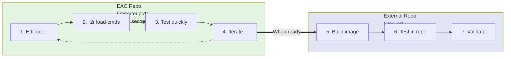

# Testing in External Repositories

{{ page_breadcrumb() }}

**Problem**: You want to test your r2r extension in a different repository to ensure it works correctly outside of the EAC development environment.

**Solution**: Build a local Docker image in the EAC repository, then configure external repositories to use it.

## Overview

### Extension Types

This guide covers testing two types of extensions in external repositories:

1. **ext-eac**: The EAC command extension (built in EAC repository)
2. **Standalone extensions**: Custom extensions like ext-env-check (separate repositories)

Both types use Docker-based testing in external repositories, but they're built differently.

### Why Test in External Repositories?

Testing in external repositories ensures your extension:

- Works with real-world repository structures
- Handles different configuration scenarios
- Functions correctly outside the development environment
- Integrates properly with existing workflows
- Validates Dockerfile and container configuration
- Verifies cross-repository compatibility

### Development vs Testing Workflow

| Extension Type | Build Location | Dev Workflow   | Test in External Repo |
| -------------- | -------------- | -------------- | --------------------- |
| **ext-eac**    | EAC repository | `importer.ps1` | Docker image          |
| **Standalone** | Own repository | Docker build   | Docker image          |

**This guide focuses on ext-eac**, but the same principles apply to standalone extensions. See the [Testing Standalone Extensions](#testing-standalone-extensions-in-external-repos) section for standalone-specific guidance.

**Workflow Summary:**

1. Develop and debug in EAC repository using `importer.ps1`
2. Build Docker image when ready to test
3. Set up external repositories to use the local Docker image
4. Test in realistic environments

## Prerequisites

Before testing in external repositories:

1. **Complete development in EAC repository** using `importer.ps1`:

   ```powershell
   cd C:\source\ready-to-release\eac
   .\scripts\pwsh\importer.ps1
   ```

2. **Build local Docker image** when ready for external testing:

   ```powershell
   cd C:\source\ready-to-release\eac
   .\scripts\pwsh\local-dev\build-local.ps1
   ```

3. **Ensure r2r binary is installed** (importer.ps1 handles this automatically)

4. **Have a target external repository** (with git initialized)

## Quick Start

Set up an external repository in one command:

```powershell
# Navigate to the external repository
cd C:\path\to\external-repo

# Run setup from EAC repository
C:\source\ready-to-release\eac\scripts\pwsh\local-dev\setup.ps1 -TargetRepo .
```

This configures the external repository to use your local Docker image.

## Rebuilding Docker Image After Code Changes

After making code changes in the EAC repository, rebuild and test:

```powershell
# 1. Navigate to EAC repository
cd C:\source\ready-to-release\eac

# 2. Rebuild Docker image
.\scripts\pwsh\local-dev\build-local.ps1

# 3. Test in external repo (no reconfiguration needed)
cd C:\path\to\external-repo
$env:R2R_REPO_ROOT = (Get-Location)
r2r eac <command>
```

**That's it!** External repositories automatically use the updated image.

## Step-by-Step Setup

### 1. Navigate to Target Repository

```powershell
cd C:\path\to\external-repo
```

**Requirements:**

- Directory must be a git repository
- If not, initialize git first:

  ```powershell
  git init
  ```

### 2. Run Setup Script

From the target repository, run the setup script from the EAC repository:

```powershell
C:\source\ready-to-release\eac\scripts\pwsh\local-dev\setup.ps1 -TargetRepo .
```

**Options:**

| Parameter      | Description                      | Default           |
| -------------- | -------------------------------- | ----------------- |
| `-TargetRepo`  | Path to target repository        | Current directory |
| `-SkipBuild`   | Skip Docker build (use existing) | `false`           |
| `-SkipInstall` | Skip r2r installation            | `false`           |
| `-SkipTest`    | Skip validation tests            | `false`           |
| `-ImageTag`    | Docker image tag to use          | `ext-eac:dev`     |
| `-Force`       | Overwrite existing config        | `false`           |

### 3. Set Environment Variable

For each terminal session in the external repository:

```powershell
# Set to current directory
$env:R2R_REPO_ROOT = (Get-Location)

# Or set explicitly
$env:R2R_REPO_ROOT = "C:\path\to\external-repo"
```

**Important**: This must be set in every new terminal session.

### 4. Initialize EAC Configuration

Initialize the EAC configuration in the external repository:

```powershell
r2r eac init
```

Follow the prompts to configure:

- AI provider (Claude API, OpenAI, or Gemini)
- API tokens
- Git integration

### 5. Test Commands

Run EAC commands to verify the setup:

```powershell
# View available commands
r2r eac help

# Show module information
r2r eac show modules

# List module groups
r2r eac show module-groups
```

## Setup Verification

### Check Configuration Files

Verify the configuration files were created:

```powershell
# Check r2r local config
cat .r2r\r2r-cli.local.yml

# Check EAC config (after r2r eac init)
cat .r2r\eac\agent.yml
```

### Verify Docker Image

Confirm the local Docker image is available:

```powershell
docker images ext-eac:dev
```

### Test Command Execution

Run a simple command to ensure everything works:

```powershell
r2r eac show modules
```

## Testing Workflow

### 1. Test Basic Operations

```powershell
# Initialize repository analysis
r2r eac init

# Analyze modules
r2r eac analyze modules

# View results
r2r eac show modules
```

### 2. Test AI Integration

```powershell
# Create specification with AI
r2r eac create spec <module-name>

# Generate changelog
r2r eac create changelog <module-name>
```

### 3. Test Release Management

```powershell
# Show release information
r2r eac show releases

# Check module releases
r2r eac show module-releases
```

## Multiple External Repositories

### Using the Same Local Image

Configure multiple repositories to use the same local image:

```powershell
# Repository 1
cd C:\repos\project-a
C:\source\ready-to-release\eac\scripts\pwsh\local-dev\setup.ps1 -TargetRepo . -SkipBuild

# Repository 2
cd C:\repos\project-b
C:\source\ready-to-release\eac\scripts\pwsh\local-dev\setup.ps1 -TargetRepo . -SkipBuild

# Repository 3
cd C:\repos\project-c
C:\source\ready-to-release\eac\scripts\pwsh\local-dev\setup.ps1 -TargetRepo . -SkipBuild
```

**Note**: Use `-SkipBuild` to avoid rebuilding the Docker image for each repository.

### Managing Configurations

Each repository maintains its own configuration:

```text
project-a/
  .r2r/
    r2r-cli.local.yml      # Points to ext-eac:dev
    eac/
      agent.yml             # Project A specific config

project-b/
  .r2r/
    r2r-cli.local.yml      # Points to ext-eac:dev
    eac/
      agent.yml             # Project B specific config
```

## Updating the Docker Image

### After Code Changes

When you make changes to the EAC extension:

1. **Develop with importer.ps1 first** for fast iteration:

   ```powershell
   cd C:\source\ready-to-release\eac

   # Make code changes, then reload
   r2r load-commands
   r2r eac <command>
   ```

2. **Rebuild the Docker image** when ready to test in external repos:

   ```powershell
   cd C:\source\ready-to-release\eac
   .\scripts\pwsh\local-dev\build-local.ps1
   ```

3. **Test in external repository** (no reconfiguration needed):

   ```powershell
   cd C:\path\to\external-repo
   $env:R2R_REPO_ROOT = (Get-Location)
   r2r eac <command>
   ```

The external repository automatically uses the updated image.

### Recommended Iteration Pattern



---

## Testing Standalone Extensions in External Repos

If you're developing a standalone extension (like ext-env-check) and want to test it in external repos, follow this workflow.

### Prerequisites

1. **Your extension repository** with Dockerfile
2. **External test repository** (different from your extension repo)
3. **r2r CLI installed**

### Quick Start

**1. Build your extension locally:**

```powershell
cd C:\path\to\your-extension
docker build -f containers\your-extension\Dockerfile -t your-extension:dev .
```

**2. Navigate to external test repo:**

```powershell
cd C:\path\to\external-test-repo
```

**3. Create local r2r config:**

```yaml
# .r2r/r2r-cli.local.yml
version: "1.0"
extensions:
  - name: your-extension
    image: your-extension:dev
    load_local: true
    image_pull_policy: Never
```

**4. Test:**

```powershell
r2r your-extension --help
r2r your-extension <command>
```

### Iteration Workflow

**After making changes to your extension:**

1. **Rebuild container** in extension repo:

   ```powershell
   cd C:\path\to\your-extension
   docker build -f containers\your-extension\Dockerfile -t your-extension:dev .
   ```

2. **Test immediately** in external repo (no reconfiguration needed):

   ```powershell
   cd C:\path\to\external-test-repo
   r2r your-extension <command>
   ```

### Multiple Test Repositories

Test your extension in different repository structures:

```powershell
# Build once
cd C:\path\to\your-extension
docker build -f containers\your-extension\Dockerfile -t your-extension:dev .

# Test in monorepo
cd C:\repos\test-monorepo
# Create .r2r/r2r-cli.local.yml
r2r your-extension <command>

# Test in single-module repo
cd C:\repos\test-single-module
# Create .r2r/r2r-cli.local.yml
r2r your-extension <command>

# Test in polyglot repo
cd C:\repos\test-polyglot
# Create .r2r/r2r-cli.local.yml
r2r your-extension <command>
```

### Testing with Repository Access

Extensions that need repository access receive it automatically:

```powershell
# Extension receives repository mounted at /var/task
r2r your-extension <command>
```

The r2r CLI automatically mounts the current directory at `/var/task` in the container.

### Example: Testing ext-env-check

```powershell
# 1. Build ext-env-check
cd C:\source\ready-to-release\ext-env-check
docker build -f containers\ext-env-check\Dockerfile -t ext-env-check:dev .

# 2. Create test repo
cd C:\temp\test-project
git init

# 3. Configure r2r
New-Item -ItemType Directory -Force .r2r
@"
version: "1.0"
extensions:
  - name: env-check
    image: ext-env-check:dev
    load_local: true
    image_pull_policy: Never
"@ | Out-File -FilePath .r2r\r2r-cli.local.yml -Encoding UTF8

# 4. Test
r2r env-check HOME USER SHELL
```

### Comparing Extension Testing

| Aspect              | ext-eac             | Standalone Extension |
| ------------------- | ------------------- | -------------------- |
| Build location      | EAC repo            | Extension repo       |
| Dev iteration       | importer.ps1        | Docker rebuild       |
| External test setup | Setup script        | Manual config        |
| Image update        | Rebuild in EAC repo | Rebuild in own repo  |
| Config file         | Same pattern        | Same pattern         |
| Test commands       | `r2r eac <cmd>`     | `r2r <ext> <cmd>`    |

### Testing Different Versions

Test different image versions by using tags:

```powershell
# Build image with version tag
cd C:\source\ready-to-release\eac
.\scripts\pwsh\local-dev\build-local.ps1 -Tag "ext-eac:test-v2"

# Configure external repo to use it
cd C:\path\to\external-repo
.\scripts\pwsh\cli\init-local.ps1 -ImageTag "ext-eac:test-v2" -Force
```

---

## Related Guides

- [Local Development Workflows](../local-setup/local-dev-workflows.md) - Learn about importer.ps1 and Docker workflows
- [Creating Extensions](./creating-extensions.md) - Learn how r2r extensions work

{{ diataxis_footer() }}
