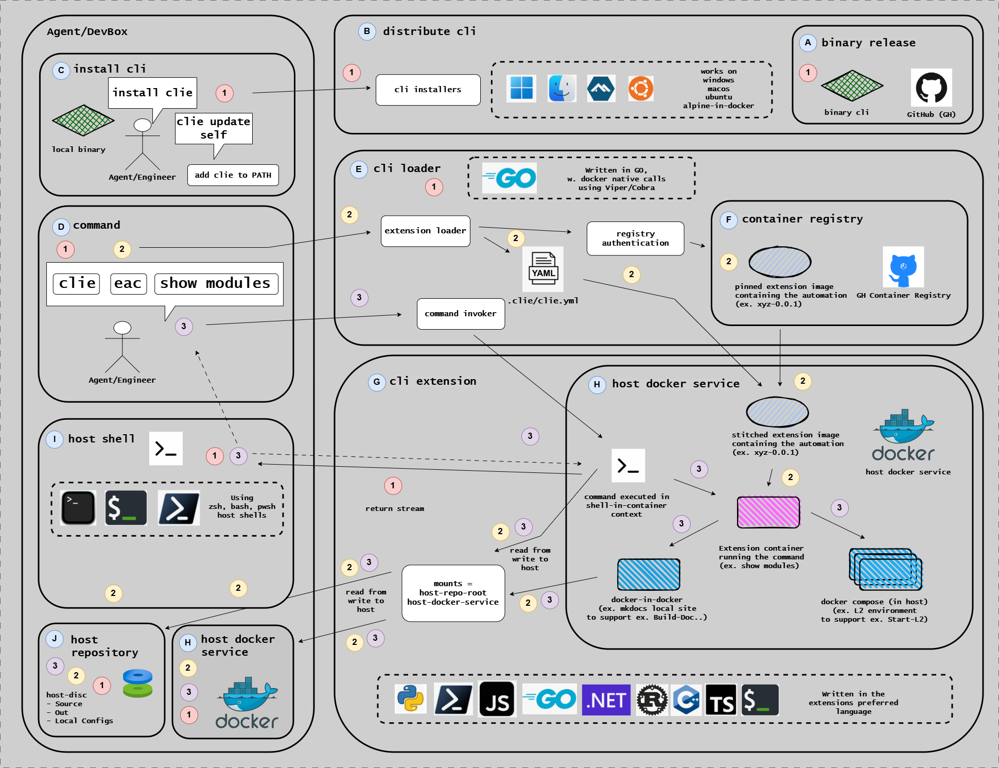

# CLIE CLI Reference

Technical reference for the CLIE CLI framework.

The diagram above shows the CLIE CLI ecosystem architecture: the Agent/DevBox environment, the distributed CLI binary, container registry integration, and language-specific integrations.

## What is CLIE CLI?

CLIE is a cross-platform CLI framework for containerized workflow execution. It provides a foundation for building modular command-line tools with support for Docker-based workflows, extension systems, and template management.

CLIE acts as a **containerized extension framework** that runs tools in isolated Docker containers, providing reproducible, platform-independent environments. EAC is the primary extension for CLIE, offering automation commands for quality engineering workflows including build, test, scan, and release management.

## In This Section

| Reference                               | Description                      |
| --------------------------------------- | -------------------------------- |
| [Commands](./commands/index.md)         | CLIE CLI command reference       |
| [Architecture](./architecture/index.md) | CLIE CLI architecture and design |

## Related Documentation

- [EAC Extension Reference](../eac/index.md) - EAC extension for CLIE
- [How-to Guides: CLIE CLI](../../how-to-guides/clie/index.md) - Task-oriented guides
