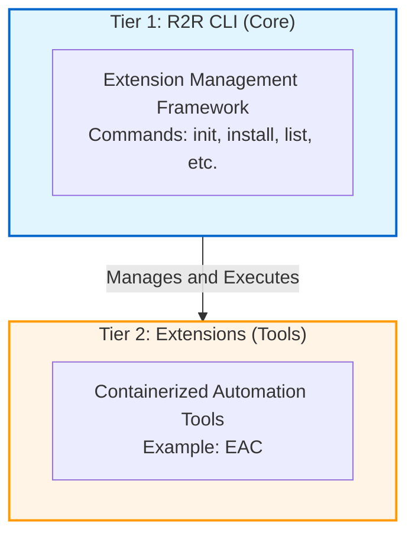

# R2R CLI vs Extensions: Understanding the Architecture

This guide explains the two-tier architecture of R2R: the core CLI framework and containerized extensions.

## Overview

R2R uses a two-tier command structure that separates framework management from automation tools:



## Tier 1: R2R CLI (Core Framework)

### Purpose

The R2R CLI is the **framework** that manages containerized extensions. It handles:

- Extension installation and lifecycle
- Docker container orchestration
- Configuration management
- Registry interaction

### Commands

Framework commands that manage extensions:

| Command        | Purpose                     |
| -------------- | --------------------------- |
| `r2r init`     | Initialize configuration    |
| `r2r install`  | Install extensions          |
| `r2r list`     | Browse available extensions |
| `r2r validate` | Validate configuration      |
| `r2r cleanup`  | Clean up old images         |
| `r2r verify`   | Check system prerequisites  |

### Where It Runs

- **Host machine** (your computer/CI environment)
- **Direct binary execution** (not containerized)
- **Single installation** per system

### Configuration

- **File**: `.r2r/r2r-cli.yml`
- **Purpose**: Extension registry and runtime settings
- **Scope**: Framework-level configuration

## Tier 2: Extensions (Automation Tools)

### Purpose

Extensions are **containerized tools** that provide automation capabilities. Each extension:

- Runs inside a Docker container
- Provides specific automation commands
- Has isolated dependencies
- Uses consistent environments

### Examples

| Extension          | Commands                    | Purpose                       |
| ------------------ | --------------------------- | ----------------------------- |
| **eac**            | build, test, validate, scan | Everything-as-Code automation |
| **pwsh**           | script execution            | PowerShell automation         |
| **python**         | script execution            | Python automation             |
| **docker-builder** | multi-platform builds       | Docker utilities              |

### Where They Run

- **Inside Docker containers**
- **Isolated from host**
- **Reproducible environments**

### Configuration

- **Directory**: `.r2r/<extension>/`
- **Purpose**: Extension-specific settings
- **Scope**: Per-extension configuration

Example: `.r2r/eac/` contains EAC-specific config like `ai-provider.yml`.

## The Relationship

### How They Work Together

1. **R2R CLI** manages extensions:

   ```bash
   r2r init          # CLI creates config
   r2r install eac   # CLI pulls Docker image
   r2r list          # CLI queries registry
   ```

2. **Extensions** provide tools:

   ```bash
   r2r eac build     # Extension runs in container
   r2r eac test      # Extension runs in container
   r2r pwsh script   # Extension runs in container
   ```

### Command Execution Flow

```text
User runs: r2r eac build

   ↓
[R2R CLI]
  ├─ Reads .r2r/r2r-cli.yml
  ├─ Finds 'eac' extension config
  ├─ Pulls image if needed
  ├─ Mounts workspace volume
  └─ Starts Docker container
       ↓
   [EAC Extension Container]
     ├─ Runs 'eac build' inside container
     ├─ Has access to /workspace (your project)
     ├─ Reads .r2r/eac/ configuration
     └─ Executes build and returns results
          ↓
   [R2R CLI]
     └─ Displays output to user
```

## Key Differences

| Aspect            | R2R CLI (Tier 1)       | Extensions (Tier 2)       |
| ----------------- | ---------------------- | ------------------------- |
| **Purpose**       | Extension management   | Automation tools          |
| **Installation**  | System-wide binary     | Per-project Docker images |
| **Runs**          | On host machine        | Inside containers         |
| **Updates**       | `r2r update`           | Automatic via registry    |
| **Configuration** | `.r2r/r2r-cli.yml`     | `.r2r/<extension>/`       |
| **Commands**      | Framework operations   | Tool-specific operations  |
| **Examples**      | init, install, cleanup | build, test, scan         |

## Configuration Layering

### Two-Level Configuration

```text
Project Root/
├── .r2r/
│   ├── r2r-cli.yml              ← Tier 1: Framework config
│   │                                (Which extensions to use)
│   └── eac/                     ← Tier 2: Extension config
│       ├── ai-provider.yml          (How EAC behaves)
│       └── repository.yml
```

### Configuration Purposes

**Tier 1** (`.r2r/r2r-cli.yml`):

```yaml
extensions:
  - name: 'eac'
    image: 'ghcr.io/ready-to-release/ext-eac:latest'
  - name: 'pwsh'
    image: 'ghcr.io/ready-to-release/ext-pwsh:latest'
```

→ Tells R2R CLI which extensions are available

**Tier 2** (`.r2r/eac/ai-provider.yml`):

```yaml
ai:
  provider: claude-api
  model: claude-sonnet-4-5
```

→ Tells EAC extension which AI provider to use

## Why This Architecture?

### Benefits

1. **Isolation**: Extensions don't interfere with each other
2. **Reproducibility**: Same container = same environment everywhere
3. **Versioning**: Lock extensions to specific versions
4. **Portability**: Works on any system with Docker
5. **Security**: Containers provide sandboxing
6. **Flexibility**: Mix and match extensions as needed

### Tradeoffs

- **Requires Docker**: Must have Docker installed
- **Image storage**: Extensions consume disk space
- **Startup overhead**: Container startup adds milliseconds

## Practical Examples

### Example 1: New Project Setup

```bash
# Tier 1: Set up framework
r2r init                    # Create extension config
r2r install eac             # Install EAC extension
r2r install pwsh            # Install PowerShell extension

# Tier 2: Configure extensions
r2r eac init --ai-provider claude-api
r2r pwsh configure

# Tier 2: Use extensions
r2r eac build
r2r eac test
r2r pwsh run-script.ps1
```

### Example 2: Development vs CI

**Development** (`.r2r/r2r-cli.local.yml`):

```yaml
extensions:
  - name: 'eac'
    image: 'ext-eac:dev'          # Local dev image
    pull_policy: 'Never'          # Don't pull
```

**CI** (`.r2r/r2r-cli.yml`):

```yaml
extensions:
  - name: 'eac'
    image: 'ghcr.io/ready-to-release/ext-eac:latest'
    pull_policy: 'Always'         # Always get latest
```

### Example 3: Multiple Extension Versions

```yaml
extensions:
  - name: 'eac'
    image: 'ghcr.io/ready-to-release/ext-eac:v1.2.3'

  - name: 'eac-beta'
    image: 'ghcr.io/ready-to-release/ext-eac:v2.0.0-beta'
```

Use different versions side by side:

```bash
r2r eac build          # Uses v1.2.3
r2r eac-beta build     # Uses v2.0.0-beta
```

## Common Workflows

### Installing R2R for the First Time

```bash
# Step 1: Install R2R CLI binary (Tier 1)
curl -fsSL https://raw.githubusercontent.com/ready-to-release/eac/main/scripts/sh/cli/install.sh | bash

# Step 2: Initialize framework (Tier 1)
r2r init

# Step 3: Install extensions (Tier 1)
r2r install eac

# Step 4: Configure extensions (Tier 2)
r2r eac init --ai-provider claude-api

# Step 5: Use extensions (Tier 2)
r2r eac build
```

### Daily Development

```bash
# Framework commands (as needed)
r2r cleanup            # Free disk space
r2r verify             # Check system health

# Extension commands (frequently)
r2r eac build
r2r eac test
r2r eac validate
r2r pwsh run-tests.ps1
```

### Troubleshooting

```bash
# Framework diagnostics (Tier 1)
r2r version            # Check CLI version
r2r verify             # Verify prerequisites
r2r validate           # Check configuration
r2r list               # See available extensions

# Extension diagnostics (Tier 2)
r2r interactive eac    # Open container shell
r2r metadata eac       # Get extension info
r2r eac --help         # Extension help
```

## Summary

### Quick Reference

**Use R2R CLI commands when:**

- ✅ Setting up a new project
- ✅ Installing or managing extensions
- ✅ Maintaining Docker images
- ✅ Verifying system health
- ✅ Configuring extension registry

**Use Extension commands when:**

- ✅ Building, testing, or validating code
- ✅ Running automation workflows
- ✅ Executing project-specific tasks
- ✅ Working with project files
- ✅ Performing daily development tasks

### Mental Model

Think of it like package managers:

- **R2R CLI** = `apt` / `brew` / `npm` (installs packages)
- **Extensions** = packages themselves (provide functionality)

```bash
# Package manager layer
npm install webpack        # Install package

# Package usage layer
webpack build             # Use package
```

Similarly:

```bash
# Framework layer
r2r install eac           # Install extension

# Extension usage layer
r2r eac build             # Use extension
```

## See Also

- [R2R CLI Overview](../../r2r/commands/index.md) - Framework commands
- [EAC Commands Reference](../commands/index.md) - Extension commands
- [Configuration Guide](../../r2r/commands/configuration.md) - Detailed configuration
- [Quick Start Tutorial](../../../tutorials/getting-started/quick-start.md) - Getting started
