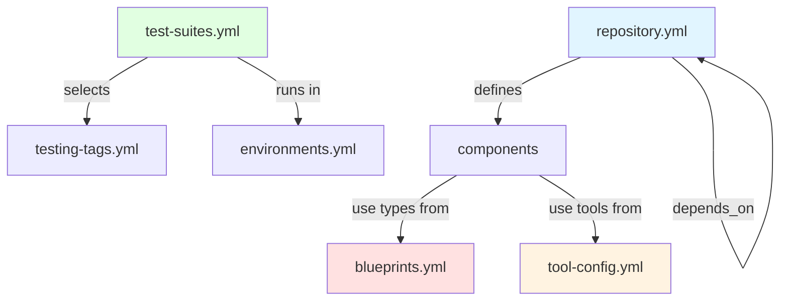

# Contracts

## Overview

The EAC contract system defines all configuration via **YAML contracts validated against JSON schemas**. Configuration, architecture, and behavior are version-controlled and validated before execution.

**Principle**: Configuration over Convention - Everything is explicit, not implicit.

**Components**:

1. **Contract Files** - YAML configuration in `.eac/*.yml`
2. **JSON Schemas** - Validation rules in `contracts/**/*.schema.json`
3. **Validation Engine** - Runtime validation in `eac-core`

---

## All Contracts

| Contract           | File                 | Location                  | Purpose                                          |
| ------------------ | -------------------- | ------------------------- | ------------------------------------------------ |
| **Repository**     | `repository.yml`     | `.eac/`                   | Module definitions, dependencies, file ownership |
| **Blueprints**     | `blueprints.yml`     | `contracts/.../defaults/` | Component kind definitions with build behavior   |
| **Tool Config**    | `tool-config.yml`    | `contracts/.../defaults/` | Tool definitions and resource configuration      |
| **Registries**     | `registries.yml`     | `contracts/.../defaults/` | Container registry definitions                   |
| **Environments**   | `environments.yml`   | `contracts/.../defaults/` | Test execution environments (L0-L4)              |
| **Test Suites**    | `test-suites.yml`    | `contracts/.../defaults/` | Test suites with tag selectors                   |
| **Testing Tags**   | `testing-tags.yml`   | `contracts/.../defaults/` | Valid test tag definitions                       |
| **Books**          | `books.yml`          | `.eac/`                   | Documentation book configuration                 |
| **Security Tools** | `security-tools.yml` | `contracts/.../defaults/` | Security scanning tool configuration             |
| **AI Config**      | `ai-config.yml`      | `contracts/.../defaults/` | AI type definitions                              |
| **AI Provider**    | `ai-provider.yml`    | `contracts/.../defaults/` | Default AI provider settings                     |
| **Logging**        | `logging.yml`        | `contracts/.../defaults/` | Logging configuration                            |

**Location**: User configs in `.eac/`, system defaults in `contracts/eac-core/0.1.0/defaults/`, schemas in `contracts/eac-core/0.1.0/`

---

## Modules Contract

**File**: `.eac/repository.yml`

**Purpose**: Central module registry defining module identities, dependencies, and file ownership

### Structure

**Minimal** (only 2 required fields):

```yaml
modules:
  - moniker: my-module
    type: go-library
```

**Complete**:

```yaml
modules:
  - moniker: eac-core
    name: EAC Core Libraries
    description: Core domain libraries for contract management
    type: go-library
    depends_on: [logging-go]
    files:
      root: go/core
      source: ["**/*.go"]
      tests: ["**/*_test.go"]
      exclude: ["**/*_old.go"]
    versioning:
      scheme: semver
      prefix: v
    metadata:
      owner: platform-team
      criticality: high
```

### Repository Settings

The `repository:` top-level key in `repository.yml` controls repository-wide behavior.

```yaml
repository:
  type: mono                        # mono, poly, or adjunct
  trunk_branch: main
  max_branch_age_days: 30           # stale branch warning threshold
  schemes: [semver, calver]         # valid versioning schemes for releasable modules
  optimize_git_ls_in_ci: true       # use GitHub API for file listing in CI (faster)

  ghost-tracking:
    ghost-alias: ghost              # prefix for ghost/dark-launch code markers
                                    # results in patterns: ghost-*, ghost.*, ghost

  pr:
    delete_branch_on_merge: true
    merge_strategy: squash          # squash, merge, or rebase

  versioning:
    constraint: unrestricted        # unrestricted, patch-only, or calver-only

  parallelism:
    ci: 8                           # max parallel workers in CI
    devbox: 16                      # max parallel workers locally

  remote:
    type: github                    # github, gitlab, azure-devops, bitbucket
    owner: my-org
    repo: my-repo                   # auto-detected from git if empty
    url: ""                         # derived from type/owner/repo if empty
    pages_url: ""                   # documentation site URL
    registry_url: ""                # container registry URL
```

| Field                   | Type    | Description                                                  |
| ----------------------- | ------- | ------------------------------------------------------------ |
| `type`                  | string  | Repository layout: `mono`, `poly`, `adjunct`                 |
| `trunk_branch`          | string  | Main branch name (default: `main`)                           |
| `max_branch_age_days`   | int     | Warn on branches older than this many days                   |
| `schemes`               | array   | Valid versioning schemes (`semver`, `calver`); `implicit` is always available |
| `optimize_git_ls_in_ci` | bool    | Use GitHub API instead of `git ls-files` in CI               |
| `ghost-tracking`        | object  | Ghost (dark launch) code tracking configuration              |
| `ghost-alias`           | string  | Prefix for ghost markers (default: `ghost`)                  |
| `pr`                    | object  | Pull request workflow settings                               |
| `versioning`            | object  | Repository-wide versioning constraints                       |
| `parallelism`           | object  | Max parallel workers for CI and local dev                    |
| `remote`                | object  | Remote VCS provider configuration                            |

### Key Fields

| Field         | Type   | Required | Description                              |
| ------------- | ------ | -------- | ---------------------------------------- |
| `moniker`     | string | ✅       | Unique module identifier (kebab-case)    |
| `type`        | string | ❌       | Deprecated; use `components` instead     |
| `name`        | string | ❌       | Human-readable name                      |
| `description` | string | ❌       | Module purpose                           |
| `depends_on`    | array  | ❌       | Module dependencies (monikers or group names)  |
| `depends_on_ci` | array  | ❌       | CI-only artifact dependencies (merged for dispatch) |
| `group`         | string | ❌       | Group name for bulk dependency targeting       |
| `files`         | object | ❌       | File ownership patterns (glob)                 |
| `versioning`    | object | ❌       | Versioning configuration (semver/calver)       |
| `metadata`      | object | ❌       | Free-form key-value pairs                      |
| `linting`       | object | ❌       | Per-module linting overrides                   |

### File Ownership

```yaml
files:
  root: go/core # Base directory
  source: ["**/*.go"] # Source patterns (glob)
  tests: ["**/*_test.go"] # Test patterns
  exclude: ["**/vendor/**"] # Exclusions
```

**Validation Rule**: Each file must be claimed by exactly one module

**Command**: `eac validate module-files`

### Additional Module Fields

#### `depends_on_ci`

CI artifact dependencies. These are modules whose build artifacts are needed at CI time
but are not source-level dependencies. They are merged into `depends_on` for CI dispatch
layering but do not affect local build ordering.

```yaml
modules:
  - moniker: eac-core
    depends_on: [contracts]
    depends_on_ci: [oci-tools]    # needs container images in CI, not locally
```

#### `group`

Assigns a module to a named group. Groups can be referenced in `depends_on` to depend
on all members of the group at once.

```yaml
modules:
  - moniker: lib-a
    group: shared-libs
  - moniker: lib-b
    group: shared-libs

  - moniker: my-app
    depends_on: [shared-libs]     # depends on both lib-a and lib-b
```

#### `metadata`

A free-form key-value map for module-specific data. Used for ownership, criticality,
and any other annotations that tools or reports can consume.

```yaml
modules:
  - moniker: eac-core
    metadata:
      owner: platform-team
      criticality: high
      team-channel: "#platform-eng"
```

#### `linting`

Per-module linting overrides. Controls which lint providers run for this module.

```yaml
modules:
  - moniker: legacy-scripts
    linting:
      disabled: ["all"]           # skip all linting for this module

  - moniker: eac-core
    linting:
      enabled: [golangci-lint]    # only run golangci-lint (ignore others)

  - moniker: docs-site
    linting:
      disabled: [markdownlint]    # skip markdownlint, run everything else
```

| Field      | Type  | Description                                                        |
| ---------- | ----- | ------------------------------------------------------------------ |
| `enabled`  | array | Lint providers to use (empty = all applicable from lint-providers) |
| `disabled` | array | Lint providers to skip, or `["all"]` to disable linting entirely  |

### Component Facets

Components can declare **facets** — lightweight sub-components for specifications,
design, and documentation assets. Each facet expands into a synthetic component named
`{parent}~{suffix}` with the appropriate component kind.

| Facet    | Suffix   | Component Kind | Purpose                       |
| -------- | -------- | -------------- | ----------------------------- |
| `specs`  | `specs`  | `gherkin`      | BDD specification files       |
| `design` | `design` | `structurizr`  | Architecture DSL files        |
| `docs`   | `docs`   | `docs-assets`  | Documentation asset files     |

#### Simple form (inherits parent root)

```yaml
components:
  - type: go
    root: go/core
    specs: ["**/*.feature"]       # creates go~specs (gherkin, root: go/core)
```

#### Rooted form (independent root)

```yaml
components:
  - type: go
    root: go/cli/eac
    design:
      root: specs/docs/.design    # creates go~design (structurizr, root: specs/docs/.design)
      patterns:
        - "workspace.dsl"
        - "**/*.dsl"
    docs: ["**/*.md"]             # creates go~docs (docs-assets, root: go/cli/eac)
```

Synthetic components participate in builds, linting, and scanning like any other component.
They inherit the parent component's root unless the rooted form provides an explicit `root`.

### Companion Components

The `with` field on a component auto-creates additional components that share the same root.
Each companion uses its type as its name. If a component with that name already exists,
the companion is skipped.

```yaml
components:
  - type: mkdocs-site
    root: docs
    with: [docs-assets, docs-drawio, docs-mermaid]
    # creates three companions, all rooted at docs/:
    #   docs-assets   (type: docs-assets)
    #   docs-drawio   (type: docs-drawio)
    #   docs-mermaid  (type: docs-mermaid)
```

Companions are useful when a single directory tree contains multiple buildable concerns
(e.g., a documentation site that also has draw.io diagrams and mermaid charts).

### Dependencies

**Example**:

```yaml
modules:
  - moniker: logging-go
    type: go-library

  - moniker: eac-core
    type: go-library
    depends_on: [logging-go]

  - moniker: eac-commands
    type: go-commands
    depends_on: [eac-core]
```

**Build Order** (topological sort): logging-go → eac-core → eac-commands

**Validation**: `eac validate module-hierarchy` checks for circular dependencies

---

## Blueprints Contract

**File**: `contracts/core/0.1.0/schemas/defaults/blueprints.yml`

**Purpose**: Define component kinds with build behavior, file patterns, and tooling

### Structure

**Minimal**:

```yaml
types:
  - name: my-type
    description: "My custom module type"
```

**Complete**:

```yaml
types:
  - name: go-cli
    description: "Go CLI application with cross-platform builds"
    build_deps: [go]
    capabilities: [go_module, executable, cross_compile]

    build:
      artifacts:
        - type: executable
          pattern: "{moniker}-{os}-amd64{ext}"
          platforms: [linux, windows, darwin]
          verify: current_platform

    defaults:
      files:
        source: ["**/*.go"]
        tests: ["**/*_test.go"]
      repo:
        specs: ["{specs_root}/{moniker}/**"]
```

### Key Fields

| Field          | Type   | Required | Description                                     |
| -------------- | ------ | -------- | ----------------------------------------------- |
| `name`         | string | ✅       | Unique type identifier (kebab-case)             |
| `description`  | string | ✅       | Human-readable description                      |
| `build_deps`   | array  | ❌       | System dependencies (go, docker, npm)           |
| `capabilities` | array  | ❌       | Type capabilities (executable, go_module, etc.) |
| `build`        | object | ❌       | Build artifacts configuration                   |
| `defaults`     | object | ❌       | Default values inherited by modules             |
| `docker_build` | object | ❌       | Docker build config (clie-extension only)       |

### Capabilities

| Capability      | Description                         |
| --------------- | ----------------------------------- |
| `go_module`     | Go module (workspace member)        |
| `executable`    | Produces executable binary          |
| `cross_compile` | Supports cross-platform compilation |
| `container`     | Docker container image              |
| `documentation` | Documentation generation            |

### Build Artifacts

```yaml
build:
  artifacts:
    - type: executable # Artifact type
      pattern: "{moniker}-{os}-amd64{ext}" # Path pattern
      platforms: [linux, windows, darwin] # Target platforms
      verify: current_platform # Verification mode
```

**Artifact Types**: `executable`, `library`, `marker`, `image`, `site`

**Pattern Variables**: `{moniker}`, `{os}`, `{arch}`, `{ext}`, `{root}`

### Component Type Families

**Go Family**:

- `go-cli` - CLI application with cross-platform builds
- `go-library` - Library package (no executable)
- `go-commands` - Library with CLI invoke wrapper
- `go-mcp` - MCP server module
- `go-tests` - Test-only module

**Docker Family**:

- `clie-extension` - CLIE extension packaged as container

**Documentation Family**:

- `mkdocs-site` - MkDocs HTML documentation
- `mkdocs-pdf` - MkDocs PDF generation

**Infrastructure Family**:

- `configuration` - Configuration files
- `scripts-package` - Shell scripts
- `templates` - Template files

### Inheritance Example

```yaml
# Type defines defaults
types:
  - name: go-library
    defaults:
      files:
        source: ["**/*.go"]

# Module inherits automatically
modules:
  - moniker: my-lib
    type: go-library
    # Automatically has files.source = ["**/*.go"]

# Module can override
modules:
  - moniker: my-lib2
    type: go-library
    files:
      source: ["cmd/**/*.go"]  # Override
```

---

## Environments Contract

**File**: `.eac/environments.yml`

**Purpose**: Define test execution environments organized in testing pyramid hierarchy (L0-L4)

### Structure

**Minimal**:

```yaml
environments:
  - moniker: l00-01
    name: "L0 Environment 01"
    level: "L0"
    type: "unit"
```

**Complete**:

```yaml
environments:
  - moniker: plte01
    name: "PLTE Environment 01 - Kubernetes"
    description: "Kubernetes-based production-like test environment"
    level: "L3"
    type: "plte"
```

### Key Fields

| Field         | Type   | Required | Description                                       |
| ------------- | ------ | -------- | ------------------------------------------------- |
| `moniker`     | string | ✅       | Unique environment identifier (kebab-case)        |
| `name`        | string | ✅       | Human-readable environment name                   |
| `level`       | string | ✅       | Test level: L0, L1, L2, L3, L4                    |
| `type`        | string | ✅       | Environment type (unit, docker, plte, production) |
| `description` | string | ❌       | Detailed environment description                  |

### Testing Pyramid Levels

| Level  | Speed     | Execution Time | Type       | Use Cases                          |
| ------ | --------- | -------------- | ---------- | ---------------------------------- |
| **L0** | Very Fast | < 100ms        | unit       | Pure logic, no I/O                 |
| **L1** | Fast      | 100ms - 1s     | unit       | Component tests, mocked deps       |
| **L2** | Moderate  | 1s - 30s       | docker     | Service integration, API contracts |
| **L3** | Slow      | 30s - 5min     | plte       | End-to-end tests, PLTE             |
| **L4** | Variable  | Variable       | production | Smoke tests, production            |

**Recommended Distribution**: 54% L0, 30% L1, 10% L2, 5% L3, 1% L4

### Environment Types

| Type             | Description                                   | Typical Levels |
| ---------------- | --------------------------------------------- | -------------- |
| `unit`           | In-process or fast unit tests                 | L0, L1         |
| `docker`         | Single Docker container                       | L2             |
| `docker-compose` | Multi-container orchestration                 | L2             |
| `plte`           | Production-Like Test Environment (Kubernetes) | L3             |
| `production`     | Live production                               | L4             |

### Examples

**L0 (Very Fast)**:

```yaml
- moniker: l00-01
  name: "L0 Environment 01 - In-process Unit Tests"
  level: "L0"
  type: "unit"
```

**L2 (Docker)**:

```yaml
- moniker: local01
  name: "Local Environment 01 - Docker Container"
  level: "L2"
  type: "docker"
```

**L3 (PLTE)**:

```yaml
- moniker: plte01
  name: "PLTE Environment 01 - Kubernetes"
  level: "L3"
  type: "plte"
```

---

## Test Suites Contract

**File**: `.eac/test-suites.yml`

**Purpose**: Define test suites with tag-based selection criteria

### Structure

```yaml
suites:
  - moniker: commit
    name: Commit Tests
    description: "Fast tests for commit validation"
    selectors:
      - any_of_tags: ["@L0", "@L1"]
        exclude_tags: ["@L2", "@L3", "@L4"]

  - moniker: acceptance
    name: Acceptance Tests
    description: "Comprehensive acceptance tests"
    selectors:
      - require_tags: ["@L0", "@L1", "@L2"]
        exclude_tags: ["@wip"]
```

### Selector Types

| Selector       | Description        | Example             |
| -------------- | ------------------ | ------------------- |
| `require_tags` | Must have ALL tags | `["@L0", "@smoke"]` |
| `any_of_tags`  | Must have ANY tag  | `["@L0", "@L1"]`    |
| `exclude_tags` | Must NOT have tags | `["@wip", "@skip"]` |

---

## Contract Relationships



---

## Validation System

### Validation Levels

| Level               | Validates                           | Command                     |
| ------------------- | ----------------------------------- | --------------------------- |
| **Schema**          | YAML structure against JSON schema  | `validate-contracts`        |
| **Cross-reference** | Dependencies and references exist   | `validate-dependencies`     |
| **File ownership**  | Files claimed by exactly one module | `validate-module-files`     |
| **Hierarchy**       | Dependency graph is acyclic         | `validate-module-hierarchy` |
| **Specs**           | Gherkin syntax, tag validity        | `validate-specs`            |
| **Design**          | Structurizr DSL syntax              | `validate-design`           |

### Commands

```bash
# Validate all contracts
eac validate

# Schema validation
eac validate contracts

# Cross-references
eac validate dependencies

# File ownership
eac validate module-files

# Dependency graph
eac validate module-hierarchy

# Gherkin specs
eac validate specs

# Structurizr DSL
eac validate design
```

---

## Configuration Precedence

**Hierarchy** (highest to lowest priority):

1. **Personal config** (`.personal.yml` files, not in Git)
2. **User config** (`.yml` files in `.eac/`)
3. **System defaults** (`contracts/eac-core/0.1.0/defaults/`)
4. **Hardcoded defaults** (in eac-core code)

**Example**: `.eac/blueprints.yml` overrides `contracts/core/0.1.0/schemas/defaults/blueprints.yml`

---

## Contract Lifecycle

**1. Definition**: Create/edit YAML files in `.eac/`

**2. Validation**: Validate against JSON schema

```bash
eac validate contracts
```

**3. Loading**: Contracts loaded at command runtime

```text
Command Start → Load Contracts → Validate → Build Registry → Execute
```

**4. Execution**: Contracts drive behavior (builds, tests, commands)

---

## IDE Integration

YAML Language Server support via schema reference:

```yaml
# yaml-language-server: $schema=../../contracts/eac-core/0.1.0/modules.schema.json
modules:
  - moniker: | # IDE provides auto-completion
```

**Features**:

- Auto-completion for fields
- Inline validation
- Hover documentation
- Enum value suggestions

**Supported IDEs**: VS Code, IntelliJ, Neovim (with LSP)

---

## Schema Versioning

EAC uses **semantic versioning** for contracts to enable backward-compatible evolution and multiple version support.

### Versioned Contract Structure

All contracts follow a standardized directory structure with version directories:

```text
contracts/
├── ai-provider/
│   └── 0.1.0/
│       ├── ai-provider.schema.json
│       ├── defaults/
│       │   └── base.yml
│       └── examples/ (optional)
├── clie/
│   └── 0.1.0/
│       ├── clie.schema.json
│       └── defaults/
│           └── base.yml
├── container-runtime/
│   └── 0.1.0/
│       ├── container-runtime.schema.json
│       └── defaults/
├── core/
│   └── 0.1.0/
│       ├── core.schema.json
│       └── defaults/
│           ├── base.yml
│           ├── blueprints.yml
│           ├── tool-config.yml
│           └── ...
├── docs/
│   └── 0.1.0/
│       ├── docs.schema.json
│       └── defaults/
├── runner/
│   └── 0.1.0/
│       ├── runner.schema.json
│       └── defaults/
├── scanner/
│   └── 0.1.0/
│       ├── scanner.schema.json
│       └── defaults/
└── tui/
    └── 0.1.0/
        ├── tui.schema.json
        └── defaults/
```

### Contract Modules (8 contracts at v0.1.0)

| Contract              | Purpose                            |
| --------------------- | ---------------------------------- |
| **ai-provider**       | AI provider integration interface  |
| **clie**              | CLIE CLI framework configuration   |
| **container-runtime** | Container runtime interface        |
| **core**              | Core configuration and environment |
| **docs**              | Documentation generation contracts |
| **runner**            | Test runner interface              |
| **scanner**           | Security scanner interface         |
| **tui**               | Terminal UI component interface    |

See [Contracts Module](../modules/contracts.md) for detailed documentation.

### Version Naming Convention

Contracts use **semantic versioning** (MAJOR.MINOR.PATCH):

- **MAJOR**: Breaking changes (incompatible schema changes)
- **MINOR**: New features (backward-compatible additions)
- **PATCH**: Bug fixes (clarifications, documentation)

### Current Version

All contracts are currently at **version 0.1.0**, indicating pre-release stability.

### Future Versioning

As contracts evolve:

```text
contracts/runner/
├── 0.1.0/          # Initial version
├── 0.2.0/          # Added new optional fields
├── 1.0.0/          # Stable release
└── 2.0.0/          # Breaking changes
```

**Migration**: Schema versioning with migration tools for contract upgrades will be added in future releases.

## Display and Query Commands

### Display Commands (Human-Readable)

```bash
eac show modules            # Module table
eac show dependencies       # Dependency graph
eac show environments       # Environment table
eac show component-kinds    # Component kind table
eac show config             # All configuration
```

### Get Commands (JSON Output)

```bash
eac get modules             # Modules JSON
eac get dependencies        # Dependencies JSON
eac get environments        # Environments JSON
eac get config              # Config JSON
```

---

## Common Patterns

### Module Definition Pattern

```yaml
# Go library
- moniker: my-lib
  type: go-library
  depends_on: [other-lib]
  files:
    root: go/my/lib
    source: ["**/*.go"]
    tests: ["**/*_test.go"]

# Go CLI with versioning
- moniker: my-cli
  type: go-cli
  files:
    root: go/my/cli
  versioning:
    scheme: semver
    prefix: v
```

### Component Type Pattern

```yaml
# Custom type template
- name: my-type
  description: "My custom type"
  build_deps: [go]
  capabilities: [go_module]
  build:
    artifacts:
      - type: marker
        pattern: ".built"
  defaults:
    files:
      source: ["**/*.go"]
```

### Environment Pattern

```yaml
# Fast unit tests
- moniker: l00-01
  level: "L0"
  type: "unit"

# Docker integration tests
- moniker: local01
  level: "L2"
  type: "docker"
```

### Test Suite Pattern

```yaml
# Fast commit tests
- moniker: commit
  selectors:
    - any_of_tags: ["@L0", "@L1"]
      exclude_tags: ["@L2", "@L3", "@L4", "@wip"]

# Production verification
- moniker: production-verification
  selectors:
    - require_tags: ["@L4", "@piv"]
```

---

## Benefits

| Benefit                    | Description                                              |
| -------------------------- | -------------------------------------------------------- |
| **Version Control**        | Track changes, code review, rollback capabilities        |
| **Self-Documenting**       | Human-readable YAML with schema validation               |
| **Early Validation**       | Catch errors pre-commit, not at runtime                  |
| **Consistency**            | Single source of truth, type templates ensure uniformity |
| **Tool Integration**       | IDE support, AI-friendly structured data                 |
| **Explicit Configuration** | No implicit conventions, everything defined              |

---

## Related Documentation

- [Overview](./index.md) - System overview and key concepts
- [Modules](./modules.md) - Module system and dependency management
