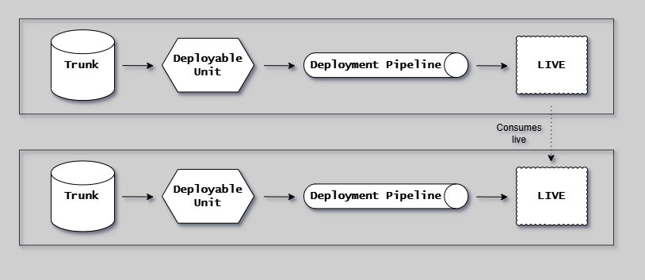

# Module Dependency System

## Overview

The module dependency system allows modules to declare relationships to other modules via `depends_on` in repository.yml.

Dependencies are used for graph visualization, validation, cache invalidation, and release gating.

## Dependency Flow

The following diagram illustrates how dependencies flow from Trunk through Deployable Module and Deployment Pipeline to LIVE, showing the consumption pattern.



## YAML Schema

```yaml
# In .eac/repository.yml
modules:
  - moniker: eac
    depends_on:
      - core
```

**Source**: `go/core/domain/modules/types.go`

```go
type BaseContract struct {
    DependsOn []string `yaml:"depends_on"`
}
```

## Data Flow

```text
repository.yml
     │
     ▼
modules.LoadFromWorkspace()
     │
     ▼
Registry (holds all ModuleContract)
     │
     ├──► GetDependencyGraph()        → map[string][]string (module → dependencies)
     ├──► GetReverseDependencyGraph() → map[string][]string (module → dependents)
     └──► CalculateExecutionOrder()   → ExecutionPlan (layers + flat order)
```

## Key Files

| File                                                | Purpose                                       |
| --------------------------------------------------- | --------------------------------------------- |
| `go/core/domain/modules/types.go`               | `BaseContract.DependsOn` - YAML parsing       |
| `go/core/domain/modules/types.go`               | `ModuleContract.GetDependencies()` - accessor |
| `go/core/repository/dependencies.go`            | Graph operations                              |
| `go/cli/eac/impl/validate/`                     | Cycle detection and hierarchy validation      |
| `go/cli/eac/impl/release/await-deps.go`        | Release-time CI verification                  |

## Execution Order Algorithm

**File**: `go/core/repository/dependencies.go`

Uses **Kahn's topological sort**:

1. Build in-degree map (count of unprocessed dependencies per module)
2. Layer 0 = modules with in-degree 0 (no dependencies)
3. Process layer, decrease in-degrees of dependents
4. Repeat until all modules processed
5. Detect cycles if layer is empty but modules remain

```go
type ExecutionPlan struct {
    Layers         [][]string // [[eac-core], [eac-commands, clie], [eac-ext]]
    ExecutionOrder []string   // Flattened: [eac-core, eac-commands, clie, eac-ext]
    LayerCount     int
}
```

## Cycle Detection

**File**: `go/cli/eac/impl/validate/module-hierarchy.go`

Uses **DFS with recursion stack**:

```go
func validateNoCircularDependencies(reg *modules.Registry, report *moduleHierarchyReport) {
    visited := make(map[string]bool)
    recStack := make(map[string]bool)  // Tracks current path

    // DFS - if we hit a node already in recStack, we found a cycle
    var detectCycle func(moniker string, path []string) bool
}
```

## Dependency Uses

| Use Case           | Description                                                |
| ------------------ | ---------------------------------------------------------- |
| Graph validation   | Checked for cycles, missing references                     |
| Build order        | Optional layer-sequential execution with `--layered-build` |
| Cache invalidation | Dependents rebuild when dependency changes                 |
| Release gating     | Block release if dependency CI failed                      |

## Build Behavior

```text
Default:           All modules run in parallel (up to MaxConcurrency)
--layered-build:   Layer-sequential execution (Layer 0, then Layer 1, etc.)
--skip-depm:       Isolated build - only build specified module, no dependency resolution
```

## CI Isolation

Each CI workflow builds its module in **isolation** - no cross-CI artifact downloads, no dependency resolution.

### Build Command Flag

```bash
build <module> --skip-depm    # Build only this module, skip module dependency handling
```

The `--skip-depm` flag:

- Skips downloading artifacts from other CI workflows
- Skips adding transitive dependencies to execution plan
- Builds only the explicitly specified module(s)

### build-module Action

The `build-module` action defaults to isolated mode (`no-deps: true`).

```yaml
# Default: isolated build (no cross-CI dependencies)
- uses: ./.github/actions/build-module
  with:
    module: eac-commands

# Explicit: build with dependencies (for integration tests)
- uses: ./.github/actions/build-module
  with:
    module: clie-installer
    no-deps: 'false'  # Download dependency artifacts from other CI runs
```

### Why CI Isolation?

1. **Speed**: Each CI runs independently, no waiting for other workflows
2. **Reliability**: CI failures are isolated to their module
3. **Simplicity**: No complex artifact download chains between workflows
4. **Correct gating**: Release-time verification (await-deps) ensures dependencies passed

## CI and Release Gating

CI workflows run in parallel for all changed modules. Release workflows verify dependencies before allowing release.

### CI Dispatch

CI dispatch uses a `CICacheChecker` (from the core [cache system](./cache-system.md#ci-cache-architecture))
to skip modules that already have a successful CI build at the current HEAD SHA.

```text
change-trigger.yaml
    │
    └──► CICacheChecker filters modules (remote:ci cache)
         │
         └──► Dispatch CI workflows for uncached modules
              [eac-core, eac-commands, clie, eac-ext, docs, books, ...]
              No layering, no waiting
```

Bypass with `--skip-cache=remote:ci` to force dispatch for all modules.

### Release Verification

```text
release-eac-ext.yaml
    │
    └──► approve-release action
            │
            ├──► release check-ci (verify own CI passed)
            │
            └──► await-dependency-ci action
                    │
                    └──► release await-deps eac-ext
                            │
                            ├──► Get transitive deps: [eac-commands, eac-core]
                            │
                            ├──► For each dependency:
                            │       ├──► Find last commit that changed it
                            │       ├──► Verify CI passed for that commit
                            │       └──► If in-progress: wait; If failed: block
                            │
                            └──► All passed → allow release
```

### await-deps Command

**File**: `go/cli/eac/impl/release/await-deps.go`

```text
release await-deps <module> [--timeout N] [--skip-static]

1. Load module registry
2. Get transitive dependencies of <module>
3. For each dependency:
   a. Find last commit that changed dep's files (git log -1)
   b. Check CI status for ci-<dep>.yaml at that commit
      - Success: continue
      - In-progress: wait (with timeout)
      - Failed: exit 1 with error
      - Not found: check if dep has CI workflow
4. All passed → exit 0
```

**Output example**:

```text
Awaiting CI for eac-ext dependencies...

Dependencies: eac-commands, eac-core

  Checking eac-commands
    Last changed: abc1234 (feat: add new feature)
    CI run: #12345 ✓ passed

  Checking eac-core
    Last changed: def5678 (fix: resolve issue)
    CI run: #12340 ✓ passed

✓ All 2 dependency CI checks passed
```

## Example Dependency Graph

```text
core (root)
    │
    ├──► eac ──┬──► eac-ext
    │       │      │
    │       │      │
    │       └──► docs
    │
    ├──► clie ──► eac-ext (also depends on eac)
    │
    ├──► godog-eac
    │
    └──► eac-mcp-server
```
