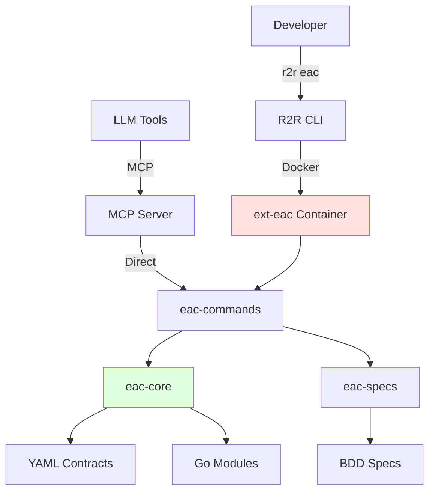

# EAC Extension Architecture

## Overview

**EAC (Everything-as-Code)** is a containerized R2R extension providing automation commands for build,
test, validation, security scanning, and release management in modular Go repositories.

**Purpose**: Command collection for everything-as-code workflows
**Package**: `ext-eac:latest` Docker container
**Integration**: R2R CLI extension, MCP server for AI tools

The EAC extension implements a **contract-driven, module-based architecture** where all repository structure,
modules, dependencies, and configurations are defined in YAML contracts validated against JSON schemas.

---

## Viewing Architecture Diagrams

All architecture diagrams referenced in this document can be viewed interactively using Structurizr:

```bash
r2r eac serve design
# Opens http://localhost:8080
```

**Design files:**

- **eac-commands**: [specs/eac-commands/.design/](https://github.com/ready-to-release/eac/tree/main/specs/eac-commands/.design/)
- **eac-core**: [specs/eac-core/.design/](https://github.com/ready-to-release/eac/tree/main/specs/eac-core/.design/)
- **eac-mcp-commands**: [specs/eac-mcp-commands/.design/](https://github.com/ready-to-release/eac/tree/main/specs/eac-mcp-commands/.design/)
- **ext-eac**: [specs/ext-eac/.design/](https://github.com/ready-to-release/eac/tree/main/specs/ext-eac/.design/)

See [Viewing Architecture](../guides/viewing-architecture.md) for detailed instructions.

---

## System Context



**EAC operates in two execution modes**:

1. **Containerized**
   (via R2R CLI): Developer runs `r2r eac <command>` → R2R CLI launches ext-eac Docker container → Command executes in isolated environment
2. **Direct**
   (via MCP): LLM tools connect via MCP protocol → eac-mcp-commands exposes tools → Commands execute directly (no container overhead)

---

## EAC Components

### Core Modules

| Module               | Purpose                                                                  | Type        |
| -------------------- | ------------------------------------------------------------------------ | ----------- |
| **eac-commands**     | Command implementations with integrated AI providers (Anthropic, OpenAI) | go-commands |
| **eac-core**         | Domain libraries, contract system, dependency graph                      | go-library  |
| **eac-specs**        | BDD test infrastructure (Godog), OSCAL compliance                        | go-library  |
| **eac-mcp-commands** | MCP server for LLM tool integration                                      | go-mcp      |

See [Module Architectures](./modules/) for detailed C4 diagrams.

### Supporting Modules

| Module                | Purpose                                            |
| --------------------- | -------------------------------------------------- |
| **docs**              | MkDocs documentation site generation               |
| **templates**         | Template management for specs, reports, AI prompts |
| **r2r-installer**     | Cross-platform CLI installer                       |
| **implicit-r2r-cli**  | Devbox CLI configuration                           |
| **vscode-ext-commit** | VS Code commit message extension                   |

See [Supporting Modules](./modules/supporting/) for details.

### Container Structure

```text
ext-eac:latest
├── /app/eac              # Compiled commands binary
├── /workspace            # Mounted repository (volume)
└── /usr/local/bin        # System dependencies (git, gh, etc.)
```

---

## Architecture Patterns

### Contract-Driven Architecture

All repository structure is defined in **YAML contracts** validated against **JSON schemas**:

| Contract             | Schema Location            | Purpose                             |
| -------------------- | -------------------------- | ----------------------------------- |
| **repository.yml**   | `repository.schema.json`   | Repository-wide configuration       |
| **modules.yml**      | `modules.schema.json`      | Module definitions and dependencies |
| **module-types.yml** | `module-types.schema.json` | Module type definitions             |
| **books.yml**        | `books.schema.json`        | Documentation book configuration    |
| **tests.yml**        | `tests.schema.json`        | Test suite and case definitions     |

Contracts are loaded by `eac-core` at runtime and validated before any operation. This ensures:

- **Type safety**: Invalid configurations fail fast with clear error messages
- **Documentation**: Schemas serve as machine-readable documentation
- **Evolution**: Schema versioning enables backward compatibility

See [Contracts System](./contracts.md) for detailed specification.

### Module System

Modules are the fundamental unit of organization in EAC repositories. Each module:

- Has a unique moniker (e.g., `eac-commands`, `r2r-cli`)
- Owns specific files (defined in `modules.yml`)
- Declares dependencies on other modules
- Has a module type that determines build/test/release behavior

**Module boundaries** are enforced:

- Files can only belong to one module
- Dependencies must be explicitly declared
- Circular dependencies are detected and rejected

See [Module System](./modules.md) for module organization patterns.

### Dependency Management

Modules form a directed acyclic graph (DAG) based on declared dependencies.

EAC uses this graph to:

- **Topological sorting**: Determine build order (dependencies before dependents)
- **Parallel execution**: Build independent modules concurrently
- **Change detection**: Rebuild only changed modules and dependents
- **CI optimization**: Dispatch workflows only for affected modules

**Dependency types**:

- **build_deps**: Required for building (code dependencies)
- **test_deps**: Required for testing (test utilities, fixtures)
- **deploy_deps**: Required for deployment (runtime dependencies)

See [Dependency System](./dependency-system.md) for graph algorithms and caching strategies.

---

## Command Organization

**Commands organized by category**:

| Category       | Example Commands                                                     |
| -------------- | -------------------------------------------------------------------- |
| **Discovery**  | `show-modules`, `show-dependencies`, `get-files`                     |
| **Build**      | `build`, `get-artifacts`, `validate-artifacts`                       |
| **Test**       | `test`, `test-suite`, `test-debug`, `show-test-summary`              |
| **Validation** | `validate-contracts`, `validate-dependencies`, `validate-specs`      |
| **Release**    | `release-changelog`, `release-this`, `release-pending`               |
| **Security**   | `scan`, `scan-zap`, `validate-risk-catalog`                          |
| **AI**         | `create-commit-message`, `create-spec`, `create-design`, `create-pr` |
| **CI/CD**      | `pipeline-run`, `pipeline-wait`, `get-changed-modules-ci`            |

All commands are implemented in `eac-commands` following a consistent pattern:

```go
// All commands follow this pattern
type BuildHandler struct {
    repo *Repository  // From eac-core
}

func (h *BuildHandler) Execute(args []string) error {
    // 1. Load contracts from .r2r/eac/
    // 2. Resolve dependencies using eac-core
    // 3. Execute build logic
    // 4. Verify artifacts and update cache
    return nil
}
```

See [Creating Commands](./creating-commands.md) for command development guide.

---

## AI Integration

**Purpose**: AI provider integrations for automated workflows

**Location**: Integrated within eac-commands at `go/eac/commands/internal/ai/`

### Supported Providers

| Provider      | Models                     | Use Cases                            |
| ------------- | -------------------------- | ------------------------------------ |
| **Anthropic** | Claude Opus, Sonnet, Haiku | Commit messages, specs, designs, PRs |
| **OpenAI**    | GPT-4, GPT-3.5             | Commit messages, specs, designs, PRs |

### Configuration

**File**: `.r2r/eac/ai-config.yml`

```yaml
provider: anthropic
model: claude-sonnet-4
api_key_env: ANTHROPIC_API_KEY
```

### AI-Powered Commands

| Command                 | AI Task                                     | Output          |
| ----------------------- | ------------------------------------------- | --------------- |
| `create-commit-message` | Analyze git diff, generate semantic message | Commit message  |
| `create-spec`           | Convert natural language to Gherkin         | `.feature` file |
| `create-design`         | Generate Structurizr DSL from description   | `workspace.dsl` |
| `create-pr`             | Analyze commits, generate PR description    | GitHub PR body  |

**Implementation**:

- Provider implementations: `go/eac/commands/internal/ai/providers/`
- Configuration loading: `go/eac/commands/internal/ai/config_loader.go`
- AI execution: `go/eac/commands/internal/ai/executor.go`

AI commands use a **retry strategy** with exponential backoff for rate limiting and transient errors.

---

## Configuration Management

### Configuration Hierarchy

**Precedence** (highest to lowest):

1. **Personal config** (`.personal.yml`, not in Git) - User-specific overrides
2. **Shared config** (`.yml` files in `.r2r/eac/`) - Team shared settings
3. **Type defaults** (from `module-types.yml`) - Defaults by module type
4. **System defaults** (hardcoded in eac-core) - Fallback values

This hierarchy allows:

- Teams to share conventions in repository
- Individuals to override without affecting others
- Types to provide sensible defaults
- System to never fail on missing config

---

## Technology Stack

### EAC-Specific Technologies

| Component         | Technology                | Purpose                     |
| ----------------- | ------------------------- | --------------------------- |
| **CLI Framework** | Cobra                     | Command parsing and routing |
| **Configuration** | Viper                     | YAML/ENV config loading     |
| **BDD Testing**   | Godog (Cucumber for Go)   | Gherkin feature execution   |
| **JSON Schema**   | gojsonschema              | Contract validation         |
| **AI Providers**  | Anthropic SDK, OpenAI SDK | LLM integrations            |
| **MCP Server**    | JSON-RPC over stdio       | LLM tool exposure           |

### External Tools

| Tool                | Purpose                              |
| ------------------- | ------------------------------------ |
| **Git**             | Version control and change detection |
| **GitHub CLI (gh)** | GitHub API access                    |
| **MkDocs**          | Documentation generation             |
| **Structurizr**     | C4 model architecture diagrams       |
| **Trivy**           | Vulnerability scanning, SBOM         |
| **Semgrep**         | Static analysis (SAST)               |
| **OWASP ZAP**       | Dynamic analysis (DAST)              |

**Container-level technologies**:

(Docker, Docker SDK) are provided by the [R2R CLI framework](https://ready-to-release.github.io/eac/reference/r2r/architecture/).

---

## Security

**EAC Security Features**:

- **Pre-commit validation**: Validate contracts, specs, and code before committing
- **Security scanning**: Integrated Trivy (vulnerabilities), Semgrep (SAST), ZAP (DAST)
- **OSCAL compliance**: Automated evidence generation in OSCAL 1.1.2 format
- **Secret detection**: Prevent accidental commit of secrets
- **Dependency validation**: Verify module dependencies match declarations

**Evidence collection**:

- **Test results**: BDD feature execution results in structured format
- **Scan results**: Vulnerability, SAST, DAST findings
- **OSCAL documents**: Assessment results, catalogs, profiles
- **Artifacts**: All evidence stored in `out/evidence/` for audit

**Container-level security**:

(isolation, non-root execution, network restrictions) is provided by [R2R CLI](https://ready-to-release.github.io/eac/reference/r2r/architecture/#security-model).

---

## Performance and Scalability

### Parallel Execution

- **Build**: Topological sort enables parallel module builds
- **Test**: Test suites run in parallel by default
- **CI**: GitHub Actions matrix strategy for cross-platform testing

### Caching

- **Build artifacts**: Cached in `.r2r/cache/` for incremental builds
- **Go modules**: Module cache for dependency downloads
- **Git change detection**: Skip unchanged modules entirely
- **Docker layers**: Layer caching for fast container image builds

### Change Detection

EAC uses **git change detection** to minimize unnecessary work:

1. **Local**: Compare working tree vs. last build (`.r2r/cache/last-build-sha`)
2. **CI**: Compare current commit vs. last successful CI run
3. **Dependency propagation**: Rebuild dependents of changed modules

This reduces build times from ~45 minutes (full build) to ~2-5 minutes (incremental).

---

## Integration with R2R CLI

EAC extends the [R2R CLI framework](https://ready-to-release.github.io/eac/reference/r2r/architecture/). The relationship:

- **R2R provides**: Container orchestration, git discovery, volume mounting, configuration loading
- **EAC provides**: Commands, contracts, modules, AI integration, security scanning

See [CLI Integration](./cli-integration.md) for details on the R2R ↔ EAC boundary and extension contract.

---

## Related Documentation

### Architecture

- [R2R CLI Architecture](https://ready-to-release.github.io/eac/reference/r2r/architecture/) - Framework overview and container model
- [Module Architectures](./modules/) - Individual module C4 diagrams
- [Contracts System](./contracts.md) - YAML contract specification
- [Dependency System](./dependency-system.md) - Module dependency graph
- [Component Types](./component-types.md) - Component type reference
- [Repository Layout](./repository-layout.md) - File organization conventions
- [CLI Integration](./cli-integration.md) - R2R ↔ EAC integration details

### How-To Guides

- [Building Modules](../../../how-to-guides/eac/commands/build-test-validate/build-single-module.md)
- [Running Tests](../../../how-to-guides/eac/commands/build-test-validate/run-tests-for-module.md)
- [Creating Specifications](../../../how-to-guides/eac/commands/documentation/create-specifications.md)
- [Generating Architecture Diagrams](../../../how-to-guides/eac/commands/documentation/generate-architecture-diagrams.md)

### Reference

- [EAC Commands](../commands/) - Complete command reference
- [Decision Records](../../repository/decision-records/) - Architectural decisions
