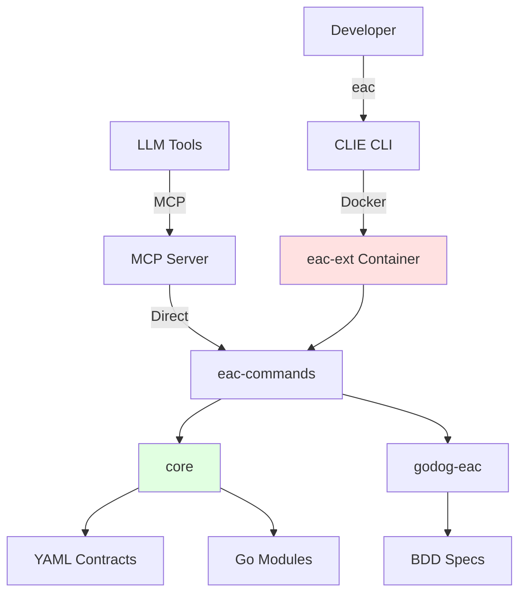

# EAC Extension Architecture

## Overview

**EAC (Everything-as-Code)** is a containerized CLIE extension providing automation commands for build,
test, validation, security scanning, and release management in modular Go repositories.

**Purpose**: Command collection for everything-as-code workflows
**Package**: `eac-ext:latest` Docker container
**Integration**: CLIE CLI extension, MCP server for AI tools

The EAC extension implements a **contract-driven, module-based architecture** where all repository structure,
modules, dependencies, and configurations are defined in YAML contracts validated against JSON schemas.

---

## Viewing Architecture Diagrams

All architecture diagrams referenced in this document can be viewed interactively using Structurizr:

```bash
eac serve design
# Opens http://localhost:8080
```

**Design files:**

- **eac**: [specs/eac/.design/](https://github.com/ready-to-release/eac/tree/main/specs/eac/.design/)
- **core**: [specs/core/.design/](https://github.com/ready-to-release/eac/tree/main/specs/core/.design/)
- **eac-mcp-server**: [specs/eac-mcp-server/.design/](https://github.com/ready-to-release/eac/tree/main/specs/eac-mcp-server/.design/)
- **eac-ext**: [specs/eac-ext/.design/](https://github.com/ready-to-release/eac/tree/main/specs/eac-ext/.design/)

See [Viewing Architecture](./viewing-diagrams.md) for detailed instructions.

---

## System Context



**EAC operates in two execution modes**:

1. **Containerized**
   (via CLIE CLI): Developer runs `eac <command>` → CLIE CLI launches eac-ext Docker container → Command executes in isolated environment
2. **Direct**
   (via MCP): LLM tools connect via MCP protocol → eac-mcp-commands exposes tools → Commands execute directly (no container overhead)

---

## EAC Components

### Core Modules

| Module               | Purpose                                                                  | Type        |
| -------------------- | ------------------------------------------------------------------------ | ----------- |
| **eac**          | Command implementations with integrated AI providers (Anthropic, OpenAI) | go-commands |
| **core**             | Domain libraries, contract system, dependency graph                      | go-library  |
| **godog-eac**    | BDD test infrastructure (Godog), OSCAL compliance                        | go-library  |
| **eac-mcp-server**   | MCP server for LLM tool integration                                      | go-mcp      |

See [Modules Reference](../modules/index.md) for detailed module documentation.

### Supporting Modules

| Module                | Purpose                                            |
| --------------------- | -------------------------------------------------- |
| **docs**              | MkDocs documentation site generation               |
| **templates**         | Template management for specs, reports, AI prompts |
| **vscode-commit**     | VS Code commit message extension                   |

See [Modules Reference](../modules/index.md) for details on all modules.

### Container Structure

```text
eac-ext:latest
├── /app/out/tools/eac    # Compiled commands binary
├── /var/task             # Mounted repository (volume)
└── /usr/local/bin        # System dependencies (git, gh, etc.)
```

---

## Architecture Patterns

### Contract-Driven Architecture

All repository structure is defined in **YAML contracts** validated against **JSON schemas**:

| Contract                | Schema Location               | Purpose                             |
| ----------------------- | ----------------------------- | ----------------------------------- |
| **repository.yml**      | `repository.schema.json`      | Repository-wide configuration       |
| **blueprints.yml**      | `blueprints.schema.json`      | Component kind definitions          |
| **tool-config.yml**     | `tool-config.schema.json`     | Tool definitions and resources      |
| **books.yml**           | `books.schema.json`           | Documentation book configuration    |
| **test-suites.yml**     | `test-suites.schema.json`     | Test suite definitions              |

Contracts are loaded by `core` at runtime and validated before any operation. This ensures:

- **Type safety**: Invalid configurations fail fast with clear error messages
- **Documentation**: Schemas serve as machine-readable documentation
- **Evolution**: Schema versioning enables backward compatibility

See [Contracts System](./contracts.md) for detailed specification.

### Module System

Modules are the fundamental unit of organization in EAC repositories. Each module:

- Has a unique moniker (e.g., `eac-commands`, `clie`)
- Owns specific files (defined in `modules.yml`)
- Declares dependencies on other modules
- Has a module type that determines build/test/release behavior

**Module boundaries** are enforced:

- Files can only belong to one module
- Dependencies must be explicitly declared
- Circular dependencies are detected and rejected

See [Module System](./modules.md) for module organization patterns.

### Dependency Management

Modules form a directed acyclic graph (DAG) based on declared dependencies.

EAC uses this graph to:

- **Topological sorting**: Determine build order (dependencies before dependents)
- **Parallel execution**: Build independent modules concurrently
- **Change detection**: Rebuild only changed modules and dependents
- **CI optimization**: Dispatch workflows only for affected modules

All module dependencies are declared via a single `depends_on` field that covers
build, test, and deployment relationships.

See [Dependency System](./dependencies.md) for graph algorithms and caching strategies.

---

## Command Organization

**Commands organized by category**:

| Category       | Example Commands                                                     |
| -------------- | -------------------------------------------------------------------- |
| **Discovery**  | `show-modules`, `show-dependencies`, `get-files`                     |
| **Build**      | `build`, `get-artifacts`, `validate-artifacts`                       |
| **Test**       | `test`, `test-suite`, `test-debug`, `show-test-summary`              |
| **Validation** | `validate-contracts`, `validate-dependencies`, `validate-specs`      |
| **Release**    | `release-changelog`, `release-this`, `release-pending`               |
| **Security**   | `scan`, `scan-zap`, `validate-risk-catalog`                          |
| **AI**         | `create-commit-message`, `create-spec`, `create-design`, `create-pr` |
| **CI/CD**      | `pipeline-run`, `pipeline-wait`, `get-changed-modules-ci`            |

All commands are implemented in `eac` following a consistent pattern:

```go
// All commands follow this pattern
type BuildHandler struct {
    repo *Repository  // From core
}

func (h *BuildHandler) Execute(args []string) error {
    // 1. Load contracts from .eac/
    // 2. Resolve dependencies using eac-core
    // 3. Execute build logic
    // 4. Verify artifacts and update cache
    return nil
}
```

See [Creating Commands](./creating-commands.md) for command development guide.

---

## AI Integration

**Purpose**: AI provider integrations for automated workflows

**Location**: Integrated within eac-commands at `go/adapters/ai/`

### Supported Providers

| Provider      | Models                     | Use Cases                            |
| ------------- | -------------------------- | ------------------------------------ |
| **Anthropic** | Claude Opus, Sonnet, Haiku | Commit messages, specs, designs, PRs |
| **OpenAI**    | GPT-4, GPT-3.5             | Commit messages, specs, designs, PRs |

### Configuration

**File**: `.eac/ai-config.yml`

```yaml
provider: anthropic
model: claude-sonnet-4
api_key_env: ANTHROPIC_API_KEY
```

### AI-Powered Commands

| Command                 | AI Task                                     | Output          |
| ----------------------- | ------------------------------------------- | --------------- |
| `create-commit-message` | Analyze git diff, generate semantic message | Commit message  |
| `create-spec`           | Convert natural language to Gherkin         | `.feature` file |
| `create-design`         | Generate Structurizr DSL from description   | `workspace.dsl` |
| `create-pr`             | Analyze commits, generate PR description    | GitHub PR body  |

**Implementation**:

- Tool handler: `go/adapters/ai/toolhandler/handler.go`
- Configuration loading: `go/adapters/ai/config_loader.go`

AI commands use a **retry strategy** with exponential backoff for rate limiting and transient errors.

---

## Configuration Management

### Configuration Hierarchy

**Precedence** (highest to lowest):

1. **Personal config** (`.personal.yml`, not in Git) - User-specific overrides
2. **User config** (`.yml` files in `.eac/`) - Team shared settings
3. **System defaults** (`contracts/eac-core/0.1.0/defaults/`) - Default configurations
4. **Hardcoded defaults** (in eac-core) - Fallback values

This hierarchy allows:

- Teams to share conventions in repository
- Individuals to override without affecting others
- Types to provide sensible defaults
- System to never fail on missing config

---

## Technology Stack

### EAC-Specific Technologies

| Component         | Technology                | Purpose                     |
| ----------------- | ------------------------- | --------------------------- |
| **CLI Framework** | Cobra                     | Command parsing and routing |
| **Configuration** | Viper                     | YAML/ENV config loading     |
| **BDD Testing**   | Godog (Cucumber for Go)   | Gherkin feature execution   |
| **JSON Schema**   | gojsonschema              | Contract validation         |
| **AI Providers**  | Anthropic SDK, OpenAI SDK | LLM integrations            |
| **MCP Server**    | JSON-RPC over stdio       | LLM tool exposure           |

### External Tools

| Tool                | Purpose                              |
| ------------------- | ------------------------------------ |
| **Git**             | Version control and change detection |
| **GitHub CLI (gh)** | GitHub API access                    |
| **MkDocs**          | Documentation generation             |
| **Structurizr**     | C4 model architecture diagrams       |
| **Trivy**           | Vulnerability scanning, SBOM         |
| **Semgrep**         | Static analysis (SAST)               |
| **OWASP ZAP**       | Dynamic analysis (DAST)              |

**Container-level technologies**:

(Docker, Docker SDK) are provided by the [CLIE CLI framework](https://ready-to-release.github.io/eac/reference/clie/architecture/).

---

## Security

**EAC Security Features**:

- **Pre-commit validation**: Validate contracts, specs, and code before committing
- **Security scanning**: Integrated Trivy (vulnerabilities), Semgrep (SAST), ZAP (DAST)
- **OSCAL compliance**: Automated evidence generation in OSCAL 1.1.2 format
- **Secret detection**: Prevent accidental commit of secrets
- **Dependency validation**: Verify module dependencies match declarations

**Evidence collection**:

- **Test results**: BDD feature execution results in structured format
- **Scan results**: Vulnerability, SAST, DAST findings
- **OSCAL documents**: Assessment results, catalogs, profiles
- **Artifacts**: All evidence stored in `out/evidence/` for audit

**Container-level security**:

(isolation, non-root execution, network restrictions) is provided by [CLIE CLI](https://ready-to-release.github.io/eac/reference/clie/architecture/#security-model).

---

## Performance and Scalability

### Parallel Execution

- **Build**: Topological sort enables parallel module builds
- **Test**: Test suites run in parallel by default
- **CI**: GitHub Actions matrix strategy for cross-platform testing

### Caching

The cache system uses a **2D taxonomy** (Level x Type) to classify all caches:

- **Level**: `local` (developer machine) or `remote` (network/CI)
- **Type**: `registry`, `state`, `asset`, `layer`, `work`, or `ci`

Key cache types:

- **`local:state`** — UoW manifests in `out/` with input/output hashes
- **`local:asset`** — Rendered diagrams (Mermaid, Structurizr) with content-based invalidation
- **`local:layer`** — Docker BuildKit layer cache
- **`remote:ci`** — CI build status (last successful GitHub Actions run per module)

Any cache can be bypassed with `--skip-cache=<spec>` (e.g., `--skip-cache=remote:ci`).

See [Cache System](./cache-system.md) for the full 2D taxonomy and CI cache architecture.

### Change Detection

EAC uses **UoW manifest-based change detection** for local builds and **CI cache checking** for remote CI dispatch:

1. **Input hashing**: SHA256 of all source files matched by component patterns
2. **Manifest comparison**: Compare current input hash against stored UoW manifest
3. **Cross-context invalidation**: Rebuild tests when builds produce new output
4. **Dependency propagation**: Rebuild dependents of changed modules
5. **CI cache**: Skip CI dispatch when a module's last successful run matches HEAD SHA

See [Cache System](./cache-system.md) for the detection algorithm.

### Build Execution

All commands (build, test, lint, scan) are executed through a unified
orchestrator that manages parallel UoW execution with capacity-aware
scheduling.

See [Build Execution System](./build-execution.md) for the full
architecture.

---

## Integration with CLIE CLI

EAC extends the [CLIE CLI framework](https://ready-to-release.github.io/eac/reference/clie/architecture/). The relationship:

- **CLIE provides**: Container orchestration, git discovery, volume mounting, configuration loading
- **EAC provides**: Commands, contracts, modules, AI integration, security scanning

See [CLI Integration](./cli-integration.md) for details on the CLIE ↔ EAC boundary and extension contract.

---

## Related Documentation

### Architecture

- [CLIE CLI Architecture](https://ready-to-release.github.io/eac/reference/clie/architecture/) - Framework overview and container model
- [Modules Reference](../modules/index.md) - Module documentation and C4 diagrams
- [Contracts System](./contracts.md) - YAML contract specification
- [Dependency System](./dependencies.md) - Module dependency graph
- [Component Types](./component-kinds.md) - Component type reference
- [Repository Layout](./repository-layout.md) - File organization conventions
- [CLI Integration](./cli-integration.md) - CLIE ↔ EAC integration details
- [Build Execution System](./build-execution.md) - UoW orchestration and parallel scheduling
- [Cache System](./cache-system.md) - Incremental builds and input hashing
- [Component Resolution](./component-resolution.md) - How contracts become executable UoWs

### How-To Guides

- [Building Modules](../../../how-to-guides/eac/commands/build-test-validate/build-single-module.md)
- [Running Tests](../../../how-to-guides/eac/commands/build-test-validate/run-tests-for-module.md)
- [Creating Specifications](../../../how-to-guides/eac/commands/documentation/create-specifications.md)
- [Generating Architecture Diagrams](../../../how-to-guides/eac/commands/documentation/generate-architecture-diagrams.md)

### Reference

- [EAC Commands](../commands/index.md) - Complete command reference
- [Decision Records](../decision-records/index.md) - Architectural decisions
