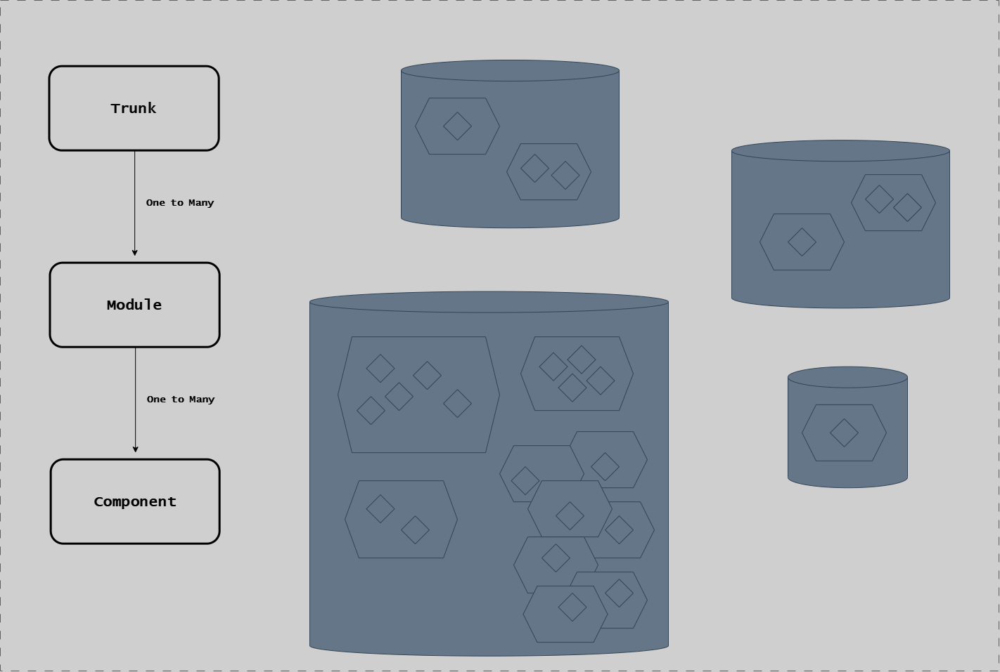
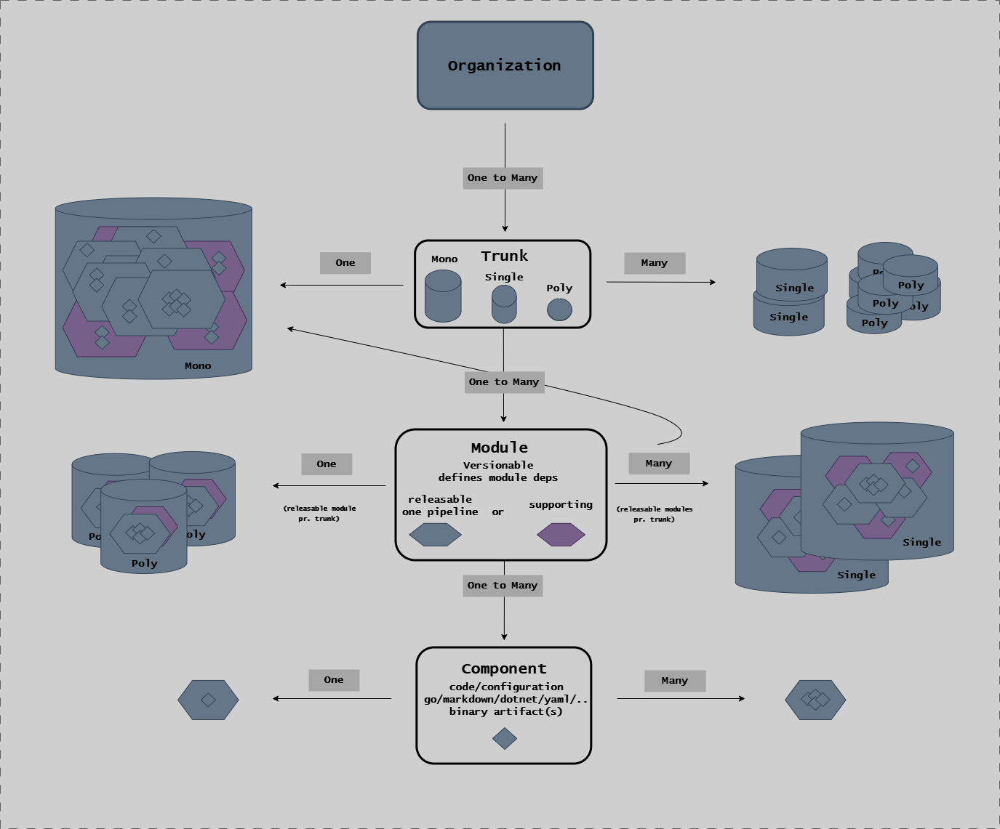
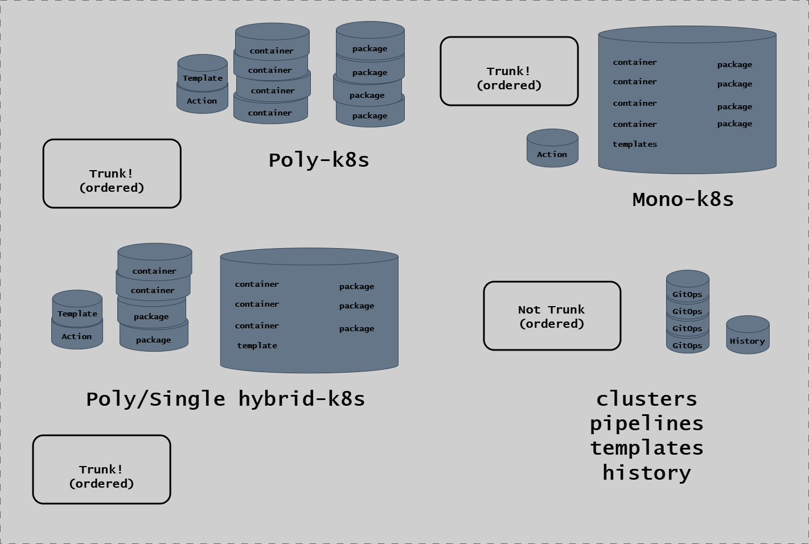
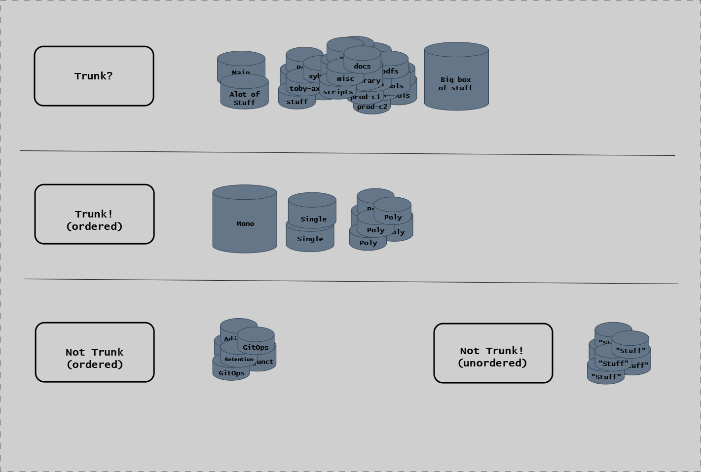

# Modules

## Overview

The EAC module system provides **independently buildable, testable units** with explicit contracts, dependency management, and file ownership.



The diagram above shows the hierarchical relationship between Trunk, Module, and Component. Each level expands in scale, from the repository trunk containing multiple modules, each module containing components.

Modules are defined in YAML contracts, validated against schemas, and built in topological order based on their dependencies.

**Key concepts**:

- **Modules** - Independently buildable units with explicit identity
- **Module Types** - Reusable templates with build/test behavior
- **Dependencies** - Explicit declaration enables topological build ordering
- **File Ownership** - Each file claimed by exactly one module

---

## Module Architectures

The following diagram shows the complete entity-relationship model for the module system, including Organization, Trunk types (Mono/Single/Poly), Modules, and Components with their deployment variations.



Each module includes C4 architecture diagrams documenting its design. View them interactively:

```bash
eac serve design
# Opens http://localhost:8080
```

**Design files in repository:**

- All modules: `specs/[module]/.design/workspace.dsl`
- View in GitHub: [specs/\*/​.design/](https://github.com/ready-to-release/eac/tree/main/specs)

See [Viewing Diagrams](./viewing-diagrams.md) for detailed instructions.

---

## Module Registry

**File**: `.eac/repository.yml`

Modules are registered with:

- **Moniker** - Unique identifier (e.g., `core`)
- **Template** - Blueprint template reference (e.g., `go-library`)
- **Dependencies** - Module dependencies (e.g., `depends_on: [logging-go]`)
- **Components** - Named components with root paths and optional configuration

**Example**:

```yaml
modules:
  - moniker: core
    name: EAC Core Libraries
    template: go-library
    depends_on: [logging-go]
    components:
      go:
        root: go/core
```

---

## Component Types

See [Component Types Reference](./component-kinds.md) for full documentation.

**File**: `contracts/core/0.1.0/schemas/defaults/blueprints.yml` (component-kinds section)

Component types define:

- **Build Dependencies** - System dependencies (go, docker, npm)
- **Capabilities** - Type capabilities (executable, go_module, etc.)
- **Build Artifacts** - Expected artifacts and verification
- **Defaults** - Default values inherited by modules

### Go Family

| Type            | Purpose                                    | Artifacts                                     |
| --------------- | ------------------------------------------ | --------------------------------------------- |
| **go-cli**      | CLI application with cross-platform builds | Platform executables (linux, windows, darwin) |
| **go-library**  | Library package (no executable)            | Marker file                                   |
| **go-commands** | Library with CLI invoke wrapper            | Single executable                             |
| **go-mcp**      | MCP server module                          | MCP server executable                         |
| **go-tests**    | Test-only module (BDD infrastructure)      | None (tests only)                             |

### Example (go-cli)

```yaml
- name: go-cli
  description: "Go CLI application with cross-platform builds"
  build_deps: [go]
  capabilities: [go_module, executable, cross_compile]
  build:
    artifacts:
      - type: executable
        pattern: "{moniker}-{os}-amd64{ext}"
        platforms: [linux, windows, darwin]
        verify: current_platform
  defaults:
    files:
      source: ["**/*.go"]
      tests: ["**/*_test.go"]
```

### Other Families

**Docker**: `clie-extension` - Container image with multi-platform builds

**Documentation**: `mkdocs-site`, `mkdocs-pdf` - MkDocs HTML/PDF generation

**Infrastructure**: `configuration`, `scripts-package`, `templates` - Non-buildable modules

### Kubernetes Deployment Patterns

For modules deployed to Kubernetes, the following diagram shows Poly-k8s, Mono-k8s, and hybrid configurations with containers, packages, and templates.



---

## Dependency Management

### Dependency Graph

**Declaration**:

```yaml
modules:
  - moniker: logging-go
    template: go-library

  - moniker: core
    template: go-library
    depends_on: [logging-go]

  - moniker: eac
    template: go-exe
    depends_on: [core]
```

**Build Order** (topological sort):

1. `logging-go`
2. `core`
3. `eac`

### Commands

```bash
# Show dependency graph
eac show dependencies

# Validate dependencies
eac validate dependencies

# Check for circular dependencies
eac validate module-hierarchy
```

### Dependency Rules

- Dependencies must exist in `repository.yml`
- No circular dependencies allowed
- Topological sort determines build order
- Changed modules trigger rebuild of dependents

---

## File Ownership

### Glob Patterns

```yaml
components:
  go:
    root: go/core # Base directory
    patterns:
      source: ["**/*.go"] # All .go files
      tests: ["**/*_test.go"] # All test files
```

**Pattern Variables**:

- `**` - Recursive match
- `*` - Single-level match
- `{specs_root}`, `{moniker}`, `{root}`, `{type}` - Template variables

### Validation

**Rule**: Each file claimed by exactly one module

**Command**:

```bash
eac validate module-files
```

**Error Example**:

```text
❌ File 'go/util/helper.go' claimed by multiple modules:
  - eac-core (pattern: go/**/*.go)
  - util-lib (pattern: go/util/**/*.go)
```

**Query Commands**:

```bash
# Show all files with ownership
eac show files

# Show changed files with ownership
eac show files-changed

# Show staged files with ownership
eac show files-staged
```

---

## Module Lifecycle

### 1. Discovery

**Load contracts**:

```bash
eac get modules
```

**Output**: All modules from `repository.yml` with resolved dependencies

### 2. Build

**Build single module**:

```bash
eac build <module>
```

**Build with dependencies**:

```bash
eac build <module> --deps
```

**Build Flow**:

1. Load contracts from `.eac/`
2. Resolve dependencies
3. Topological sort
4. Build in dependency order
5. Verify artifacts
6. Update cache

### 3. Test

**Test single module**:

```bash
eac test <module>
```

**Test suite** (multiple modules):

```bash
eac test --suite unit
```

**Test Flow**:

1. Load test suites from `.eac/test-suites.yml`
2. Select tests by tags (e.g., `@L0`, `@L1`)
3. Run tests in parallel
4. Collect results in `out/test/`

### 4. Validation

**Schema validation**:

```bash
eac validate contracts
```

**Dependency validation**:

```bash
eac validate dependencies
```

**File ownership validation**:

```bash
eac validate module-files
```

### 5. Release

**Check pending releases**:

```bash
eac release pending <module>
```

**Generate changelog**:

```bash
eac release changelog <module>
```

**Create release**:

```bash
eac release this <module>
```

---

## Working with Modules

### Creating a New Module

**1. Add to repository.yml**:

```yaml
modules:
  - moniker: my-new-module
    name: My New Module
    template: go-library
    depends_on: [core]
    components:
      go:
        root: go/my/module
```

**2. Validate**:

```bash
eac validate contracts
eac validate module-files
```

**3. Build**:

```bash
eac build my-new-module
```

### Modifying Dependencies

**1. Update repository.yml**:

```yaml
depends_on: [logging-go, config-go] # Add config-go
```

**2. Validate**:

```bash
eac validate dependencies
eac validate module-hierarchy  # Check for cycles
```

**3. Rebuild**:

```bash
eac build my-module --deps
```

### Finding Module Information

```bash
# List all modules
eac show modules

# Show dependency graph
eac show dependencies

# Show files owned by modules
eac show files

# Get module details (JSON)
eac get modules

# Get build dependencies
eac get build-deps my-module
```

---

## Build System

### Artifacts

Each module type defines expected artifacts:

**Executable (go-cli)**:

```yaml
artifacts:
  - type: executable
    pattern: "{moniker}-{os}-amd64{ext}"
    platforms: [linux, windows, darwin]
    verify: current_platform
```

**Marker (go-library)**:

```yaml
artifacts:
  - type: marker
    pattern: ".built"
    verify: existence
```

**Container Image (clie-extension)**:

```yaml
artifacts:
  - type: image
    pattern: "{moniker}:latest"
```

### Artifact Location

**Build Artifacts**: `out/build/{module}/{component}-{tool}/`

Each UoW writes artifacts to a deterministic output path along with a
`uow.manifest.json` that records input/output hashes.

**Verification**:

```bash
eac show artifacts <module>
eac validate artifacts <module>
```

### Build Cache

Build caching is based on **UoW manifests** stored in `out/`. Each manifest
records the input hash at build time. On subsequent builds, the current input
hash is compared against the manifest — if unchanged, the UoW is skipped.

See [Cache System](./cache-system.md) for full details.

**Usage**:

```bash
# Use cache (default)
eac build my-module

# Force rebuild (ignore cached state)
eac build my-module --skip-cache=local:state

# Clear all caches
eac update cache-clear
```

### Incremental Builds

**Changed Modules Detection**:

```bash
# Detect changed modules since last successful CI
eac get changed-modules-ci

# Get affected modules (dependents)
eac get changed-modules --with-dependents
```

**CI Workflow**:

```bash
# 1. Detect changes
CHANGED=$(eac get changed-modules-ci)

# 2. Build affected modules
eac build $CHANGED

# 3. Test affected modules
eac test $CHANGED
```

---

## Module Designs (Architecture)

### Structurizr C4 Diagrams

**Location**: `specs/{module}/.design/workspace.dsl`

**Format**: C4 model DSL (System Context → Containers → Components)

### Viewing Designs

**Method 1: Browser (Recommended)**:

```bash
# Start Structurizr Lite server
eac serve design

# Access: http://localhost:8080

# Stop server
eac serve design --stop
```

**Method 2: VS Code Extension**:

- Install: `systemticks.c4-dsl-extension`
- Open: `specs/{module}/.design/workspace.dsl`

### Design Commands

```bash
# Validate design
eac validate design <module>

# Generate design (AI-powered)
eac create design <module>

# Update existing design (AI-powered)
eac update design <module>
```

### C4 Model Levels

| Level                 | Focus                                    | Audience   | Diagram Type  |
| --------------------- | ---------------------------------------- | ---------- | ------------- |
| **1. System Context** | System boundaries, external dependencies | Everyone   | systemContext |
| **2. Container**      | Major subsystems, applications           | Technical  | container     |
| **3. Component**      | Internal modules, packages               | Developers | component     |
| **4. Code**           | Classes, functions                       | Developers | (code only)   |

---

## Module Organization

For the complete module catalog organized by group, see [Modules Reference](../modules/index.md).

---

## Module Commands Reference

### Discovery

```bash
eac show modules               # Module table
eac show dependencies          # Dependency graph
eac show files                 # File ownership
eac show component-kinds        # Component kind table
eac get modules                # Modules JSON
eac get dependencies           # Dependencies JSON
```

### Build

```bash
eac build <module>             # Build single module
eac build <module> --deps      # Build with dependencies
eac get artifacts <module>     # List artifacts
eac show artifacts <module>    # Show artifact status
eac show build-summary <module> # Build summary
```

### Test

```bash
eac test <module>              # Test single module
eac test --suite <suite>         # Run test suite
eac test debug                 # Debug test failures
eac show test-summary <module> # Test summary
```

### Validation

```bash
eac validate                   # Validate all
eac validate contracts         # Schema validation
eac validate dependencies      # Dependency validation
eac validate module-files      # File ownership validation
eac validate module-hierarchy  # Circular dependency check
eac validate artifacts <module> # Artifact validation
```

### Design

```bash
eac validate design <module>   # Validate Structurizr DSL
eac create design <module>     # Generate design (AI)
eac update design <module>     # Update design (AI)
eac serve design               # Serve designs in browser
```

### Release

```bash
eac release changelog <module> # Generate changelog
eac release pending <module>   # Check pending releases
eac release this <module>      # Create release
```

---

## Module Organization Patterns

The following diagram compares ordered vs unordered module configurations within a trunk, including anti-pattern examples to avoid.



## Module Best Practices

### Module Granularity

- **Small, focused modules** - Single responsibility
- **Clear dependencies** - Explicit, minimal coupling
- **Shared libraries** - Extract common code into libraries
- **Avoid circular dependencies** - Refactor to break cycles

### Naming Conventions

- **Moniker**: kebab-case (e.g., `eac-core`)
- **Type prefix**: Language or tech (e.g., `go-library`)
- **Descriptive names**: Clear purpose (e.g., `logging-go`)

### File Organization

- **Module root**: `go/{namespace}/{module}/`
- **Source**: `**/*.go`
- **Tests**: `**/*_test.go`
- **Specs**: `specs/{module}/`
- **Design**: `specs/{module}/.design/`

### Dependency Management

- **Minimize dependencies** - Only depend on what you need
- **Layer architecture** - Libraries → Commands → CLI
- **Shared contracts** - Use eac-core for shared types
- **Avoid deep chains** - Flatten dependency trees

---

## Related Documentation

- [Overview](./index.md) - System overview and key concepts
- [Contracts](./contracts.md) - Contract system and YAML schemas
- [Dependencies](./dependencies.md) - Dependency resolution details
