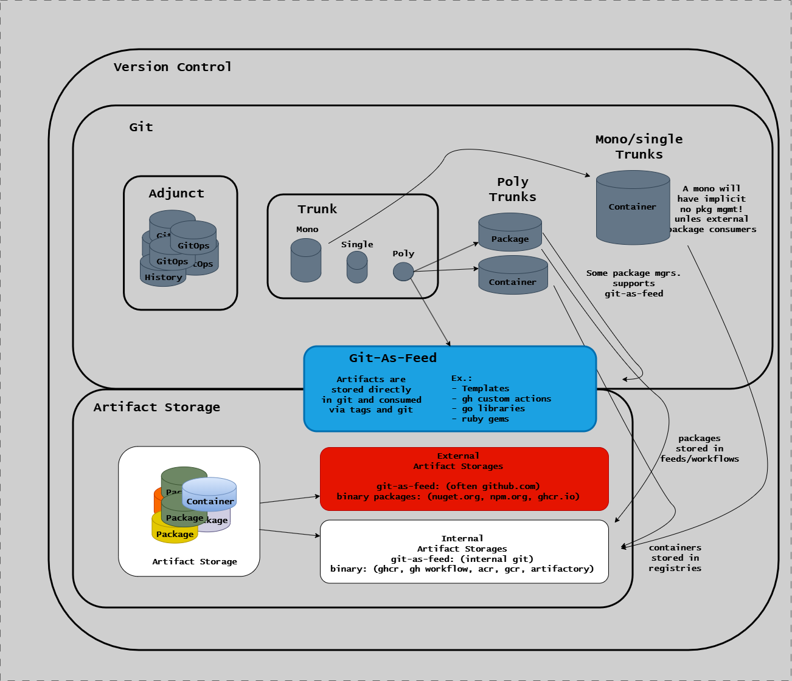

# Repository Layout and Module Structure

## Overview

This repository is organized as a **modular monorepo** with clearly defined module boundaries using the EAC (Everything as Code) system.

The following diagram illustrates the version control and artifact storage architecture, showing the Git-as-Feed pattern with internal and external artifact storage flows.



**Quick Reference**: For complete documentation on the R2R CLI and EAC system, see:

- [EAC Overview](../../eac/index.md) - System overview with repository structure
- [Modules](../modules/index.md) - Module system and dependency management
- [Contracts](./contracts.md) - Module contracts and configuration

All modules are defined in `.eac/repository.yml`, which serves as the central contract for module ownership, dependencies,
and build configuration.

## Repository Structure

```text
eac/
├── .claude/                    # Claude Code CLI configuration
│   ├── agents/                 # Custom agent definitions
│   ├── commands/               # Custom command definitions
│   ├── hooks/                  # Git hooks for Claude integration
│   ├── plans/                  # Plan mode output files
│   ├── rules/                  # Custom rules and guidelines
│   ├── schemas/                # JSON schemas for validation
│   └── skills/                 # Custom skill definitions
│
├── .github/                    # GitHub Actions workflows and configuration
│   ├── actions/                # Reusable workflow actions
│   └── workflows/              # CI/CD pipeline definitions
│
├── .r2r/                       # R2R and EAC configuration (Everything as Code)
│   ├── cache/                  # Build cache
│   ├── eac/                    # User configuration overrides
│   │   ├── repository.yml      # Module contracts (central registry)
│   │   └── books.yml           # PDF book generation config
│   └── templates/              # Report templates
│
├── .vscode/                    # VSCode workspace configuration
│   └── extensions/             # Custom VSCode extensions
│
├── containers/                 # Docker container definitions
│   ├── drawio-tool/             # Draw.io diagram CLI
│   ├── ext-eac/                # R2R CLI extension for EAC
│   ├── git-filter-repo/        # Git history filtering tool
│   ├── gource/                 # Repository visualization
│   ├── mermaid-cli/            # Mermaid diagram renderer
│   ├── mkdocs-pdf/             # PDF documentation builder
│   ├── mkdocs-site/            # Documentation site builder
│   ├── pdf-cli-tool/           # PDF manipulation utilities (poppler-utils)
│   └── static-site/            # Static site hosting
│
├── contracts/                  # JSON schemas and system defaults
│   ├── eac-core/0.1.0/         # Core EAC schemas and defaults
│   │   ├── defaults/           # System default configurations
│   │   │   ├── component-types.yml  # Component type definitions
│   │   │   ├── tool-config.yml      # Tool definitions and resources
│   │   │   ├── environments.yml     # Environment configurations
│   │   │   ├── test-suites.yml      # Test suite definitions
│   │   │   └── ...                  # Other system defaults
│   │   ├── repository.schema.json
│   │   ├── component-types.schema.json
│   │   └── ...
│   ├── eac-docs/0.1.0/         # Documentation schemas
│   ├── r2r-cli/0.1.0/          # CLI-specific schemas
│   └── vscode-commit/          # VSCode extension schemas
│
├── docs/                       # MkDocs documentation site source
│   ├── assets/                 # Images, diagrams, etc.
│   ├── explanation/            # Conceptual documentation
│   ├── how-to-guides/          # Task-based guides
│   ├── reference/              # Technical reference (this file)
│   └── tutorials/              # Learning-oriented tutorials
│
├── go/                         # Go source code
│   ├── adapters/               # Adapters (AI, Docker, TUI)
│   ├── cli/                    # CLI implementations
│   │   └── eac/                # EAC CLI commands library (eac-commands module)
│   ├── core/                   # Core domain libraries (eac-core module)
│   ├── godog/                  # Shared BDD test infrastructure
│   ├── specs/                  # Specs implementations
│   └── r2r/                    # R2R implementation
│       └── cli/                # R2R CLI application (r2r-cli module)
│
├── release/                    # Release notes and changelogs
│   ├── books/                  # Books module releases
│   ├── docs/                   # Docs module releases
│   ├── ext-eac/                # Extension releases
│   ├── r2r-cli/                # CLI releases
│   └── r2r-eac-bundle/         # Bundle releases
│
├── scripts/                    # Cross-platform scripts
│   ├── pwsh/                   # PowerShell scripts (Windows)
│   └── sh/                     # Shell scripts (Linux/macOS)
│
├── specs/                      # Gherkin BDD specifications
│   ├── eac-commands/           # Specs for commands module
│   ├── eac-core/               # Specs for core module
│   ├── r2r-cli/                # Specs for CLI module
│   └── repository/             # Repository-level validation specs
│
├── templates/                  # Project templates
│   ├── ai/                     # AI prompt templates
│   ├── claude/                 # Claude Code configuration templates
│   ├── docs/                   # Documentation templates
│   ├── github/                 # GitHub Actions templates
│   ├── reports/                # Report templates
│   ├── specs/                  # Specification templates
│   └── test-repositories/      # Test fixture repositories
│
├── typescript/                 # TypeScript source code
│   └── vscode-commit/          # VSCode Git extension
│
├── go.work                     # Go workspace definition
├── mkdocs.yml                  # MkDocs site configuration
└── CHANGELOG.md                # Repository-level changelog
```

## Module Organization

Modules are organized into two categories:

**Deployable Modules** - Independently built, versioned, and deployed:

- **r2r-cli** - Go CLI application with cross-platform executables
- **ext-eac** - Docker extension for R2R CLI
- **docs-site** - MkDocs documentation site (GitHub Pages)

**Supporting Modules** - Shared code and infrastructure:

- **eac-core** - Core domain libraries
- **eac-commands** - Command implementations (hundreds of commands) with integrated AI providers (Anthropic, OpenAI)
- **eac-specs** - BDD test infrastructure
- **eac-mcp-commands** - MCP server for LLM tools

For detailed information on module types, capabilities, and configuration, see [Modules Documentation](../modules/index.md).

## Module Configuration

All modules are defined in `.eac/repository.yml`. Each module specifies:

- **Moniker** - Unique identifier (e.g., `eac-commands`)
- **Type** - Module type reference (e.g., `go-library`)
- **Dependencies** - Module dependencies (e.g., `depends_on: [eac-core]`)
- **File Ownership** - Glob patterns defining owned files

**Example**:

```yaml
modules:
  - moniker: eac-commands
    name: Go Commands Library
    type: go-commands
    depends_on: [eac-core]
    files:
      root: go/cli/eac
      source: ["**/*.go"]
      tests: ["**/*_test.go"]
```

For complete module configuration reference, see:

- [Modules Contract](./contracts.md#modules-contract) - Full field reference and validation rules
- [Component Types Contract](./contracts.md#component-types-contract) - Type templates and capabilities
- [Modules Documentation](../modules/index.md) - Module system and lifecycle

---

## Complete Documentation

For comprehensive information about the R2R and EAC system:

### Core Documentation

- [EAC Overview](../index.md) - System overview with repository structure
- [Architecture](./index.md) - System architecture, components, and execution models
- [Contracts](./contracts.md) - Contract system and YAML configuration
- [Modules](../modules/index.md) - Module system and dependency management

### Related Topics

- [Trunk-Based Development](../../../explanation/continuous-delivery/workflow/trunk-based-development.md)
- [Command Reference](../commands/index.md) - All the hundreds of EAC commands

### Configuration Files

- `.eac/repository.yml` - Module registry and dependencies (user config)
- `contracts/eac-core/0.1.0/defaults/` - System default configurations
- `contracts/eac-core/0.1.0/defaults/component-types.yml` - Component type definitions
- `contracts/eac-core/0.1.0/` - JSON schemas for validation
