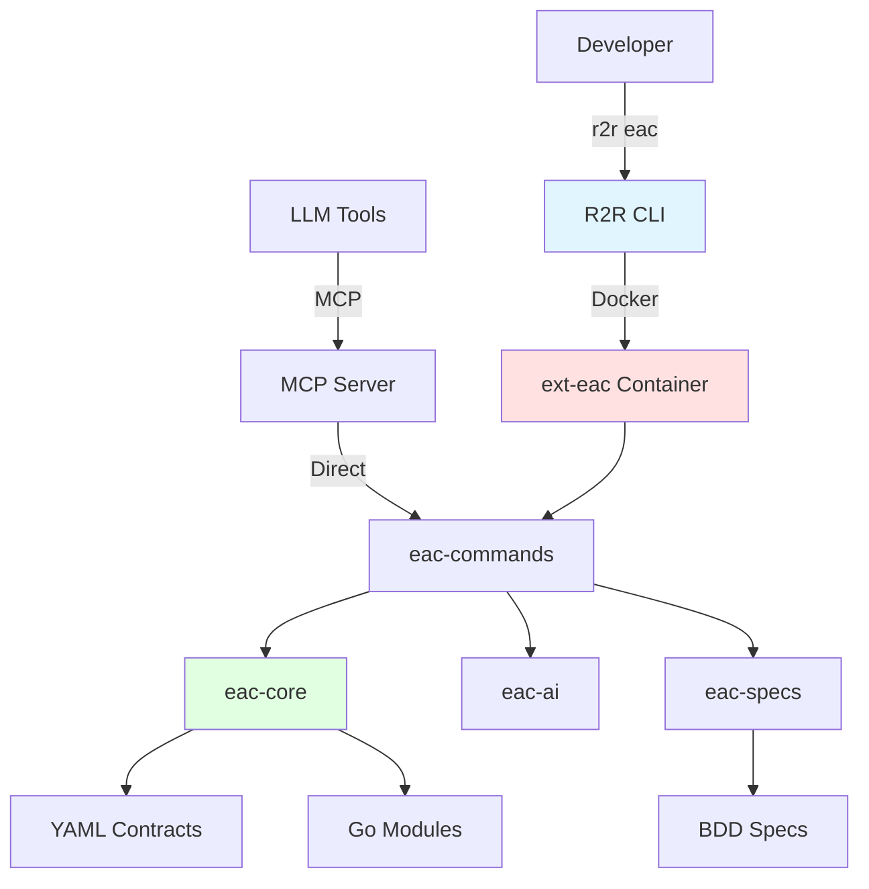

# Architecture

{{ page_breadcrumb() }}

## Overview

R2R and EAC implement a **container-based, contract-driven architecture** for everything-as-code workflows. The system uses multiple execution models optimized for different use cases: isolated Docker containers for reproducibility, direct Go execution for speed, and MCP protocol for AI integration.

**Core architecture**: CLI → Extension Container → Core Libraries → Repository

---

## System Diagram



---

## Component Layers

| Layer | Components | Purpose | Technology |
|-------|------------|---------|------------|
| **CLI** | R2R CLI binary | Command-line interface, Docker orchestration | Go (Cobra, Docker SDK) |
| **Extension** | ext-eac container | Isolated execution environment | Docker container |
| **Core** | eac-commands, eac-core, eac-ai, eac-specs | Business logic and domain libraries | Go modules |
| **MCP** | eac-mcp-commands | LLM tool integration via MCP protocol | Go (JSON-RPC) |
| **Repository** | Contracts, modules, specs | Configuration and source code | YAML, Go, Gherkin |

---

## R2R CLI

**Purpose**: Containerized workflow execution framework

**Package**: Binary (`r2r`, `r2r.exe`)

### Responsibilities

| Component | Responsibility |
|-----------|----------------|
| **CLI Core** | Command parsing, argument validation using Cobra |
| **Config Loader** | Load `.r2r/r2r-cli.yml` configuration via Viper |
| **Docker Orchestrator** | Container lifecycle management (create, start, stop) |
| **Git Discovery** | Find repository root, mount as `/workspace` |

### Configuration

**File**: `.r2r/r2r-cli.yml`

```yaml
extensions:
  - name: eac
    image: ext-eac:latest
    load_local: true  # Build locally for development
```

**Features**:

- Cross-platform (Windows, macOS, Linux)
- Docker-based extension execution
- Git-aware working directory mounting
- Configurable extension management

---

## EAC Extension

**Purpose**: Everything-as-code command collection

**Package**: `ext-eac:latest` Docker container

### Modules

| Module | Purpose | Type |
|--------|---------|------|
| **eac-commands** | 105+ command implementations | go-commands |
| **eac-core** | Domain libraries, contract loading | go-library |
| **eac-ai** | AI provider integrations (Anthropic, OpenAI) | go-library |
| **eac-specs** | BDD test infrastructure (Godog) | go-library |
| **eac-mcp-commands** | MCP server for LLM tool integration | go-mcp |

### Container Structure

```text
ext-eac:latest
├── /app/eac              # Compiled commands binary
├── /workspace            # Mounted repository (volume)
└── /usr/local/bin        # System dependencies (git, gh, etc.)
```

---

## eac-commands

**Purpose**: Command handler implementations

**Commands organized by category**:

| Category | Example Commands |
|----------|------------------|
| **Discovery** | `show-modules`, `show-dependencies`, `get-files` |
| **Build** | `build`, `get-artifacts`, `validate-artifacts` |
| **Test** | `test`, `test-suite`, `test-debug`, `show-test-summary` |
| **Validation** | `validate-contracts`, `validate-dependencies`, `validate-specs` |
| **Release** | `release-changelog`, `release-this`, `release-pending` |
| **Security** | `scan-vuln`, `scan-sast`, `scan-zap`, `scan-secrets` |
| **AI** | `create-commit-message`, `create-spec`, `create-design`, `create-pr` |
| **CI/CD** | `pipeline-run`, `pipeline-wait`, `get-changed-modules-ci` |

### Command Pattern

```go
// All commands follow this pattern
type BuildHandler struct {
    repo *Repository  // From eac-core
}

func (h *BuildHandler) Execute(args []string) error {
    // 1. Load contracts from .r2r/eac/
    // 2. Resolve dependencies using eac-core
    // 3. Execute build logic
    // 4. Verify artifacts and update cache
    return nil
}
```

---

## eac-core

**Purpose**: Core domain libraries and contract system

### Core Packages

| Package | Purpose |
|---------|---------|
| **contracts** | YAML contract loading and JSON schema validation |
| **repository** | Module registry and dependency graph |
| **builder** | Build orchestration and artifact management |
| **tester** | Test execution and result collection |
| **validator** | Contract and file validation |

### Repository Registry

```go
// Central registry for all modules and contracts
type Repository struct {
    Modules      map[string]*Module
    ModuleTypes  map[string]*ModuleType
    Environments map[string]*Environment
    TestSuites   map[string]*TestSuite
    Dependencies *DependencyGraph
}
```

**Responsibilities**:

- Load all YAML contracts from `.r2r/eac/`
- Validate contracts against JSON schemas
- Build module dependency graph
- Resolve topological build order
- Manage build cache and artifacts

---

## eac-ai

**Purpose**: AI provider integrations for automated workflows

### Supported Providers

| Provider | Models | Use Cases |
|----------|--------|-----------|
| **Anthropic** | Claude Opus, Sonnet, Haiku | Commit messages, specs, designs, PRs |
| **OpenAI** | GPT-4, GPT-3.5 | Commit messages, specs, designs, PRs |

### Configuration

**File**: `.r2r/eac/ai-config.yml`

```yaml
provider: anthropic
model: claude-sonnet-4
api_key_env: ANTHROPIC_API_KEY
```

**Features**:

- Generate commit messages from staged changes
- Create Gherkin specifications from natural language
- Generate Structurizr architecture designs
- Generate pull request descriptions

---

## eac-specs

**Purpose**: BDD test infrastructure and OSCAL compliance

### Components

| Component | Purpose |
|-----------|---------|
| **Godog Integration** | Execute Gherkin feature files |
| **Step Definitions** | Reusable test steps in Go |
| **Test Helpers** | Isolated test environments and utilities |
| **Evidence Collection** | Generate OSCAL compliance evidence |

### Test Layers

1. **Feature Files** (`.feature`) - Gherkin specifications in `specs/`
2. **Step Definitions** (`.go`) - Go implementations in module `tests/` folders
3. **Unit Tests** (`*_test.go`) - Go unit tests alongside source code

---

## eac-mcp-commands

**Purpose**: MCP server for LLM tool integration

**Protocol**: stdio-based JSON-RPC (MCP 1.0)

**Compatible with**: Any MCP-compatible LLM tool (Claude Code, Cline, Zed, Cursor, etc.)

### MCP Tools

**105+ tools** exposed as `mcp__commands__*`:

```json
{
  "name": "mcp__commands__build",
  "description": "Build one or more modules by moniker",
  "inputSchema": {
    "type": "object",
    "properties": {
      "args": {"type": "string"}
    }
  }
}
```

### Configuration

**File**: `.mcp.json` or LLM-specific config (e.g., `.claude/settings.json` for Claude Code)

```json
{
  "mcpServers": {
    "commands": {
      "command": "go",
      "args": ["run", "./go/eac/mcp/commands/main.go"]
    }
  }
}
```

**Benefits**:

- Fast execution (~100ms vs ~2s Docker overhead)
- Structured JSON I/O for AI tools
- AI-optimized metadata and descriptions
- Real-time validation feedback
- Works with any MCP-compatible LLM tool

---

## Security Architecture

### Isolation

- **Containers**: Extensions run in isolated Docker containers
- **File Access**: Minimal read/write permissions via volume mounts
- **Network**: Limited network access in containers

### Scanning

- **Pre-build**: Secret detection, dependency scanning
- **Post-build**: Vulnerability scanning, SBOM generation
- **Runtime**: DAST scanning in test environments

### Evidence Collection

- **OSCAL**: Automated compliance evidence in `out/evidence/`
- **Artifacts**: All build/test artifacts in `out/`
- **Audit Logs**: Immutable logs in `out/logs/`

---

## Configuration Management

### Configuration Hierarchy

**Precedence** (highest to lowest):

1. Personal config (`.personal.yml`, not in Git)
2. Shared config (`.yml` files in `.r2r/eac/`)
3. Type defaults (from `module-types.yml`)
4. System defaults (hardcoded in eac-core)

---

## Technology Stack

### Go Ecosystem

| Component | Technology |
|-----------|------------|
| **CLI Framework** | Cobra |
| **Configuration** | Viper |
| **Docker SDK** | github.com/docker/docker |
| **BDD Testing** | Godog (Cucumber for Go) |
| **JSON Schema** | gojsonschema |

### External Tools

| Tool | Purpose |
|------|---------|
| **Docker** | Container runtime |
| **Git** | Version control and change detection |
| **GitHub CLI (gh)** | GitHub API access |
| **MkDocs** | Documentation generation |
| **Structurizr** | C4 model architecture diagrams |
| **Trivy** | Vulnerability scanning, SBOM |
| **Semgrep** | Static analysis (SAST) |
| **OWASP ZAP** | Dynamic analysis (DAST) |

---

## Performance & Scalability

### Parallel Execution

- **Build**: Topological sort enables parallel module builds
- **Test**: Test suites run in parallel by default
- **CI**: GitHub Actions matrix strategy for cross-platform

### Caching

- **Docker**: Layer caching for fast image builds
- **Build**: Artifact cache in `.r2r/cache/` for incremental builds
- **Go**: Module cache for dependency downloads
- **Git**: Change detection to skip unchanged modules

---

## Related Documentation

- [Overview](./overview.md) - System overview and key concepts
- [Contracts](./contracts.md) - Contract system and YAML schemas
- [Modules](./modules.md) - Module system and types

{{ diataxis_footer() }}
