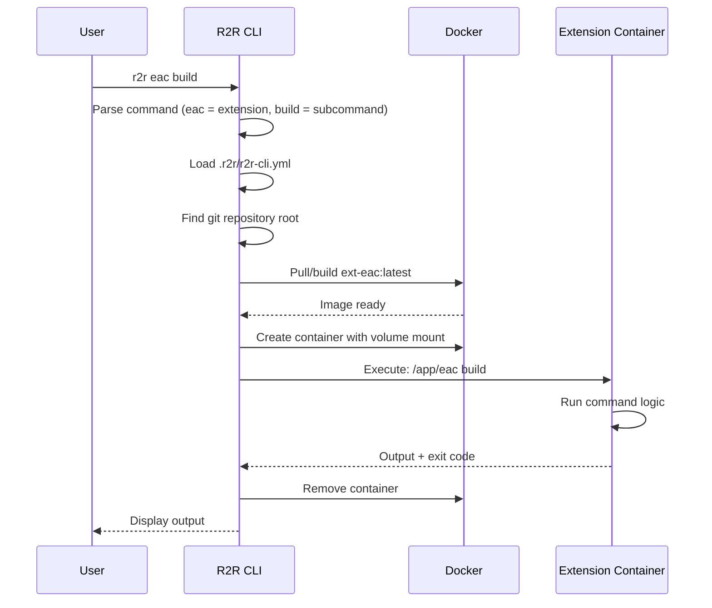

# R2R CLI Architecture

Architecture documentation for the Ready-to-Release CLI framework.

## Overview

R2R (Ready to Release) provides a container-based CLI framework for modular, extensible command-line tools. The architecture focuses on:

- **Docker-based execution** - Isolated, reproducible environments
- **Extension system** - Pluggable command collections via containers
- **Git-aware workflows** - Automatic repository detection and mounting
- **Cross-platform support** - Windows, macOS, Linux compatibility

## Core Design Principles

### 1. Container Isolation

Extensions execute in isolated Docker containers, providing:

- Reproducible builds across environments
- Dependency isolation (no global installs)
- Consistent behavior (Linux runtime for all platforms)
- Security boundaries between extensions

### 2. Repository-Centric

R2R automatically detects git repositories and:

- Mounts repository root as `/workspace`
- Preserves working directory context
- Enables git-based workflows (change detection, hooks)
- Respects `.gitignore` for artifacts

### 3. Extension Modularity

Extensions are self-contained Docker images:

- Single binary entrypoint
- Declarative configuration (`.r2r/r2r-cli.yml`)
- Independent versioning and releases
- Composable (extensions can invoke other extensions)

## Architecture Documentation

| Document                    | Description                                   |
| --------------------------- | --------------------------------------------- |
| [R2R CLI Module](module.md) | Detailed module architecture with C4 diagrams |

## Key Components

### CLI Core

The R2R binary provides:

| Component            | Technology | Responsibility                                  |
| -------------------- | ---------- | ----------------------------------------------- |
| Command Parser       | Cobra      | Command routing and argument parsing            |
| Configuration Loader | Viper      | Load `.r2r/r2r-cli.yml` and merge configs       |
| Docker Orchestrator  | Docker SDK | Container lifecycle (pull, create, start, stop) |
| Git Discovery        | go-git     | Find repository root and mount points           |

### Extension Interface

Extensions communicate via:

- **stdin/stdout**: Command input and output
- **Volume mounts**: Repository access at `/workspace`
- **Environment variables**: Configuration and secrets
- **Exit codes**: Success (0) or failure (non-zero)

**Configuration example** (`.r2r/r2r-cli.yml`):

```yaml
extensions:
  - name: eac
    image: ext-eac:latest
    load_local: true # Build from Dockerfile for development
```

### Execution Flow



## Command Discovery

Extensions register commands dynamically:

1. R2R detects extension name from first argument (`r2r eac ...`)
2. Looks up extension in `.r2r/r2r-cli.yml`
3. Passes remaining arguments to extension (`build ...`)
4. Extension handles subcommand routing internally

No central registry needed - extensions are self-documenting.

## Configuration Hierarchy

R2R loads configuration from multiple sources (precedence order):

1. **Command-line flags** (highest priority)
2. **Environment variables** (`R2R_*`)
3. **Project config** (`.r2r/r2r-cli.yml`)
4. **User config** (`~/.r2r/config.yml`)
5. **System defaults** (hardcoded fallbacks)

## Design Patterns

### Repository as Volume

```yaml
# Docker container configuration
volumes:
  - /absolute/path/to/repo:/workspace
working_dir: /workspace
```

Benefits:

- Native file I/O performance
- Preserves file permissions
- Direct git operations
- Simple debugging (files visible on host)

### Stateless Containers

Containers are ephemeral:

- Created per command execution
- Removed after completion
- No state persists between runs
- Cache stored in repository (`.r2r/cache/`)

### Extension Composition

Extensions can invoke other extensions:

```bash
# Inside ext-eac container
r2r eac show-modules  # Calls back to R2R CLI
```

Enables:

- Reusable command building blocks
- Cross-extension workflows
- Dependency management

## Performance Optimizations

### Image Caching

- Docker layer cache for fast rebuilds
- Multi-stage builds for smaller images
- Base image reuse across extensions

### Volume Mounting

- Bind mounts (not copies) for instant access
- Read-only mounts for immutable data
- Cached mounts for dependencies

### Container Reuse (Future)

Planned: Long-running containers for faster execution

```yaml
extensions:
  - name: eac
    keep_alive: true # Don't remove after command
    idle_timeout: 5m # Remove after 5 min idle
```

## Security Model

### Isolation

- Extensions run as non-root user in container
- Limited host access (only mounted volumes)
- Network isolation (no internet by default)

### Trust Model

Extensions execute arbitrary code - users must trust extension authors.

**Mitigations**:

- Extensions are Docker images (auditable)
- Local build option (`load_local: true`)
- No automatic updates (explicit version pins)

## Technology Stack

| Component         | Technology        |
| ----------------- | ----------------- |
| CLI Framework     | Go (Cobra)        |
| Configuration     | Viper (YAML/ENV)  |
| Container Runtime | Docker Engine API |
| Git Integration   | go-git / git CLI  |
| Logging           | logrus            |

## Error Handling

R2R uses exit codes for error signaling:

| Exit Code | Meaning             |
| --------- | ------------------- |
| 0         | Success             |
| 1         | General error       |
| 2         | Configuration error |
| 3         | Docker error        |
| 125+      | Container exit code |

Errors propagate from extension to CLI to user.

## Extension Development

To create an extension:

1. Create Dockerfile with extension binary
2. Add entry to `.r2r/r2r-cli.yml`
3. Implement command handling
4. Build and test locally
5. Publish Docker image (optional)

See [Creating Extensions](../../../how-to-guides/r2r/creating-extensions.md) for details.

## Comparison with Alternatives

| Feature             | R2R | Make | Devbox | Task |
| ------------------- | --- | ---- | ------ | ---- |
| Container isolation | ✅  | ❌   | ✅     | ❌   |
| Cross-platform      | ✅  | ⚠️   | ✅     | ✅   |
| Extension system    | ✅  | ❌   | ⚠️     | ❌   |
| Git integration     | ✅  | ❌   | ❌     | ❌   |
| Reproducible builds | ✅  | ⚠️   | ✅     | ⚠️   |

**R2R sweet spot**: Teams needing reproducible, containerized workflows with modular command collections.

## Related Documentation

- [R2R CLI Commands](../commands/) - Command reference
- [EAC Extension Architecture](../../eac/architecture/) - EAC extension details
- [How-to Guides: R2R](../../../how-to-guides/r2r/) - Usage guides
- [Creating Extensions](../../../how-to-guides/r2r/creating-extensions.md) - Extension development guide
