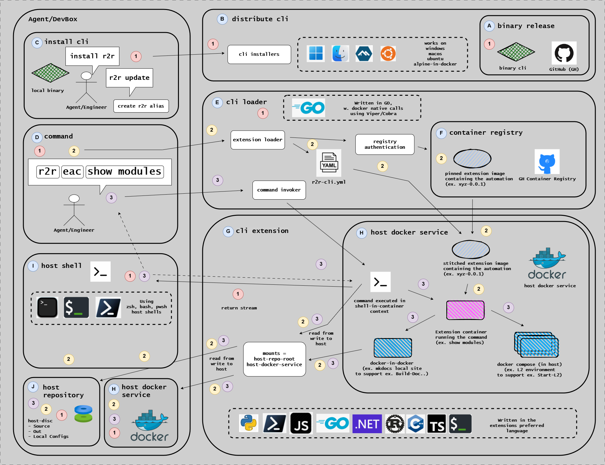

# R2R CLI Reference

Technical reference for the R2R CLI framework.

The diagram above shows the R2R CLI ecosystem architecture: the Agent/DevBox environment, the distributed CLI binary, container registry integration, and language-specific integrations.

## What is R2R CLI?

R2R (Ready to Release) is a cross-platform CLI framework for containerized workflow execution.

It provides a foundation for building modular command-line tools with support for Docker-based workflows, extension systems,
and template management.

## In This Section

| Reference                       | Description                     |
| ------------------------------- | ------------------------------- |
| [Commands](./commands/)         | R2R CLI command reference       |
| [Architecture](./architecture/) | R2R CLI architecture and design |

## Related Documentation

- [EAC Extension Reference](../eac/) - EAC extension for R2R
- [How-to Guides: R2R CLI](../../how-to-guides/r2r/) - Task-oriented guides
